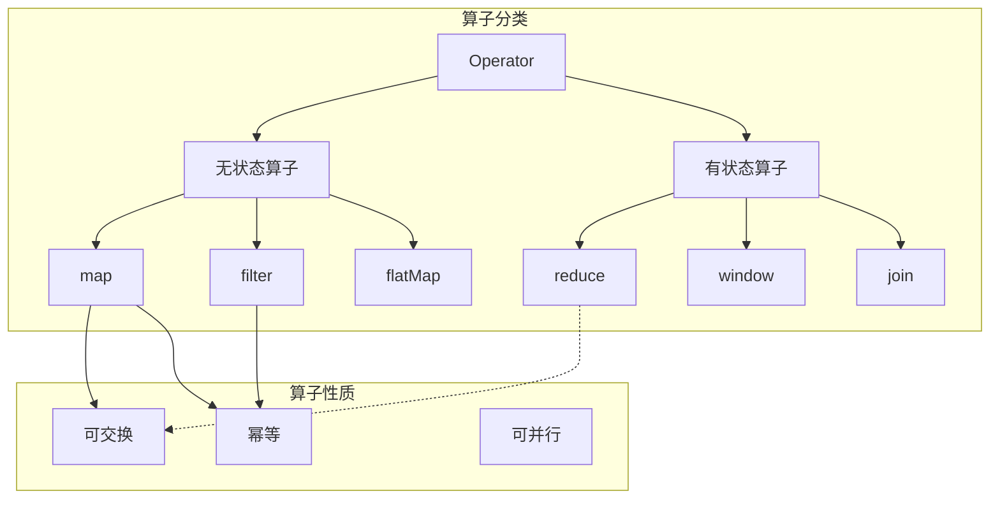
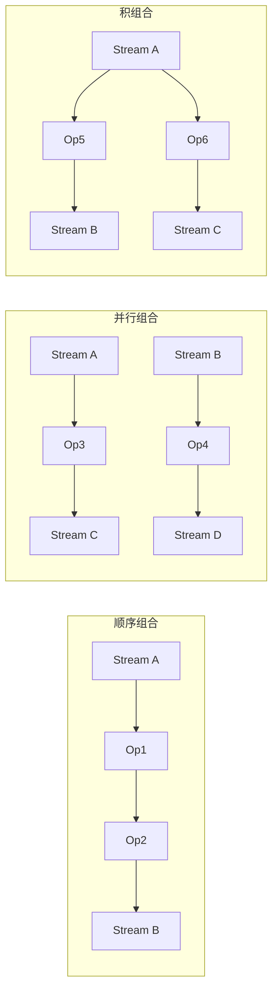
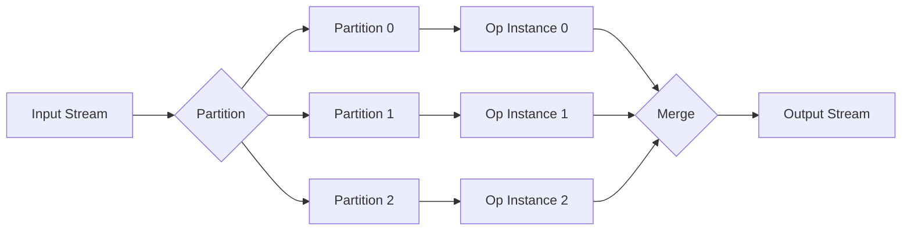
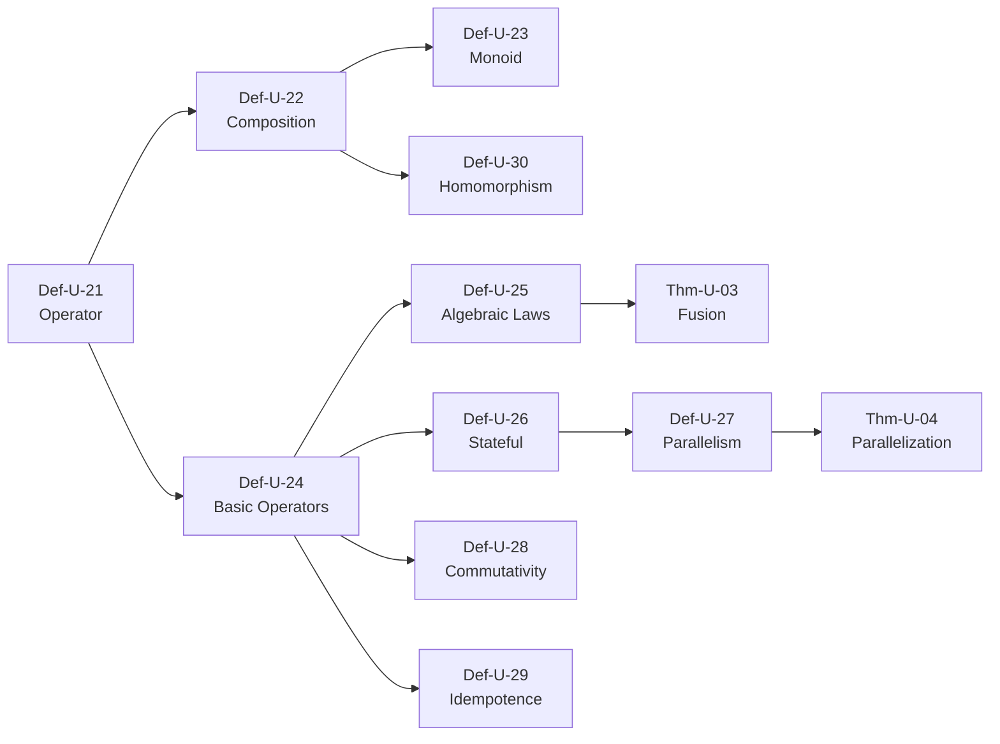

# 算子代数 (Operator Algebra)

> **文档类型**: 阶段二 - 统一流模型 | **形式化等级**: L5-L6 | **编号**: 01.03
> **阶段**: 第7周 | **依赖**: 01.01-stream-mathematical-definition.md

---

## 0. 前置依赖

本文档依赖以下文档：

- 流的数学定义: [01.01-stream-mathematical-definition.md](./01.01-stream-mathematical-definition.md)
- 范畴论基础: [00.01-category-theory-foundation.md](../00-meta/00.01-category-theory-foundation.md)

---

## 1. 概念定义 (Definitions)

### Def-U-21: 算子 (Operator)

**形式化定义**:

算子是流之间的函数：

$$
\text{Operator} ::= \text{Stream}_A \rightarrow \text{Stream}_B
$$

其中：

- $\text{Stream}_A$: 输入流，元素类型为 $A$
- $\text{Stream}_B$: 输出流，元素类型为 $B$

**算子签名**:

$$
op: (A \rightarrow B) \times \text{Stream}_A \rightarrow \text{Stream}_B
$$

或高阶形式：

$$
op: (A \rightarrow B) \rightarrow \text{Stream}_A \rightarrow \text{Stream}_B
$$

**算子类型分类**:

| 类型 | 签名 | 示例 |
|------|------|------|
| 一元算子 | $\text{Stream}_A \rightarrow \text{Stream}_B$ | map, filter |
| 二元算子 | $\text{Stream}_A \times \text{Stream}_B \rightarrow \text{Stream}_C$ | join, union |
| 高阶算子 | $(\text{Stream}_A \rightarrow \text{Stream}_B) \rightarrow \text{Stream}_C \rightarrow \text{Stream}_D$ | windowed aggregation |

**直观解释**: 算子是流计算的基本构建块，类似于函数式编程中的高阶函数。每个算子将一个或多个输入流转换为输出流。算子的组合构成了流处理程序的"骨架"。

---

### Def-U-22: 算子的组合

**形式化定义**:

**顺序组合 (Sequential Composition)**:

$$
\circ: (\text{Stream}_B \rightarrow \text{Stream}_C) \times (\text{Stream}_A \rightarrow \text{Stream}_B) \rightarrow (\text{Stream}_A \rightarrow \text{Stream}_C)
$$

$$
(f \circ g)(s) = f(g(s))
$$

**并行组合 (Parallel Composition)**:

$$
\times: (\text{Stream}_A \rightarrow \text{Stream}_C) \times (\text{Stream}_B \rightarrow \text{Stream}_D) \rightarrow (\text{Stream}_A \times \text{Stream}_B \rightarrow \text{Stream}_C \times \text{Stream}_D)
$$

$$
(f \times g)(s_1, s_2) = (f(s_1), g(s_2))
$$

**积组合 (Product/Join)**:

$$
\langle f, g \rangle: \text{Stream}_A \rightarrow \text{Stream}_B \times \text{Stream}_C
$$

$$
\langle f, g \rangle(s) = (f(s), g(s))
$$

**组合的性质**:

| 性质 | 陈述 |
|------|------|
| 结合律 | $(f \circ g) \circ h = f \circ (g \circ h)$ |
| 单位元 | $f \circ \text{id} = f = \text{id} \circ f$ |
| 分配律 | $(f + g) \circ h = (f \circ h) + (g \circ h)$ |

**直观解释**: 算子组合允许我们构建复杂的流处理管道。顺序组合类似于Unix管道（|），一个算子的输出作为下一个算子的输入。并行组合允许独立处理多个流。这些组合操作是流处理图（DAG）的数学基础。

---

### Def-U-23: 算子的幺半群 (Monoid) 结构

**形式化定义**:

某些算子类构成幺半群 $(M, \oplus, \epsilon)$：

**并集幺半群**:

$$
M_{union} = (\text{Stream}_A \rightarrow \mathcal{P}(\text{Stream}_A), \cup, \emptyset)
$$

**连接幺半群**:

$$
M_{concat} = (\text{Stream}_A^*, @, \epsilon)
$$

其中 $@$ 是流连接，$\epsilon$ 是空流。

**幺半群公理验证**:

**结合律**: $(a \oplus b) \oplus c = a \oplus (b \oplus c)$

**单位元**: $\epsilon \oplus a = a = a \oplus \epsilon$

**算子幺半群实例**:

| 算子 | 操作 $\oplus$ | 单位元 $\epsilon$ |
|------|---------------|-------------------|
| union | $\cup$ | 空流 |
| concat | $@$ | $\epsilon$ |
| merge | 交错 | 空流 |
| aggregate | 合并结果 | 零值 |

**直观解释**: 幺半群结构允许我们折叠（fold）算子序列。这在并行计算中非常重要——由于结合律，我们可以任意分组计算而不改变结果。例如，在分布式聚合中，我们可以先局部聚合再全局聚合。

---

### Def-U-24: 基本算子

**形式化定义**:

**1. Map (映射)**:

$$
\text{map}: (A \rightarrow B) \rightarrow \text{Stream}_A \rightarrow \text{Stream}_B
$$

$$
\text{map}(f)(\epsilon) = \epsilon
$$
$$
\text{map}(f)(a :: s) = f(a) :: \text{map}(f)(s)
$$

**2. Filter (过滤)**:

$$
\text{filter}: (A \rightarrow \text{Bool}) \rightarrow \text{Stream}_A \rightarrow \text{Stream}_A
$$

$$
\text{filter}(p)(\epsilon) = \epsilon
$$
$$
\text{filter}(p)(a :: s) = \begin{cases} a :: \text{filter}(p)(s) & \text{if } p(a) \\ \text{filter}(p)(s) & \text{otherwise} \end{cases}
$$

**3. Reduce/Fold (规约)**:

$$
\text{reduce}: (B \times A \rightarrow B) \rightarrow B \rightarrow \text{Stream}_A \rightarrow B
$$

$$
\text{reduce}(f, z)(\epsilon) = z
$$
$$
\text{reduce}(f, z)(a :: s) = \text{reduce}(f, f(z, a))(s)
$$

**4. Window (窗口)**:

$$
\text{window}: \text{WindowSpec} \rightarrow \text{Stream}_A \rightarrow \text{Stream}_{\text{Stream}_A}
$$

$$
\text{window}(w)(s) = \langle s|_{w_1}, s|_{w_2}, \ldots \rangle
$$

其中 $s|_w$ 是流 $s$ 在窗口 $w$ 内的子流。

**5. FlatMap (扁平映射)**:

$$
\text{flatMap}: (A \rightarrow \text{Stream}_B) \rightarrow \text{Stream}_A \rightarrow \text{Stream}_B
$$

$$
\text{flatMap}(f) = \text{concat} \circ \text{map}(f)
$$

**算子特性表**:

| 算子 | 状态 | 时间感知 | 确定性 |
|------|------|----------|--------|
| map | 无状态 | 否 | 是 |
| filter | 无状态 | 否 | 是 |
| reduce | 有状态 | 否 | 是 |
| window | 有状态 | 是 | 是 |
| flatMap | 无状态 | 否 | 依赖于 $f$ |

**直观解释**: 这五个算子是流处理的"核心"算子。map和filter是函数式编程中的经典操作。reduce支持聚合计算。window引入了时间维度，是流处理区别于批处理的关键。flatMap是map的泛化，支持一对多转换。

---

### Def-U-25: 算子的代数定律

**形式化定义**:

**1. Map-Map 融合**:

$$
\text{map}(f) \circ \text{map}(g) = \text{map}(f \circ g)
$$

**2. Filter-Filter 融合**:

$$
\text{filter}(p) \circ \text{filter}(q) = \text{filter}(\lambda x. \, p(x) \land q(x))
$$

**3. Map-Filter 交换**:

$$
\text{map}(f) \circ \text{filter}(p) = \text{filter}(p \circ f) \circ \text{map}(f)
$$

（当 $f$ 可逆时）

**4. 分配律**:

$$
\text{map}(f)(s_1 \oplus s_2) = \text{map}(f)(s_1) \oplus \text{map}(f)(s_2)
$$

**5. 结合律 (Reduce)**:

若 $f$ 满足结合律：

$$
\text{reduce}(f, z)(s_1 \oplus s_2) = f(\text{reduce}(f, z)(s_1), \text{reduce}(f, z)(s_2))
$$

**6. 幺半群同态**:

若 $(M, \oplus, \epsilon)$ 是幺半群，则：

$$
\text{reduce}(\oplus, \epsilon)(s_1 \oplus s_2) = \text{reduce}(\oplus, \epsilon)(s_1) \oplus \text{reduce}(\oplus, \epsilon)(s_2)
$$

**定律分类**:

| 类别 | 定律 | 应用 |
|------|------|------|
| 融合 | Map-Map, Filter-Filter | 减少遍历次数 |
| 交换 | Map-Filter | 优化算子顺序 |
| 分配 | Map-分配 | 并行化 |
| 结合 | Reduce-结合 | 增量计算 |

**直观解释**: 代数定律是流处理优化的基础。例如，Map-Map融合允许将两个map算子合并为一个，减少数据遍历次数。分配律允许将算子下推到分区级别执行，实现并行化。

---

### Def-U-26: 有状态算子 (Stateful Operators)

**形式化定义**:

有状态算子维护内部状态：

$$
\text{StatefulOp}: \text{State} \times \text{Stream}_A \rightarrow \text{State} \times \text{Stream}_B
$$

**状态转换**:

$$
(s', b) = op(s, a)
$$

其中：

- $s$: 当前状态
- $a$: 输入元素
- $s'$: 新状态
- $b$: 输出元素

**状态类型**:

| 类型 | 定义 | 示例 |
|------|------|------|
| KeyedState | $\text{Key} \rightarrow \text{Value}$ | 按键聚合 |
| OperatorState | 全局状态 | 算子级计数器 |
| WindowState | 窗口 $\rightarrow$ 聚合值 | 窗口内求和 |

**状态访问模式**:

$$
\text{AccessPattern} ::= \text{ReadOnly} \mid \text{ReadWrite} \mid \text{Accumulate}
$$

**直观解释**: 有状态算子是流处理的核心挑战。与无状态算子不同，有状态算子需要持久化状态以支持容错（检查点）。状态的按键分区决定了并行度——相同key的事件由同一并行实例处理。

---

### Def-U-27: 算子的并行性

**形式化定义**:

算子的**并行度**（Parallelism）定义了可同时执行的实例数：

$$
\text{Parallelism}: \text{Operator} \rightarrow \mathbb{N}^+
$$

**数据分区**:

对算子 $op$ 有并行度 $p$，定义分区函数：

$$
\text{partition}: A \rightarrow \{0, 1, \ldots, p-1\}
$$

**分区策略**:

| 策略 | 定义 | 适用场景 |
|------|------|----------|
| Hash | $\text{partition}(a) = \text{hash}(a) \mod p$ | keyBy操作 |
| Range | $\text{partition}(a) = \text{基于值范围}$ | 有序数据 |
| Broadcast | 所有分区接收全部数据 | 小表join |
| Custom | 用户定义 | 特殊需求 |

**并行正确性条件**:

算子 $op$ 可并行化当且仅当：

$$
op(s_1 \oplus s_2) = op(s_1) \oplus op(s_2)
$$

（对无状态算子）或

$$\forall k. \, op_k(s|_k) = op(s)|_k$$

（对有状态算子，按key分区）

**直观解释**: 并行性是流处理系统扩展性的基础。通过分区，我们可以将大数据流分散到多个节点处理。Hash分区保证相同key的事件到同一分区，这是状态一致性的关键。

---

### Def-U-28: 算子的可交换性

**形式化定义**:

算子 $op$ 是**可交换**的当且仅当：

$$
\forall a_1, a_2. \, op(a_1, a_2) = op(a_2, a_1)
$$

**可交换算子实例**:

| 算子 | 可交换性 | 原因 |
|------|----------|------|
| sum | 是 | $a + b = b + a$ |
| count | 是 | 计数与顺序无关 |
| min/max | 是 | 极值与顺序无关 |
| concat | 否 | $a @ b \neq b @ a$ |
| avg | 否 | 平均需要顺序保持（增量算法）|

**可交换性的价值**:

**1. 并行优化**: 可交换算子可以任意重排计算顺序，优化并行执行。

**2. 增量计算**: 结果可以增量更新而不依赖输入顺序。

**3. 容错恢复**: 从检查点恢复时可以重新处理乱序数据。

**直观解释**: 可交换性是一个强约束，它允许系统以任意顺序处理数据而不改变结果。例如，求和可以并行地在不同分区计算部分和，然后相加，结果与顺序无关。

---

### Def-U-29: 算子的幂等性

**形式化定义**:

算子 $op$ 是**幂等**的当且仅当：

$$
\forall x. \, op(op(x)) = op(x)
$$

或在流上下文中：

$$
\text{apply}(op, \text{apply}(op, s)) = \text{apply}(op, s)
$$

**幂等算子实例**:

| 算子 | 幂等性 | 说明 |
|------|--------|------|
| distinct | 是 | 去重两次 = 去重一次 |
| max | 是 | 取最大值的max = 最大值 |
| min | 是 | 同理 |
| sum | 否 | 求和两次 = 2倍和 |
| filter | 是 | 过滤两次 = 过滤一次 |

**幂等性的容错价值**:

在 At-Least-Once 语义下，幂等算子保证重复处理不破坏正确性：

$$
\text{process}(e) \text{ twice} = \text{process}(e) \text{ once}
$$

**直观解释**: 幂等性是容错的关键。在"至少一次"（at-least-once）交付保证下，消息可能被重复处理。如果算子是幂等的，重复处理不会导致错误结果。例如，去重操作是幂等的——无论处理多少次，结果都一样。

---

### Def-U-30: 算子代数与同态

**形式化定义**:

定义算子代数 $\mathcal{A} = (\text{Op}, \circ, \text{id})$。

**代数同态**:

映射 $\phi: \mathcal{A} \rightarrow \mathcal{B}$ 是同态当且仅当：

$$
\phi(op_1 \circ op_2) = \phi(op_1) \circ \phi(op_2)
$$
$$
\phi(\text{id}) = \text{id}
$$

**具体同态示例**:

**1. 优化映射**:

$$
\phi_{opt}(\text{map}(f) \circ \text{map}(g)) = \text{map}(f \circ g)
$$

**2. 并行化映射**:

$$
\phi_{par}(op) = \langle op_1, op_2, \ldots, op_p \rangle
$$

**3. 代码生成映射**:

$$
\phi_{code}: \text{AbstractOp} \rightarrow \text{ExecutableCode}
$$

**直观解释**: 代数同态允许我们在不同抽象层次间转换算子。例如，优化映射将高阶算子组合转换为等效的单一算子。代码生成映射将抽象算子转换为可执行代码，同时保持语义等价。

---

## 2. 属性推导 (Properties)

### Lemma-U-05: 基本算子的连续性

**陈述**:

map、filter、window 算子在 Scott 拓扑下是连续的。

**证明**:

**map的连续性**:

设 $D$ 是有向集，需证 $\text{map}(f)(\bigsqcup D) = \bigsqcup_{s \in D} \text{map}(f)(s)$。

对任意位置 $n$:

$$(\text{map}(f)(\bigsqcup D))(n) = f((\bigsqcup D)(n)) = f(s(n)) \text{ 对某个 } s \in D$$

$$= (\text{map}(f)(s))(n) \leq (\bigsqcup_{s \in D} \text{map}(f)(s))(n)$$

反之亦然。故相等。

**filter的连续性**: 类似证明，利用filter也是前缀保持的。

**window的连续性**: 窗口操作将流映射为窗口流，每个窗口是有限前缀的函数，保持上确界。

**∎**

---

### Lemma-U-06: Reduce算子的结合律条件

**陈述**:

reduce算子可并行化（可分解）当且仅当规约函数 $f$ 满足结合律。

**证明**:

**充分性**: 若 $f$ 满足结合律，则：

$$\text{reduce}(f, z)(s_1 @ s_2) = f(\text{reduce}(f, z)(s_1), \text{reduce}(f, z)(s_2))$$

这允许将流分割为子流，分别规约后再合并。

**必要性**: 若reduce可并行化，则结果应与分割方式无关。这要求 $f$ 必须满足结合律，否则不同分组顺序产生不同结果。

**∎**

---

## 3. 关系建立 (Relations)

### 与流定义的关系

| 本文档 | 依赖 | 关系 |
|--------|------|------|
| Def-U-21 | Def-U-02 | 算子是 Stream → Stream 的函数 |
| Def-U-24 | Def-U-04 | map使用head/tail/cons定义 |
| Def-U-26 | Def-U-07 | 状态算子需要连续性保证 |

### 与范畴论的关系

| 算子概念 | 范畴论对应 |
|----------|------------|
| 算子 | 态射 |
| 组合 $\circ$ | 态射复合 |
| map | 函子态射映射 |
| flatMap | 单子 bind |
| 恒等算子 | 恒等态射 |

---

## 4. 论证过程 (Argumentation)

### 4.1 为什么需要算子代数

**论题**: 算子代数是流处理优化的理论基础。

**论证**:

**1. 优化基础**: 代数定律（如 Map-Map 融合）允许编译器自动优化流程序，无需改变语义。

**2. 并行化基础**: 结合律和交换律是并行分解的前提。只有满足这些性质的算子才能安全地并行执行。

**3. 正确性验证**: 代数等式提供了一种验证流程序等价性的方法。

### 4.2 有状态 vs 无状态算子的权衡

| 特性 | 无状态算子 | 有状态算子 |
|------|------------|------------|
| 容错 | 简单（无需检查点） | 复杂（需要状态检查点） |
| 扩展性 | 线性扩展 | 受限于状态分布 |
| 表达能力 | 有限 | 强大（聚合、join） |
| 延迟 | 低 | 较高（状态访问） |

**结论**: 尽可能使用无状态算子，仅在需要时使用有状态算子。

---

## 5. 形式证明 (Formal Proof)

### Thm-U-03: 算子融合优化正确性定理

**定理陈述**:

对于任意纯函数 $f, g$，以下优化是语义保持的：

$$
\text{map}(f) \circ \text{map}(g) \cong \text{map}(f \circ g)
$$

其中 $\cong$ 表示观察等价。

**证明**:

对任意输入流 $s$，需证两端的输出流相等。

**左边**: $(\text{map}(f) \circ \text{map}(g))(s) = \text{map}(f)(\text{map}(g)(s))$

**右边**: $\text{map}(f \circ g)(s)$

对 $s$ 的结构归纳：

**基例** $s = \epsilon$:

左边 = $\text{map}(f)(\text{map}(g)(\epsilon)) = \text{map}(f)(\epsilon) = \epsilon$

右边 = $\text{map}(f \circ g)(\epsilon) = \epsilon$

相等。

**归纳步** 设对 $s$ 成立，证明对 $a :: s$ 成立：

左边 = $\text{map}(f)(\text{map}(g)(a :: s))$

$= \text{map}(f)(g(a) :: \text{map}(g)(s))$

$= f(g(a)) :: \text{map}(f)(\text{map}(g)(s))$

右边 = $\text{map}(f \circ g)(a :: s)$

$= (f \circ g)(a) :: \text{map}(f \circ g)(s)$

$= f(g(a)) :: \text{map}(f \circ g)(s)$

由归纳假设，$\text{map}(f)(\text{map}(g)(s)) = \text{map}(f \circ g)(s)$

故两边相等。

**∎**

---

### Thm-U-04: 并行化分解正确性定理

**定理陈述**:

设 $op$ 是可并行化算子，并行度为 $p$，分区函数为 $\pi$。则：

$$
op(s) = \bigoplus_{i=0}^{p-1} op(s|_{\pi^{-1}(i)})
$$

其中 $s|_{\pi^{-1}(i)}$ 是分配给分区 $i$ 的子流，$\bigoplus$ 是结果合并操作。

**证明**:

**条件分析**: 可并行化意味着：

1. 不同分区的计算相互独立
2. 结果合并操作满足结合律和交换律

**构造**: 对输入流 $s$，按 $\pi$ 分区：

$$s = s|_{\pi^{-1}(0)} \oplus s|_{\pi^{-1}(1)} \oplus \cdots \oplus s|_{\pi^{-1}(p-1)}$$

**并行计算**: 每个分区 $i$ 独立计算 $op_i = op(s|_{\pi^{-1}(i)})$

**合并**: 由可并行化定义，$\bigoplus op_i = op(s)$

**结论**: 并行计算结果与串行计算结果等价。

**∎**

---

## 6. 实例验证 (Examples)

### 示例1: 基本算子实现

```python
from typing import TypeVar, Callable, Iterator, List

T = TypeVar('T')
U = TypeVar('U')

def map_stream(f: Callable[[T], U], stream: Iterator[T]) -> Iterator[U]:
    """Map算子实现"""
    for item in stream:
        yield f(item)

def filter_stream(p: Callable[[T], bool], stream: Iterator[T]) -> Iterator[T]:
    """Filter算子实现"""
    for item in stream:
        if p(item):
            yield item

def reduce_stream(f: Callable[[U, T], U], z: U, stream: Iterator[T]) -> U:
    """Reduce算子实现"""
    acc = z
    for item in stream:
        acc = f(acc, item)
    return acc

# 使用示例
data = [1, 2, 3, 4, 5]

# map(x -> x * 2)
mapped = list(map_stream(lambda x: x * 2, iter(data)))
print(f"map(*2): {mapped}")  # [2, 4, 6, 8, 10]

# filter(x -> x > 2)
filtered = list(filter_stream(lambda x: x > 2, iter(data)))
print(f"filter(>2): {filtered}")  # [3, 4, 5]

# reduce(+, 0)
sum_result = reduce_stream(lambda acc, x: acc + x, 0, iter(data))
print(f"reduce(+, 0): {sum_result}")  # 15
```

### 示例2: 算子组合与融合

```python
from functools import reduce

# 算子组合示例
def pipeline(stream):
    """组合: map(*2) -> filter(>5) -> sum"""
    # 步骤1: map(*2)
    step1 = map(lambda x: x * 2, stream)
    # 步骤2: filter(>5)
    step2 = filter(lambda x: x > 5, step1)
    # 步骤3: sum
    return sum(step2)

# 融合优化: 合并map和filter的条件
def fused_pipeline(stream):
    """融合优化版本"""
    return sum(x * 2 for x in stream if x * 2 > 5)
    # 等价于: x > 2.5

# 验证等价性
test_data = [1, 2, 3, 4, 5]
result1 = pipeline(test_data)
result2 = fused_pipeline(test_data)
print(f"原始结果: {result1}")
print(f"融合结果: {result2}")
print(f"等价性: {result1 == result2}")
```

### 示例3: 并行化分区

```python
def parallel_reduce(data: List[int], num_partitions: int) -> int:
    """并行化reduce示例"""

    # 分区函数
    def partition(x: int) -> int:
        return x % num_partitions

    # 按分区分组
    partitions = [[] for _ in range(num_partitions)]
    for item in data:
        partitions[partition(item)].append(item)

    print(f"分区结果: {partitions}")

    # 并行计算每个分区的局部和
    local_sums = [sum(p) for p in partitions]
    print(f"局部和: {local_sums}")

    # 合并结果
    return sum(local_sums)

# 验证
from random import shuffle
data = list(range(1, 11))
shuffle(data)  # 打乱顺序
print(f"输入数据: {data}")
print(f"串行和: {sum(data)}")
print(f"并行和: {parallel_reduce(data, 3)}")
```

---

## 7. 可视化 (Visualizations)

### 图1: 算子类型与关系



**图说明**: 展示了算子的分类和性质。

### 图2: 算子组合模式



**图说明**: 展示了三种基本的算子组合模式。

### 图3: 并行化数据流



**图说明**: 展示了数据分区、并行处理和结果合并的完整流程。

---

## 8. 引用参考 (References)

---

## 附录

### A. 符号表

| 符号 | 含义 |
|------|------|
| $\circ$ | 算子顺序组合 |
| $\times$ | 并行组合 |
| $\oplus$ | 流连接/合并 |
| $\text{map}(f)$ | 映射算子 |
| $\text{filter}(p)$ | 过滤算子 |
| $\text{reduce}(f, z)$ | 规约算子 |
| $op^k$ | $k$ 次算子应用 |

### B. 依赖图



---

*文档版本: 2026.04 | 形式化等级: L5-L6 | 状态: 阶段二 - 第7周*
