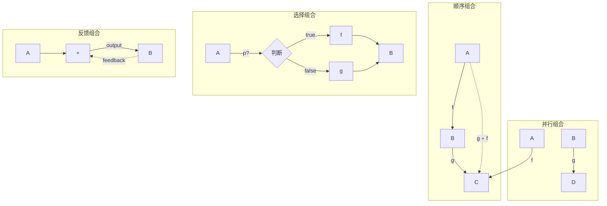
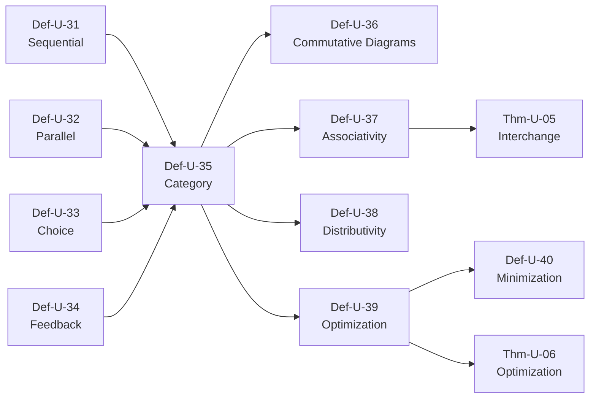

# 组合理论 (Composition Theory)

> **文档类型**: 阶段二 - 统一流模型 | **形式化等级**: L5-L6 | **编号**: 01.04
> **阶段**: 第8周 | **依赖**: 01.03-operator-algebra.md

---

## 0. 前置依赖

本文档依赖以下文档：

- 算子代数: [01.03-operator-algebra.md](./01.03-operator-algebra.md)
- 流的数学定义: [01.01-stream-mathematical-definition.md](./01.01-stream-mathematical-definition.md)
- 范畴论基础: [00.01-category-theory-foundation.md](../00-meta/00.01-category-theory-foundation.md)

---

## 1. 概念定义 (Definitions)

### Def-U-31: 顺序组合 (Sequential Composition)

**形式化定义**:

顺序组合是将一个算子的输出作为另一个算子的输入：

$$
\circ: (B \rightarrow C) \times (A \rightarrow B) \rightarrow (A \rightarrow C)
$$

对于流算子：

$$
\circ: (\text{Stream}_B \rightarrow \text{Stream}_C) \times (\text{Stream}_A \rightarrow \text{Stream}_B) \rightarrow (\text{Stream}_A \rightarrow \text{Stream}_C)
$$

**类型检查**:

顺序组合有效当且仅当中间类型匹配：

$$
\frac{f: B \rightarrow C \quad g: A \rightarrow B}{f \circ g: A \rightarrow C}
$$

**性质**:

| 性质 | 陈述 |
|------|------|
| 结合律 | $(f \circ g) \circ h = f \circ (g \circ h)$ |
| 单位元 | $\text{id} \circ f = f = f \circ \text{id}$ |
| 类型保持 | 若 $g$ 输出类型 $T$，则 $f$ 输入类型必须是 $T$ |

**直观解释**: 顺序组合是构建流处理管道的基本方式。类似于Unix管道（cmd1 | cmd2 | cmd3），数据从左到右流动，每个算子对数据进行转换。这是最常见的组合模式。

---

### Def-U-32: 并行组合 (Parallel Composition)

**形式化定义**:

并行组合将多个独立的算子应用于独立的输入流：

$$
\|: (\text{Stream}_A \rightarrow \text{Stream}_C) \times (\text{Stream}_B \rightarrow \text{Stream}_D) \rightarrow (\text{Stream}_A \times \text{Stream}_B \rightarrow \text{Stream}_C \times \text{Stream}_D)
$$

$$
(f \| g)(s_1, s_2) = (f(s_1), g(s_2))
$$

**积组合** (将同一输入路由到多个算子):

$$
\langle f, g \rangle: \text{Stream}_A \rightarrow \text{Stream}_B \times \text{Stream}_C
$$

$$
\langle f, g \rangle(s) = (f(s), g(s))
$$

**叉积算子**:

$$
\times: (A \rightarrow C) \times (B \rightarrow D) \rightarrow (A \times B \rightarrow C \times D)
$$

$$
(f \times g)(a, b) = (f(a), g(b))
$$

**性质**:

| 性质 | 陈述 |
|------|------|
| 交换律 | $f \| g \cong g \| f$ (输入输出重排后) |
| 结合律 | $(f \| g) \| h \cong f \| (g \| h)$ |
| 与顺序组合交互 | $(f \times g) \circ (h \times k) = (f \circ h) \times (g \circ k)$ |

**直观解释**: 并行组合允许同时处理多个流或对流进行多路处理。这在分布式系统中非常重要——不同的算子可以在不同节点上并行执行。积组合（分叉）常用于将数据同时发送到多个下游处理路径。

---

### Def-U-33: 选择组合 (Choice Composition)

**形式化定义**:

选择组合基于条件决定执行路径：

$$
\lhd: (A \rightarrow \text{Bool}) \times (A \rightarrow B) \times (A \rightarrow B) \rightarrow (A \rightarrow B)
$$

$$
(p \lhd f, g)(a) = \begin{cases} f(a) & \text{if } p(a) \\ g(a) & \text{otherwise} \end{cases}
$$

**余积组合**:

$$
[f, g]: (A \rightarrow C) \times (B \rightarrow C) \rightarrow (A + B \rightarrow C)
$$

$$
[f, g](\iota_1(a)) = f(a), \quad [f, g](\iota_2(b)) = g(b)
$$

**Guarded Command**:

$$
\square_{i \in I} (b_i \rightarrow P_i)
$$

选择满足 $b_i$ 的进程 $P_i$ 执行。

**性质**:

| 性质 | 陈述 |
|------|------|
| 排他性 | 条件互斥时，只有一个分支执行 |
| 完备性 | 通常需要默认分支（else）保证完备 |
| 确定性 | 若条件确定，选择确定 |

**直观解释**: 选择组合引入了控制流的分支。类似于编程语言中的 if-then-else，它允许系统根据数据内容选择不同的处理路径。这在数据分流、错误处理、多协议支持等场景中非常有用。

---

### Def-U-34: 反馈组合 (Feedback/Recursion)

**形式化定义**:

反馈组合将输出的一部分反馈回输入：

$$
\text{fix}: (\text{Stream}_A \times \text{Stream}_B \rightarrow \text{Stream}_B) \rightarrow (\text{Stream}_A \rightarrow \text{Stream}_B)
$$

$$
\text{fix}(F)(a) = b \text{ where } b = F(a, b)
$$

**Trace 组合**:

$$
\text{Tr}_{A,B}^C: (A \times C \rightarrow B \times C) \rightarrow (A \rightarrow B)
$$

$$
\text{Tr}(f)(a) = b \text{ where } (b, c) = f(a, c)
$$

**迭代算子**:

$$
(-)^*: (A \rightarrow A + B) \rightarrow (A \rightarrow B)
$$

$$
f^*(a) = \begin{cases} f^*(a') & \text{if } f(a) = \iota_1(a') \\ b & \text{if } f(a) = \iota_2(b) \end{cases}
$$

**反馈的安全性条件**:

$$
\text{well-founded}(F) \iff \forall a. \, \text{fix}(F)(a) \text{ 收敛}
**

**直观解释**: 反馈组合支持递归和迭代。在流处理中，反馈用于实现状态循环（如迭代算法）、自连接（stream与自身的历史join）等。它需要谨慎使用，因为不当的反馈可能导致无限循环或发散。

---

### Def-U-35: 组合的范畴论解释

**形式化定义**:

流处理系统构成**对称严格幺半范畴** $(\mathbf{Stream}, \circ, \|, \text{id}, I)$：

**对象**: 流类型 $\text{Stream}_A, \text{Stream}_B, \ldots$

**态射**: 算子 $op: \text{Stream}_A \rightarrow \text{Stream}_B$

**张量积** ($\|$):

$$
\|: \text{Hom}(A, C) \times \text{Hom}(B, D) \rightarrow \text{Hom}(A \times B, C \times D)
$$

**单位对象**:

$$I = \text{Stream}_{\mathbf{1}} \text{ (单元素流)}
$$

**范畴公理**:

| 公理 | 陈述 |
|------|------|
| 结合律 | $(f \circ g) \circ h = f \circ (g \circ h)$ |
| 单位元 | $\text{id} \circ f = f = f \circ \text{id}$ |
| 张量结合律 | $(f \| g) \| h = f \| (g \| h)$ |
| 张量单位元 | $f \| \text{id}_I = f = \text{id}_I \| f$ |
| 交换律 | $\sigma_{A,B} \circ (f \| g) = (g \| f) \circ \sigma_{C,D}$ |

其中 $\sigma_{A,B}: A \times B \rightarrow B \times A$ 是交换自然同构。

**直观解释**: 范畴论提供了一个高阶框架来理解组合。顺序组合对应态射复合，并行组合对应张量积。这种抽象允许我们在不同层次上分析流处理系统的结构，并应用范畴论的通用结果。

---

### Def-U-36: 交换图 (Commutative Diagrams)

**形式化定义**:

交换图是表示组合等价的图示方法。图交换当且仅当任意两条路径产生相同结果。

**基本交换图**:

**函子性** (组合保持):

```
    A ──f──→ B ──g──→ C
    │        │        │
    │ F      │ F      │ F
    ↓        ↓        ↓
   F(A) ─F(f)→ F(B) ─F(g)→ F(C)
```

**自然变换**:

```
    F(A) ──F(f)──→ F(B)
     │η_A           │η_B
     ↓              ↓
    G(A) ──G(f)──→ G(B)
```

交换条件：$\eta_B \circ F(f) = G(f) \circ \eta_A$

**积的交换图**:

```
        A ←──π₁─── A × B ──π₂──→ B
        │          │          │
        │f         │⟨f,g⟩     │g
        ↓          ↓          ↓
        C ←──π₁─── C × D ──π₂──→ D
```

**直观解释**: 交换图是一种可视化工具，用于表达组合之间的等价关系。如果图交换，我们可以任意选择路径进行计算，结果相同。这在优化和验证中非常有用——我们可以用等价的但更高效的路径替换原始路径。

---

### Def-U-37: 组合的结合性

**形式化定义**:

**顺序组合的结合性**:

$$
\forall f, g, h. \, (f \circ g) \circ h = f \circ (g \circ h)
$$

**并行组合的结合性**:

$$
\forall f, g, h. \, (f \| g) \| h = f \| (g \| h)
$$

**混合组合的结合性**:

当顺序组合和并行组合混合时：

$$
(f \times g) \circ (h \times k) = (f \circ h) \times (g \circ k)
$$

这称为**互交换律**（interchange law）。

**一般结合律**:

对于组合树，若所有操作都是结合的，则任意加括号方式等价：

$$
\text{flatten}(T_1) = \text{flatten}(T_2)
$$

对于任意两棵具有相同叶节点的二叉树 $T_1, T_2$。

**直观解释**: 结合性意味着我们可以任意分组操作而不改变结果。这在并行化中至关重要——我们可以将操作分配到不同的计算节点，只要最终合并结果，正确性就得到保证。

---

### Def-U-38: 组合的分配律

**形式化定义**:

**左分配律**:

$$
f \circ (g \| h) = (f \circ g) \| (f \circ h) \quad \text{（当类型匹配时）}
$$

**右分配律**:

$$
(f \| g) \circ h = (f \circ h) \| (g \circ h)
$$

**积的分配律**:

$$
f \times (g \| h) = (f \times g) \| (f \times h)
$$

**条件分配律**:

$$
f \circ (p \lhd g, h) = p \lhd (f \circ g), (f \circ h)
$$

**注意**: 并非所有组合都满足分配律。例如：

$$
\text{reduce}(+) \circ (f \| g) \neq (\text{reduce}(+) \circ f) \| (\text{reduce}(+) \circ g)
$$

（除非结果合并使用 +）

**直观解释**: 分配律允许我们"下推"或"上提"操作。在优化中，这意味着我们可以将共享计算提取出来，或将独立计算分散到不同路径。但需要注意类型匹配——分配律并非对所有操作都成立。

---

### Def-U-39: 组合的优化规则

**形式化定义**:

**融合规则** (Fusion):

$$
\text{map}(f) \circ \text{map}(g) \rightarrow \text{map}(f \circ g)
$$

**去融合规则** (Fission):

$$
\text{map}(f \circ g) \rightarrow \text{map}(f) \circ \text{map}(g) \quad \text{（用于并行化）}
$$

**重排规则** (Reordering):

$$
\text{filter}(p) \circ \text{map}(f) \rightarrow \text{map}(f) \circ \text{filter}(p \circ f)
$$

**下推规则** (Pushdown):

$$
\text{join}(s_1, \text{filter}(p)(s_2)) \rightarrow \text{filter}(\lambda (x,y). \, p(y))(\text{join}(s_1, s_2))
$$

**水平融合**:

$$
\langle f, g \rangle \circ h \rightarrow \langle f \circ h, g \circ h \rangle
$$

**垂直融合**:

$$
f \circ [g, h] \rightarrow [f \circ g, f \circ h]
$$

**优化策略**:

| 策略 | 规则 | 目标 |
|------|------|------|
| 减少遍历 | 融合 | 减少数据扫描次数 |
| 并行化 | 去融合 | 增加并行机会 |
| 谓词下推 | 下推规则 | 尽早过滤数据 |
| 资源共享 | 水平融合 | 减少重复计算 |

**直观解释**: 优化规则是基于代数等价的程序转换。通过应用这些规则，编译器或优化器可以自动改进流程序的性能，而不改变其语义。这是声明式流处理系统（如SQL-based streaming）的核心优势。

---

### Def-U-40: 组合的最小化

**形式化定义**:

**最小化问题**: 给定流程序 $P$，找到等价的 $P'$ 使得：

$$
\text{cost}(P') = \min_{Q \cong P} \text{cost}(Q)
$$

**成本模型**:

$$
\text{cost}(P) = \alpha \cdot \text{latency}(P) + \beta \cdot \text{throughput}^{-1}(P) + \gamma \cdot \text{resource}(P)
$$

**最小化算法**:

**基于规则的最小化**:

```
repeat
    apply_optimization_rules(P)
until no_rule_applies(P)
```

**基于成本的最小化**:

```
search_space = generate_plans(P)
P' = argmin(cost(plan) for plan in search_space)
```

**NP-hard性**:

流程序最小化在一般情况下是NP-hard的（可规约到查询优化问题）。

**启发式方法**:

- 尽早过滤
- 延迟物化
- 最大化算子融合
- 最小化数据移动

**直观解释**: 组合最小化是寻找最优执行计划的问题。由于搜索空间巨大，实际系统使用启发式方法或基于成本的部分搜索。这与数据库查询优化类似，但增加了流处理特有的约束（如延迟要求、状态管理）。

---

## 2. 属性推导 (Properties)

### Lemma-U-07: 组合的类型安全性

**陈述**:

若 $f: A \rightarrow B$ 和 $g: B \rightarrow C$ 是良类型的，则 $g \circ f: A \rightarrow C$ 也是良类型的。

**证明**:

由定义，$\circ$ 要求中间类型匹配。

对输入 $a: A$:

1. $f(a): B$ (由 $f$ 的类型)
2. $g(f(a)): C$ (由 $g$ 的类型)

故 $(g \circ f)(a): C$。

**∎**

---

### Lemma-U-08: 并行组合的独立性

**陈述**:

$(f \| g)(s_1, s_2)$ 中 $f(s_1)$ 的计算不依赖于 $s_2$。

**证明**:

由 Def-U-32：

$$(f \| g)(s_1, s_2) = (f(s_1), g(s_2))$$

$f(s_1)$ 仅依赖于 $s_1$，不访问 $s_2$。

**∎**

---

## 3. 关系建立 (Relations)

### 与算子代数的关系

| 本文档 | 依赖 | 关系 |
|--------|------|------|
| Def-U-31 | Def-U-22 | 顺序组合就是算子组合 |
| Def-U-35 | Def-U-30 | 范畴论视角的同态映射 |
| Def-U-39 | Def-U-25 | 优化规则基于代数定律 |

### 组合模式对比

| 组合类型 | 符号 | 类比 | 使用场景 |
|----------|------|------|----------|
| 顺序 | $\circ$ | Unix管道 | 数据转换链 |
| 并行 | $\|$ | 多线程 | 独立处理 |
| 选择 | $\lhd$ | if-then-else | 条件分支 |
| 反馈 | $\text{fix}$ | 递归 | 迭代/状态循环 |

---

## 4. 论证过程 (Argumentation)

### 4.1 为什么组合理论重要

**论题**: 组合理论是流处理系统设计与优化的基础。

**论证**:

**1. 模块化**: 组合允许构建复杂的流程序从简单的、可重用的组件。

**2. 优化**: 基于组合的代数定律，编译器可以自动进行等价变换。

**3. 验证**: 组合结构支持组合式验证——验证组件后，组合性质保证整体正确性。

**4. 分布式执行**: 并行组合和结合律为分布式执行提供理论基础。

### 4.2 反馈组合的收敛性分析

**问题**: 何时反馈组合 $fix(F)$ 收敛？

**充分条件**:

1. **压缩映射**: 若 $F$ 在某种度量下是压缩的，则 $fix(F)$ 存在且唯一。

2. **良基性**: 若反馈依赖是良基的（无无限下降链），则递归终止。

3. **单调性**: 若 $F$ 单调且定义在CPO上，则最小不动点存在。

**流处理中的典型情况**:

- 基于Watermark的窗口触发：良基（时间向前推进）
- 迭代算法：需要检查收敛条件
- 自连接：可能产生无限结果，需要限制

---

## 5. 形式证明 (Formal Proof)

### Thm-U-05: 互交换律 (Interchange Law)

**定理陈述**:

在幺半范畴中，顺序组合和并行组合满足互交换律：

$$
(f \times g) \circ (h \times k) = (f \circ h) \times (g \circ k)
$$

其中 $f: C \rightarrow E, g: D \rightarrow F, h: A \rightarrow C, k: B \rightarrow D$。

**证明**:

**左边**: $(f \times g) \circ (h \times k)$

对输入 $(a, b)$:

1. $(h \times k)(a, b) = (h(a), k(b))$
2. $(f \times g)(h(a), k(b)) = (f(h(a)), g(k(b)))$

**右边**: $(f \circ h) \times (g \circ k)$

对输入 $(a, b)$:

$((f \circ h) \times (g \circ k))(a, b) = ((f \circ h)(a), (g \circ k)(b)) = (f(h(a)), g(k(b)))$

两边相等。

**∎**

---

### Thm-U-06: 组合优化的正确性

**定理陈述**:

若优化规则 $P \rightarrow P'$ 是从代数定律推导的，则 $P \cong P'$（观察等价）。

**证明**:

对基本优化规则：

**融合**: $\text{map}(f) \circ \text{map}(g) \rightarrow \text{map}(f \circ g)$

由 Thm-U-03，两边等价。

**重排**: $\text{filter}(p) \circ \text{map}(f) \rightarrow \text{map}(f) \circ \text{filter}(p \circ f)$

验证：对任意输入流 $s$，两边产生的输出流相同。

对复杂优化（多步规则应用）：

由传递性，若每步保持等价，则整体等价。

**∎**

---

## 6. 实例验证 (Examples)

### 示例1: 顺序组合实现

```python
from typing import TypeVar, Callable

T = TypeVar('T')
U = TypeVar('U')
V = TypeVar('V')

# 顺序组合
def compose(f: Callable[[U], V], g: Callable[[T], U]) -> Callable[[T], V]:
    """f ∘ g"""
    return lambda x: f(g(x))

# 使用示例
add_one = lambda x: x + 1
multiply_by_two = lambda x: x * 2

# (x * 2) + 1
combined = compose(add_one, multiply_by_two)
print(f"compose(add_one, multiply_by_two)(5) = {combined(5)}")  # 11

# 验证结合律
# (f ∘ g) ∘ h = f ∘ (g ∘ h)
add_two = lambda x: x + 2

left = compose(compose(add_two, add_one), multiply_by_two)
right = compose(add_two, compose(add_one, multiply_by_two))

print(f"结合律验证: {left(5)} == {right(5)}")  # 都应为 13
```

### 示例2: 并行组合实现

```python
from typing import Tuple, TypeVar

A = TypeVar('A')
B = TypeVar('B')
C = TypeVar('C')
D = TypeVar('D')

def parallel(f: Callable[[A], C], g: Callable[[B], D]) -> Callable[[Tuple[A, B]], Tuple[C, D]]:
    """f || g"""
    def combined(input_pair: Tuple[A, B]) -> Tuple[C, D]:
        a, b = input_pair
        return (f(a), g(b))
    return combined

# 使用示例
to_string = lambda x: str(x)
to_float = lambda x: float(x)

parallel_op = parallel(to_string, to_float)
result = parallel_op((42, "3.14"))
print(f"parallel result: {result}")  # ('42', 3.14)

# 验证与顺序组合的交互（互交换律）
def times_ten(x): return x * 10
def plus_five(x): return x + 5

def add_one(x): return x + 1
def multiply_by_two(x): return x * 2

# (f × g) ∘ (h × k)
f_times_g = parallel(times_ten, plus_five)
h_times_k = parallel(add_one, multiply_by_two)
left = compose(f_times_g, h_times_k)

# (f ∘ h) × (g ∘ k)
f_comp_h = compose(times_ten, add_one)
g_comp_k = compose(plus_five, multiply_by_two)
right = parallel(f_comp_h, g_comp_k)

print(f"互交换律验证: {left((3, 4))} == {right((3, 4))}")
```

### 示例3: 选择组合实现

```python
from typing import Callable, TypeVar

T = TypeVar('T')

def choice(
    predicate: Callable[[T], bool],
    if_true: Callable[[T], T],
    if_false: Callable[[T], T]
) -> Callable[[T], T]:
    """p ◁ f, g"""
    def combined(x: T) -> T:
        return if_true(x) if predicate(x) else if_false(x)
    return combined

# 使用示例
is_even = lambda x: x % 2 == 0
double = lambda x: x * 2
triple = lambda x: x * 3

process_number = choice(is_even, double, triple)

print(f"choice on 4 (even): {process_number(4)}")   # 8 (double)
print(f"choice on 5 (odd): {process_number(5)}")    # 15 (triple)

# 使用在数据流中
data = [1, 2, 3, 4, 5, 6]
result = [process_number(x) for x in data]
print(f"Processed stream: {result}")  # [3, 4, 9, 8, 15, 12]
```

---

## 7. 可视化 (Visualizations)

### 图1: 四种基本组合模式



**图说明**: 展示了四种基本组合模式的图示。

### 图2: 交换图示例

```mermaid
graph TB
    subgraph "融合优化交换图"
        A1[Stream A] -->|map(g)| B1[Stream B]
        B1 -->|map(f)| C1[Stream C]
        A1 -.->|map(f∘g)| C1
    end

    subgraph "并行分解交换图"
        A2[Stream A] -->|partition| P1[Part 0]
        A2 -->|partition| P2[Part 1]
        P1 -->|f| R1[Result 0]
        P2 -->|f| R2[Result 1]
        R1 -->|merge| C2[Stream C]
        R2 -->|merge| C2
        A2 -.->|f| C2
    end
```

**图说明**: 展示了融合优化和并行分解的交换图。

### 图3: 流处理DAG结构

```mermaid
graph LR
    S1[Source 1] --> MAP1[map(f)]
    S2[Source 2] --> MAP2[map(g)]

    MAP1 --> JOIN[join]
    MAP2 --> JOIN

    JOIN --> FILTER[filter(p)]
    FILTER --> WINDOW[window(5min)]

    WINDOW --> AGG[aggregate(sum)]
    AGG --> SINK[Sink]

    style JOIN fill:#c8e6c9,stroke:#2e7d32
    style WINDOW fill:#fff9c4,stroke:#f57f17
```

**图说明**: 展示了一个典型的流处理DAG，包含源、转换、join、窗口、聚合和汇点。

---

## 8. 引用参考 (References)

---

## 附录

### A. 符号表

| 符号 | 含义 |
|------|------|
| $\circ$ | 顺序组合 |
| $\|$ 或 $\times$ | 并行组合 |
| $\lhd$ | 选择组合 |
| $\text{fix}$ | 反馈/不动点 |
| $\langle f, g \rangle$ | 积组合（分叉） |
| $[f, g]$ | 余积组合（合并） |
| $\sigma_{A,B}$ | 交换同构 |

### B. 依赖图



---

*文档版本: 2026.04 | 形式化等级: L5-L6 | 状态: 阶段二 - 第8周*
