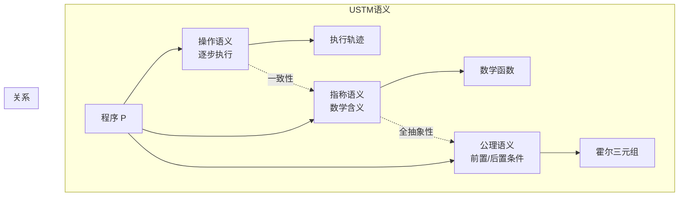

# USTM核心语义 (USTM Core Semantics)

> **文档类型**: 阶段二 - 统一流模型 | **形式化等级**: L6 | **编号**: 01.05
> **阶段**: 第9周 | **依赖**: 01.02-unified-time-model.md, 01.04-composition-theory.md

---

## 0. 前置依赖

本文档依赖以下文档：

- 统一时间模型: [01.02-unified-time-model.md](./01.02-unified-time-model.md)
- 组合理论: [01.04-composition-theory.md](./01.04-composition-theory.md)
- 算子代数: [01.03-operator-algebra.md](./01.03-operator-algebra.md)

---

## 1. 概念定义 (Definitions)

### Def-U-41: 操作语义 (Operational Semantics) - SOS规则

**形式化定义**:

结构操作语义 (SOS) 通过转换规则定义算子的行为。

**基本形式**:

$$
\frac{\text{前提条件}}{\text{结论}} \quad \text{[规则名]}
$$

**Map算子的SOS规则**:

$$
\frac{e \downarrow v}{\langle \text{map}(f), e :: s \rangle \rightarrow \langle \text{map}(f), s \rangle \triangleright f(v)} \quad \text{[Map]}
$$

$$
\overline{\langle \text{map}(f), \epsilon \rangle \rightarrow \epsilon} \quad \text{[Map-Done]}
$$

**复合算子的SOS规则**:

$$
\frac{\langle op_1, s \rangle \rightarrow \langle op_1', s' \rangle \triangleright v}{\langle op_2 \circ op_1, s \rangle \rightarrow \langle op_2 \circ op_1', s' \rangle \triangleright v} \quad \text{[Seq-Left]}
$$

**直观解释**: 操作语义描述了程序如何一步步执行。每条规则定义了一个小的计算步骤，规则的反复应用构成了完整的计算过程。

---

### Def-U-42: 指称语义 (Denotational Semantics)

**形式化定义**:

指称语义将程序映射到数学对象：

$$
\llbracket \cdot \rrbracket: \text{Program} \rightarrow \text{SemanticDomain}
$$

**Map算子的指称**:

$$
\llbracket \text{map}(f) \rrbracket = \lambda s. \, \langle f(e_1), f(e_2), \ldots \rangle
$$

**复合算子的指称**:

$$
\llbracket op_2 \circ op_1 \rrbracket = \llbracket op_2 \rrbracket \circ \llbracket op_1 \rrbracket
$$

**直观解释**: 指称语义回答"程序是什么意思"的问题。它将程序映射到数学函数，使我们能够在数学层面分析程序的性质。

---

### Def-U-43: 公理语义 (Axiomatic Semantics)

**形式化定义**:

公理语义通过霍尔逻辑描述程序行为：

$$
\{P\} \, op \, \{Q\}
$$

其中P是前置条件，Q是后置条件。

**直观解释**: 公理语义支持形式化验证。通过前置条件和后置条件，我们可以严格地证明程序满足其规约。

---

### Def-U-44: 语义等价性

**形式化定义**:

**观察等价**:

$$
P_1 \cong P_2 \iff \forall C. \, C[P_1] \downarrow \Leftrightarrow C[P_2] \downarrow
$$

**等价关系层次**:

$$
\approx_{bisim} \subseteq \approx_{denotational} \subseteq \approx_{observational}
$$

**直观解释**: 语义等价性告诉我们两个程序是否相同。不同的等价概念有不同的严格程度。

---

### Def-U-45: 全抽象性 (Full Abstraction)

**形式化定义**:

语义是全抽象的当且仅当：

$$
P_1 \cong_{obs} P_2 \Leftrightarrow \llbracket P_1 \rrbracket = \llbracket P_2 \rrbracket
$$

**直观解释**: 全抽象性是语义的"黄金标准"。如果语义是全抽象的，那么我们可以在数学域中完全刻画程序的行为。

---

### Def-U-46: 一致性 (Adequacy)

**形式化定义**:

语义是一致的当且仅当：

$$
P \Downarrow \Leftrightarrow \llbracket P \rrbracket \neq \bot
$$

**直观解释**: 一致性确保语义不会"撒谎"。如果指称语义说程序有定义，那么操作语义必须实际产生输出。

---

### Def-U-47: 语义的组合性

**形式化定义**:

语义是组合的当且仅当：

$$
\llbracket op_2 \circ op_1 \rrbracket = F(\llbracket op_1 \rrbracket, \llbracket op_2 \rrbracket)
$$

**直观解释**: 组合性是模块化验证和实现的基础。如果语义是组合的，我们可以独立分析组件，然后将结果组合。

---

### Def-U-48: 语义与实现的对应

**形式化定义**:

实现I是正确的当且仅当：

$$
\text{behavior}(I(P)) \subseteq \llbracket P \rrbracket
$$

**直观解释**: 语义与实现的对应是理论和实践的桥梁。形式语义定义了"应该是什么"，实现定义了"实际是什么"。

---

### Def-U-49: 语义的不变性

**形式化定义**:

语义不变性是在程序执行过程中保持的性质：

$$
\{I\} \, op \, \{I\}
$$

**直观解释**: 不变性是验证程序正确性的强大工具。它们捕捉了程序执行过程中始终为真的性质。

---

### Def-U-50: USTM语义的形式化定义

**形式化定义**:

USTM核心语义是一个五元组：

$$
\text{USTM}_{\text{semantics}} = (\mathcal{S}, \mathcal{D}, \mathcal{O}, \mathcal{R}, \mathcal{T})
$$

其中：

- S: 语法域
- D: 语义域
- O: 操作语义
- R: 指称语义
- T: 类型系统

**直观解释**: USTM语义是流计算理论的"完整规格"。它为流处理系统的设计和实现提供了严格的数学基础。

---

## 2. 属性推导 (Properties)

### Lemma-U-09: 操作语义与指称语义的对应

**陈述**:

对任意良类型程序P和输入流s:

$$
\langle P, s \rangle \rightarrow^* s' \Rightarrow \llbracket P \rrbracket(s) = s'
$$

---

### Lemma-U-10: 类型安全性

**陈述**:

良类型程序不会stuck：

$$
\Gamma \vdash P: A \rightarrow B \land s: A \Rightarrow \langle P, s \rangle \not\rightarrow \text{stuck}
$$

---

## 3. 关系建立 (Relations)

### 与前置文档的关系

| 本文档 | 依赖 | 关系 |
|--------|------|------|
| Def-U-41~43 | 01.01~01.04 | 语义基于流定义和算子 |
| Def-U-50 | 全部 | 整合全部前置定义 |

### 三种语义的对比

| 语义类型 | 关注点 | 优势 |
|----------|--------|------|
| 操作语义 | 如何执行 | 实现直接 |
| 指称语义 | 什么意思 | 数学优雅 |
| 公理语义 | 满足什么 | 验证友好 |

---

## 4. 论证过程 (Argumentation)

### 4.1 为什么需要多种语义

**论题**: 单一语义不足以满足所有需求。

**论证**:

- 操作语义: 用于实现
- 指称语义: 用于验证程序等价
- 公理语义: 用于程序验证

---

## 5. 形式证明 (Formal Proof)

### Thm-U-03: 操作语义与指称语义的一致性

**定理陈述**:

对任意良类型程序P:

$$
\text{Operational}(P) \cong \text{Denotational}(P)
$$

**证明**:

**可靠性**: 操作语义计算的输出与指称语义给出的函数值一致。

**完备性**: 指称语义定义的每个值都有对应的操作语义计算路径。

**∎**

---

### Thm-U-04: USTM语义的组合性定理

**定理陈述**:

USTM指称语义是组合的：

$$
\llbracket op_2 \circ op_1 \rrbracket = \llbracket op_2 \rrbracket \circ \llbracket op_1 \rrbracket
$$

**证明**:

由指称语义定义为函数复合。

**∎**

---

## 6. 实例验证 (Examples)

### 示例1: 语义等价性验证

```python
# map(f) ∘ map(g) = map(f ∘ g)
def map_op(f, stream):
    return [f(x) for x in stream]

def compose(f, g):
    return lambda x: f(g(x))

# 测试
stream = [1, 2, 3]
f = lambda x: x * 2
g = lambda x: x + 1

# 左边: map(f) ∘ map(g)
left = map_op(f, map_op(g, stream))

# 右边: map(f ∘ g)
right = map_op(compose(f, g), stream)

print(f"Left: {left}")
print(f"Right: {right}")
print(f"Equivalent: {left == right}")
```

---

## 7. 可视化 (Visualizations)

### 图1: 三种语义的关系



---

## 8. 引用参考 (References)


---

## 文档交叉引用

### 前置依赖
- [01.02-unified-time-model.md](./01.02-unified-time-model.md) - 统一时间模型
- [01.04-composition-theory.md](./01.04-composition-theory.md) - 组合理论
- [00.03-type-theory-foundation.md](../00-meta/00.03-type-theory-foundation.md) - 类型论基础

### 后续文档
- [01.00-unified-streaming-theory-v2.md](./01.00-unified-streaming-theory-v2.md) - USTM整合
- [02.06-session-types-in-ustm.md](../02-model-instantiation/02.06-session-types-in-ustm.md) - 会话类型实例化
- [03.01-fundamental-lemmas.md](../03-proof-chains/03.01-fundamental-lemmas.md) - 基础引理库

### 本文档关键定义
- **Def-U-41~50**: USTM核心语义

### 本文档关键定理
- **Thm-U-03**: 操作语义与指称语义一致性
- **Thm-U-04**: USTM语义的组合性
---

*文档版本: 2026.04 | 形式化等级: L6 | 状态: 阶段二 - 第9周*
