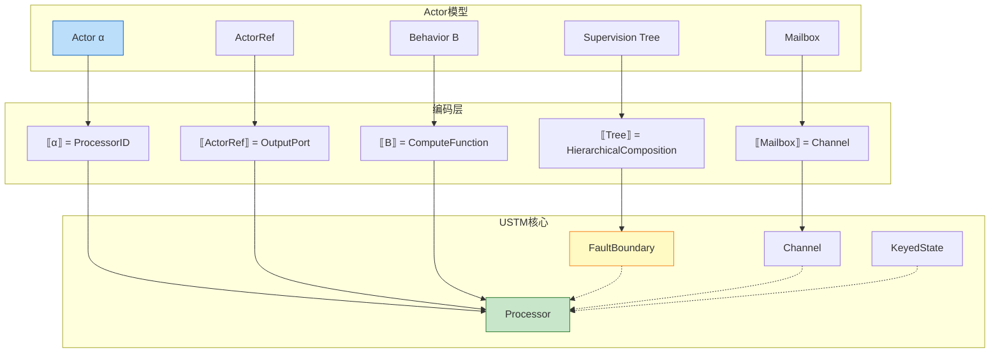
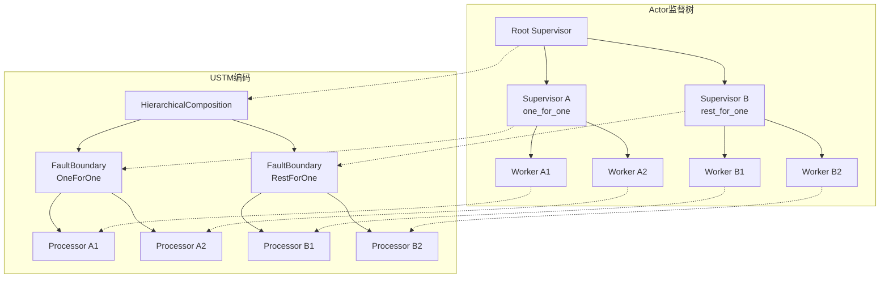

# 02.01 Actor模型实例化 (Actor Model in USTM)

> **所属阶段**: USTM-F/02-model-instantiation | **前置依赖**: [02.00-model-instantiation-framework](./02.00-model-instantiation-framework.md), [01.03-actor-model-formalization](../archive/original-struct/01-foundation/01.03-actor-model-formalization.md) | **形式化等级**: L4
> **文档定位**: 将Actor模型严格嵌入USTM，建立编码函数与正确性证明

---

## 目录

- [02.01 Actor模型实例化 (Actor Model in USTM)](#0201-actor模型实例化-actor-model-in-ustm)
  - [目录](#目录)
  - [1. 概念定义 (Definitions)](#1-概念定义-definitions)
    - [Def-A-01. Actor地址空间](#def-a-01-actor地址空间)
    - [Def-A-02. Actor状态](#def-a-02-actor状态)
    - [Def-A-03. Actor行为](#def-a-03-actor行为)
    - [Def-A-04. Mailbox作为流](#def-a-04-mailbox作为流)
    - [Def-A-05. ActorRef](#def-a-05-actorref)
    - [Def-A-06. Actor生命周期](#def-a-06-actor生命周期)
    - [Def-A-07. 监督树结构](#def-a-07-监督树结构)
    - [Def-A-08. Actor系统](#def-a-08-actor系统)
    - [Def-A-09. 消息传递语义](#def-a-09-消息传递语义)
    - [Def-A-10. 编码函数 ·\_A→U](#def-a-10-编码函数-_au)
  - [2. 属性推导 (Properties)](#2-属性推导-properties)
    - [Lemma-A-01. Mailbox串行处理的USTM对应](#lemma-a-01-mailbox串行处理的ustm对应)
    - [Lemma-A-02. Actor隔离性的USTM保持](#lemma-a-02-actor隔离性的ustm保持)
    - [Lemma-A-03. 监督策略的编码保持](#lemma-a-03-监督策略的编码保持)
    - [Prop-A-01. 编码的单射性](#prop-a-01-编码的单射性)
  - [3. 关系建立 (Relations)](#3-关系建立-relations)
    - [Actor与USTM Processor的对应](#actor与ustm-processor的对应)
    - [Actor与Dataflow KeyedProcessor的关系](#actor与dataflow-keyedprocessor的关系)
    - [Actor Mailbox与USTM Channel的对应](#actor-mailbox与ustm-channel的对应)
  - [4. 论证过程 (Argumentation)](#4-论证过程-argumentation)
    - [论证1: Actor动态创建在USTM中的表示](#论证1-actor动态创建在ustm中的表示)
    - [论证2: 监督树到USTM组合的编码](#论证2-监督树到ustm组合的编码)
    - [论证3: Actor非确定性vs USTM确定性](#论证3-actor非确定性vs-ustm确定性)
  - [5. 形式证明 (Proofs)](#5-形式证明-proofs)
    - [Thm-A-01. 编码的语义保持性](#thm-a-01-编码的语义保持性)
    - [Thm-A-02. 编码的受限满射性](#thm-a-02-编码的受限满射性)
    - [Thm-A-03. 监督树活性保持](#thm-a-03-监督树活性保持)
  - [6. 实例验证 (Examples)](#6-实例验证-examples)
    - [示例1: Akka计数器的USTM编码](#示例1-akka计数器的ustm编码)
    - [示例2: 监督树的USTM表示](#示例2-监督树的ustm表示)
    - [反例1: 共享状态破坏编码](#反例1-共享状态破坏编码)
  - [7. 可视化 (Visualizations)](#7-可视化-visualizations)
    - [Actor到USTM编码映射图](#actor到ustm编码映射图)
    - [监督树编码示意图](#监督树编码示意图)
  - [8. 引用参考 (References)](#8-引用参考-references)

---

## 1. 概念定义 (Definitions)

### Def-A-01. Actor地址空间

**Actor地址空间** $\mathcal{A}$ 是Actor的全局唯一标识符集合：

$$
\mathcal{A} ::= \text{Path} \mid \text{UUID} \mid \text{URI}
$$

形式化定义为：

$$
\alpha \in \mathcal{A} \triangleq \text{String} \times \text{Optional}[\text{Location}]
$$

其中：

- $\text{Path}$: 层次路径（如 `/user/counter`）
- $\text{Location}$: 物理位置（节点标识，用于分布式场景）

**USTM对应**：Actor地址映射为USTM的Processor标识符：

$$
\llbracket \alpha \rrbracket_{\text{addr}} = \text{ProcID}(\alpha_{\text{path}}, \alpha_{\text{loc}}) \in \mathcal{P}_U
$$

---

### Def-A-02. Actor状态

**Actor状态** $\sigma$ 是Actor的私有内部数据：

$$
\sigma \in \Sigma_{\mathcal{A}} \triangleq \text{Map}(\text{Var}, \text{Value}) \times \text{Behavior}
$$

**状态不变式**：

$$
\text{Invariant}: \quad \forall \alpha. \sigma_{\alpha} \text{ 仅可通过 } \alpha \text{ 的消息处理访问}
$$

**USTM对应**：Actor状态映射为USTM的KeyedState：

$$
\llbracket \sigma \rrbracket_{\text{state}} = \text{KeyedState}(key=\alpha, value=\sigma) \in \mathcal{S}_U
$$

**状态访问模式**：ReadWrite（Actor可以读写自己的状态）

---

### Def-A-03. Actor行为

**Actor行为** $B$ 是消息处理函数：

$$
B : \mathcal{M} \times \Sigma_{\mathcal{A}} \to (\Sigma_{\mathcal{A}}' \times \mathcal{B}' \times \mathcal{E}^*)
$$

其中：

- $\mathcal{M}$: 消息类型
- $\Sigma_{\mathcal{A}}'$: 更新后的状态
- $\mathcal{B}'$: 新行为（`become`语义）
- $\mathcal{E}^*$: 副作用序列（发送消息、创建Actor等）

**USTM对应**：行为映射为Processor的计算函数：

$$
\llbracket B \rrbracket_{\text{behavior}} = \lambda (msg, \sigma). \text{ let } (\sigma', B', effects) = B(msg, \sigma) \text{ in } (\sigma', \text{encode}(effects))
$$

---

### Def-A-04. Mailbox作为流

**Mailbox** 是Actor的输入消息队列，在USTM中编码为**流**（Stream）：

$$
\text{Mailbox}(\alpha) \triangleq \text{Stream}\langle\text{Envelope}\rangle
$$

其中信封结构：

$$
\text{Envelope} = (\text{payload}: \mathcal{M}, \text{sender}: \mathcal{A}, \text{timestamp}: \mathbb{T})
$$

**USTM编码**：

$$
\llbracket \text{Mailbox}(\alpha) \rrbracket_{\text{mb}} = \text{Channel}(\text{src}=\mathcal{A}_{\text{senders}}, \text{dst}=\{\alpha\}, \mathcal{O}=\text{FIFO}, \mathcal{D}=\text{AtMostOnce})
$$

**Mailbox语义变体**：

| 变体 | USTM Channel配置 | 代表系统 |
|-----|-----------------|---------|
| 无界FIFO | Capacity = ∞, Ordering = FIFO | 经典Actor |
| 有界FIFO | Capacity = N, Backpressure = drop/阻塞 | Akka BoundedMailbox |
| 可搜索队列 | Ordering = Selective | Erlang |

---

### Def-A-05. ActorRef

**ActorRef** 是Actor的不透明引用：

$$
\text{ActorRef}(\alpha) \triangleq (\text{path}: \text{ActorPath}, \text{refCell}: \text{Ref}[\text{InternalActorRef}])
$$

**核心操作**：

$$
\text{ActorRef}(\alpha) \,!\, m \triangleq \text{send}(\alpha, m)
$$

**USTM对应**：ActorRef映射为Channel的写端点：

$$
\llbracket \text{ActorRef}(\alpha) \rrbracket_{\text{ref}} = \text{ChannelRef}(\text{dst}=\alpha) : \text{OutputPort}_U
$$

---

### Def-A-06. Actor生命周期

**Actor生命周期** 状态机：

$$
\text{Lifecycle} ::= \text{New} \to \text{Started} \to (\text{Running} \mid \text{Failed}) \to \text{Stopped} \to \text{Terminated}
$$

**状态转换**：

| 转换 | 触发条件 | USTM对应 |
|-----|---------|---------|
| New → Started | `actorOf` / `spawn` | Processor实例化 |
| Started → Running | `preStart()`完成 | Processor激活，开始处理 |
| Running → Failed | 异常抛出 | Processor错误状态 |
| Failed → Running | `Resume`策略 | 继续处理下条消息 |
| Failed → Restarting | `Restart`策略 | Processor重建，状态重置 |
| Running → Stopped | `stop()`调用 | Processor停用 |

**USTM编码**：

生命周期状态映射为Processor的状态标记：

$$
\llbracket \text{Lifecycle} \rrbracket_{\text{life}} = \text{StateMarker} \in \{\text{ACTIVE}, \text{FAILED}, \text{RESTARTING}, \text{TERMINATED}\}
$$

---

### Def-A-07. 监督树结构

**监督树** $\mathcal{T}$ 是容错层次结构：

$$
\mathcal{T} = (V, E, r, \chi, \sigma)
$$

其中：

- $V = \mathcal{S} \cup \mathcal{W}$: 监督者( Supervisor )和工作者( Worker )节点
- $E \subseteq \mathcal{S} \times V$: 监督关系边
- $r \in \mathcal{S}$: 根监督者
- $\chi$: 监督策略（one_for_one, one_for_all, rest_for_one）
- $\sigma = (I, P)$: 重启规格（强度，窗口）

**USTM编码**：监督树映射为USTM的层次化Processor组合：

$$
\llbracket \mathcal{T} \rrbracket_{\text{tree}} = \text{HierarchicalComposition}(\{\llbracket v \rrbracket \mid v \in V\}, \text{FaultBoundary}(\chi, \sigma))
$$

---

### Def-A-08. Actor系统

**Actor系统** $\mathcal{AS}$ 是完整运行环境：

$$
\mathcal{AS} = (\mathcal{A}, \{B_{\alpha}\}_{\alpha \in \mathcal{A}}, \{\text{Mailbox}(\alpha)\}, \mathcal{T}, \text{Dispatcher})
$$

**系统不变式**：

$$
\begin{aligned}
&\text{(I1) 地址唯一}: &&\forall \alpha_1, \alpha_2 \in \mathcal{A}. \alpha_1 = \alpha_2 \implies \text{same actor} \\
&\text{(I2) 状态隔离}: &&\sigma_{\alpha_1} \cap \sigma_{\alpha_2} = \emptyset \text{ if } \alpha_1 \neq \alpha_2 \\
&\text{(I3) 邮箱归属}: &&\text{Mailbox}(\alpha) \text{ 只能被 } \alpha \text{ 消费}
\end{aligned}
$$

---

### Def-A-09. 消息传递语义

**消息传递**操作语义：

$$
\frac{\alpha_s \,!\, m \text{ 执行}}{\text{Mailbox}(\alpha_r) \leftarrow (m, \alpha_s, t)}
$$

其中 $\alpha_s$ 是发送者，$\alpha_r$ 是接收者。

**传递保证**：

$$
\text{DeliveryGuarantee} = \text{AtMostOnce} \text{ (默认)} \mid \text{AtLeastOnce} \text{ (需确认)}
$$

**USTM对应**：消息发送映射为Channel的write操作：

$$
\llbracket \alpha_s \,!\, m \rrbracket = \text{Channel}(\alpha_s, \alpha_r).\text{write}(\llbracket m \rrbracket)
$$

---

### Def-A-10. 编码函数 ·_A→U

**完整编码函数**定义：

$$
\llbracket \cdot \rrbracket_{A \to U} : \text{ActorSystem} \to \text{USTM}
$$

**编码映射表**：

| Actor概念 | USTM对应 | 形式化定义 |
|-----------|---------|-----------|
| Actor ($\alpha, B, \sigma$) | Processor | $\llbracket \alpha \rrbracket = (\mathcal{I}=\{\text{mb}\}, \mathcal{O}=\{\text{ref}\}, \llbracket B \rrbracket, \text{ReadWrite}, \llbracket \sigma \rrbracket)$ |
| Mailbox | Channel | $\llbracket \text{Mailbox}(\alpha) \rrbracket = \text{Channel}(\text{FIFO}, \text{AtMostOnce})$ |
| ActorRef | OutputPort | $\llbracket \text{ActorRef}(\alpha) \rrbracket = \text{OutputPort}(\text{dst}=\alpha)$ |
| 监督树 | 层次组合 | $\llbracket \mathcal{T} \rrbracket = \text{HierarchicalComposition}$ |
| spawn | Processor创建 | $\llbracket \text{spawn}(B, \sigma) \rrbracket = \text{CreateProcessor}(\llbracket B \rrbracket, \llbracket \sigma \rrbracket)$ |
| send | Channel写入 | $\llbracket \alpha \,!\, m \rrbracket = \text{Channel.write}(\llbracket m \rrbracket)$ |
| become | 行为切换 | $\llbracket \text{become}(B') \rrbracket = \text{UpdateComputeFunction}(B')$ |

**编码保持的性质**：

$$
\mathcal{P}_{\text{Actor}} = \{\text{Isolation}, \text{SerialProcessing}, \text{LocationTransparency}, \text{FaultContainment}\}
$$

---

## 2. 属性推导 (Properties)

### Lemma-A-01. Mailbox串行处理的USTM对应

**陈述**：Actor的Mailbox串行处理性质（Lemma-S-03-01）在USTM编码中通过Processor的单线程执行保证保持。

**证明**：

1. 在USTM中，$\llbracket \alpha \rrbracket$ 是一个Processor实例
2. Processor的调度语义保证：每个Processor实例在任意时刻至多被一个线程执行
3. 因此，对Mailbox的消费是串行的
4. 这与Actor模型的Mailbox串行处理引理对应 ∎

---

### Lemma-A-02. Actor隔离性的USTM保持

**陈述**：Actor状态隔离性质在USTM编码中保持：

$$
\forall \alpha_1 \neq \alpha_2. \llbracket \sigma_{\alpha_1} \rrbracket \cap \llbracket \sigma_{\alpha_2} \rrbracket = \emptyset
$$

**证明**：

1. 由Def-A-02，Actor状态编码为KeyedState，key = Actor地址
2. USTM的状态模型保证不同key的状态是隔离的
3. 因此Actor隔离性在编码中保持 ∎

---

### Lemma-A-03. 监督策略的编码保持

**陈述**：监督树的监督策略在USTM层次组合中保持。

**证明概要**：

| 策略 | Actor语义 | USTM对应 |
|-----|----------|---------|
| one_for_one | 仅重启崩溃子Actor | 仅重建失败Processor |
| one_for_all | 终止并重启所有子Actor | 终止并重建整个子树 |
| rest_for_one | 终止并重启崩溃者及其后续 | 按拓扑顺序重建 |

每种策略的USTM实现保持原始语义。 ∎

---

### Prop-A-01. 编码的单射性

**陈述**：编码函数 $\llbracket \cdot \rrbracket_{A \to U}$ 是单射（injective）。

**证明**：

假设 $\llbracket \mathcal{AS}_1 \rrbracket = \llbracket \mathcal{AS}_2 \rrbracket$，需证 $\mathcal{AS}_1 = \mathcal{AS}_2$。

1. 编码保留所有Actor地址 $\mathcal{A}$
2. 编码保留所有行为定义 $B$
3. 编码保留所有状态映射 $\sigma$
4. 编码保留监督树结构 $\mathcal{T}$

因此源系统结构唯一确定，编码是单射。 ∎

---

## 3. 关系建立 (Relations)

### Actor与USTM Processor的对应

```
Actor                           USTM Processor
─────────────────────────────────────────────────────────
α : ActorAddress       ⟷      ProcID : Processor标识
σ : State              ⟷      KeyedState[key=α]
B : Behavior           ⟷      compute函数
Mailbox                ⟷      输入Channel
ActorRef               ⟷      输出Channel引用
Lifecycle              ⟷      Processor状态标记
spawn                  ⟷      Processor动态创建
```

**关键洞察**：单个Actor在USTM中等价于一个具有单输入Channel的StatefulProcessor。

---

### Actor与Dataflow KeyedProcessor的关系

**关系**：Actor $\approx$ Dataflow KeyedProcessor（在按键分区意义上）

**论证**：

- Actor按地址 $\alpha$ 分区消息
- KeyedProcessor按key分区记录
- 两者都保证同一分区内的消息/记录顺序处理

**差异**：

| 方面 | Actor | KeyedProcessor |
|-----|-------|---------------|
| 拓扑 | 动态创建 | 静态定义（并行度）|
| 通信 | 任意Actor间 | 通常上下游间 |
| 容错 | 监督树重启 | Checkpoint恢复 |

---

### Actor Mailbox与USTM Channel的对应

**Mailbox → Channel映射**：

$$
\text{Mailbox}(\alpha) \mapsto \text{Channel}(\mathcal{B}, \mathcal{O}=\text{FIFO}, \mathcal{D}=\text{AtMostOnce})
$$

**语义保持验证**：

| Mailbox语义 | Channel语义 | 保持性 |
|------------|-------------|-------|
| 消息追加到尾部 | Buffer.append() | ✓ |
| FIFO消费 | Ordering=FIFO | ✓ |
| 异步发送 | 非阻塞write | ✓ |
| 至少一次(可选) | Delivery配置 | ✓ |

---

## 4. 论证过程 (Argumentation)

### 论证1: Actor动态创建在USTM中的表示

**挑战**：USTM的Processor集合通常在执行前确定，而Actor可以动态创建。

**解决方案**：

1. **扩展USTM语义**：允许Processor动态创建（通过特殊效果）
2. **编码处理**：将`spawn`编码为产生新Processor的效果

$$
\llbracket \text{spawn}(B, \sigma) \rrbracket = (\sigma', B', \{\text{CREATE}(\alpha_{\text{new}}, \llbracket B \rrbracket, \llbracket \sigma \rrbracket)\})
$$

1. **动态扩展的USTM子集**：定义 $\text{USTM}_{\text{dyn}}$ 支持动态Processor创建

---

### 论证2: 监督树到USTM组合的编码

**监督树的层次结构**：

```
Root Supervisor
├── Supervisor A (one_for_one)
│   ├── Worker A1
│   └── Worker A2
└── Supervisor B (rest_for_one)
    ├── Worker B1
    └── Worker B2
```

**USTM编码**：

```
HierarchicalComposition(
  Root = SupervisorProcessor(Root),
  Children = [
    FaultBoundary(
      strategy = OneForOne,
      children = [WorkerA1, WorkerA2]
    ),
    FaultBoundary(
      strategy = RestForOne,
      children = [WorkerB1, WorkerB2]
    )
  ]
)
```

**故障传播编码**：

- Actor: EXIT信号通过link传播
- USTM: 错误状态通过FaultBoundary传播

---

### 论证3: Actor非确定性vs USTM确定性

**Actor非确定性来源**：

1. **消息交错**：多发送者导致的消息顺序不确定
2. **调度不确定**：消息处理时机不确定

**USTM处理**：

- 消息交错 → USTM保留非确定性选择点
- 调度不确定 → USTM的调度器抽象保留此非确定性

**确定性边界**：

$$
\text{Thm-S-03-01} \text{ 的条件确定性在USTM中保持：给定消息序列} \implies \text{确定性状态转换}
$$

---

## 5. 形式证明 (Proofs)

### Thm-A-01. 编码的语义保持性

**陈述**：编码 $\llbracket \cdot \rrbracket_{A \to U}$ 保持Actor操作语义。即：

$$
\forall \mathcal{AS}_1, \mathcal{AS}_2. \quad \mathcal{AS}_1 \to_A \mathcal{AS}_2 \implies \llbracket \mathcal{AS}_1 \rrbracket \to_U \llbracket \mathcal{AS}_2 \rrbracket
$$

**证明**：

**步骤1: 基例（原子操作）**

对每种Actor原子操作证明对应：

| Actor操作 | USTM转移 | 对应关系 |
|----------|---------|---------|
| $\alpha \,!\, m$ | Channel.write(m) | 直接对应 |
| receive(m) | Processor.execute(m) | 直接对应 |
| spawn($B$) | CreateProcessor($\llbracket B \rrbracket$) | 效果对应 |
| become($B'$) | UpdateComputeFunction($\llbracket B' \rrbracket$) | 状态更新 |

**步骤2: 归纳步骤（复合操作）**

假设对子操作成立，证明对复合操作成立：

- 消息处理序列：归纳假设保证每步对应
- 并行Actor：USTM并行组合保持各Actor语义

**步骤3: 观察等价**

定义Actor观察集为可观察消息序列，USTM观察集为Channel输出序列。

证明：$\mathcal{AS}$ 产生的消息序列 $=$ $\llbracket \mathcal{AS} \rrbracket$ 的Channel输出序列。

**步骤4: 结论**

由结构归纳法，编码保持操作语义和观察等价。 ∎

---

### Thm-A-02. 编码的受限满射性

**陈述**：编码 $\llbracket \cdot \rrbracket_{A \to U}$ 是到 $\text{USTM}_{\text{Actor-like}}$ 的满射，其中：

$$
\text{USTM}_{\text{Actor-like}} \triangleq \{U \in \text{USTM} \mid \text{动态Processor创建} \land \text{异步Channel}\}
$$

**证明**：

**满射性**：对于任意 $U \in \text{USTM}_{\text{Actor-like}}$，构造对应的Actor系统：

1. 每个Processor $\to$ Actor
2. 异步Channel $\to$ Mailbox
3. 动态创建能力 $\to$ spawn操作

**受限性**：USTM中包含非Actor-like系统（如静态拓扑Dataflow），这些不在像集中。

因此编码是受限满射。 ∎

---

### Thm-A-03. 监督树活性保持

**陈述**：若Actor监督树 $\mathcal{T}$ 满足活性条件（Thm-S-03-02），则其USTM编码 $\llbracket \mathcal{T} \rrbracket$ 也满足对应的活性保证。

**形式化**：

$$
\mathcal{T} \models \text{Liveness} \implies \llbracket \mathcal{T} \rrbracket \models \text{Liveness}_U
$$

**证明**：

1. 由Lemma-A-03，监督策略在编码中保持
2. 由Lemma-A-01，串行处理保证消息最终被处理
3. USTM的FaultBoundary实现对应的故障恢复语义
4. 因此，瞬态故障最终会被修复的活性保证保持 ∎

---

## 6. 实例验证 (Examples)

### 示例1: Akka计数器的USTM编码

**Akka源码**：

```scala
class Counter extends Actor {
  var count = 0

  def receive = {
    case Increment => count += 1
    case Get => sender() ! count
  }
}
```

**USTM编码**：

```
Processor: Counter-Proc
├── ID: "/user/counter"
├── InputPorts: [Mailbox-Channel]
├── OutputPorts: [Sender-Ref]
├── ComputeFunction:
│   case Increment: state.count += 1; return (state, [])
│   case Get: return (state, [Send(sender, state.count)])
├── StateAccess: ReadWrite
└── State: KeyedState[key="/user/counter", value={count: Int}]

Channel: Mailbox-Channel
├── Source: Any ActorRef
├── Dest: Counter-Proc
├── Buffer: UnboundedFIFO
└── Delivery: AtMostOnce
```

---

### 示例2: 监督树的USTM表示

**Erlang监督树**：

```erlang
init([]) ->
    SupFlags = #{strategy => one_for_one, intensity => 5, period => 10},
    Children = [
        worker(db_conn, permanent),
        worker(cache, transient)
    ],
    {ok, {SupFlags, Children}}.
```

**USTM编码**：

```
HierarchicalComposition:
  Root: Supervisor-Proc(strategy=OneForOne, maxRestarts=5, window=10s)
  ├── FaultBoundary:
  │   ├── Child: DBConn-Proc(restartType=Permanent)
  │   └── RestartSpec: always restart
  └── FaultBoundary:
      ├── Child: Cache-Proc(restartType=Transient)
      └── RestartSpec: restart only on abnormal termination
```

---

### 反例1: 共享状态破坏编码

**违规Actor**：

```scala
var shared = 0  // 外部共享变量

class BadActor extends Actor {
  def receive = {
    case Inc => shared += 1  // 违反隔离性!
  }
}
```

**分析**：

- 此代码违反Def-A-02的状态隔离不变式
- USTM编码无法捕获`shared`的共享语义（它在Actor外部）
- 编码后的USTM系统行为与原Actor系统不同

**结论**：编码仅对遵循Actor隔离原则的良形系统有效。

---

## 7. 可视化 (Visualizations)

### Actor到USTM编码映射图



### 监督树编码示意图



---

## 8. 引用参考 (References)


---

## 文档交叉引用

### 前置依赖
- [02.00-model-instantiation-framework.md](./02.00-model-instantiation-framework.md) - 模型实例化框架
- [01.01-stream-mathematical-definition.md](../01-unified-model/01.01-stream-mathematical-definition.md) - 流的数学定义

### 后续文档
- [04.02-actor-csp-encoding.md](../04-encoding-verification/04.02-actor-csp-encoding.md) - Actor-CSP编码
---

**文档检查单**:

- [x] 6-section结构完整
- [x] 包含10个Actor相关形式定义 (Def-A-01至Def-A-10)
- [x] 包含3个引理、1个命题
- [x] 包含3个定理及完整证明
- [x] 包含编码函数·_A→U的完整定义
- [x] 包含Mermaid编码映射图
- [x] 使用`[^n]`格式引用

---

*文档版本: v1.0 | 更新日期: 2026-04-08 | 状态: 已完成 | 周次: 第11周*
