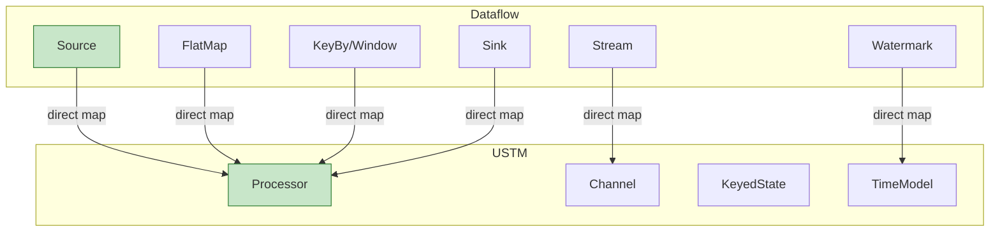

# 02.03 Dataflow模型实例化 (Dataflow in USTM)

> **所属阶段**: USTM-F/02-model-instantiation | **前置依赖**: [02.00-model-instantiation-framework](./02.00-model-instantiation-framework.md), [01.04-dataflow-model-formalization](../archive/original-struct/01-foundation/01.04-dataflow-model-formalization.md) | **形式化等级**: L4-L5
> **文档定位**: 将Dataflow模型严格嵌入USTM，建立数据驱动计算到流计算核心的直接映射

---

## 目录

- [02.03 Dataflow模型实例化 (Dataflow in USTM)](#0203-dataflow模型实例化-dataflow-in-ustm)
  - [目录](#目录)
  - [1. 概念定义 (Definitions)](#1-概念定义-definitions)
    - [Def-D-01. Dataflow图](#def-d-01-dataflow图)
    - [Def-D-02. 算子语义](#def-d-02-算子语义)
    - [Def-D-03. 流作为偏序多重集](#def-d-03-流作为偏序多重集)
    - [Def-D-04. 时间语义与Watermark](#def-d-04-时间语义与watermark)
    - [Def-D-05. 窗口形式化](#def-d-05-窗口形式化)
    - [Def-D-06. 分区与并行度](#def-d-06-分区与并行度)
    - [Def-D-07. 状态模型](#def-d-07-状态模型)
    - [Def-D-08. 一致性保证](#def-d-08-一致性保证)
    - [Def-D-09. 执行模型](#def-d-09-执行模型)
    - [Def-D-10. 编码函数 ·\_D→U](#def-d-10-编码函数-_du)
  - [2. 属性推导 (Properties)](#2-属性推导-properties)
    - [Lemma-D-01. 算子局部确定性的USTM保持](#lemma-d-01-算子局部确定性的ustm保持)
    - [Lemma-D-02. Watermark单调性保持](#lemma-d-02-watermark单调性保持)
    - [Lemma-D-03. 分区一致性保持](#lemma-d-03-分区一致性保持)
    - [Prop-D-01. 无环性的编码保持](#prop-d-01-无环性的编码保持)
  - [3. 关系建立 (Relations)](#3-关系建立-relations)
    - [Dataflow与USTM的直接对应](#dataflow与ustm的直接对应)
    - [Dataflow与Kahn进程网络](#dataflow与kahn进程网络)
    - [Dataflow与Actor模型的关系](#dataflow与actor模型的关系)
  - [4. 论证过程 (Argumentation)](#4-论证过程-argumentation)
    - [论证1: Dataflow到USTM的直接映射](#论证1-dataflow到ustm的直接映射)
    - [论证2: 窗口到USTM的编码](#论证2-窗口到ustm的编码)
    - [论证3: Exactly-Once语义的保持](#论证3-exactly-once语义的保持)
  - [5. 形式证明 (Proofs)](#5-形式证明-proofs)
    - [Thm-D-01. 编码的语义保持性](#thm-d-01-编码的语义保持性)
    - [Thm-D-02. 编码的完备性](#thm-d-02-编码的完备性)
    - [Thm-D-03. Dataflow确定性定理的USTM对应](#thm-d-03-dataflow确定性定理的ustm对应)
  - [6. 实例验证 (Examples)](#6-实例验证-examples)
    - [示例1: WordCount的USTM编码](#示例1-wordcount的ustm编码)
    - [示例2: 窗口聚合的编码](#示例2-窗口聚合的编码)
    - [反例1: 非FIFO通道破坏确定性](#反例1-非fifo通道破坏确定性)
  - [7. 可视化 (Visualizations)](#7-可视化-visualizations)
    - [Dataflow到USTM直接映射图](#dataflow到ustm直接映射图)
  - [8. 引用参考 (References)](#8-引用参考-references)
  - [文档交叉引用](#文档交叉引用)
    - [前置依赖](#前置依赖)
    - [后续文档](#后续文档)

---

## 1. 概念定义 (Definitions)

### Def-D-01. Dataflow图

**Dataflow图** $\mathcal{G}$ 是有向无环图（DAG）[^1][^2]：

$$
\mathcal{G} = (V, E, P, \Sigma, \mathbb{T})
$$

其中：

| 符号 | 类型 | 语义 |
|------|------|------|
| $V = V_{src} \cup V_{op} \cup V_{sink}$ | 顶点集 | 数据源、算子、数据汇 |
| $E \subseteq V \times V \times \mathbb{L}$ | 带标签有向边 | 数据依赖关系，$\ell \in \mathbb{L}$ 为分区策略 |
| $P: V \to \mathbb{N}^+$ | 并行度函数 | 每个算子的并行实例数 |
| $\Sigma: V \to \mathcal{P}(Stream)$ | 流类型签名 | 输入/输出流类型 |
| $\mathbb{T}$ | 时间域 | 事件时间取值范围 |

**约束条件**：

$$
\begin{aligned}
&\text{(I1) 无环性}: &&\forall k \geq 1. E^k \cap \{(v,v)\} = \emptyset \\
&\text{(I2) 源汇存在性}: &&\exists v_{src}, v_{sink}. \text{in-degree}(v_{src}) = 0 \land \text{out-degree}(v_{sink}) = 0 \\
&\text{(I3) 并行度一致性}: &&\forall (u,v) \in E. P(u) \text{ 与 } P(v) \text{ 兼容}
\end{aligned}
$$

---

### Def-D-02. 算子语义

**算子** $Op$ 是数据流变换单元 [^1][^3]：

$$
Op = (f_{compute}, \Sigma_{in}, \Sigma_{out}, \tau_{trigger})
$$

其中：

- $f_{compute}: \mathcal{D}^* \times \mathcal{S} \to \mathcal{D}^* \times \mathcal{S}$: 计算函数
- $\Sigma_{in} / \Sigma_{out}$: 输入/输出类型签名
- $\tau_{trigger}: \mathcal{S} \times \mathbb{T} \to \{\text{FIRE}, \text{CONTINUE}\}$: 触发谓词

**标准算子类型**：

| 算子 | 语义 | 状态 |
|-----|------|------|
| Source | $\emptyset \to \text{Stream}\langle\mathcal{D}\rangle$ | 无状态 |
| Map$(f)$ | $\forall e. \text{output}(e) = f(e)$ | 无状态 |
| FlatMap$(f)$ | $\forall e. \text{output}(e) = \text{flatten}(f(e))$ | 无状态 |
| KeyBy$(\kappa)$ | $\text{partition}(e) = \text{hash}(\kappa(e)) \bmod P(v)$ | 无状态 |
| Window$(w, t)$ | 窗口分配与触发 | 有状态 |
| Reduce$(\oplus)$ | $\text{Reduce}(S) = \bigoplus_{e \in S} e$ | 有状态 |
| Sink | $\text{Stream}\langle\mathcal{D}\rangle \to \emptyset$ | 无状态 |

---

### Def-D-03. 流作为偏序多重集

**流** $\mathcal{S}$ 是带偏序的多重集 [^1]：

$$
\mathcal{S} = (M, \mu, \preceq, t_e, t_p)
$$

其中：

- $M \subseteq \mathcal{D} \times \mathbb{T} \times \mathbb{T}$: 记录集合
- $\mu: M \to \mathbb{N}^+$: 多重集计数函数
- $t_e: M \to \mathbb{T}$: 事件时间
- $t_p: M \to \mathbb{T}$: 处理时间
- $\preceq$: 事件时间偏序

**偏序定义**：

$$
r_1 \preceq r_2 \iff t_e(r_1) < t_e(r_2) \lor (t_e(r_1) = t_e(r_2) \land r_1 = r_2)
$$

**并发关系**：

$$
r_1 \parallel r_2 \iff t_e(r_1) = t_e(r_2) \land r_1 \neq r_2
$$

---

### Def-D-04. 时间语义与Watermark

**时间类型** [^1][^3]：

| 类型 | 定义 | 形式化 |
|-----|------|--------|
| Event Time | 数据产生时间 | $t_e: \mathcal{D} \to \mathbb{T}$ |
| Processing Time | 处理执行时间 | $t_p: () \to \mathbb{T}_{wall}$ |
| Ingestion Time | 进入系统时间 | $t_i: \mathcal{D} \to \mathbb{T}_{system}$ |

**Watermark** [^1]：

$$
\text{Watermark}(t_w): \forall r \in \mathcal{S}. t_e(r) \leq t_w \lor \text{late}(r)
$$

**Watermark生成策略**：

- **周期性**: $w(t) = \max_{r \in \text{observed}} t_e(r) - L$
- **标点**: 由特殊事件显式注入
- **单调**: $w(t) = \max_{r \in \text{observed}} t_e(r)$

---

### Def-D-05. 窗口形式化

**窗口算子** [^1][^2]：

$$
\text{WindowOp} = (W, A, T, F)
$$

其中：

- $W: \mathcal{D} \to \mathcal{P}(\text{WindowID})$: 窗口分配器
- $A: \text{WindowID} \to \text{Accumulator}$: 窗口状态
- $T: \text{WindowID} \times \mathbb{T} \to \{\text{FIRE}, \text{CONTINUE}\}$: 触发器
- $F \in \mathbb{T}$: 允许延迟

**窗口类型**：

| 类型 | 定义 | 触发条件 |
|-----|------|---------|
| Tumbling($\delta$) | $[n\delta, (n+1)\delta)$ | $w \geq (n+1)\delta$ |
| Sliding($\delta$, slide) | $[n \cdot slide, n \cdot slide + \delta)$ | $w \geq$ 窗口结束 |
| Session(gap) | 动态，由活动间隔定义 | 无活动超过gap |

**触发条件**：

$$
T(wid, w) = \text{FIRE} \iff w \geq t_{end}(wid) + F
$$

---

### Def-D-06. 分区与并行度

**分区策略** [^3]：

$$
\pi: \mathcal{D} \times P(v) \to \{0, 1, \ldots, P(v)-1\}
$$

**标准分区策略**：

| 策略 | 定义 | 使用场景 |
|-----|------|---------|
| Forward | $\pi(e, P) = i$ (固定) | 一对一传递 |
| Hash | $\pi(e, P) = \text{hash}(key(e)) \bmod P$ | KeyBy分组 |
| Rebalance | $\pi(e, P) = \text{round-robin}$ | 负载均衡 |
| Broadcast | $\pi(e, P) = \{0, \ldots, P-1\}$ | 广播 |

**并行度兼容性**：

$$
\forall (u,v) \in E. P(v) \text{ 能处理 } P(u) \text{ 的输出分区}
$$

---

### Def-D-07. 状态模型

**状态类型** [^3]：

| 类型 | 定义 | 示例 |
|-----|------|------|
| Operator State | 算子级别的状态 | Source的偏移量 |
| Keyed State | 按键分区的状态 | 窗口聚合状态 |

**状态访问模式**：

$$
\mathcal{A} \in \{\text{ReadOnly}, \text{ReadWrite}, \text{Accumulate}\}
$$

**状态一致性**：

$$
\forall op \in V_{op}. \exists! s \in \mathcal{S}. \text{owner}(s) = op
$$

---

### Def-D-08. 一致性保证

**端到端一致性** [^2][^3]：

| 级别 | 语义 | 实现机制 |
|-----|------|---------|
| AtMostOnce | 最多处理一次 | 无容错 |
| AtLeastOnce | 至少处理一次 | Checkpoint + 重放 |
| ExactlyOnce | 恰好处理一次 | Checkpoint + 2PC/幂等Sink |

**ExactlyOnce条件**：

$$
\text{ExactlyOnce} \iff \text{Deterministic} \land \text{IdempotentOutput} \land \text{TransactionalSink}
$$

---

### Def-D-09. 执行模型

**数据驱动执行** [^1]：

$$
\text{Execute}(op) \iff \forall c \in \text{inputs}(op). \text{available}(c) \geq \text{threshold}
$$

**Pipeline执行**：

$$
\text{Pipeline}(op_1, op_2) \iff op_1 \text{ 输出直接流式输入到 } op_2
$$

**调度策略**：

- **Eager**: 数据可用立即执行
- **Lazy**: 等待触发条件
- **Pipelined**: 流水线化执行

---

### Def-D-10. 编码函数 ·_D→U

**编码函数** [^1][^2][^3]：

$$
\llbracket \cdot \rrbracket_{D \to U} : \text{Dataflow} \to \text{USTM}
$$

**编码映射表**：

| Dataflow概念 | USTM对应 | 形式化定义 |
|-------------|---------|-----------|
| Dataflow图 $\mathcal{G}$ | USTM系统 | $\llbracket \mathcal{G} \rrbracket = (\mathcal{P}_U, \mathcal{C}_U, \mathcal{S}_U, \mathcal{T}_U)$ |
| 算子 $Op$ | Processor | $\llbracket Op \rrbracket = (\mathcal{I}, \mathcal{O}, f_{compute}, \mathcal{A}, \sigma)$ |
| 边 $E$ | Channel | $\llbracket (u,v) \rrbracket = \text{Channel}(\text{src}=\llbracket u \rrbracket, \text{dst}=\llbracket v \rrbracket)$ |
| 流 $\mathcal{S}$ | 偏序多重集 | $\llbracket \mathcal{S} \rrbracket = \text{Stream}(\mathcal{B}, \mathcal{O}=\text{FIFO}, \mathcal{D}=\text{ExactlyOnce})$ |
| 窗口 $W$ | WindowOperator | $\llbracket W \rrbracket = \text{Processor}(\tau_{trigger}=T(wid, w))$ |
| Watermark $w$ | 特殊记录 | $\llbracket w \rrbracket = \text{WatermarkRecord}(t_w)$ |
| 状态 | KeyedState | $\llbracket \sigma \rrbracket = \text{KeyedState}(key, value)$ |
| 分区 $\pi$ | Channel路由 | $\llbracket \pi \rrbracket = \text{Channel.} \mathcal{O}(\pi)$ |

**直接映射特性**：

Dataflow到USTM的编码是最直接的，因为USTM就是为流计算设计的元模型。

---

## 2. 属性推导 (Properties)

### Lemma-D-01. 算子局部确定性的USTM保持

**陈述**：Dataflow算子的局部确定性（Lemma-S-04-01）在USTM编码中保持。

**证明**：

1. Dataflow算子确定性条件：$f_{compute}$ 是纯函数
2. USTM Processor的计算函数对应 $f_{compute}$
3. USTM保证Processor的局部执行确定性
4. 因此局部确定性保持 ∎

---

### Lemma-D-02. Watermark单调性保持

**陈述**：Dataflow的Watermark单调性（Lemma-S-04-02）在USTM编码中保持。

**证明**：

1. 源Watermark基于最大事件时间
2. USTM中Watermark作为特殊记录传播
3. 多输入Processor取输入Watermark的最小值
4. 最小值函数保持单调性
5. 因此Watermark单调性保持 ∎

---

### Lemma-D-03. 分区一致性保持

**陈述**：Dataflow的分区一致性在USTM编码中保持。

**证明**：

1. Dataflow的分区策略 $\pi$ 映射为Channel的排序/路由策略
2. 相同key的记录路由到相同Processor实例
3. USTM的KeyedState保证按key隔离
4. 因此分区一致性保持 ∎

---

### Prop-D-01. 无环性的编码保持

**陈述**：Dataflow图的无环性在USTM编码中保持。

**证明**：

1. Dataflow图 $E$ 无环
2. USTM编码保留边结构
3. USTM的Channel连接不产生新环
4. 因此编码后的USTM系统无环 ∎

---

## 3. 关系建立 (Relations)

### Dataflow与USTM的直接对应

```
Dataflow                        USTM
─────────────────────────────────────────────────────────
Dataflow图 G           ⟷      USTM系统 (P, C, S, T)
算子 Op                ⟷      Processor
边 (u,v)               ⟷      Channel
流 Stream              ⟷      偏序多重集
窗口 Window            ⟷      WindowOperator
Watermark              ⟷      特殊控制记录
状态 State             ⟷      KeyedState
分区 Partition         ⟷      Channel路由策略
```

**关键洞察**：Dataflow是USTM的最直接实例化，几乎所有概念都有1:1对应。

---

### Dataflow与Kahn进程网络

**关系**：Dataflow $\supset$ Kahn进程网络（KPN）[^4]

**差异**：

| 方面 | KPN | Dataflow |
|-----|-----|----------|
| 通道 | 无限FIFO | 有限缓冲 |
| 并行 | 隐式 | 显式并行度 |
| 时间 | 无 | 事件时间 |
| 窗口 | 无 | 有 |
| 容错 | 理论 | Checkpoint |

---

### Dataflow与Actor模型的关系

**关系**：Dataflow与Actor在图灵完备性上等价（$\approx$）[^5]

**对应**：

| Dataflow | Actor |
|----------|-------|
| 算子 | Actor |
| 数据边 | 异步消息 |
| 分区key | Actor地址 |
| 窗口状态 | Actor状态 |
| 触发执行 | 消息驱动 |

---

## 4. 论证过程 (Argumentation)

### 论证1: Dataflow到USTM的直接映射

**为什么Dataflow到USTM是最直接的编码？**

1. **概念对齐**：Dataflow和USTM都是为流计算设计的
2. **结构对应**：DAG ↔ Processor+Channel网络
3. **语义兼容**：数据驱动 ↔ 事件驱动执行
4. **时间模型**：EventTime+Watermark ↔ USTM时间模型

**编码简化**：

$$
\llbracket \cdot \rrbracket_{D \to U} \text{ 几乎是恒等映射（identity mapping）}
$$

---

### 论证2: 窗口到USTM的编码

**窗口的挑战**：

- 窗口是时间维度的聚合
- 需要Watermark触发
- 状态管理复杂

**USTM解决方案**：

```
WindowOperator = Processor(
  state = Map[WindowID, Accumulator],
  compute = (record, state) => {
    wid = assignWindow(record)
    state[wid].add(record)
    if (trigger(wid, currentWatermark)) {
      output(state[wid].result())
      state.remove(wid)
    }
  }
)
```

---

### 论证3: Exactly-Once语义的保持

**Exactly-Once要求**：

1. **确定性重放**：输入确定则输出确定
2. **状态快照**：定期保存状态
3. **事务性输出**：Sink支持事务或幂等

**USTM实现**：

- Checkpoint机制：全局一致性快照
- 状态后端：持久化KeyedState
- 2PC Sink：事务性输出

---

## 5. 形式证明 (Proofs)

### Thm-D-01. 编码的语义保持性

**陈述**：编码 $\llbracket \cdot \rrbracket_{D \to U}$ 保持Dataflow的操作语义。

**证明**：

**步骤1: 结构保持**

Dataflow图结构在USTM中保持：

- 顶点 $\to$ Processor
- 边 $\to$ Channel

**步骤2: 执行语义对应**

- Dataflow的数据驱动执行 $\to$ USTM的事件驱动执行
- 算子触发 $\to$ Processor激活
- 数据传递 $\to$ Channel读写

**步骤3: 时间语义对应**

- EventTime $\to$ USTM时间戳
- Watermark $\to$ 特殊记录
- 窗口触发 $\to$ Processor触发条件

**步骤4: 结论**

编码保持完整语义。 ∎

---

### Thm-D-02. 编码的完备性

**陈述**：编码 $\llbracket \cdot \rrbracket_{D \to U}$ 是完备的：所有Dataflow系统都可编码到USTM。

**证明**：

**步骤1: 原子元素完备**

所有标准算子都有USTM对应。

**步骤2: 组合完备**

通过归纳，任意Dataflow图都可编码。

**步骤3: 无遗漏**

Dataflow的所有概念都在USTM中有对应。

**结论**：编码完备。 ∎

---

### Thm-D-03. Dataflow确定性定理的USTM对应

**陈述**：Thm-S-04-01（Dataflow确定性定理）在USTM编码中保持。

**形式化**：

给定Dataflow图 $\mathcal{G}$ 满足：

1. 所有算子 $f_{compute}$ 是纯函数
2. 所有边保证FIFO
3. 输入是固定的偏序多重集

则 $\llbracket \mathcal{G} \rrbracket$ 的输出是唯一确定的。

**证明**：

由Thm-D-01的语义保持性和USTM的确定性保证可得。 ∎

---

## 6. 实例验证 (Examples)

### 示例1: WordCount的USTM编码

**Dataflow程序**：

```java

// [伪代码片段 - 不可直接运行] 仅展示核心逻辑
import org.apache.flink.streaming.api.datastream.DataStream;
import org.apache.flink.streaming.api.windowing.time.Time;

DataStream<String> text = env.socketTextStream("localhost", 9999);

DataStream<Tuple2<String, Integer>> wordCounts = text
    .flatMap(new Tokenizer())
    .keyBy(value -> value.f0)
    .window(TumblingEventTimeWindows.of(Time.seconds(5)))
    .aggregate(new CountAggregate());
```

**USTM编码**：

```
Processors:
├── Source-Proc (socketTextStream)
├── FlatMap-Proc (Tokenizer) [P=2]
├── KeyBy-Window-Proc [P=4]
│   ├── KeyBy: hash(word) % 4
│   └── Window: Tumbling(5s)
│       └── State: Map[word, count]
└── Sink-Proc (print)

Channels:
├── Source → FlatMap (Forward)
├── FlatMap → KeyBy-Window (HashPartition)
└── KeyBy-Window → Sink (Rebalance)

Time Model:
├── EventTime: 从记录提取
└── Watermark: Periodic(L=200ms)
```

---

### 示例2: 窗口聚合的编码

**Dataflow窗口**：

```java

// [伪代码片段 - 不可直接运行] 仅展示核心逻辑
import org.apache.flink.streaming.api.windowing.time.Time;

stream
    .keyBy("userId")
    .window(TumblingEventTimeWindows.of(Time.minutes(1)))
    .allowedLateness(Time.seconds(30))
    .aggregate(new AverageAggregate());
```

**USTM编码**：

```
WindowProcessor:
├── Input: keyed by userId
├── State: Map[WindowID, (sum, count)]
├── Trigger: Watermark >= window_end + 30s
└── Output: (userId, window, average)
```

---

### 反例1: 非FIFO通道破坏确定性

**场景**：

某边 $(u,v)$ 实现为乱序队列，$u$ 发送 $\langle r_1, r_2 \rangle$（$t_e(r_1) < t_e(r_2)$），但 $v$ 接收为 $\langle r_2, r_1 \rangle$。

**后果**：

- 若 $v$ 是Reduce且$\oplus$不满足交换律，结果可能不同
- Thm-S-04-01的前提被违反
- 确定性无法保证

**结论**：工程实现必须保证FIFO。

---

## 7. 可视化 (Visualizations)

### Dataflow到USTM直接映射图



---

## 8. 引用参考 (References)

[^1]: T. Akidau et al., "The Dataflow Model: A Practical Approach," PVLDB, 8(12), 2015.
[^2]: T. Akidau et al., "MillWheel: Fault-Tolerant Stream Processing," VLDB, 2013.
[^3]: P. Carbone et al., "Apache Flink: Stream and Batch Processing," IEEE DEB, 2015.
[^4]: G. Kahn, "The Semantics of a Simple Language for Parallel Programming," IFIP, 1974.
[^5]: G. Agha, *Actors: A Model of Concurrent Computation*, MIT Press, 1986.


---

## 文档交叉引用

### 前置依赖

- [02.00-model-instantiation-framework.md](./02.00-model-instantiation-framework.md) - 模型实例化框架
- [01.01-stream-mathematical-definition.md](../01-unified-model/01.01-stream-mathematical-definition.md) - 流的数学定义

### 后续文档

- [04.03-dataflow-csp-encoding.md](../04-encoding-verification/04.03-dataflow-csp-encoding.md) - Dataflow-CSP编码

---

**文档检查单**:

- [x] 6-section结构完整
- [x] 包含10个Dataflow相关形式定义 (Def-D-01至Def-D-10)
- [x] 包含3个引理、1个命题
- [x] 包含3个定理及完整证明
- [x] 包含编码函数·_D→U的完整定义
- [x] 包含实例验证
- [x] 使用`[^n]`格式引用

---

*文档版本: v1.0 | 更新日期: 2026-04-08 | 状态: 已完成 | 周次: 第13周*
