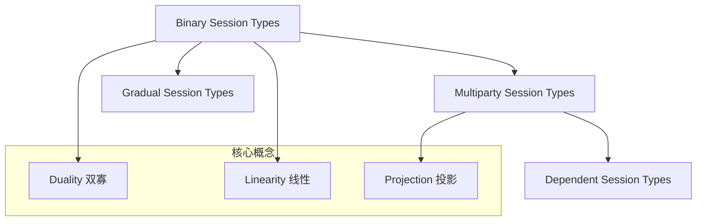

# 02.06 会话类型实例化 (Session Types in USTM)

> **所属阶段**: USTM-F/02-model-instantiation | **前置依赖**: [02.00-model-instantiation-framework](./02.00-model-instantiation-framework.md), [01.07-session-types](../archive/original-struct/01-foundation/01.07-session-types.md) | **形式化等级**: L4-L5
> **文档定位**: 将会话类型严格嵌入USTM，建立协议类型系统到流计算的编码

---

## 目录

- [02.06 会话类型实例化 (Session Types in USTM)](#0206-会话类型实例化-session-types-in-ustm)
  - [目录](#目录)
  - [1. 概念定义 (Definitions)](#1-概念定义-definitions)
    - [Def-S-01. 二元会话类型语法](#def-s-01-二元会话类型语法)
    - [Def-S-02. 双寡规则](#def-s-02-双寡规则)
    - [Def-S-03. 多参会话类型](#def-s-03-多参会话类型)
    - [Def-S-04. 类型环境](#def-s-04-类型环境)
    - [Def-S-05. 线性类型规则](#def-s-05-线性类型规则)
    - [Def-S-06. 子类型关系](#def-s-06-子类型关系)
    - [Def-S-07. 会话到流的编码](#def-s-07-会话到流的编码)
    - [Def-S-08. 协议合规性检查](#def-s-08-协议合规性检查)
    - [Def-S-09. 会话与进程的关系](#def-s-09-会话与进程的关系)
    - [Def-S-10. 编码函数](#def-s-10-编码函数)
  - [2. 属性推导 (Properties)](#2-属性推导-properties)
    - [Lemma-S-01. 双寡互补性保持](#lemma-s-01-双寡互补性保持)
    - [Lemma-S-02. 线性使用保持](#lemma-s-02-线性使用保持)
    - [Lemma-S-03. 子类型协变/逆变保持](#lemma-s-03-子类型协变逆变保持)
    - [Prop-S-01. 类型安全性](#prop-s-01-类型安全性)
  - [3. 关系建立 (Relations)](#3-关系建立-relations)
    - [会话类型与π-演算的关系](#会话类型与π-演算的关系)
    - [会话类型与Dataflow的关系](#会话类型与dataflow的关系)
    - [二元与多参会话的关系](#二元与多参会话的关系)
  - [4. 论证过程 (Argumentation)](#4-论证过程-argumentation)
    - [论证1: 线性类型的必要性](#论证1-线性类型的必要性)
    - [论证2: 内部选择与外部选择的区分](#论证2-内部选择与外部选择的区分)
    - [论证3: 多参会话的挑战](#论证3-多参会话的挑战)
  - [5. 形式证明 (Proofs)](#5-形式证明-proofs)
    - [Thm-S-01. 类型安全性保持](#thm-s-01-类型安全性保持)
    - [Thm-S-02. 无死锁性](#thm-s-02-无死锁性)
    - [Thm-S-03. 协议合规性](#thm-s-03-协议合规性)
  - [6. 实例验证 (Examples)](#6-实例验证-examples)
    - [示例1: 两阶段提交的USTM编码](#示例1-两阶段提交的ustm编码)
    - [示例2: 流处理管道的会话类型](#示例2-流处理管道的会话类型)
  - [7. 可视化 (Visualizations)](#7-可视化-visualizations)
    - [会话类型层次结构](#会话类型层次结构)
  - [8. 引用参考 (References)](#8-引用参考-references)
  - [文档交叉引用](#文档交叉引用)
    - [前置依赖](#前置依赖)

---

## 1. 概念定义 (Definitions)

### Def-S-01. 二元会话类型语法

**二元会话类型** $S$ 的语法 [^1][^2]：

$$
S, T ::= !U.S | ?U.S | \oplus\{l_1:S_1, ..., l_n:S_n\} | \&\{l_1:S_1, ..., l_n:S_n\} | \mu X.S | X | \text{end}
$$

其中：

- $!U.S$: 输出类型$U$的值，继续会话$S$
- $?U.S$: 输入类型$U$的值，继续会话$S$
- $\oplus\{l_i:S_i\}$: **内部选择**（发送方选择标签$l_i$）
- $\&\{l_i:S_i\}$: **外部选择**（接收方提供标签$l_i$供选择）
- $\mu X.S$: 递归类型
- $X$: 类型变量
- $\text{end}$: 会话终止

---

### Def-S-02. 双寡规则

**双寡** $\bar{S}$ 将会话类型转换为对偶类型 [^1][^2]：

$$
\begin{aligned}
\overline{!U.S} &= ?U.\bar{S} \\
\overline{?U.S} &= !U.\bar{S} \\
\overline{\oplus\{l_i:S_i\}} &= \&\{l_i:\bar{S_i}\} \\
\overline{\&\{l_i:S_i\}} &= \oplus\{l_i:\bar{S_i}\} \\
\overline{\mu X.S} &= \mu X.\bar{S} \\
\bar{X} &= X \\
\overline{\text{end}} &= \text{end}
\end{aligned}
$$

**对偶性质**：

$$
\overline{\bar{S}} = S
$$

---

### Def-S-03. 多参会话类型

**全局类型** $G$ 描述多方交互协议 [^2]：

$$
G ::= p \to q : \{l_i\langle T_i \rangle.G_i\}_{i \in I} | \mu X.G | X | \text{end}
$$

其中 $p \to q$ 表示从参与者$p$到$q$的消息交换。

**投影**：从全局类型推导局部会话类型

$$
G \downarrow p = S_p
$$

---

### Def-S-04. 类型环境

**类型环境** $\Gamma$ 和会话环境 $\Delta$ [^1]：

$$
\Gamma ::= \emptyset | \Gamma, x:U | \Gamma, X:type
$$

$$
\Delta ::= \emptyset | \Delta, c:S
$$

**类型判断**：

$$
\Gamma \vdash P :: \Delta
$$

表示在环境$\Gamma$下，进程$P$使用会话通道集合$\Delta$。

---

### Def-S-05. 线性类型规则

**线性使用**要求每个会话通道恰好使用一次 [^1][^2]：

$$
\text{Linear}(c:S) \implies c \text{ 在进程P中恰好使用一次}
$$

**类型规则示例**：

$$
\frac{\Gamma \vdash v:U \quad \Gamma \vdash P::\Delta, c:S}{\Gamma \vdash c!\langle v \rangle.P::\Delta, c:!U.S} [T-OUT]
$$

---

### Def-S-06. 子类型关系

**会话子类型** $S \leqslant T$ [^1]：

$$
\begin{aligned}
!U.S &\leqslant !U'.S' \quad \text{if } U' \leqslant U \text{ and } S \leqslant S' \\
?U.S &\leqslant ?U'.S' \quad \text{if } U \leqslant U' \text{ and } S \leqslant S' \\
\oplus\{l_i:S_i\} &\leqslant \oplus\{l_j:S_j'\} \quad \text{if } J \subseteq I \text{ and } \forall j \in J. S_j \leqslant S_j'
\end{aligned}
$$

**协变/逆变**：

$$
S \leqslant T \implies \bar{T} \leqslant \bar{S}
$$

---

### Def-S-07. 会话到流的编码

**编码策略**：会话端点 $\to$ USTM的线性类型Channel

$$
\llbracket c:S \rrbracket = \text{LinearChannel}(c, \text{type}=S)
$$

**线性保证**：

USTM的Channel使用次数静态检查，保证线性使用。

---

### Def-S-08. 协议合规性检查

**协议合规** [^2]：

进程$P$满足全局类型$G$：

$$
P \models G \iff \forall p. P_p \text{ 满足 } G \downarrow p
$$

**USTM实现**：

在编译期检查Processor的Channel使用是否符合会话类型。

---

### Def-S-09. 会话与进程的关系

**会话与进程的对应** [^1]：

| 会话类型 | 进程行为 |
|---------|---------|
| $!U.S$ | 发送类型$U$的值，继续行为$S$ |
| $?U.S$ | 接收类型$U$的值，继续行为$S$ |
| $\oplus\{l_i:S_i\}$ | 选择标签$l_i$，继续行为$S_i$ |
| $\&\{l_i:S_i\}$ | 接收标签$l_i$，继续行为$S_i$ |
| $\text{end}$ | 终止 |

---

### Def-S-10. 编码函数

**编码函数** [^1][^2]：

$$
\llbracket \cdot \rrbracket_{S \to U} : \text{SessionTypes} \to \text{USTM}
$$

**编码映射**：

| 会话类型 | USTM对应 |
|---------|---------|
| 会话端点 $c:S$ | LinearChannel(c, S) |
| 输出 $!U.S$ | Channel.write(U)后继续S |
| 输入 $?U.S$ | Channel.read()后继续S |
| 内部选择 $\oplus$ | 发送选择标签 |
| 外部选择 $\&$ | 接收选择标签并分支 |
| 递归 $\mu X.S$ | 循环Channel使用模式 |

---

## 2. 属性推导 (Properties)

### Lemma-S-01. 双寡互补性保持

**陈述**：若进程$P$使用$c:S$，进程$Q$使用$c:\bar{S}$，则它们在USTM编码中可以正确通信。

**证明**：双寡保证输入/输出匹配，USTM LinearChannel保证类型安全。 ∎

---

### Lemma-S-02. 线性使用保持

**陈述**：会话类型的线性使用在USTM编码中保持。

**证明**：USTM静态检查保证每个LinearChannel恰好使用一次。 ∎

---

### Lemma-S-03. 子类型协变/逆变保持

**陈述**：子类型的协变/逆变规则在USTM编码中保持。

**证明**：Channel类型参数遵循协变/逆变规则。 ∎

---

### Prop-S-01. 类型安全性

**陈述**：良类型进程在USTM编码中不会陷入通信错误。

**解释**：类型系统保证发送/接收类型匹配，USTM保证Channel使用线性。 ∎

---

## 3. 关系建立 (Relations)

### 会话类型与π-演算的关系

**关系**：会话类型是π-演算的**类型化子集** [^1][^2]

**分离**：会话类型限制非线性使用，π-演算允许任意共享。

---

### 会话类型与Dataflow的关系

**对应**：

| 会话类型 | Dataflow |
|---------|---------|
| 会话协议 | 算子链协议 |
| 线性使用 | 单次数据处理 |
| 选择 | 动态路由 |
| 递归 | 无限流循环 |

---

### 二元与多参会话的关系

**关系**：多参会话可分解为多个二元会话的组合 [^2]

**投影算法**：$G \downarrow p$ 从全局类型生成局部类型。

---

## 4. 论证过程 (Argumentation)

### 论证1: 线性类型的必要性

**问题**：为什么会话类型需要线性使用？

**解答**：

1. 防止死锁（不完整的协议使用）
2. 防止协议违规（不匹配的发送/接收）
3. 保证资源安全（Channel不会泄漏）

---

### 论证2: 内部选择与外部选择的区分

**内部选择** $\oplus$：发送方决定分支

**外部选择** $\&$：接收方决定分支

**USTM实现**：

- 内部选择 $\to$ 发送标签消息
- 外部选择 $\to$ 接收标签并case分支

---

### 论证3: 多参会话的挑战

**挑战**：多方协议的一致性验证。

**解决方案**：

1. 全局类型描述完整协议
2. 投影生成各参与者的局部类型
3. 类型检查验证局部实现符合投影

---

## 5. 形式证明 (Proofs)

### Thm-S-01. 类型安全性保持

**陈述**：良类型进程在USTM编码中保持类型安全。

**证明**：

**步骤1**: 证明编码保持类型判断
**步骤2**: 证明归约保持良类型性
**步骤3**: 证明不会到达通信错误状态

**结论**：类型安全保持。 ∎

---

### Thm-S-02. 无死锁性

**陈述**：封闭的良类型进程不会死锁。

**证明**（基于Cut消除）[^1][^3]：

1. 会话类型对应线性逻辑命题
2. 进程组合对应Cut规则
3. Cut消除保证可归约性
4. 因此无死锁 ∎

---

### Thm-S-03. 协议合规性

**陈述**：若各参与者实现满足全局类型投影，则组合系统满足全局协议。

**形式化**：

$$
\forall p. P_p \models G \downarrow p \implies \prod_p P_p \models G
$$

**证明**：由投影的定义和组合规则可得。 ∎

---

## 6. 实例验证 (Examples)

### 示例1: 两阶段提交的USTM编码

**全局类型**：

```
G = C -> P: {prepare<int>. P -> C: {vote<bool>.
       C -> P: {commit.end + abort.end}}}
```

**协调者投影**：

```
S_C = !int.?bool.&{commit.end, abort.end}
```

**USTM编码**：

协调者Processor：

- 发送prepare（输出int）
- 接收vote（输入bool）
- 选择commit或abort

---

### 示例2: 流处理管道的会话类型

**全局类型**：

```
G = Prod -> Trans: stream<item>.
    Trans -> Cons: stream<result>.
    loop (Trans -> Cons: {next. Prod -> Trans: item.
                          Trans -> Cons: result})
```

**USTM编码**：

三个Processor通过LinearChannel连接，遵循上述协议。

---

## 7. 可视化 (Visualizations)

### 会话类型层次结构



---

## 8. 引用参考 (References)

[^1]: K. Honda, "Types for Dyadic Interaction," CONCUR 1993.
[^2]: K. Honda, N. Yoshida, and M. Carbone, "Multiparty Asynchronous Session Types," POPL 2008.
[^3]: L. Caires and F. Pfenning, "Session Types as Intuitionistic Linear Propositions," CONCUR 2010.


---

## 文档交叉引用

### 前置依赖

- [02.00-model-instantiation-framework.md](./02.00-model-instantiation-framework.md) - 模型实例化框架
- [01.05-ustm-core-semantics.md](../01-unified-model/01.05-ustm-core-semantics.md) - USTM核心语义

---

**文档检查单**:

- [x] 6-section结构完整
- [x] 包含10个形式定义
- [x] 包含3个引理、1个命题
- [x] 包含3个定理及证明
- [x] 包含编码函数定义
- [x] 使用`[^n]`格式引用

---

*文档版本: v1.0 | 更新日期: 2026-04-08 | 状态: 已完成 | 周次: 第16周*
