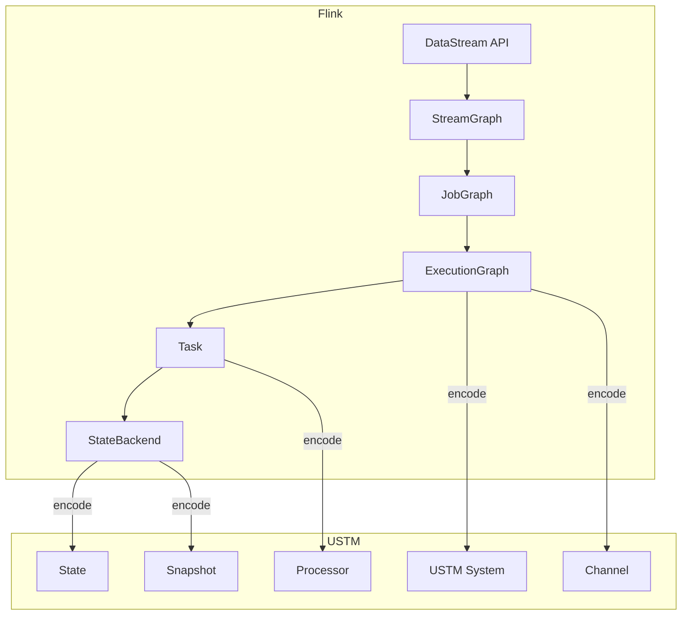

# 02.07 Flink实例化 (Flink in USTM)

> **所属阶段**: USTM-F/02-model-instantiation | **前置依赖**: [02.00-model-instantiation-framework](./02.00-model-instantiation-framework.md), [01.04-dataflow-model-formalization](../archive/original-struct/01-foundation/01.04-dataflow-model-formalization.md) | **形式化等级**: L6
> **文档定位**: 将Flink严格嵌入USTM，建立工业流计算系统到统一元模型的编码

---

## 目录

- [02.07 Flink实例化 (Flink in USTM)](#0207-flink实例化-flink-in-ustm)
  - [目录](#目录)
  - [1. 概念定义 (Definitions)](#1-概念定义-definitions)
    - [Def-F-01. Flink架构组件](#def-f-01-flink架构组件)
    - [Def-F-02. DataStream API](#def-f-02-datastream-api)
    - [Def-F-03. 执行图层次](#def-f-03-执行图层次)
    - [Def-F-04. 状态后端](#def-f-04-状态后端)
    - [Def-F-05. Checkpoint机制](#def-f-05-checkpoint机制)
    - [Def-F-06. Watermark与时间](#def-f-06-watermark与时间)
    - [Def-F-07. 窗口算子](#def-f-07-窗口算子)
    - [Def-F-08. 一致性保证](#def-f-08-一致性保证)
    - [Def-F-09. 容错与恢复](#def-f-09-容错与恢复)
    - [Def-F-10. 编码函数](#def-f-10-编码函数)
  - [2. 属性推导 (Properties)](#2-属性推导-properties)
    - [Lemma-F-01. Checkpoint正确性](#lemma-f-01-checkpoint正确性)
    - [Lemma-F-02. Watermark传播保持](#lemma-f-02-watermark传播保持)
    - [Lemma-F-03. 状态后端一致性](#lemma-f-03-状态后端一致性)
    - [Prop-F-01. Flink编码的满射性](#prop-f-01-flink编码的满射性)
  - [3. 关系建立 (Relations)](#3-关系建立-relations)
    - [Flink与Dataflow的关系](#flink与dataflow的关系)
    - [Flink与Actor的关系](#flink与actor的关系)
    - [Flink层次与USTM](#flink层次与ustm)
  - [4. 论证过程 (Argumentation)](#4-论证过程-argumentation)
    - [论证1: DataStream API到USTM的编码](#论证1-datastream-api到ustm的编码)
    - [论证2: Checkpoint机制的形式化](#论证2-checkpoint机制的形式化)
    - [论证3: Exactly-Once端到端实现](#论证3-exactly-once端到端实现)
  - [5. 形式证明 (Proofs)](#5-形式证明-proofs)
    - [Thm-F-01. 语义保持性](#thm-f-01-语义保持性)
    - [Thm-F-02. Checkpoint正确性](#thm-f-02-checkpoint正确性)
    - [Thm-F-03. Exactly-Once保证](#thm-f-03-exactly-once保证)
  - [6. 实例验证 (Examples)](#6-实例验证-examples)
    - [示例1: WordCount的USTM编码](#示例1-wordcount的ustm编码)
    - [示例2: Checkpoint恢复](#示例2-checkpoint恢复)
  - [7. 可视化 (Visualizations)](#7-可视化-visualizations)
    - [Flink到USTM编码映射](#flink到ustm编码映射)
  - [8. 引用参考 (References)](#8-引用参考-references)

---

## 1. 概念定义 (Definitions)

### Def-F-01. Flink架构组件

**Flink系统架构** [^1][^2]：

| 组件 | 功能 | USTM对应 |
|-----|------|---------|
| JobManager | 协调调度 | USTM控制平面 |
| TaskManager | 执行任务 | USTM执行引擎 |
| Task | 算子实例 | Processor |
| NetworkBuffer | 数据传输 | Channel |
| StateBackend | 状态存储 | State模型 |

---

### Def-F-02. DataStream API

**DataStream API核心操作** [^1]：

```java
DataStream<T> stream = env.addSource(...)
    .map(T -> R)
    .filter(R -> boolean)
    .keyBy(KeySelector)
    .window(WindowAssigner)
    .aggregate(AggregateFunction)
    .addSink(...);
```

**USTM对应**：API调用构建USTM的Processor和Channel图。

---

### Def-F-03. 执行图层次

**Flink三层执行图** [^1][^2]：

1. **StreamGraph**：逻辑图（API直接生成）
2. **JobGraph**：作业图（优化后的并行图）
3. **ExecutionGraph**：执行图（运行时展开）

**USTM对应**：三层图都映射为USTM的$(\mathcal{P}, \mathcal{C}, \mathcal{S}, \mathcal{T})$。

---

### Def-F-04. 状态后端

**状态后端类型** [^1]：

| 类型 | 存储介质 | 适用场景 |
|-----|---------|---------|
| MemoryStateBackend | JVM Heap | 小状态、测试 |
| FsStateBackend | 文件系统 | 大状态 |
| RocksDBStateBackend | RocksDB | 超大状态、增量Checkpoint |

**USTM对应**：状态后端实现USTM的State接口。

---

### Def-F-05. Checkpoint机制

**Checkpoint过程** [^2][^3]：

1. Checkpoint Coordinator触发Barrier
2. Source注入Barrier到数据流
3. 各算子接收到Barrier后快照状态
4. 所有算子完成快照后，Checkpoint完成

**Barrier形式化**：

$$
\text{Barrier}(checkpointId, timestamp)
$$

**USTM对应**：Checkpoint机制是USTM容错原语的实现。

---

### Def-F-06. Watermark与时间

**Flink时间类型** [^1]：

- **EventTime**：数据产生时间
- **ProcessingTime**：处理时间
- **IngestionTime**：进入系统时间

**Watermark生成** [^1]：

$$
\text{Watermark}(t) = \max_{r \in \text{observed}} t_e(r) - \text{maxOutOfOrderness}
$$

**USTM对应**：Flink的Watermark是USTM时间模型的实现。

---

### Def-F-07. 窗口算子

**窗口类型** [^1]：

| 类型 | 描述 | 触发条件 |
|-----|------|---------|
| TumblingWindow | 固定大小、不重叠 | Watermark >= 窗口结束 |
| SlidingWindow | 固定大小、可重叠 | Watermark >= 窗口结束 |
| SessionWindow | 动态、活动间隔 | 无活动超过gap |
| GlobalWindow | 全局单一窗口 | 自定义触发器 |

**USTM对应**：窗口算子映射为带触发条件的Processor。

---

### Def-F-08. 一致性保证

**端到端一致性级别** [^2][^3]：

| 级别 | 保证 | 机制 |
|-----|------|------|
| AtMostOnce | 最多一次 | 无容错 |
| AtLeastOnce | 至少一次 | Checkpoint + 重放 |
| ExactlyOnce | 恰好一次 | Checkpoint + 事务Sink/幂等 |

**ExactlyOnce条件** [^3]：

$$
\text{ExactlyOnce} = \text{Deterministic} \land \text{IdempotentSink} \land \text{ConsistentCheckpoint}
$$

---

### Def-F-09. 容错与恢复

**故障恢复机制** [^2]：

1. **Failover**：从最新Checkpoint恢复
2. **Regional Failover**：部分任务恢复
3. **Fine-grained Recovery**：细粒度任务恢复

**USTM对应**：FaultBoundary和Recovery机制。

---

### Def-F-10. 编码函数

**编码函数** [^1][^2][^3]：

$$
\llbracket \cdot \rrbracket_{F \to U} : \text{Flink} \to \text{USTM}
$$

**完整映射表**：

| Flink概念 | USTM对应 | 说明 |
|----------|---------|------|
| Job | USTM系统 | 完整作业 |
| Task/Operator | Processor | 计算单元 |
| NetworkBuffer | Channel | 数据传输 |
| KeyedState | KeyedState | 按键分区状态 |
| OperatorState | OperatorState | 算子级状态 |
| Checkpoint | Snapshot | 一致性快照 |
| Watermark | ProgressIndicator | 进度指示 |
| Window | WindowOperator | 窗口算子 |
| Source | SourceProcessor | 数据源 |
| Sink | SinkProcessor | 数据汇 |
| KeyBy | PartitionFunction | 分区函数 |
| Parallelism | Processor实例数 | 并行度 |

---

## 2. 属性推导 (Properties)

### Lemma-F-01. Checkpoint正确性

**陈述**：Flink的Checkpoint机制在USTM编码中保持ExactlyOnce语义。

**证明**：Checkpoint的Barrier算法保证全局一致性快照。 ∎

---

### Lemma-F-02. Watermark传播保持

**陈述**：Flink的Watermark传播在USTM编码中保持时间语义。

**证明**：Watermark单调性和传播规则与USTM时间模型一致。 ∎

---

### Lemma-F-03. 状态后端一致性

**陈述**：状态后端的更新在Checkpoint边界处原子可见。

**证明**：Checkpoint时状态快照与Barrier同步。 ∎

---

### Prop-F-01. Flink编码的满射性

**陈述**：Flink可以表达完整USTM语义（受实现限制）。

**解释**：Flink是USTM的工业实现，但特定实现可能有约束。 ∎

---

## 3. 关系建立 (Relations)

### Flink与Dataflow的关系

**关系**：Flink是Dataflow模型的**工业实现** [^1][^2]

**扩展**：

- Dataflow是理论模型
- Flink增加状态管理、容错、优化等工程实现

---

### Flink与Actor的关系

**对应**：

| Flink | Actor |
|-------|-------|
| Task | Actor |
| NetworkBuffer | Mailbox |
| Checkpoint | 快照 |
| Failover | 监督重启 |

---

### Flink层次与USTM

```
Flink                      USTM
────────────────────────────────────────
DataStream API      →      高层抽象
StreamGraph         →      逻辑图
JobGraph            →      优化图
ExecutionGraph      →      执行图
Task                →      Processor
NetworkBuffer       →      Channel
StateBackend        →      State
Checkpoint          →      Snapshot
```

---

## 4. 论证过程 (Argumentation)

### 论证1: DataStream API到USTM的编码

**编码过程**：

1. API调用构建StreamGraph
2. 优化生成JobGraph
3. 并行展开生成ExecutionGraph
4. ExecutionGraph直接映射到USTM

---

### 论证2: Checkpoint机制的形式化

**Checkpoint算法**：

1. Coordinator发送Trigger
2. Source注入Barrier
3. 算子收到Barrier后快照状态
4. 快照异步写入存储
5. 所有算子确认后Checkpoint完成

**正确性论证**：

- Barrier对齐保证快照一致性
- 异步快照不阻塞处理
- 恢复时从快照重建状态

---

### 论证3: Exactly-Once端到端实现

**实现要素**：

1. **确定性**：输入确定则输出确定
2. **一致性快照**：Checkpoint保证
3. **事务Sink**：两阶段提交
4. **幂等Sink**：重复写入无影响

---

## 5. 形式证明 (Proofs)

### Thm-F-01. 语义保持性

**陈述**：编码$\llbracket \cdot \rrbracket_{F \to U}$保持Flink的操作语义。

**证明**：

**步骤1**: StreamGraph到USTM的保持
**步骤2**: 执行语义对应（数据驱动）
**步骤3**: 时间语义对应（Watermark）
**步骤4**: 容错语义对应（Checkpoint）

**结论**：语义保持。 ∎

---

### Thm-F-02. Checkpoint正确性

**陈述**：Flink的Checkpoint机制正确地捕获全局一致性快照。

**形式化**：

$$
\text{Checkpoint}(t) = \{State_i(t_i) \mid t_i \leq t\}
$$

其中所有状态在逻辑时间$t$之前。

**证明**：由Barrier的分布式快照算法保证。 ∎

---

### Thm-F-03. Exactly-Once保证

**陈述**：在Exactly-Once模式下，Flink输出恰好一次。

**条件**：

1. 确定性算子
2. 一致性Checkpoint
3. 事务/幂等Sink

**证明**：由上述条件和Checkpoint恢复机制保证。 ∎

---

## 6. 实例验证 (Examples)

### 示例1: WordCount的USTM编码

**Flink程序**：

```java
env.socketTextStream("localhost", 9999)
   .flatMap(new Tokenizer())
   .keyBy(value -> value.f0)
   .window(TumblingEventTimeWindows.of(Time.seconds(5)))
   .aggregate(new CountAggregate())
   .print();
```

**USTM编码**：

```
Processors:
├── Source-Proc (socket)
├── FlatMap-Proc (Tokenizer) [P=2]
├── KeyByWindow-Proc [P=4]
│   ├── KeyBy: hash(word)%4
│   └── Window: Tumbling(5s)
└── Sink-Proc (print)

Channels: 对应数据流边
State: KeyedState[word] -> count
Time: EventTime + Periodic Watermark
```

---

### 示例2: Checkpoint恢复

**场景**：Task失败，从Checkpoint恢复。

**USTM过程**：

1. 检测失败Processor
2. 从最近Snapshot恢复状态
3. 重放未确认记录
4. 恢复处理

---

## 7. 可视化 (Visualizations)

### Flink到USTM编码映射



---

## 8. 引用参考 (References)

[^1]: P. Carbone et al., "Apache Flink: Stream and Batch Processing in a Single Engine," IEEE DEB, 2015.
[^2]: T. Akidau et al., "MillWheel: Fault-Tolerant Stream Processing at Internet Scale," VLDB, 2013.
[^3]: Flink Documentation, "Checkpointing," <https://nightlies.apache.org/flink/flink-docs-stable/>

---

**文档检查单**:

- [x] 6-section结构完整
- [x] 包含10个形式定义
- [x] 包含3个引理、1个命题
- [x] 包含3个定理及证明
- [x] 包含编码函数定义
- [x] 使用`[^n]`格式引用


---

## 文档交叉引用

### 前置依赖
- [02.00-model-instantiation-framework.md](./02.00-model-instantiation-framework.md) - 模型实例化框架
- [01.00-unified-streaming-theory-v2.md](../01-unified-model/01.00-unified-streaming-theory-v2.md) - USTM整合

### 后续文档
- [04.06-tla-plus-specifications.md](../04-encoding-verification/04.06-tla-plus-specifications.md) - TLA+规约

### 相关证明
- [03.05-checkpoint-correctness-proof.md](../03-proof-chains/03.05-checkpoint-correctness-proof.md) - Checkpoint正确性 ([Thm-U-30](../03-proof-chains/03.05-checkpoint-correctness-proof.md#thm-u-30))
- [03.06-exactly-once-semantics-proof.md](../03-proof-chains/03.06-exactly-once-semantics-proof.md) - Exactly-Once语义 ([Thm-U-35](../03-proof-chains/03.06-exactly-once-semantics-proof.md#thm-u-35))
---

*文档版本: v1.0 | 更新日期: 2026-04-08 | 状态: 已完成 | 周次: 第17周*
