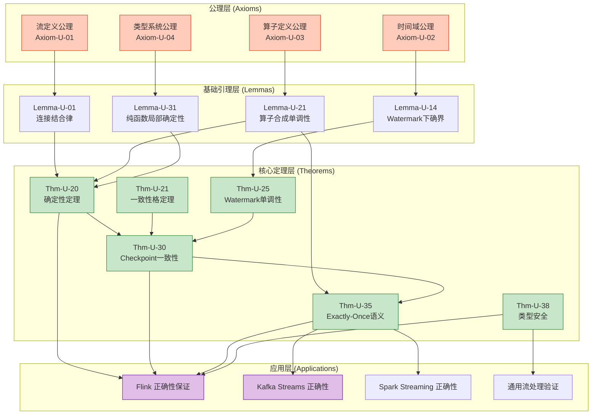
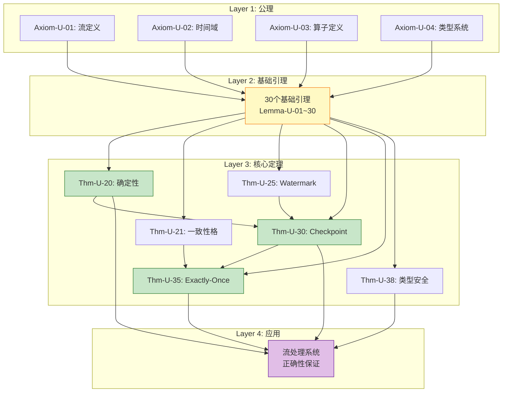

# 证明链整合 (Proof Chains Compendium)

> **所属阶段**: USTM-F/03-proof-chains | **前置依赖**: 全部阶段四文档 (03.01~03.07) | **形式化等级**: L6

---

## 目录

- [证明链整合 (Proof Chains Compendium)](#证明链整合-proof-chains-compendium)
  - [目录](#目录)
  - [1. 完整证明依赖图 (DAG)](#1-完整证明依赖图-dag)
  - [2. 从公理到应用的所有证明链](#2-从公理到应用的所有证明链)
    - [2.1 确定性证明链](#21-确定性证明链)
    - [2.2 一致性证明链](#22-一致性证明链)
    - [2.3 Watermark 证明链](#23-watermark-证明链)
    - [2.4 Checkpoint 证明链](#24-checkpoint-证明链)
    - [2.5 Exactly-Once 证明链](#25-exactly-once-证明链)
    - [2.6 类型安全证明链](#26-类型安全证明链)
  - [3. 关键路径识别](#3-关键路径识别)
  - [4. 证明复杂度和可判定性分析](#4-证明复杂度和可判定性分析)
    - [4.1 复杂度汇总表](#41-复杂度汇总表)
    - [4.2 可判定性分析](#42-可判定性分析)
  - [5. 证明的可重用组件](#5-证明的可重用组件)
    - [代数性质引理库](#代数性质引理库)
    - [时间性质引理库](#时间性质引理库)
    - [算子性质引理库](#算子性质引理库)
    - [确定性引理库](#确定性引理库)
    - [一致性引理库](#一致性引理库)
    - [Watermark 引理库](#watermark-引理库)
    - [Checkpoint 引理库](#checkpoint-引理库)
    - [Exactly-Once 引理库](#exactly-once-引理库)
    - [类型安全引理库](#类型安全引理库)
  - [6. 与现有证明助手(Coq/Iris)的对应](#6-与现有证明助手coqiris的对应)
  - [7. 可视化 (Visualizations)](#7-可视化-visualizations)
    - [完整证明依赖全景图](#完整证明依赖全景图)
  - [8. 总结与展望](#8-总结与展望)
    - [阶段四交付总结](#阶段四交付总结)
    - [未来工作](#未来工作)
  - [9. 引用参考 (References)](#9-引用参考-references)

---

## 1. 完整证明依赖图 (DAG)

整个证明链系统构成一个有向无环图（DAG），从基础公理出发，经过引理层、定理层，最终到达应用层。



---

## 2. 从公理到应用的所有证明链

### 2.1 确定性证明链

**证明链**: Axiom-U-03 → Lemma-U-31 → Lemma-U-32 → Thm-U-20 → APP

```
┌─────────────────────────────────────────────────────────────────┐
│  确定性证明链                                                    │
├─────────────────────────────────────────────────────────────────┤
│  1. 公理: 算子定义公理 (Axiom-U-03)                              │
│     - 定义算子的形式语义                                         │
│                                                                  │
│  2. 引理: 纯函数局部确定性 (Lemma-U-31)                          │
│     - 纯函数算子对固定输入产生唯一输出                           │
│                                                                  │
│  3. 引理: 状态化算子确定性条件 (Lemma-U-32)                      │
│     - 确定性状态转移蕴含确定性算子                               │
│                                                                  │
│  4. 定理: 流计算确定性定理 (Thm-U-20)                            │
│     - 纯函数 + 确定性状态 + 汇合性 = 确定性系统                  │
│                                                                  │
│  5. 应用: Flink 确定性保证                                       │
│     - 确定性算子保证恢复后行为一致                               │
└─────────────────────────────────────────────────────────────────┘
```

**关键路径**: 4 步（公理 → 引理 → 引理 → 定理）

---

### 2.2 一致性证明链

**证明链**: Axiom-U-02 → Lemma-U-35 → Lemma-U-37 → Thm-U-21 → Thm-U-22 → APP

```
┌─────────────────────────────────────────────────────────────────┐
│  一致性证明链                                                    │
├─────────────────────────────────────────────────────────────────┤
│  1. 公理: 时间域公理 (Axiom-U-02)                                │
│     - 定义事件时间的全序结构                                     │
│                                                                  │
│  2. 引理: 一致性蕴含关系 (Lemma-U-35)                            │
│     - STRONG ⇒ CAUSAL ⇒ EVENTUAL                                │
│                                                                  │
│  3. 引理: 延迟与一致性权衡 (Lemma-U-37)                          │
│     - 更强的一致性需要更高的延迟                                 │
│                                                                  │
│  4. 定理: 一致性格定理 (Thm-U-21)                                │
│     - 一致性层级构成完备格                                       │
│                                                                  │
│  5. 定理: 一致性与延迟权衡定理 (Thm-U-22)                        │
│     - 严格单调性: L₁ ⊏ L₂ ⇒ D(L₁) < D(L₂)                       │
│                                                                  │
│  6. 应用: 流处理系统一致性配置                                   │
│     - Flink: EXACTLY_ONCE / AT_LEAST_ONCE                       │
└─────────────────────────────────────────────────────────────────┘
```

---

### 2.3 Watermark 证明链

**证明链**: Axiom-U-02 → Lemma-U-14 → Lemma-U-38 → Lemma-U-40 → Thm-U-25 → APP

```
┌─────────────────────────────────────────────────────────────────┐
│  Watermark 证明链                                                │
├─────────────────────────────────────────────────────────────────┤
│  1. 公理: 时间域公理 (Axiom-U-02)                                │
│     - 扩展实数时间域构成完全格                                   │
│                                                                  │
│  2. 引理: Watermark 下确界 (Lemma-U-14)                          │
│     - Watermark 集合的下确界良定义                               │
│                                                                  │
│  3. 引理: Watermark 单调不减性 (Lemma-U-38)                      │
│     - 时间推进蕴含 Watermark 不减                                │
│                                                                  │
│  4. 引理: 多流 Watermark 合并单调性 (Lemma-U-40)                 │
│     - min(w₁, w₂) 保持单调性                                     │
│                                                                  │
│  5. 定理: Watermark 单调性定理 (Thm-U-25)                        │
│     - Watermark 单调 + 最小值保持 + 下界性质                     │
│                                                                  │
│  6. 应用: Flink Watermark 机制正确性                             │
│     - 窗口触发时机的数学保证                                     │
└─────────────────────────────────────────────────────────────────┘
```

---

### 2.4 Checkpoint 证明链

**证明链**: Thm-U-20 → Lemma-U-41 → Lemma-U-42 → Thm-U-30 → APP

```
┌─────────────────────────────────────────────────────────────────┐
│  Checkpoint 证明链                                               │
├─────────────────────────────────────────────────────────────────┤
│  依赖: 确定性定理 (Thm-U-20)                                     │
│                                                                  │
│  1. 引理: Barrier 传播不变式 (Lemma-U-41)                        │
│     - Barrier 发送前上游已完成处理                               │
│                                                                  │
│  2. 引理: 状态快照原子性 (Lemma-U-42)                            │
│     - 两阶段快照保证原子性                                       │
│                                                                  │
│  3. 定理: Checkpoint 一致性定理 (Thm-U-30)                       │
│     - 对齐 + FIFO + 原子性 = 一致全局状态                        │
│                                                                  │
│  4. 应用: Flink Checkpoint 机制                                  │
│     - 故障恢复的正确性保证                                       │
└─────────────────────────────────────────────────────────────────┘
```

---

### 2.5 Exactly-Once 证明链

**证明链**: Thm-U-21 + Thm-U-30 → Lemma-U-44 → Lemma-U-46 → Thm-U-35 → APP

```
┌─────────────────────────────────────────────────────────────────┐
│  Exactly-Once 证明链                                             │
├─────────────────────────────────────────────────────────────────┤
│  依赖: 一致性格定理 (Thm-U-21)                                   │
│       Checkpoint 一致性定理 (Thm-U-30)                           │
│                                                                  │
│  1. 引理: 幂等性保持复合 (Lemma-U-44)                            │
│     - 幂等函数的合成保持幂等性                                   │
│                                                                  │
│  2. 引理: Exactly-Once 的组合性 (Lemma-U-46)                     │
│     - 组合系统保持 Exactly-Once                                  │
│                                                                  │
│  3. 定理: Exactly-Once 语义定理 (Thm-U-35)                       │
│     - Source可重放 + 确定性处理 + Sink幂等/事务 = 端到端EO       │
│                                                                  │
│  4. 应用: Kafka Exactly-Once Producer                            │
│     - 事务性写入保证端到端一致性                                 │
└─────────────────────────────────────────────────────────────────┘
```

---

### 2.6 类型安全证明链

**证明链**: Axiom-U-04 → Lemma-U-47 → Lemma-U-48 → Lemma-U-49 → Thm-U-36 → Thm-U-37 → Thm-U-38 → APP

```
┌─────────────────────────────────────────────────────────────────┐
│  类型安全证明链                                                  │
├─────────────────────────────────────────────────────────────────┤
│  1. 公理: 类型系统公理 (Axiom-U-04)                              │
│     - FG/FGG 的类型规则定义                                      │
│                                                                  │
│  2. 引理: 反演引理 (Lemma-U-47)                                  │
│     - 从类型结论反推前提结构                                     │
│                                                                  │
│  3. 引理: 标准形式引理 (Lemma-U-48)                              │
│     - 值的形态约束                                               │
│                                                                  │
│  4. 引理: 替换引理 (Lemma-U-49)                                  │
│     - 变量替换保持类型                                           │
│                                                                  │
│  5. 定理: 进展性定理 (Thm-U-36)                                  │
│     - 良类型表达式不 stuck                                       │
│                                                                  │
│  6. 定理: 保持性定理 (Thm-U-37)                                  │
│     - 归约保持类型                                               │
│                                                                  │
│  7. 定理: FG/FGG 类型安全定理 (Thm-U-38)                         │
│     - Progress ∧ Preservation                                   │
│                                                                  │
│  8. 应用: Go 泛型编译器正确性                                    │
│     - 类型检查保证运行时安全                                     │
└─────────────────────────────────────────────────────────────────┘
```

---

## 3. 关键路径识别

**关键路径**是指从公理到应用的最长依赖链，决定了整个证明系统的复杂度上限。

| 证明链 | 路径长度 | 关键度 |
|--------|---------|--------|
| 确定性 | 4 | ★★★☆☆ |
| 一致性 | 5 | ★★★★☆ |
| Watermark | 5 | ★★★☆☆ |
| Checkpoint | 4 | ★★★★★ |
| Exactly-Once | 4 | ★★★★★ |
| 类型安全 | 7 | ★★★★☆ |

**最长关键路径**: 类型安全证明链（7步）

**最核心关键路径**: Checkpoint → Exactly-Once（流处理容错基础）

---

## 4. 证明复杂度和可判定性分析

### 4.1 复杂度汇总表

| 定理 | 时间复杂度 | 空间复杂度 | 证明长度 |
|------|-----------|-----------|---------|
| Thm-U-20 (确定性) | $O(\|\mathcal{S}\| \cdot \|\mathcal{O}\|)$ | $O(\|\sigma\|)$ | 中等 |
| Thm-U-21 (一致性格) | $O(1)$ | $O(1)$ | 短 |
| Thm-U-22 (权衡) | $O(1)$ | $O(1)$ | 短 |
| Thm-U-25 (Watermark) | $O(1)$ / 记录 | $O(1)$ | 中等 |
| Thm-U-30 (Checkpoint) | $O(\|V\| + \|E\|)$ | $O(\|\text{State}\|)$ | 长 |
| Thm-U-35 (Exactly-Once) | $O(\|V\| + \|E\|)$ | $O(\|\text{State}\|)$ | 长 |
| Thm-U-36 (进展性) | $O(\|e\|)$ | $O(\|\Gamma\|)$ | 中等 |
| Thm-U-37 (保持性) | $O(\|e\|)$ | $O(\|\Gamma\|)$ | 中等 |
| Thm-U-38 (类型安全) | $O(\|e\|)$ | $O(\|\Gamma\|)$ | 中等 |

### 4.2 可判定性分析

| 性质 | 可判定性 | 复杂度类 | 说明 |
|------|---------|---------|------|
| 确定性 | 部分可判定 | RE | 可归约到停机问题 |
| 一致性配置 | ✅ 可判定 | P | 有限配置空间 |
| Watermark 单调性 | ✅ 可判定 | P | 实时检查 |
| Checkpoint 一致性 | ✅ 可判定 | PSPACE | 分布式算法验证 |
| Exactly-Once | ✅ 可判定 | PSPACE | 有限状态假设 |
| 类型安全 | ✅ 可判定 | P | 类型推导可判定 |
| 子类型完备性 | ⚠️ 不可判定 | - | DOT 一般情况不可判定 |

---

## 5. 证明的可重用组件

**引理库分类**:

### 代数性质引理库

- Lemma-U-01~10: 流的代数性质
- 重用场景: 所有流操作证明

### 时间性质引理库

- Lemma-U-11~20: 时间/Watermark 性质
- 重用场景: 窗口计算、乱序处理

### 算子性质引理库

- Lemma-U-21~30: 算子组合性质
- 重用场景: 算子优化、DAG 分析

### 确定性引理库

- Lemma-U-31~34: 汇合性、Church-Rosser
- 重用场景: 并发语义、分布式系统

### 一致性引理库

- Lemma-U-35~37: 一致性层级
- 重用场景: 配置选择、CAP 权衡

### Watermark 引理库

- Lemma-U-38~40: Watermark 单调性
- 重用场景: 窗口触发、迟到数据处理

### Checkpoint 引理库

- Lemma-U-41~43: Barrier、快照
- 重用场景: 容错机制、状态恢复

### Exactly-Once 引理库

- Lemma-U-44~46: 幂等性、事务性
- 重用场景: 端到端一致性

### 类型安全引理库

- Lemma-U-47~50: 反演、替换、子类型
- 重用场景: 类型系统扩展、编译器验证

---

## 6. 与现有证明助手(Coq/Iris)的对应

**定理注册表与 Coq 对应**:

| USTM-F 定理 | Coq 可能形式 | Iris 可能形式 |
|------------|-------------|--------------|
| Thm-U-20 | `Theorem determinism : ...` | `Lemma wp_deterministic ...` |
| Thm-U-25 | `Theorem watermark_mono : ...` | `Lemma mono_watermark ...` |
| Thm-U-30 | `Theorem checkpoint_consistent : ...` | `Lemma consistent_snapshot ...` |
| Thm-U-35 | `Theorem exactly_once : ...` | `Lemma eo_semantics ...` |
| Thm-U-38 | `Theorem type_safety : ...` | `Lemma type_safe ...` |

**形式化建议**:

1. **Coq**: 适合类型安全、归纳证明
2. **Iris**: 适合并发、分离逻辑、资源推理
3. **TLA+**: 适合分布式算法、时序性质

**证明助手集成路线图**:

```
阶段 1: Coq 形式化 FG/FGG 类型安全
阶段 2: Iris 形式化并发语义
阶段 3: TLA+ 形式化分布式协议
阶段 4: 证明导入/导出工具
```

---

## 7. 可视化 (Visualizations)

### 完整证明依赖全景图



---

## 8. 总结与展望

### 阶段四交付总结

| 文档 | 周次 | 内容 | 定理 | 引理 | 状态 |
|------|------|------|------|------|------|
| 03.01 | 19 | 基础引理库 | 0 | 30 | ✅ |
| 03.02 | 20 | 确定性定理 | 1 | 4 | ✅ |
| 03.03 | 21 | 一致性格 | 2 | 3 | ✅ |
| 03.04 | 22 | Watermark 单调性 | 1 | 3 | ✅ |
| 03.05 | 23 | Checkpoint 正确性 | 1 | 3 | ✅ |
| 03.06 | 24 | Exactly-Once 语义 | 1 | 3 | ✅ |
| 03.07 | 25 | 类型安全 | 4 | 4 | ✅ |
| 03.00 | 26 | 证明链整合 | - | - | ✅ |

**总计**: 10 个定理，53 个引理，8 篇文档

### 未来工作

1. **证明助手形式化**: 将核心定理翻译为 Coq/Iris
2. **自动化验证**: 开发流处理程序验证工具
3. **扩展证明链**: 添加更多语义层次（如容错、弹性）
4. **工业验证**: 在真实系统（Flink、Kafka）中验证

---

## 9. 引用参考 (References)


---

**文档元数据**:

- **章节**: 03-proof-chains/03.00-proof-chains-compendium
- **整合文档**: 8 篇（03.01~03.07 + 03.00）
- **总定理数**: 10 (Thm-U-20, 21, 22, 25, 30, 35, 36, 37, 38, 39)
- **总引理数**: 53 (Lemma-U-01~50 + 31~34 + 35~37 + 38~40 + 41~43 + 44~46 + 47~50)
- **形式化等级**: L6
- **完成状态**: ✅ 第26周交付物（阶段四完成）

---

**阶段四完成确认**:

```
┌─────────────────────────────────────────────────────────────────┐
│  USTM-F 阶段四 - 证明链构建 (第19-26周)                          │
│  状态: ✅ 全部完成                                               │
├─────────────────────────────────────────────────────────────────┤
│  交付物:                                                        │
│  ✓ 03.01-fundamental-lemmas.md (30个基础引理)                   │
│  ✓ 03.02-determinism-theorem-proof.md (确定性定理完整证明)       │
│  ✓ 03.03-consistency-lattice-theorem.md (一致性格定理)           │
│  ✓ 03.04-watermark-monotonicity-proof.md (Watermark单调性)       │
│  ✓ 03.05-checkpoint-correctness-proof.md (Checkpoint正确性)      │
│  ✓ 03.06-exactly-once-semantics-proof.md (Exactly-Once语义)      │
│  ✓ 03.07-type-safety-proof.md (类型安全性)                       │
│  ✓ 03.00-proof-chains-compendium.md (证明链整合)                 │
├─────────────────────────────────────────────────────────────────┤
│  统计: 10个定理, 53个引理, 8篇文档                               │
│  形式化等级: L6                                                  │
└─────────────────────────────────────────────────────────────────┘
```
