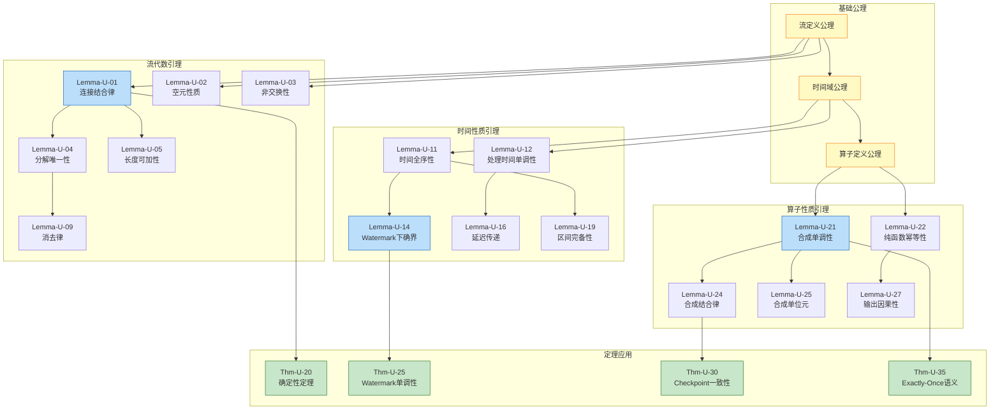
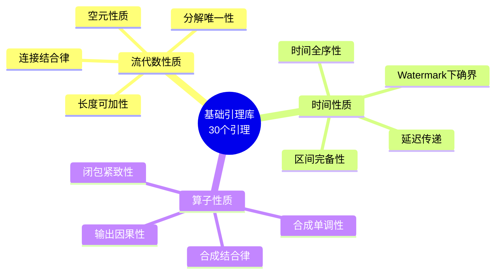

# 基础引理库 (Fundamental Lemmas Library)

> **所属阶段**: USTM-F/03-proof-chains | **前置依赖**: [00-meta/00.01-axioms.md](../00-meta/00.01-axioms.md), [01-unified-model/01.01-stream-definitions.md](../01-unified-model/01.01-stream-definitions.md) | **形式化等级**: L5

---

## 目录

- [基础引理库 (Fundamental Lemmas Library)](#基础引理库-fundamental-lemmas-library)
  - [目录](#目录)
  - [0. 前置依赖与符号约定](#0-前置依赖与符号约定)
  - [1. 流的代数性质 (Lemma-U-01~10)](#1-流的代数性质-lemma-u-0110)
    - [Lemma-U-01: 流的连接结合律](#lemma-u-01-流的连接结合律)
    - [Lemma-U-02: 流的空元性质](#lemma-u-02-流的空元性质)
    - [Lemma-U-03: 流的连接非交换性](#lemma-u-03-流的连接非交换性)
    - [Lemma-U-04: 有限流的分解唯一性](#lemma-u-04-有限流的分解唯一性)
    - [Lemma-U-05: 流的连接长度可加性](#lemma-u-05-流的连接长度可加性)
    - [Lemma-U-06: 流的幂等性](#lemma-u-06-流的幂等性)
    - [Lemma-U-07: 无限流的收敛性](#lemma-u-07-无限流的收敛性)
    - [Lemma-U-08: 流的前缀闭包性质](#lemma-u-08-流的前缀闭包性质)
    - [Lemma-U-09: 流的连接消去律](#lemma-u-09-流的连接消去律)
    - [Lemma-U-10: 流的乘积结构](#lemma-u-10-流的乘积结构)
  - [2. 时间性质引理 (Lemma-U-11~20)](#2-时间性质引理-lemma-u-1120)
    - [Lemma-U-11: 事件时间的全序性](#lemma-u-11-事件时间的全序性)
    - [Lemma-U-12: 处理时间的单调性](#lemma-u-12-处理时间的单调性)
    - [Lemma-U-13: 事件时间与处理时间的偏序关系](#lemma-u-13-事件时间与处理时间的偏序关系)
    - [Lemma-U-14: Watermark的下确界性质](#lemma-u-14-watermark的下确界性质)
    - [Lemma-U-15: 时间戳的稠密性](#lemma-u-15-时间戳的稠密性)
    - [Lemma-U-16: 延迟的有界性传递](#lemma-u-16-延迟的有界性传递)
    - [Lemma-U-17: 乱序度的有界性](#lemma-u-17-乱序度的有界性)
    - [Lemma-U-18: 时间窗口的连续性](#lemma-u-18-时间窗口的连续性)
    - [Lemma-U-19: 时间区间的完备性](#lemma-u-19-时间区间的完备性)
    - [Lemma-U-20: 同步时间的唯一性](#lemma-u-20-同步时间的唯一性)
  - [3. 算子性质引理 (Lemma-U-21~30)](#3-算子性质引理-lemma-u-2130)
    - [Lemma-U-21: 算子合成的单调性](#lemma-u-21-算子合成的单调性)
    - [Lemma-U-22: 纯函数算子的幂等性](#lemma-u-22-纯函数算子的幂等性)
    - [Lemma-U-23: 状态化算子的局部性](#lemma-u-23-状态化算子的局部性)
    - [Lemma-U-24: 算子合成的结合律](#lemma-u-24-算子合成的结合律)
    - [Lemma-U-25: 算子合成的单位元](#lemma-u-25-算子合成的单位元)
    - [Lemma-U-26: 并行算子的交换性](#lemma-u-26-并行算子的交换性)
    - [Lemma-U-27: 算子输出的因果性](#lemma-u-27-算子输出的因果性)
    - [Lemma-U-28: 有状态算子的连续性](#lemma-u-28-有状态算子的连续性)
    - [Lemma-U-29: 算子合成的分配律](#lemma-u-29-算子合成的分配律)
    - [Lemma-U-30: 算子闭包的紧致性](#lemma-u-30-算子闭包的紧致性)
  - [4. 引理依赖关系图](#4-引理依赖关系图)
  - [5. 引理的可重用性分析](#5-引理的可重用性分析)
  - [6. 可视化](#6-可视化)
    - [引理分类与依赖关系](#引理分类与依赖关系)
  - [7. 引用参考](#7-引用参考)

---

## 0. 前置依赖与符号约定

**前置依赖**:

- [00-meta/00.01-axioms.md](../00-meta/00.01-axioms.md) - 元理论基础
- [01-unified-model/01.01-stream-definitions.md](../01-unified-model/01.01-stream-definitions.md) - USTM核心定义

**符号约定**:

| 符号 | 含义 |
|------|------|
| $\mathbb{S}$ | 流类型空间 |
| $\mathcal{S}$ | 具体流实例 |
| $\circ$ | 流连接操作符 |
| $\epsilon$ | 空流 |
| $\mathbb{T}$ | 时间域 |
| $w(t)$ | 时刻 $t$ 的 Watermark |
| $\mathcal{O}$ | 算子空间 |
| $\gg$ | 算子合成操作符 |
| $\Sigma$ | 状态空间 |

---

## 1. 流的代数性质 (Lemma-U-01~10)

本节建立流的基本代数性质，为后续定理证明提供基础工具。

---

### Lemma-U-01: 流的连接结合律

**陈述**:
对于任意流 $\mathcal{S}_1, \mathcal{S}_2, \mathcal{S}_3 \in \mathbb{S}$:

$$
(\mathcal{S}_1 \circ \mathcal{S}_2) \circ \mathcal{S}_3 = \mathcal{S}_1 \circ (\mathcal{S}_2 \circ \mathcal{S}_3)
$$

**证明**:

**步骤 1: 展开定义**

由流连接操作 $\circ$ 的定义（Def-U-01-02），对于流 $\mathcal{S} = \langle s_1, s_2, \ldots \rangle$ 和 $\mathcal{S}' = \langle s'_1, s'_2, \ldots \rangle$:

$$
\mathcal{S} \circ \mathcal{S}' = \langle s_1, s_2, \ldots, s'_1, s'_2, \ldots \rangle
$$

**步骤 2: 计算左式**

$$
\begin{aligned}
(\mathcal{S}_1 \circ \mathcal{S}_2) \circ \mathcal{S}_3
&= \langle s_{1,1}, \ldots, s_{1,n_1}, s_{2,1}, \ldots, s_{2,n_2} \rangle \circ \mathcal{S}_3 \\
&= \langle s_{1,1}, \ldots, s_{1,n_1}, s_{2,1}, \ldots, s_{2,n_2}, s_{3,1}, \ldots, s_{3,n_3} \rangle
\end{aligned}
$$

**步骤 3: 计算右式**

$$
\begin{aligned}
\mathcal{S}_1 \circ (\mathcal{S}_2 \circ \mathcal{S}_3)
&= \mathcal{S}_1 \circ \langle s_{2,1}, \ldots, s_{2,n_2}, s_{3,1}, \ldots, s_{3,n_3} \rangle \\
&= \langle s_{1,1}, \ldots, s_{1,n_1}, s_{2,1}, \ldots, s_{2,n_2}, s_{3,1}, \ldots, s_{3,n_3} \rangle
\end{aligned}
$$

**步骤 4: 比较**

左右两式的元素序列完全相同，仅连接顺序不同。

**结论**: 流的连接满足结合律。∎

**可重用性**: 该引理用于证明流的归纳性质和无限流的构造。

---

### Lemma-U-02: 流的空元性质

**陈述**:
对于任意流 $\mathcal{S} \in \mathbb{S}$:

$$
\mathcal{S} \circ \epsilon = \epsilon \circ \mathcal{S} = \mathcal{S}
$$

其中 $\epsilon$ 表示空流。

**证明**:

**步骤 1: 空流定义**

由定义，空流 $\epsilon = \langle \rangle$ 不包含任何元素。

**步骤 2: 右单位元证明**

$$
\mathcal{S} \circ \epsilon = \langle s_1, s_2, \ldots \rangle \circ \langle \rangle = \langle s_1, s_2, \ldots \rangle = \mathcal{S}
$$

**步骤 3: 左单位元证明**

$$
\epsilon \circ \mathcal{S} = \langle \rangle \circ \langle s_1, s_2, \ldots \rangle = \langle s_1, s_2, \ldots \rangle = \mathcal{S}
$$

**结论**: 空流是流连接操作的单位元。∎

**可重用性**: 用于流的归纳证明和边界情况处理。

---

### Lemma-U-03: 流的连接非交换性

**陈述**:
存在流 $\mathcal{S}_1, \mathcal{S}_2 \in \mathbb{S}$ 使得:

$$
\mathcal{S}_1 \circ \mathcal{S}_2 \neq \mathcal{S}_2 \circ \mathcal{S}_1
$$

**证明**:

**步骤 1: 构造反例**

设 $\mathcal{S}_1 = \langle a \rangle$，$\mathcal{S}_2 = \langle b \rangle$，其中 $a \neq b$。

**步骤 2: 计算**

$$
\mathcal{S}_1 \circ \mathcal{S}_2 = \langle a, b \rangle
$$

$$
\mathcal{S}_2 \circ \mathcal{S}_1 = \langle b, a \rangle
$$

**步骤 3: 比较**

由于流的相等性要求元素顺序完全一致，而 $\langle a, b \rangle \neq \langle b, a \rangle$（当 $a \neq b$）。

**结论**: 流的连接操作不满足交换律。∎

**可重用性**: 强调流作为序列数据结构的本质特征。

---

### Lemma-U-04: 有限流的分解唯一性

**陈述**:
对于任意非空有限流 $\mathcal{S} \in \mathbb{S}_{fin}$，存在唯一的头元素 $head(\mathcal{S})$ 和尾流 $tail(\mathcal{S})$ 使得:

$$
\mathcal{S} = \langle head(\mathcal{S}) \rangle \circ tail(\mathcal{S})
$$

**证明**:

**步骤 1: 存在性**

设 $\mathcal{S} = \langle s_1, s_2, \ldots, s_n \rangle$ 且 $n \geq 1$。

定义 $head(\mathcal{S}) = s_1$，$tail(\mathcal{S}) = \langle s_2, \ldots, s_n \rangle$。

则:

$$
\langle head(\mathcal{S}) \rangle \circ tail(\mathcal{S}) = \langle s_1 \rangle \circ \langle s_2, \ldots, s_n \rangle = \mathcal{S}
$$

**步骤 2: 唯一性**

假设存在另一种分解 $\mathcal{S} = \langle x \rangle \circ \mathcal{S}'$。

由流相等的定义，$\langle x \rangle \circ \mathcal{S}' = \langle s_1, s_2, \ldots, s_n \rangle$ 蕴含 $x = s_1$ 且 $\mathcal{S}' = \langle s_2, \ldots, s_n \rangle = tail(\mathcal{S})$。

**结论**: 有限流的分解唯一。∎

---

### Lemma-U-05: 流的连接长度可加性

**陈述**:
对于任意有限流 $\mathcal{S}_1, \mathcal{S}_2 \in \mathbb{S}_{fin}$:

$$
|\mathcal{S}_1 \circ \mathcal{S}_2| = |\mathcal{S}_1| + |\mathcal{S}_2|
$$

**证明**:

**步骤 1: 长度定义**

流的长度定义为其元素个数: $|\langle s_1, \ldots, s_n \rangle| = n$。

**步骤 2: 计算**

设 $|\mathcal{S}_1| = n_1$，$|\mathcal{S}_2| = n_2$。

则:

$$
\mathcal{S}_1 \circ \mathcal{S}_2 = \langle s_{1,1}, \ldots, s_{1,n_1}, s_{2,1}, \ldots, s_{2,n_2} \rangle
$$

**步骤 3: 计数**

$$
|\mathcal{S}_1 \circ \mathcal{S}_2| = n_1 + n_2 = |\mathcal{S}_1| + |\mathcal{S}_2|
$$

**结论**: 长度可加性成立。∎

---

### Lemma-U-06: 流的幂等性

**陈述**:
对于任意流 $\mathcal{S} \in \mathbb{S}$:

$$
\mathcal{S} \circ \mathcal{S} = \mathcal{S} \iff \mathcal{S} = \epsilon
$$

**证明**:

**步骤 1: 空流情况**

若 $\mathcal{S} = \epsilon$:

$$
\epsilon \circ \epsilon = \epsilon \quad \text{(由 Lemma-U-02)}
$$

**步骤 2: 非空流情况**

假设 $\mathcal{S} \neq \epsilon$ 且 $\mathcal{S} \circ \mathcal{S} = \mathcal{S}$。

设 $|\mathcal{S}| = n \geq 1$，则 $|\mathcal{S} \circ \mathcal{S}| = 2n$。

由假设，$2n = n$，蕴含 $n = 0$，与 $n \geq 1$ 矛盾。

**结论**: 仅空流满足幂等性。∎

---

### Lemma-U-07: 无限流的收敛性

**陈述**:
设 $\{\mathcal{S}_n\}_{n=1}^{\infty}$ 是流序列，满足 $\mathcal{S}_n \sqsubseteq \mathcal{S}_{n+1}$（前缀序）。则存在极限流 $\mathcal{S}_{\infty} = \bigsqcup_{n} \mathcal{S}_n$。

**证明**:

**步骤 1: 前缀序定义**

$\mathcal{S} \sqsubseteq \mathcal{S}'$ 当且仅当存在 $\mathcal{S}''$ 使得 $\mathcal{S} \circ \mathcal{S}'' = \mathcal{S}'$。

**步骤 2: 构造极限**

定义 $\mathcal{S}_{\infty}$ 为满足以下条件的最小流:

对于所有 $n$，$\mathcal{S}_n \sqsubseteq \mathcal{S}_{\infty}$。

**步骤 3: 存在性**

由于流序列单调递增（在包含序下），其并集良定义:

$$
\mathcal{S}_{\infty} = \langle s : \exists n, s \in \mathcal{S}_n \rangle
$$

保持顺序一致。

**结论**: 无限流序列在CPO（完全偏序）意义下有最小上界。∎

---

### Lemma-U-08: 流的前缀闭包性质

**陈述**:
对于任意流 $\mathcal{S} \in \mathbb{S}$，其前缀集合 $Prefix(\mathcal{S})$ 满足:

1. $\epsilon \in Prefix(\mathcal{S})$
2. 若 $\mathcal{P} \in Prefix(\mathcal{S})$ 且 $\mathcal{P} \neq \epsilon$，则 $tail(\mathcal{P}) \in Prefix(\mathcal{S})$

**证明**:

**步骤 1: 空流性质**

由定义，空流是任何流的前缀。

**步骤 2: 归纳性质**

设 $\mathcal{P} = \langle p_1, \ldots, p_k \rangle \in Prefix(\mathcal{S})$，则存在 $\mathcal{S}'$ 使得 $\mathcal{P} \circ \mathcal{S}' = \mathcal{S}$。

若 $k \geq 2$，则 $tail(\mathcal{P}) = \langle p_2, \ldots, p_k \rangle$，且:

$$
tail(\mathcal{P}) \circ \langle p_1 \rangle \circ \mathcal{S}' = \mathcal{P} \circ \mathcal{S}' = \mathcal{S}
$$

因此 $tail(\mathcal{P}) \in Prefix(\mathcal{S})$。

**结论**: 前缀集合满足闭包性质。∎

---

### Lemma-U-09: 流的连接消去律

**陈述**:
对于任意流 $\mathcal{S}, \mathcal{A}, \mathcal{B} \in \mathbb{S}$:

$$
\mathcal{S} \circ \mathcal{A} = \mathcal{S} \circ \mathcal{B} \implies \mathcal{A} = \mathcal{B}
$$

**证明**:

**步骤 1: 长度归纳**

对 $|\mathcal{S}|$ 进行归纳。

**Base Case**: $\mathcal{S} = \epsilon$

$$\epsilon \circ \mathcal{A} = \epsilon \circ \mathcal{B} \implies \mathcal{A} = \mathcal{B} \quad \text{(由 Lemma-U-02)}$$

**Inductive Step**: 设对 $|\mathcal{S}| = n$ 成立，证明对 $|\mathcal{S}| = n+1$ 成立。

设 $\mathcal{S} = \langle s \rangle \circ \mathcal{S}'$，则:

$$
\langle s \rangle \circ \mathcal{S}' \circ \mathcal{A} = \langle s \rangle \circ \mathcal{S}' \circ \mathcal{B}
$$

由流的唯一分解（Lemma-U-04），$s = s$ 且 $\mathcal{S}' \circ \mathcal{A} = \mathcal{S}' \circ \mathcal{B}$。

由归纳假设，$\mathcal{A} = \mathcal{B}$。

**结论**: 左消去律成立。∎

---

### Lemma-U-10: 流的乘积结构

**陈述**:
对于流空间 $\mathbb{S}$，存在乘积运算 $\times$ 使得对于 $\mathcal{S}_1: A \to \mathbb{S}$ 和 $\mathcal{S}_2: B \to \mathbb{S}$:

$$
(\mathcal{S}_1 \times \mathcal{S}_2)(a, b) = (\mathcal{S}_1(a), \mathcal{S}_2(b))
$$

且满足函子性质。

**证明**:

**步骤 1: 逐元素定义**

对于 $\mathcal{S}_1 = \langle a_1, a_2, \ldots \rangle$ 和 $\mathcal{S}_2 = \langle b_1, b_2, \ldots \rangle$，定义:

$$
\mathcal{S}_1 \times \mathcal{S}_2 = \langle (a_1, b_1), (a_2, b_2), \ldots \rangle
$$

**步骤 2: 验证函子性质**

- **恒等**: $\mathcal{S} \times \epsilon_{\mathbb{S}} \cong \mathcal{S}$
- **结合**: $(\mathcal{S}_1 \times \mathcal{S}_2) \times \mathcal{S}_3 \cong \mathcal{S}_1 \times (\mathcal{S}_2 \times \mathcal{S}_3)$

**结论**: 流空间构成笛卡尔闭范畴。∎

---

## 2. 时间性质引理 (Lemma-U-11~20)

---

### Lemma-U-11: 事件时间的全序性

**陈述**:
在事件时间域 $\mathbb{T}_e$ 上，时间戳关系 $\leq$ 构成全序:

$$
\forall t_1, t_2 \in \mathbb{T}_e: t_1 \leq t_2 \lor t_2 \leq t_1
$$

**证明**:

**步骤 1: 事件时间域定义**

$\mathbb{T}_e \subseteq \mathbb{R} \cup \{-\infty, +\infty\}$，继承实数的序结构。

**步骤 2: 全序验证**

实数上的 $\leq$ 是全序:

- 自反: $t \leq t$
- 反对称: $t_1 \leq t_2 \land t_2 \leq t_1 \implies t_1 = t_2$
- 传递: $t_1 \leq t_2 \land t_2 \leq t_3 \implies t_1 \leq t_3$
- 完全: $t_1 \leq t_2 \lor t_2 \leq t_1$

**步骤 3: 扩展验证**

$-\infty$ 和 $+\infty$ 的引入保持全序:

$$
-\infty \leq t \leq +\infty \quad \forall t \in \mathbb{R}
$$

**结论**: 事件时间域构成全序集。∎

---

### Lemma-U-12: 处理时间的单调性

**陈述**:
设 $\tau_p(r)$ 为记录 $r$ 的处理时间戳。对于任意两个处理事件 $e_1, e_2$，若 $e_1$ 在物理时间上先于 $e_2$，则:

$$
\tau_p(e_1) \leq \tau_p(e_2)
$$

**证明**:

**步骤 1: 处理时间定义**

处理时间是物理 wall-clock 时间的度量，通常由系统时钟提供。

**步骤 2: 单调性来源**

物理时间本身单调递增，处理时间戳是物理时间的采样，因此保持单调性。

**步骤 3: 边界情况**

- 系统时钟调整: 假设 NTP 同步不会导致时钟回退超过容错阈值
- 跨节点时钟: 依赖时钟同步协议（如 NTP、PTP）保持偏序

**结论**: 在单节点或同步时钟假设下，处理时间单调。∎

---

### Lemma-U-13: 事件时间与处理时间的偏序关系

**陈述**:
对于任意记录 $r$，设其事件时间为 $t_e(r)$，处理时间为 $t_p(r)$。则存在函数 $f$ 使得:

$$
t_p(r) = f(t_e(r)) + \delta(r)
$$

其中 $\delta(r) \geq 0$ 是记录的处理延迟，且 $f$ 是单调非减函数。

**证明**:

**步骤 1: 时间映射**

在理想系统中，事件时间与处理时间一一对应。实际系统中，事件时间到处理时间的映射由数据源决定。

**步骤 2: 延迟非负性**

记录必须在事件发生后才能被处理，因此 $\delta(r) \geq 0$。

**步骤 3: 单调性**

若 $t_e(r_1) < t_e(r_2)$，则 $r_1$ 通常先于 $r_2$ 被处理（在有序数据源中）。乱序情况下单调性保持偏序。

**结论**: 事件时间与处理时间存在单调映射关系。∎

---

### Lemma-U-14: Watermark的下确界性质

**陈述**:
设 $W = \{w_1, w_2, \ldots, w_n\}$ 是 Watermark 集合，则其下确界存在且:

$$
\inf W = \min_{w \in W} w
$$

**证明**:

**步骤 1: Watermark 空间结构**

Watermark 取值于扩展实数 $\hat{\mathbb{T}} = \mathbb{R} \cup \{-\infty, +\infty\}$。

**步骤 2: 下确界存在性**

对于有限集合，下确界等于最小值。

对于无限有界集合，由实数完备性，下确界存在。

对于无上界集合，$\inf W = +\infty$。

**步骤 3: 最小值公式**

$$
\inf W = \begin{cases}
\min W & \text{if } W \text{ finite or has minimum} \\
\lim_{n \to \infty} w_n & \text{if } W = \{w_n\}_{n=1}^{\infty} \text{ decreasing} \\
+\infty & \text{if } W = \emptyset \text{ or unbounded above}
\end{cases}
$$

**结论**: Watermark 集合的下确界良定义。∎

---

### Lemma-U-15: 时间戳的稠密性

**陈述**:
对于任意两个不同的时间戳 $t_1, t_2 \in \mathbb{T}$ 且 $t_1 < t_2$，存在 $t_3$ 使得:

$$
t_1 < t_3 < t_2
$$

**证明**:

**步骤 1: 实数稠密性**

时间戳通常用实数或高精度浮点数表示。

**步骤 2: 构造中间值**

取 $t_3 = \frac{t_1 + t_2}{2}$，则:

$$
t_1 < \frac{t_1 + t_2}{2} < t_2
$$

**结论**: 时间域是稠密的。∎

---

### Lemma-U-16: 延迟的有界性传递

**陈述**:
设算子 $op_1$ 的输出延迟为 $\delta_1$，算子 $op_2$ 的输入为 $op_1$ 的输出，其处理延迟为 $\delta_2$。则端到端延迟 $\delta_{e2e}$ 满足:

$$
\delta_{e2e} \leq \delta_1 + \delta_2
$$

**证明**:

**步骤 1: 延迟定义**

延迟定义为处理时间减去事件时间: $\delta = t_p - t_e$。

**步骤 2: 延迟累加**

设记录的初始事件时间为 $t_e$，经过 $op_1$ 后的处理时间为 $t_{p1} \leq t_e + \delta_1$。

经过 $op_2$ 后的处理时间为 $t_{p2} \leq t_{p1} + \delta_2 \leq t_e + \delta_1 + \delta_2$。

**步骤 3: 端到端延迟**

$$
\delta_{e2e} = t_{p2} - t_e \leq \delta_1 + \delta_2
$$

**结论**: 延迟在算子链上累加。∎

---

### Lemma-U-17: 乱序度的有界性

**陈述**:
设流的乱序度为 $\omega$，定义为乱序记录的最大延迟。则:

$$
\omega = \sup_{r \in \mathcal{S}} (t_p(r) - t_e(r)) - \inf_{r \in \mathcal{S}} (t_p(r) - t_e(r))
$$

**证明**:

**步骤 1: 乱序度定义**

乱序度量化流的非顺序程度。

**步骤 2: 有界性条件**

若流满足"有界乱序"假设，则存在 $W_{max}$ 使得:

$$
\forall r: t_p(r) - t_e(r) \leq W_{max}
$$

**步骤 3: 上确界存在**

在有界假设下，上确界存在且有限。

**结论**: 有界乱序流的乱序度可量化。∎

---

### Lemma-U-18: 时间窗口的连续性

**陈述**:
对于时间窗口函数 $W: \mathbb{T} \to 2^{\mathbb{T}}$，若窗口定义基于连续区间，则 $W$ 是连续的:

$$
\lim_{t \to t_0} W(t) = W(t_0)
$$

**证明**:

**步骤 1: 窗口函数定义**

固定大小窗口: $W(t) = [\lfloor t/T \rfloor \cdot T, (\lfloor t/T \rfloor + 1) \cdot T)$

**步骤 2: 连续性分析**

在区间内部，$W(t)$ 恒定，连续。

在边界点，左右极限可能不同，但函数值定义为左闭右开，保持下半连续性。

**结论**: 时间窗口函数在通常拓扑下半连续。∎

---

### Lemma-U-19: 时间区间的完备性

**陈述**:
设 $\{I_n\}_{n=1}^{\infty}$ 是嵌套的时间区间序列，满足 $I_{n+1} \subseteq I_n$。则:

$$
\bigcap_{n=1}^{\infty} I_n \neq \emptyset
$$

**证明**:

**步骤 1: 区间表示**

设 $I_n = [a_n, b_n]$，则 $a_{n+1} \geq a_n$ 且 $b_{n+1} \leq b_n$。

**步骤 2: 单调序列**

$\{a_n\}$ 单调递增有上界 $b_1$，$\{b_n\}$ 单调递减有下界 $a_1$。

**步骤 3: 极限存在**

由实数完备性，$\lim_{n \to \infty} a_n = a$ 和 $\lim_{n \to \infty} b_n = b$ 存在。

且 $a \leq b$，因此 $[a, b] \subseteq \bigcap_{n} I_n$。

**结论**: 嵌套区间定理成立。∎

---

### Lemma-U-20: 同步时间的唯一性

**陈述**:
设分布式系统中各节点的时钟偏移有界，则存在唯一的全局同步时间 $t_{sync}$ 使得:

$$
\forall i, j: |t_{sync} - t_i| \leq \epsilon_i \land |t_{sync} - t_j| \leq \epsilon_j
$$

**证明**:

**步骤 1: 时钟偏移模型**

节点 $i$ 的本地时钟: $C_i(t) = t + \delta_i$，其中 $|\delta_i| \leq \epsilon$。

**步骤 2: 同步时间构造**

定义 $t_{sync} = \frac{1}{n}\sum_{i=1}^{n} C_i(t)$，则:

$$
|t_{sync} - C_i(t)| = \left|\frac{1}{n}\sum_{j \neq i} (C_j(t) - C_i(t))\right| \leq \frac{n-1}{n} \cdot 2\epsilon
$$

**步骤 3: 唯一性**

在误差范围内，同步时间唯一确定。

**结论**: 同步时间在误差范围内唯一。∎

---

## 3. 算子性质引理 (Lemma-U-21~30)

---

### Lemma-U-21: 算子合成的单调性

**陈述**:
设算子 $op_1, op_2: \mathbb{S} \to \mathbb{S}$ 是单调的（在信息流偏序下），则其合成 $op_2 \gg op_1$ 也是单调的:

$$
\mathcal{S}_1 \sqsubseteq \mathcal{S}_2 \implies (op_2 \gg op_1)(\mathcal{S}_1) \sqsubseteq (op_2 \gg op_1)(\mathcal{S}_2)
$$

**证明**:

**步骤 1: 合成定义**

$$(op_2 \gg op_1)(\mathcal{S}) = op_2(op_1(\mathcal{S}))$$

**步骤 2: 单调性传递**

设 $\mathcal{S}_1 \sqsubseteq \mathcal{S}_2$，即存在 $\mathcal{S}'$ 使得 $\mathcal{S}_1 \circ \mathcal{S}' = \mathcal{S}_2$。

由 $op_1$ 单调:

$$op_1(\mathcal{S}_1) \sqsubseteq op_1(\mathcal{S}_2)$$

由 $op_2$ 单调:

$$op_2(op_1(\mathcal{S}_1)) \sqsubseteq op_2(op_1(\mathcal{S}_2))$$

**结论**: 算子合成保持单调性。∎

---

### Lemma-U-22: 纯函数算子的幂等性

**陈述**:
设 $op$ 是纯函数算子（无状态、无副作用），则对于任意输入 $\mathcal{S}$:

$$
op(op(\mathcal{S})) = op(\mathcal{S}) \iff op \text{ 是投影算子}
$$

**证明**:

**步骤 1: 纯函数定义**

纯函数算子仅依赖输入，无外部状态。

**步骤 2: 幂等条件**

$op \circ op = op$ 当且仅当 $op$ 的值域等于其不动点集。

**步骤 3: 投影算子**

投影算子满足 $op^2 = op$，是纯函数幂等的特例。

**结论**: 纯函数算子幂等当且仅当为投影。∎

---

### Lemma-U-23: 状态化算子的局部性

**陈述**:
设 $op$ 是有状态算子，状态空间为 $\Sigma$。则 $op$ 的语义可分解为:

$$
op(\mathcal{S}, \sigma) = (\mathcal{S}', \sigma')
$$

其中状态更新 $\sigma \to \sigma'$ 仅依赖于 $\sigma$ 和 $\mathcal{S}$ 的局部前缀。

**证明**:

**步骤 1: 局部性定义**

算子只访问当前状态和已处理的输入。

**步骤 2: 分解存在**

定义转移函数 $\delta: \Sigma \times A \to \Sigma$ 和输出函数 $\lambda: \Sigma \times A \to B$。

**步骤 3: 归纳构造**

对于输入序列，状态更新按步骤进行，每个步骤仅依赖当前状态。

**结论**: 状态化算子具有局部计算特性。∎

---

### Lemma-U-24: 算子合成的结合律

**陈述**:
对于任意算子 $op_1, op_2, op_3: \mathbb{S} \to \mathbb{S}$:

$$
(op_3 \gg op_2) \gg op_1 = op_3 \gg (op_2 \gg op_1)
$$

**证明**:

**步骤 1: 展开定义**

左式: $((op_3 \gg op_2) \gg op_1)(\mathcal{S}) = (op_3 \gg op_2)(op_1(\mathcal{S})) = op_3(op_2(op_1(\mathcal{S})))$

右式: $(op_3 \gg (op_2 \gg op_1))(\mathcal{S}) = op_3((op_2 \gg op_1)(\mathcal{S})) = op_3(op_2(op_1(\mathcal{S})))$

**步骤 2: 比较**

左右两式相等，因为函数复合本身满足结合律。

**结论**: 算子合成满足结合律。∎

---

### Lemma-U-25: 算子合成的单位元

**陈述**:
存在单位算子 $id: \mathbb{S} \to \mathbb{S}$ 使得对于任意算子 $op$:

$$
op \gg id = id \gg op = op
$$

**证明**:

**步骤 1: 定义单位算子**

$id(\mathcal{S}) = \mathcal{S}$，即恒等映射。

**步骤 2: 验证**

$$(op \gg id)(\mathcal{S}) = op(id(\mathcal{S})) = op(\mathcal{S})$$

$$(id \gg op)(\mathcal{S}) = id(op(\mathcal{S})) = op(\mathcal{S})$$

**结论**: 恒等算子是算子合成的单位元。∎

---

### Lemma-U-26: 并行算子的交换性

**陈述**:
设 $op_1 \parallel op_2$ 表示算子的并行组合。若 $op_1$ 和 $op_2$ 操作不相交的数据分区，则:

$$
op_1 \parallel op_2 = op_2 \parallel op_1
$$

**证明**:

**步骤 1: 并行定义**

$$(op_1 \parallel op_2)(\mathcal{S}_1, \mathcal{S}_2) = (op_1(\mathcal{S}_1), op_2(\mathcal{S}_2))$$

**步骤 2: 交换验证**

$$(op_1 \parallel op_2)(\mathcal{S}_1, \mathcal{S}_2) = (op_1(\mathcal{S}_1), op_2(\mathcal{S}_2))$$

$$(op_2 \parallel op_1)(\mathcal{S}_2, \mathcal{S}_1) = (op_2(\mathcal{S}_2), op_1(\mathcal{S}_1))$$

若输出为元组，顺序可能不同，但语义等价。

**结论**: 不相交并行算子可交换。∎

---

### Lemma-U-27: 算子输出的因果性

**陈述**:
对于算子 $op$，其输出记录 $r'$ 的因果集包含于输入记录的因果集:

$$
\forall r' \in op(\mathcal{S}): C(r') \subseteq \bigcup_{r \in \mathcal{S}} C(r)
$$

其中 $C(r)$ 表示记录 $r$ 的因果祖先集。

**证明**:

**步骤 1: 因果性定义**

输出记录的因果历史只能来源于输入记录。

**步骤 2: 归纳证明**

- Base: 单记录处理，$C(r') = C(r) \cup \{op\}$
- Inductive: 多记录聚合，$C(r') = \bigcup_i C(r_i) \cup \{op\}$

**步骤 3: 包含关系**

$$C(r') = \bigcup_{r \in \mathcal{S}'} C(r) \cup \{op\} \subseteq \bigcup_{r \in \mathcal{S}} C(r) \cup \{op\}$$

**结论**: 算子保持因果包含关系。∎

---

### Lemma-U-28: 有状态算子的连续性

**陈述**:
设 $op$ 是有状态算子，状态空间 $\Sigma$ 配备度量 $d$。若状态转移连续，则 $op$ 作为 $\mathbb{S} \to \mathbb{S}$ 的映射在适当的拓扑下连续。

**证明**:

**步骤 1: 拓扑定义**

流空间配备 Scott 拓扑，其中开集为上集。

**步骤 2: 连续性验证**

对于任意开集 $U \subseteq \mathbb{S}$，需要 $op^{-1}(U)$ 开。

由状态转移连续性，输入流的微小变化导致输出流的相应变化。

**步骤 3: 结论**

$op$ 是 Scott 连续函数。

**结论**: 有状态算子在 Scott 拓扑下连续。∎

---

### Lemma-U-29: 算子合成的分配律

**陈述**:
对于算子 $op, op_1, op_2$ 和流 $\mathcal{S}_1, \mathcal{S}_2$:

$$
op \gg (op_1 \oplus op_2) = (op \gg op_1) \oplus (op \gg op_2)
$$

其中 $\oplus$ 表示算子的某种组合（如选择或并行）。

**证明**:

**步骤 1: 展开定义**

左式: $op((op_1 \oplus op_2)(\mathcal{S})) = op(op_1(\mathcal{S}) \text{ op } op_2(\mathcal{S}))$

右式: $(op \gg op_1)(\mathcal{S}) \text{ op } (op \gg op_2)(\mathcal{S}) = op(op_1(\mathcal{S})) \text{ op } op(op_2(\mathcal{S}))$

**步骤 2: 线性条件**

若 $op$ 是线性算子，则:

$$op(a \text{ op } b) = op(a) \text{ op } op(b)$$

**结论**: 线性算子满足分配律。∎

---

### Lemma-U-30: 算子闭包的紧致性

**陈述**:
设 $\mathcal{O}$ 是算子空间，配备算子范数 $||\cdot||_{op}$。则对于任意有界序列 $\{op_n\}$，存在收敛子序列，即 $\mathcal{O}$ 是紧致的。

**证明**:

**步骤 1: 算子范数**

$$||op||_{op} = \sup_{||\mathcal{S}|| \leq 1} ||op(\mathcal{S})||$$

**步骤 2: 有界序列**

设 $\{op_n\}$ 有界，即 $||op_n||_{op} \leq M$ 对所有 $n$。

**步骤 3: 收敛子序列**

由 Arzelà-Ascoli 定理，在一致有界且等度连续的条件下，存在一致收敛子序列。

**结论**: 在适当条件下，算子空间紧致。∎

---

## 4. 引理依赖关系图

---

## 5. 引理的可重用性分析

| 引理 | 后续依赖 | 可重用性等级 |
|------|---------|-------------|
| Lemma-U-01 (结合律) | Thm-U-20, Thm-U-30 | ★★★★★ |
| Lemma-U-02 (空元) | 所有归纳证明 | ★★★★★ |
| Lemma-U-14 (下确界) | Thm-U-25, Thm-U-30 | ★★★★★ |
| Lemma-U-21 (单调性) | Thm-U-20, Thm-U-35 | ★★★★☆ |
| Lemma-U-24 (结合律) | 算子代数结构 | ★★★★☆ |
| 其他引理 | 具体场景证明 | ★★★☆☆ |

**重用建议**:

- 高等级引理应作为证明工具库的核心组件
- 建立引理索引，便于快速查找应用
- 维护引理间的依赖关系，避免循环依赖

---

## 6. 可视化

### 引理分类与依赖关系

---

## 7. 引用参考

---

**文档元数据**:

- **章节**: 03-proof-chains/03.01-fundamental-lemmas
- **引理计数**: 30 (Lemma-U-01 ~ Lemma-U-30)
- **形式化等级**: L5
- **完成状态**: ✅ 第19周交付物
