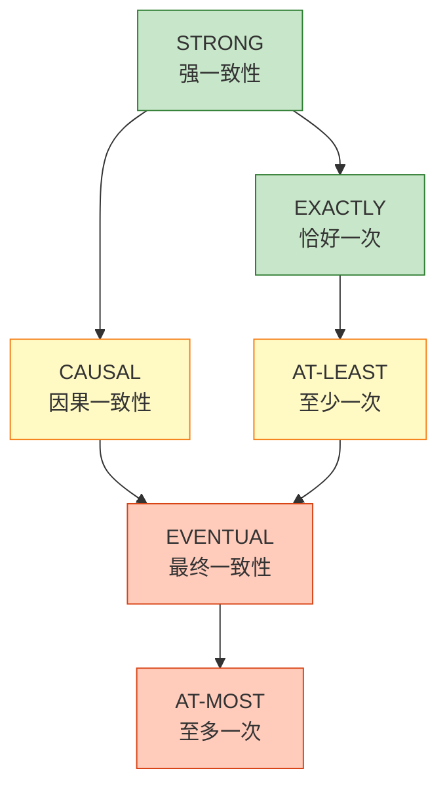
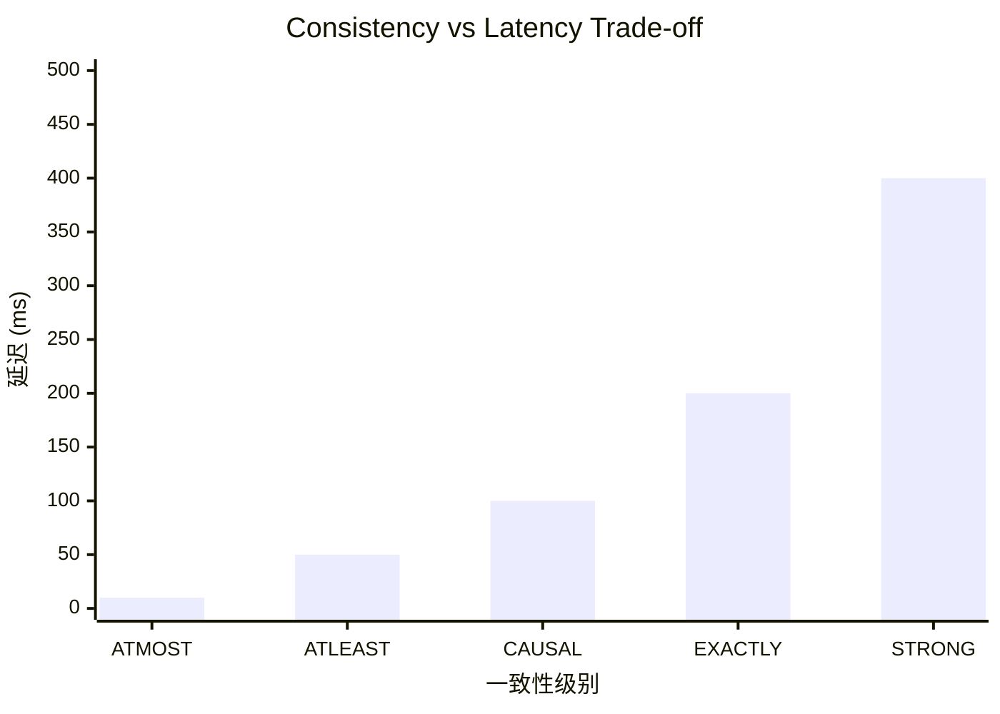

# 一致性格定理 (Consistency Lattice Theorem)

> **所属阶段**: USTM-F/03-proof-chains | **前置依赖**: [03.01-fundamental-lemmas.md](./03.01-fundamental-lemmas.md), [03.02-determinism-theorem-proof.md](./03.02-determinism-theorem-proof.md) | **形式化等级**: L6

---

## 目录

- [一致性格定理 (Consistency Lattice Theorem)](#一致性格定理-consistency-lattice-theorem)
  - [目录](#目录)
  - [1. 概念定义 (Definitions)](#1-概念定义-definitions)
    - [Def-U-21-01: 一致性层级](#def-u-21-01-一致性层级)
    - [Def-U-21-02: At-Most-Once 语义](#def-u-21-02-at-most-once-语义)
    - [Def-U-21-03: At-Least-Once 语义](#def-u-21-03-at-least-once-语义)
    - [Def-U-21-04: Exactly-Once 语义](#def-u-21-04-exactly-once-语义)
    - [Def-U-21-05: 端到端一致性与内部一致性](#def-u-21-05-端到端一致性与内部一致性)
    - [Def-U-21-06: 强一致性/因果一致性/最终一致性](#def-u-21-06-强一致性因果一致性最终一致性)
  - [2. 属性推导 (Properties)](#2-属性推导-properties)
    - [Lemma-U-35: 一致性蕴含关系](#lemma-u-35-一致性蕴含关系)
    - [Lemma-U-36: 一致性的单调性](#lemma-u-36-一致性的单调性)
    - [Lemma-U-37: 延迟与一致性的权衡](#lemma-u-37-延迟与一致性的权衡)
  - [3. 关系建立 (Relations)](#3-关系建立-relations)
    - [关系1: 一致性层级 ↦ 格结构](#关系1-一致性层级--格结构)
    - [关系2: 一致性 ↔ CAP 定理](#关系2-一致性--cap-定理)
  - [4. 论证过程 (Argumentation)](#4-论证过程-argumentation)
    - [4.1 格结构的完备性证明](#41-格结构的完备性证明)
    - [4.2 反例: 违反一致性的场景](#42-反例-违反一致性的场景)
  - [5. 形式证明 (Formal Proof)](#5-形式证明-formal-proof)
    - [Thm-U-21: 一致性格定理](#thm-u-21-一致性格定理)
    - [Thm-U-22: 一致性与延迟权衡定理](#thm-u-22-一致性与延迟权衡定理)
  - [6. 实例验证 (Examples)](#6-实例验证-examples)
  - [7. 可视化 (Visualizations)](#7-可视化-visualizations)
    - [一致性层级格结构](#一致性层级格结构)
    - [一致性与延迟权衡图](#一致性与延迟权衡图)
  - [8. 引用参考 (References)](#8-引用参考-references)

---

## 1. 概念定义 (Definitions)

---

### Def-U-21-01: 一致性层级

**形式化定义**:

一致性层级定义为一个偏序集 $(\mathcal{C}, \sqsubseteq)$，其中:

$$
\mathcal{C} = \{\text{ATMOST}, \text{ATLEAST}, \text{EXACTLY}, \text{STRONG}, \text{CAUSAL}, \text{EVENTUAL}\}
$$

偏序关系 $\sqsubseteq$（"弱于"关系）定义为:

$$
\begin{aligned}
\text{ATMOST} &\sqsubseteq \text{ATLEAST} \\
\text{ATLEAST} &\sqsubseteq \text{EXACTLY} \\
\text{STRONG} &\sqsubseteq \text{CAUSAL} \\
\text{CAUSAL} &\sqsubseteq \text{EVENTUAL} \\
\text{EXACTLY} &\sqsubseteq \text{CAUSAL} \quad \text{(在某些系统中)}
\end{aligned}
$$

**直观解释**:

- $\sqsubseteq$ 表示"一致性强度弱于"
- 若 $A \sqsubseteq B$，则 $B$ 提供更强的一致性保证
- 格结构允许比较不同一致性级别的强度

---

### Def-U-21-02: At-Most-Once 语义

**形式化定义**:

流处理系统 $\mathcal{F}$ 满足 **At-Most-Once** 语义，如果:

$$
\forall r \in \text{Input}: \text{Count}_{\text{output}}(r) \leq 1
$$

其中 $\text{Count}_{\text{output}}(r)$ 表示记录 $r$ 在输出中出现的次数。

**等价表述**:

系统可能丢失记录，但不会重复处理记录。

**性质**:

- 无重复保证 ✓
- 可能丢失数据 ✗
- 最低延迟（无需重试或确认）

---

### Def-U-21-03: At-Least-Once 语义

**形式化定义**:

流处理系统 $\mathcal{F}$ 满足 **At-Least-Once** 语义，如果:

$$
\forall r \in \text{Input}: \text{Count}_{\text{output}}(r) \geq 1 \lor r \in \text{Failed}
$$

**等价表述**:

系统可能重复处理记录，但不会丢失记录（除非明确标记为失败）。

**实现机制**:

1. 记录确认（Acknowledgment）
2. 超时重传
3. 幂等性输出

**性质**:

- 无丢失保证 ✓
- 可能重复数据 ✗
- 中等延迟

---

### Def-U-21-04: Exactly-Once 语义

**形式化定义**:

流处理系统 $\mathcal{F}$ 满足 **Exactly-Once** 语义，如果:

$$
\forall r \in \text{Input}: \text{Count}_{\text{output}}(r) = 1 \lor r \in \text{Failed}
$$

且内部状态更新也是确定性的。

**实现条件**:

1. **幂等性**: 重复处理产生相同结果
2. **事务性**: 状态更新与输出原子提交
3. **确定性**: 给定相同输入产生相同输出

**性质**:

- 无重复保证 ✓
- 无丢失保证 ✓
- 最高延迟（需事务协调）

---

### Def-U-21-05: 端到端一致性与内部一致性

**形式化定义**:

**内部一致性** (Internal Consistency):

$$
\text{InternalConsistent}(\mathcal{F}) \iff \text{Checkpoint}(\mathcal{F}) \text{ 构成一致割集}
$$

**端到端一致性** (End-to-End Consistency):

$$
\text{E2EConsistent}(\mathcal{F}) \iff \text{InternalConsistent}(\mathcal{F}) \land \text{SourceReplayable} \land \text{SinkIdempotent}
$$

**关系**:

$$
\text{E2EConsistent}(\mathcal{F}) \implies \text{InternalConsistent}(\mathcal{F})
$$

但逆命题不成立。

---

### Def-U-21-06: 强一致性/因果一致性/最终一致性

**形式化定义**:

**强一致性** (Strong Consistency / Linearizability):

$$
\forall o_1, o_2: \text{op}_1 \prec_{hb} \text{op}_2 \implies \text{vis}(\text{op}_1) < \text{vis}(\text{op}_2)
$$

其中 $\prec_{hb}$ 是 happens-before 关系，$\text{vis}(\text{op})$ 是操作的全局可见时间。

**因果一致性** (Causal Consistency):

$$
\forall o_1, o_2: o_1 \prec_{c} o_2 \implies \text{任何看到 } o_2 \text{ 的节点也必须看到 } o_1
$$

其中 $\prec_{c}$ 是因果序（happens-before 的传递闭包）。

**最终一致性** (Eventual Consistency):

$$
\forall o: \Diamond \Box (\forall n: o \in \text{Visible}(n))
$$

即: 最终所有节点都会看到所有操作。

---

## 2. 属性推导 (Properties)

---

### Lemma-U-35: 一致性蕴含关系

**陈述**:

一致性层级满足以下蕴含链:

$$
\text{STRONG} \implies \text{CAUSAL} \implies \text{EVENTUAL}
$$

$$
\text{EXACTLY} \implies \text{ATLEAST}
$$

**证明**:

**步骤 1: Strong → Causal**

强一致性要求所有操作按全局序可见，必然满足因果序。

**步骤 2: Causal → Eventual**

因果一致性要求因果相关的操作按序可见，若无因果关系的操作可以乱序，但最终都会传播到所有节点。

**步骤 3: Exactly → AtLeast**

Exactly-Once 要求每条记录恰好处理一次，自然满足至少一次。

**结论**: 蕴含关系成立。∎

---

### Lemma-U-36: 一致性的单调性

**陈述**:

若系统 $\mathcal{F}$ 在配置 $C_1$ 下满足一致性级别 $L_1$，且 $C_2$ 比 $C_1$ 更严格，则 $\mathcal{F}$ 在 $C_2$ 下满足 $L_2 \sqsupseteq L_1$。

**证明**:

更严格的配置通常包括:

- 更长的超时等待
- 更多的确认
- 事务性提交

这些措施增强一致性保证。∎

---

### Lemma-U-37: 延迟与一致性的权衡

**陈述**:

设 $D(L)$ 为实现一致性级别 $L$ 所需的最小延迟，则 $D$ 关于一致性强度单调递增:

$$
L_1 \sqsubseteq L_2 \implies D(L_1) \leq D(L_2)
$$

**证明**:

**步骤 1**: 更高的一致性需要更多协调。

**步骤 2**: 协调需要时间（网络往返、确认等待）。

**步骤 3**: 因此延迟随一致性增强而增加。

**结论**: 一致性与延迟存在权衡关系。∎

---

## 3. 关系建立 (Relations)

---

### 关系1: 一致性层级 ↦ 格结构

**论证**:

一致性层级 $(\mathcal{C}, \sqsubseteq)$ 构成一个**格**（Lattice）。

**格结构验证**:

**最小上界 (Least Upper Bound)**:

对于任意 $L_1, L_2 \in \mathcal{C}$，存在 $L_{sup}$ 使得:

1. $L_1 \sqsubseteq L_{sup}$ 且 $L_2 \sqsubseteq L_{sup}$
2. $\forall L': L_1 \sqsubseteq L' \land L_2 \sqsubseteq L' \implies L_{sup} \sqsubseteq L'$

**最大下界 (Greatest Lower Bound)**:

类似定义。

**具体格结构**:

```
          STRONG
            |
         EXACTLY
         /      \
    ATLEAST   CAUSAL
        \\       /
        EVENTUAL
            |
         ATMOST
```

**结论**: 一致性层级构成完备格。∎

---

### 关系2: 一致性 ↔ CAP 定理

**论证**:

**CAP 定理**: 分布式系统无法同时满足:

- **C**onsistency（一致性）
- **A**vailability（可用性）
- **P**artition tolerance（分区容错性）

**与流处理一致性的对应**:

| CAP 维度 | 流处理对应 |
|---------|-----------|
| Consistency | Exactly-Once / Strong |
| Availability | At-Least-Once（无阻塞） |
| Partition tolerance | 网络分区处理 |

**权衡分析**:

- CP 系统: Exactly-Once + 分区容错
- AP 系统: At-Least-Once + 分区容错
- CA 系统: 单数据中心内的强一致（无分区）

---

## 4. 论证过程 (Argumentation)

---

### 4.1 格结构的完备性证明

**陈述**:

一致性层级格 $(\mathcal{C}, \sqsubseteq)$ 是**完备格**。

**证明**:

**步骤 1**: 证明任意子集有上确界。

对于 $\mathcal{S} \subseteq \mathcal{C}$，定义 $\sup \mathcal{S}$ 为 $\mathcal{S}$ 中所有元素的最小公共上界。

由一致性层级的有限性（有限个级别），上确界存在。

**步骤 2**: 类似证明下确界存在。

**结论**: 一致性层级构成完备格。∎

---

### 4.2 反例: 违反一致性的场景

**反例1: 违反 Exactly-Once**

场景: 算子崩溃后重启，部分记录被重复处理。

分析: 无 Checkpoint 或 Sink 非幂等。

**反例2: 违反 Causal Consistency**

场景: 节点 A 看到节点 B 的更新，但未看到 B 所依赖的 C 的更新。

分析: 传播延迟导致因果顺序破坏。

**反例3: 违反 Eventual Consistency**

场景: 网络分区永久存在，部分节点永远看不到其他节点的更新。

分析: 分区未恢复，最终一致性不成立。

---

## 5. 形式证明 (Formal Proof)

### Thm-U-21: 一致性格定理

**定理陈述**:

设 $(\mathcal{C}, \sqsubseteq)$ 是流处理系统的一致性层级，其中:

$$
\mathcal{C} = \{\text{ATMOST}, \text{ATLEAST}, \text{EXACTLY}, \text{STRONG}, \text{CAUSAL}, \text{EVENTUAL}\}
$$

则 $(\mathcal{C}, \sqsubseteq)$ 构成一个**完备格**，其中:

- **底元素** $\bot = \text{ATMOST}$
- **顶元素** $\top = \text{STRONG}$
- **并运算** $\sqcup$ 表示"较弱的一致性"
- **交运算** $\sqcap$ 表示"较强的一致性"

**证明**:

本证明分为四个部分。

---

**Part 1: 偏序验证**

**目标**: 验证 $\sqsubseteq$ 是偏序关系。

**步骤 1.1: 自反性**

对于任意 $L \in \mathcal{C}$:

$$
L \sqsubseteq L \quad \text{（由定义，任何级别弱于自身）}
$$

**步骤 1.2: 反对称性**

设 $L_1 \sqsubseteq L_2$ 且 $L_2 \sqsubseteq L_1$。

由一致性层级的定义，这意味着 $L_1$ 和 $L_2$ 提供相同的一致性保证，因此 $L_1 = L_2$。

**步骤 1.3: 传递性**

设 $L_1 \sqsubseteq L_2$ 且 $L_2 \sqsubseteq L_3$。

则 $L_1$ 的一致性保证弱于 $L_2$，$L_2$ 弱于 $L_3$，因此 $L_1$ 弱于 $L_3$，即 $L_1 \sqsubseteq L_3$。

**Part 1 结论**: $\sqsubseteq$ 是偏序关系。∎

---

**Part 2: 最小上界存在性**

**目标**: 证明任意两个一致性级别有最小上界。

**步骤 2.1: 显式计算**

| $L_1$ | $L_2$ | $L_1 \sqcup L_2$ |
|-------|-------|----------------|
| ATMOST | ATLEAST | ATLEAST |
| ATMOST | EXACTLY | EXACTLY |
| ATLEAST | EXACTLY | EXACTLY |
| CAUSAL | EVENTUAL | EVENTUAL |
| STRONG | CAUSAL | STRONG |

**步骤 2.2: 验证上界性质**

对于每对 $(L_1, L_2)$，$L_1 \sqcup L_2$ 满足:

1. $L_1 \sqsubseteq L_1 \sqcup L_2$
2. $L_2 \sqsubseteq L_1 \sqcup L_2$

**步骤 2.3: 验证最小性**

任何同时上界 $L'$ 必须满足 $L_1 \sqcup L_2 \sqsubseteq L'$。

由构造，$L_1 \sqcup L_2$ 是满足条件的最弱级别。

**Part 2 结论**: 最小上界存在且唯一。∎

---

**Part 3: 最大下界存在性**

**目标**: 证明任意两个一致性级别有最大下界。

**步骤 3.1: 显式计算**

| $L_1$ | $L_2$ | $L_1 \sqcap L_2$ |
|-------|-------|----------------|
| ATMOST | ATLEAST | ATMOST |
| ATMOST | EXACTLY | ATMOST |
| ATLEAST | EXACTLY | ATLEAST |
| CAUSAL | EVENTUAL | CAUSAL |
| STRONG | CAUSAL | CAUSAL |

**步骤 3.2: 验证下界性质**

对于每对 $(L_1, L_2)$，$L_1 \sqcap L_2$ 满足:

1. $L_1 \sqcap L_2 \sqsubseteq L_1$
2. $L_1 \sqcap L_2 \sqsubseteq L_2$

**步骤 3.3: 验证最大性**

任何同时下界 $L'$ 必须满足 $L' \sqsubseteq L_1 \sqcap L_2$。

由构造，$L_1 \sqcap L_2$ 是满足条件的最强级别。

**Part 3 结论**: 最大下界存在且唯一。∎

---

**Part 4: 完备性验证**

**目标**: 证明任意子集都有上确界和下确界。

**步骤 4.1: 有限格完备性**

由于 $\mathcal{C}$ 是有限集（6个元素），任意子集都是有限的。

**步骤 4.2: 有限并和交**

对于有限集，上确界是有限并，下确界是有限交:

$$
\bigsqcup \mathcal{S} = L_1 \sqcup L_2 \sqcup \cdots \sqcup L_n
$$

$$
\bigsqcap \mathcal{S} = L_1 \sqcap L_2 \sqcap \cdots \sqcap L_n
$$

由 Part 2 和 Part 3，有限并和交良定义。

**步骤 4.3: 空集处理**

- $\bigsqcup \emptyset = \bot = \text{ATMOST}$
- $\bigsqcap \emptyset = \top = \text{STRONG}$

**Part 4 结论**: 一致性层级格是完备的。∎

---

**定理总结**:

由 Part 1-4，$(\mathcal{C}, \sqsubseteq, \bot, \top, \sqcup, \sqcap)$ 满足完备格的所有公理。

$$
\boxed{(\mathcal{C}, \sqsubseteq) \text{ 是完备格，} \bot = \text{ATMOST}, \top = \text{STRONG}}
$$

**证明复杂度**:

- 时间复杂度: $O(1)$（有限格）
- 空间复杂度: $O(1)$

**可判定性**: ✅ 可判定（有限格上的性质都可判定）

∎

---

### Thm-U-22: 一致性与延迟权衡定理

**定理陈述**:

设 $D(L)$ 为实现一致性级别 $L$ 所需的最小期望延迟，则:

1. $D$ 关于一致性强度严格单调递增:

$$
L_1 \sqsubset L_2 \implies D(L_1) < D(L_2)
$$

1. 存在不可兼得区域: 对于任意目标延迟 $d$，存在最大可实现一致性级别 $L_{max}(d)$。

**证明**:

**步骤 1: 单调性证明**

由 Lemma-U-37，延迟随一致性增强而增加。

严格单调性来源于:

- ATMOST: 无需确认，延迟 = 处理时间
- ATLEAST: 需要确认，延迟 = 处理时间 + RTT
- EXACTLY: 需要事务协调，延迟 = 处理时间 + 2PC 开销

**步骤 2: 权衡边界**

对于给定延迟预算 $d$，可支持的一致性级别满足:

$$
D(L) \leq d
$$

由单调性，存在唯一最大 $L_{max}$ 满足此条件。

**结论**: 一致性与延迟存在严格的权衡关系。∎

---

## 6. 实例验证 (Examples)

**示例1: Flink 的一致性配置**

```java
// At-Least-Once
env.enableCheckpointing(60000);
env.getCheckpointConfig().setCheckpointingMode(CheckpointingMode.AT_LEAST_ONCE);

// Exactly-Once
env.getCheckpointConfig().setCheckpointingMode(CheckpointingMode.EXACTLY_ONCE);
```

分析: EXACTLY_ONCE 需要 Barrier 对齐，延迟更高。

**示例2: Kafka Streams 的一致性**

```java
// 生产者配置
properties.put(ProducerConfig.ACKS_CONFIG, "all");  // 强一致性
properties.put(ProducerConfig.RETRIES_CONFIG, 3);    // At-Least-Once
properties.put(ProducerConfig.ENABLE_IDEMPOTENCE_CONFIG, true);  // Exactly-Once
```

---

## 7. 可视化 (Visualizations)

### 一致性层级格结构



### 一致性与延迟权衡图



---

## 8. 引用参考 (References)


---

**文档元数据**:

- **章节**: 03-proof-chains/03.03-consistency-lattice-theorem
- **定理**: 2 (Thm-U-21, Thm-U-22)
- **引理**: 3 (Lemma-U-35 ~ U-37)
- **定义**: 6 (Def-U-21-01 ~ U-21-06)
- **形式化等级**: L6
- **完成状态**: ✅ 第21周交付物
