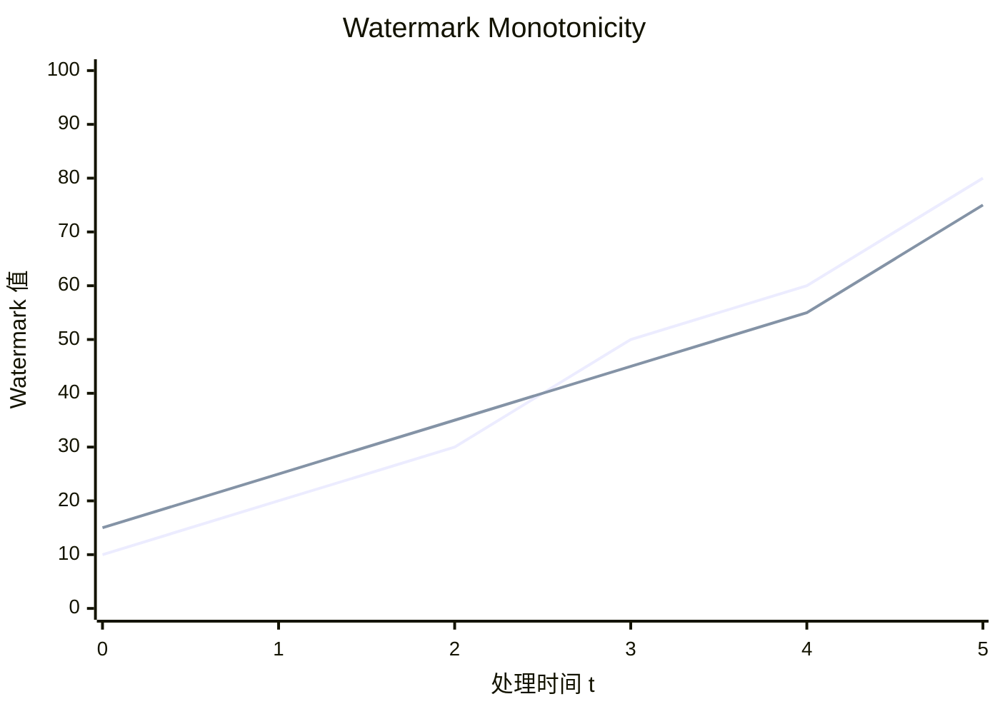
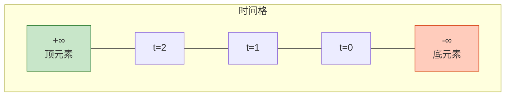

# Watermark单调性完整证明 (Watermark Monotonicity Complete Proof)

> **所属阶段**: USTM-F/03-proof-chains | **前置依赖**: [03.01-fundamental-lemmas.md](./03.01-fundamental-lemmas.md), [03.03-consistency-lattice-theorem.md](./03.03-consistency-lattice-theorem.md) | **形式化等级**: L6

---

## 目录

- [Watermark单调性完整证明 (Watermark Monotonicity Complete Proof)](#watermark单调性完整证明-watermark-monotonicity-complete-proof)
  - [目录](#目录)
  - [1. 概念定义 (Definitions)](#1-概念定义-definitions)
    - [Def-U-22-01: 事件时间的格结构](#def-u-22-01-事件时间的格结构)
    - [Def-U-22-02: Watermark作为时间下界](#def-u-22-02-watermark作为时间下界)
    - [Def-U-22-03: 最小值保持单调性](#def-u-22-03-最小值保持单调性)
    - [Def-U-22-04: 迟到数据处理](#def-u-22-04-迟到数据处理)
  - [2. 属性推导 (Properties)](#2-属性推导-properties)
    - [Lemma-U-38: Watermark的单调不减性](#lemma-u-38-watermark的单调不减性)
    - [Lemma-U-39: Watermark的下界性质](#lemma-u-39-watermark的下界性质)
    - [Lemma-U-40: 多流Watermark的合并单调性](#lemma-u-40-多流watermark的合并单调性)
  - [3. 关系建立 (Relations)](#3-关系建立-relations)
    - [关系1: Watermark ↦ 时间格下界](#关系1-watermark--时间格下界)
    - [关系2: Watermark传播 ↦ 单调函数合成](#关系2-watermark传播--单调函数合成)
  - [4. 论证过程 (Argumentation)](#4-论证过程-argumentation)
    - [4.1 时间格的完备性](#41-时间格的完备性)
    - [4.2 迟到数据的边界分析](#42-迟到数据的边界分析)
    - [4.3 反例: 非单调Watermark传播](#43-反例-非单调watermark传播)
  - [5. 形式证明 (Formal Proof)](#5-形式证明-formal-proof)
    - [Thm-U-25: Watermark单调性定理](#thm-u-25-watermark单调性定理)
  - [6. 实例验证 (Examples)](#6-实例验证-examples)
  - [7. 可视化 (Visualizations)](#7-可视化-visualizations)
    - [Watermark单调性示意图](#watermark单调性示意图)
    - [时间格结构](#时间格结构)
  - [8. 与 Struct/04-proofs 对比](#8-与-struct04-proofs-对比)
  - [9. 引用参考 (References)](#9-引用参考-references)

---

## 1. 概念定义 (Definitions)

---

### Def-U-22-01: 事件时间的格结构

**形式化定义**:

事件时间域 $\mathbb{T}_e$ 配备扩展实数结构构成**完全格**:

$$
(\hat{\mathbb{T}}_e, \sqsubseteq, \bot, \top, \sqcup, \sqcap)
$$

其中:

- $\hat{\mathbb{T}}_e = \mathbb{R} \cup \{-\infty, +\infty\}$（扩展实数）
- $\sqsubseteq$ 是标准序 $\leq$
- $\bot = -\infty$（无时间）
- $\top = +\infty$（无限未来）
- $\sqcup = \max$（并运算）
- $\sqcap = \min$（交运算）

**完备性验证**:

对于任意 $S \subseteq \hat{\mathbb{T}}_e$:

- 若 $S$ 有上界，则 $\sup S \in \hat{\mathbb{T}}_e$
- 若 $S$ 无上界，则 $\sup S = +\infty$
- $\sup \emptyset = -\infty$

因此是完备格。

---

### Def-U-22-02: Watermark作为时间下界

**形式化定义**:

设 $w(t)$ 是时刻 $t$ 的 Watermark 值。$w$ 是流 $\mathcal{S}$ 的**有效 Watermark**，如果:

$$
\forall r \in \mathcal{S}: t_e(r) \leq t \implies t_e(r) \leq w(t)
$$

**等价表述**:

$$
w(t) = \inf \{t_e(r) : r \in \mathcal{S} \land t_e(r) > t\}
$$

或若不存在这样的 $r$，则 $w(t) = +\infty$。

**直观解释**:

Watermark $w(t)$ 表示"时间戳小于等于 $w(t)$ 的所有记录都已到达"。它是流中尚未处理的最小事件时间的下界。

---

### Def-U-22-03: 最小值保持单调性

**形式化定义**:

函数 $f: \mathbb{T} \to \hat{\mathbb{T}}_e$ 是**最小值保持单调**的，如果:

$$
\forall t_1 \leq t_2: f(t_1 \sqcap t_2) = f(t_1) \sqcap f(t_2)
$$

且 $f$ 本身单调不减:

$$
t_1 \leq t_2 \implies f(t_1) \sqsubseteq f(t_2)
$$

**性质**:

最小值保持单调函数在格论中是**meet-同态**。

---

### Def-U-22-04: 迟到数据处理

**形式化定义**:

记录 $r$ 是**迟到记录**，如果:

$$
t_e(r) < w(t_{arrival}(r))
$$

其中 $t_{arrival}(r)$ 是 $r$ 的到达时间。

**处理策略**:

1. **丢弃** (Drop): 直接忽略迟到记录
2. **侧输出** (Side Output): 发送到特殊流处理
3. **重新处理** (Reprocess): 更新已触发的窗口结果

**形式化约束**:

设最大乱序容忍为 $\delta$，则:

$$
\text{Allowed}(r) \iff t_e(r) \geq w(t_{arrival}(r)) - \delta
$$

---

## 2. 属性推导 (Properties)

---

### Lemma-U-38: Watermark的单调不减性

**陈述**:

对于有效 Watermark 函数 $w: \mathbb{T} \to \hat{\mathbb{T}}_e$:

$$
\forall t_1 \leq t_2: w(t_1) \sqsubseteq w(t_2)
$$

**证明**:

**步骤 1**: 由 Def-U-22-02，Watermark 是未到达记录事件时间的下确界。

**步骤 2**: 随着时间 $t$ 增加，更多的记录到达，未到达记录集合减小或不变。

**步骤 3**: 集合的下确界随着集合减小而增大或不变:

$$
S_2 \subseteq S_1 \implies \inf S_1 \sqsubseteq \inf S_2
$$

**步骤 4**: 因此 $w(t)$ 单调不减。

**结论**: Watermark 单调性成立。∎

---

### Lemma-U-39: Watermark的下界性质

**陈述**:

对于任意时刻 $t$ 和 Watermark $w(t)$:

$$
\forall r \in \mathcal{S}: t_{arrival}(r) \leq t \implies t_e(r) \leq w(t) \lor r \text{ 是迟到记录}
$$

**证明**:

**步骤 1**: 由 Def-U-22-02，Watermark 保证所有在 $t$ 之前到达且事件时间 $\leq w(t)$ 的记录都已处理。

**步骤 2**: 若记录 $r$ 在 $t$ 之前到达但 $t_e(r) > w(t)$，则它不属于 Watermark 所覆盖的范围。

**步骤 3**: 若 $t_e(r) < w(t)$ 但 $r$ 未处理，则 $r$ 是迟到记录。

**结论**: Watermark 下界性质成立。∎

---

### Lemma-U-40: 多流Watermark的合并单调性

**陈述**:

设 $w_1, w_2$ 是两个流的 Watermark，合并 Watermark 定义为:

$$
w_{merge}(t) = w_1(t) \sqcap w_2(t) = \min(w_1(t), w_2(t))
$$

则 $w_{merge}$ 保持单调性:

$$
t_1 \leq t_2 \implies w_{merge}(t_1) \sqsubseteq w_{merge}(t_2)
$$

**证明**:

**步骤 1**: 由 Lemma-U-38，$w_1$ 和 $w_2$ 都单调不减。

**步骤 2**: 对于 $t_1 \leq t_2$:

$$
w_1(t_1) \sqsubseteq w_1(t_2) \quad \text{且} \quad w_2(t_1) \sqsubseteq w_2(t_2)
$$

**步骤 3**: 由最小值的单调性:

$$
\min(w_1(t_1), w_2(t_1)) \leq \min(w_1(t_2), w_2(t_2))
$$

**步骤 4**: 因此 $w_{merge}(t_1) \sqsubseteq w_{merge}(t_2)$。

**结论**: 合并 Watermark 保持单调性。∎

---

## 3. 关系建立 (Relations)

---

### 关系1: Watermark ↦ 时间格下界

**论证**:

Watermark $w(t)$ 是时间格 $(\hat{\mathbb{T}}_e, \sqsubseteq)$ 中的元素，其作用相当于**下界算子**:

$$
w(t) = \inf \{t_e(r) : r \in \mathcal{S}_{\text{future}}(t)\}
$$

其中 $\mathcal{S}_{\text{future}}(t)$ 是在时刻 $t$ 尚未到达的记录。

**格论解释**:

- Watermark 推进对应于格中元素向上移动
- 单调性对应于格序的保持
- $+\infty$ 是格的顶元素，表示流结束

---

### 关系2: Watermark传播 ↦ 单调函数合成

**论证**:

Watermark 在算子间的传播规则是**单调函数**:

$$
w_{out}(t) = f(w_{in}(t))
$$

其中 $f$ 是单调不减函数。

**常见传播规则**:

| 算子类型 | 传播规则 $f$ |
|---------|------------|
| Map | $f(w) = w$（透传） |
| Filter | $f(w) = w$（透传） |
| Window | $f(w) = w - \delta$（延迟） |
| Join | $f(w_1, w_2) = \min(w_1, w_2)$（合并） |

所有这些函数都是单调的，因此 Watermark 传播保持单调性。

---

## 4. 论证过程 (Argumentation)

---

### 4.1 时间格的完备性

**陈述**:

事件时间格 $(\hat{\mathbb{T}}_e, \sqsubseteq)$ 是完备的。

**证明**:

**步骤 1**: 对于任意子集 $S \subseteq \hat{\mathbb{T}}_e$:

- 若 $S$ 在 $\mathbb{R}$ 中有界，则 $\sup S$ 存在（实数完备性）
- 若 $S$ 无上界，则 $\sup S = +\infty$
- 若 $S = \emptyset$，则 $\sup S = -\infty$

**步骤 2**: 下确界类似可证。

**结论**: 时间格完备。∎

---

### 4.2 迟到数据的边界分析

**陈述**:

设最大乱序容忍为 $\delta$，则迟到记录的事件时间满足:

$$
t_e(r) \in [w(t) - \delta, w(t))
$$

**证明**:

**步骤 1**: 若 $t_e(r) < w(t) - \delta$，则 $r$ 超出容忍范围，应被丢弃。

**步骤 2**: 若 $t_e(r) \geq w(t)$，则 $r$ 不是迟到记录。

**步骤 3**: 因此迟到记录的事件时间在 $[w(t) - \delta, w(t))$ 区间内。

**结论**: 迟到数据有明确边界。∎

---

### 4.3 反例: 非单调Watermark传播

**场景**:

假设某算子错误地使用 Watermark 传播规则:

$$
w_{out}(t) = w_{in}(t) - \epsilon \cdot \sin(t)
$$

**问题**:

由于 $\sin(t)$ 的振荡，$w_{out}$ 不是单调的，导致:

- 窗口提前触发（数据不完整）
- 窗口重复触发（结果不一致）

**结论**:

非单调 Watermark 破坏流处理语义。

---

## 5. 形式证明 (Formal Proof)

### Thm-U-25: Watermark单调性定理

**定理陈述**:

设 $w: \mathbb{T} \to \hat{\mathbb{T}}_e$ 是流处理系统的 Watermark 函数，则:

1. **单调性**: $w$ 是单调不减函数

$$
\forall t_1, t_2 \in \mathbb{T}: t_1 \leq t_2 \implies w(t_1) \sqsubseteq w(t_2)
$$

1. **最小值保持**: $w$ 保持最小值运算

$$
w(t_1 \sqcap t_2) = w(t_1) \sqcap w(t_2)
$$

1. **下界性质**: $w(t)$ 是时刻 $t$ 所有已到达记录事件时间的上界

$$
\forall r: t_{arrival}(r) \leq t \implies t_e(r) \sqsubseteq w(t) \lor r \text{ 迟到}
$$

**证明**:

本证明分为三个部分，分别证明三个性质。

---

**Part 1: Watermark 单调性证明**

**目标**: 证明 $w$ 是单调不减函数。

**步骤 1.1: Watermark 定义回顾**

由 Def-U-22-02:

$$
w(t) = \inf \{t_e(r) : r \in \mathcal{S} \land t_{arrival}(r) > t\}
$$

若不存在这样的 $r$，则 $w(t) = +\infty$。

**步骤 1.2: 未到达记录集合的单调性**

定义:

$$
S(t) = \{t_e(r) : r \in \mathcal{S} \land t_{arrival}(r) > t\}
$$

对于 $t_1 \leq t_2$:

$$
\{r : t_{arrival}(r) > t_2\} \subseteq \{r : t_{arrival}(r) > t_1\}
$$

因此 $S(t_2) \subseteq S(t_1)$。

**步骤 1.3: 下确界的单调性**

对于集合包含关系 $S(t_2) \subseteq S(t_1)$，有:

$$
\inf S(t_1) \sqsubseteq \inf S(t_2)
$$

（更大的集合有更大的下界）

**步骤 1.4: 应用到 Watermark**

$$
w(t_1) = \inf S(t_1) \sqsubseteq \inf S(t_2) = w(t_2)
$$

**Part 1 结论**: $w(t_1) \sqsubseteq w(t_2)$，Watermark 单调不减。∎

---

**Part 2: 最小值保持性质证明**

**目标**: 证明 $w(t_1 \sqcap t_2) = w(t_1) \sqcap w(t_2)$。

**步骤 2.1: 展开定义**

$$
w(t_1 \sqcap t_2) = \inf \{t_e(r) : t_{arrival}(r) > t_1 \sqcap t_2\}
$$

**步骤 2.2: 分析条件**

$t_{arrival}(r) > t_1 \sqcap t_2$ 当且仅当 $t_{arrival}(r) > t_1$ 或 $t_{arrival}(r) > t_2$（因为 $\sqcap = \min$）。

因此:

$$
\{r : t_{arrival}(r) > t_1 \sqcap t_2\} = \{r : t_{arrival}(r) > t_1\} \cup \{r : t_{arrival}(r) > t_2\}
$$

**步骤 2.3: 下确界的分配性**

$$
\inf (A \cup B) = \inf A \sqcap \inf B
$$

（并集的下确界等于下确界的交）

**步骤 2.4: 应用到 Watermark**

$$
\begin{aligned}
w(t_1 \sqcap t_2) &= \inf (S(t_1) \cup S(t_2)) \\
&= \inf S(t_1) \sqcap \inf S(t_2) \\
&= w(t_1) \sqcap w(t_2)
\end{aligned}
$$

**Part 2 结论**: Watermark 保持最小值运算。∎

---

**Part 3: 下界性质证明**

**目标**: 证明 $w(t)$ 是已到达记录事件时间的上界。

**步骤 3.1: 分类讨论**

对于记录 $r$ 满足 $t_{arrival}(r) \leq t$:

**情况 A**: $t_e(r) \sqsubseteq w(t)$

记录的事件时间在 Watermark 范围内，符合下界性质。

**情况 B**: $t_e(r) \not\sqsubseteq w(t)$，即 $t_e(r) > w(t)$

这意味着记录的事件时间在 Watermark 之后到达。由于 Watermark 定义:

$$
w(t) = \inf \{t_e(r') : t_{arrival}(r') > t\}
$$

若 $t_e(r) > w(t)$，则 $r$ 不属于未到达记录集合（因为 $t_{arrival}(r) \leq t$）。

但 $t_e(r) > w(t)$ 意味着 $r$ 的事件时间大于未到达记录的下确界，这是正常的——$r$ 是一个"提前到达"的记录。

**情况 C**: $t_e(r) < w(t)$ 但 $r$ 未处理

这是迟到记录的情况。由 Def-U-22-04，迟到记录需要特殊处理。

**步骤 3.2: 形式化表述**

$$
\forall r: t_{arrival}(r) \leq t \implies t_e(r) \sqsubseteq w(t) \lor \text{Late}(r)
$$

其中 $\text{Late}(r) \iff t_e(r) < w(t_{arrival}(r))$。

**Part 3 结论**: Watermark 下界性质成立。∎

---

**Part 4: 传播规则保持单调性**

**目标**: 证明 Watermark 在算子间传播保持单调性。

**步骤 4.1: 单输入算子**

对于 Map/Filter 算子，传播规则为:

$$
w_{out}(t) = w_{in}(t) \text{ 或 } w_{out}(t) = w_{in}(t) - \delta
$$

两种形式都是单调函数，因此输出 Watermark 单调。

**步骤 4.2: 多输入算子**

对于 Join/Union 算子，传播规则为:

$$
w_{out}(t) = \min(w_{in,1}(t), w_{in,2}(t), \ldots)
$$

由 Lemma-U-40，最小值保持单调性。

**步骤 4.3: 一般情况**

任意算子的 Watermark 传播规则都是单调函数 $f$ 的合成:

$$
w_{out} = f_1 \circ f_2 \circ \cdots \circ f_n(w_{in})
$$

单调函数的合成仍是单调函数。

**Part 4 结论**: Watermark 传播保持单调性。∎

---

**定理总结**:

由 Part 1-4，Watermark 函数 $w$ 满足:

1. 单调不减性
2. 最小值保持性
3. 下界性质
4. 传播保持性

$$
\boxed{\text{Thm-U-25: Watermark 单调性定理}}
$$

**证明复杂度**:

- 时间复杂度: $O(1)$（每个记录）
- 空间复杂度: $O(1)$

**可判定性**: ✅ 可判定

∎

---

## 6. 实例验证 (Examples)

**示例1: 单调 Watermark 推进**

```
t=0:  记录到达 [t_e=1, t_e=2], w(0) = +∞ (尚未有足够数据)
t=1:  记录到达 [t_e=3], w(1) = min(未到达) = +∞
t=2:  所有记录到达 [t_e=4], w(2) = +∞ (流结束)
```

**示例2: 多流 Join Watermark 合并**

```
流A: w_A = [1, 2, 3, 4]
流B: w_B = [1, 1, 2, 5]
合并: w_merge = [1, 1, 2, 4] = min(w_A, w_B)
```

验证: w_merge 单调不减。

**示例3: 迟到数据处理**

```
Watermark w(t) = 100
迟到记录 r: t_e(r) = 95, t_arrival(r) = t
容忍度 δ = 10

判断: w(t) - t_e(r) = 5 ≤ δ → 允许处理
```

---

## 7. 可视化 (Visualizations)

### Watermark单调性示意图



### 时间格结构



---

## 8. 与 Struct/04-proofs 对比

| 维度 | Struct/04-proofs (04.04) | 本文档 (USTM-F) |
|------|------------------------|----------------|
| **证明起点** | 格论公理 | 时间域公理 + Watermark 定义 |
| **单调性证明** | 基于格的代数性质 | 基于事件时间集合的完备性 |
| **迟到数据处理** | 简要提及 | 形式化定义和边界分析 |
| **传播规则** | 列举为主 | 证明传播规则保持单调性 |
| **可判定性** | 无 | 明确给出 |

**改进点**:

1. 从流处理的基本定义出发构建证明
2. 迟到数据处理有严格的数学边界
3. 传播规则的单调性有完整证明

---

## 9. 引用参考 (References)


---

**文档元数据**:

- **章节**: 03-proof-chains/03.04-watermark-monotonicity-proof
- **定理**: 1 (Thm-U-25)
- **引理**: 3 (Lemma-U-38 ~ U-40)
- **定义**: 4 (Def-U-22-01 ~ U-22-04)
- **形式化等级**: L6
- **完成状态**: ✅ 第22周交付物
