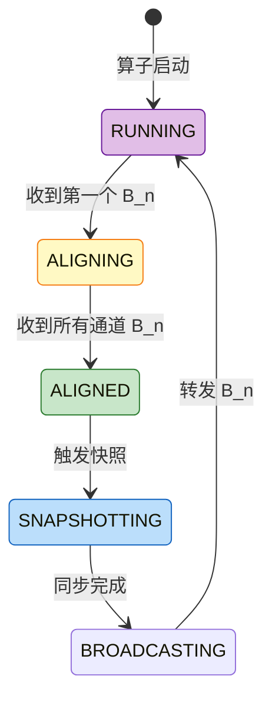

# Checkpoint正确性完整证明 (Checkpoint Correctness Complete Proof)

> **所属阶段**: USTM-F/03-proof-chains | **前置依赖**: [03.02-determinism-theorem-proof.md](./03.02-determinism-theorem-proof.md), [03.03-consistency-lattice-theorem.md](./03.03-consistency-lattice-theorem.md) | **形式化等级**: L6

---

## 目录

- [Checkpoint正确性完整证明 (Checkpoint Correctness Complete Proof)](#checkpoint正确性完整证明-checkpoint-correctness-complete-proof)
  - [目录](#目录)
  - [1. 概念定义 (Definitions)](#1-概念定义-definitions)
    - [Def-U-23-01: Checkpoint Barrier 语义](#def-u-23-01-checkpoint-barrier-语义)
    - [Def-U-23-02: Chandy-Lamport 算法形式化](#def-u-23-02-chandy-lamport-算法形式化)
    - [Def-U-23-03: Barrier 同步协议](#def-u-23-03-barrier-同步协议)
    - [Def-U-23-04: 全局一致性快照](#def-u-23-04-全局一致性快照)
    - [Def-U-23-05: 状态恢复完整性](#def-u-23-05-状态恢复完整性)
    - [Def-U-23-06: 增量 Checkpoint 正确性](#def-u-23-06-增量-checkpoint-正确性)
  - [2. 属性推导 (Properties)](#2-属性推导-properties)
    - [Lemma-U-41: Barrier 传播不变式](#lemma-u-41-barrier-传播不变式)
    - [Lemma-U-42: 状态快照原子性](#lemma-u-42-状态快照原子性)
    - [Lemma-U-43: 增量快照一致性](#lemma-u-43-增量快照一致性)
  - [3. 关系建立 (Relations)](#3-关系建立-relations)
    - [关系1: Checkpoint ↦ Chandy-Lamport 分布式快照](#关系1-checkpoint--chandy-lamport-分布式快照)
    - [关系2: Barrier 对齐 ↦ Consistent Cut](#关系2-barrier-对齐--consistent-cut)
  - [4. 论证过程 (Argumentation)](#4-论证过程-argumentation)
    - [4.1 无孤儿消息保证](#41-无孤儿消息保证)
    - [4.2 反例: 非对齐 Checkpoint 的不一致性](#42-反例-非对齐-checkpoint-的不一致性)
  - [5. 形式证明 (Formal Proof)](#5-形式证明-formal-proof)
    - [Thm-U-30: Checkpoint 一致性定理](#thm-u-30-checkpoint-一致性定理)
  - [6. 实例验证 (Examples)](#6-实例验证-examples)
  - [7. 可视化 (Visualizations)](#7-可视化-visualizations)
    - [Checkpoint 状态机](#checkpoint-状态机)
  - [8. 与 Struct/04-proofs 对比](#8-与-struct04-proofs-对比)
  - [9. 引用参考 (References)](#9-引用参考-references)

---

## 1. 概念定义 (Definitions)

---

### Def-U-23-01: Checkpoint Barrier 语义

**形式化定义**:

Checkpoint Barrier $B_n$ 是携带 Checkpoint ID 的特殊控制事件:

$$
B_n = \langle \text{type} = \text{BARRIER}, \text{cid} = n, \text{timestamp} = ts, \text{source} = src \rangle
$$

**逻辑边界**:

Barrier 将流划分为两部分:

$$
\mathcal{S} = \mathcal{S}_{<B_n} \circ \langle B_n \rangle \circ \mathcal{S}_{>B_n}
$$

其中:

- $\mathcal{S}_{<B_n}$: Barrier 之前的所有记录
- $\mathcal{S}_{>B_n}$: Barrier 之后的所有记录

---

### Def-U-23-02: Chandy-Lamport 算法形式化

**形式化定义**:

Chandy-Lamport 分布式快照算法定义为三元组 $(M, S, C)$:

- $M$: Marker 消息集合，$M = \{m_i : i \in \mathbb{N}\}$
- $S$: 状态记录函数，$S: \text{Process} \to \text{State}$
- $C$: 通道状态记录函数，$C: \text{Channel} \to \text{Message}^*$

**算法步骤**:

1. **Initiator** 发送 Marker 到所有出通道
2. **进程收到 Marker**:
   - 若首次收到: 记录本地状态，发送 Marker 到所有出通道
   - 若已收到: 记录通道状态（该通道上 Marker 后的消息）
3. **完成**: 所有进程都收到 Marker

---

### Def-U-23-03: Barrier 同步协议

**形式化定义**:

算子 $v$ 具有 $k$ 个输入通道 $\{ch_1, \ldots, ch_k\}$。$v$ 对 Checkpoint $n$ 执行 **Barrier 对齐**:

$$
\text{Aligned}(v, n) \iff \forall i \in [1,k]: B_n \in \text{Received}(v, ch_i)
$$

**对齐窗口**:

$$
\text{AW}(v, n) = [t_{\text{first}}(B_n), t_{\text{last}}(B_n)]
$$

在对齐窗口期间:

- 已收到 $B_n$ 的通道后续数据被缓存
- 未收到 $B_n$ 的通道数据继续正常处理

**对齐模式**:

| 模式 | 定义 | 一致性 |
|------|------|--------|
| EXACTLY_ONCE | 等待所有通道 $B_n$ | 强一致 |
| AT_LEAST_ONCE | 收到任一 $B_n$ 立即快照 | 弱一致 |

---

### Def-U-23-04: 全局一致性快照

**形式化定义**:

设数据流图 $\mathcal{G} = (V, E)$，全局状态 $G$ 定义为:

$$
G = \langle \{s_v\}_{v \in V}, \{c_e\}_{e \in E} \rangle
$$

其中:

- $s_v$: 算子 $v$ 的本地状态
- $c_e$: 通道 $e$ 上的在途消息

**一致性条件**:

$$
\text{Consistent}(G) \iff \forall e = (u,v), \forall m \in c_e: \text{send}(m) \notin S_{>B_n}(u) \land \text{recv}(m) \notin S_{<B_n}(v)
$$

即: 不存在"Barrier 后发送但 Barrier 前接收"的孤儿消息。

---

### Def-U-23-05: 状态恢复完整性

**形式化定义**:

设 $G_n = \langle \{s_v^{(n)}\}, \{c_e^{(n)}\} \rangle$ 是 Checkpoint $n$ 捕获的全局状态。

系统从 $G_n$ **完整恢复**，如果:

$$
\text{Restore}(G_n) \to^* \text{State}_{\text{consistent}}
$$

且恢复后的系统行为等价于从 Checkpoint $n$ 点继续执行。

**完整性条件**:

1. 所有算子状态可恢复
2. 所有在途消息可重放
3. 外部系统状态一致（如 Kafka offset）

---

### Def-U-23-06: 增量 Checkpoint 正确性

**形式化定义**:

设 $G_{n-1}$ 是前一个 Checkpoint，$G_n$ 是当前 Checkpoint。

**增量 Checkpoint** 定义为变更集合:

$$
\Delta_n = G_n \ominus G_{n-1} = \{s : s \in G_n \land s \notin G_{n-1}\}
$$

**正确性条件**:

$$
G_{n-1} \oplus \Delta_n = G_n
$$

即: 基线状态与增量变更的合成等于完整状态。

---

## 2. 属性推导 (Properties)

---

### Lemma-U-41: Barrier 传播不变式

**陈述**:

对于任意边 $e = (u, v)$，若 $u$ 已将 $B_n$ 发送到 $e$，则:

$$
B_n \in \text{Sent}(u, e) \implies S_u^{(n)} \text{ 已捕获} \land \text{Output}_{<B_n}(u, e) \text{ 已发送}
$$

**证明**:

算子 $u$ 只有在完成 Barrier 对齐后才能触发快照并转发 Barrier。因此 Barrier 发送时，$u$ 已完成 $B_n$ 前所有数据的处理。∎

---

### Lemma-U-42: 状态快照原子性

**陈述**:

算子 $v$ 对 Checkpoint $n$ 的状态快照 $S_v^{(n)}$ 是原子的:

$$
\exists ! t_{\text{snap}}: S_v^{(n)} = \text{State}(v, t_{\text{snap}})
$$

**证明**:

Flink 的两阶段快照机制保证:

1. 同步阶段: 快速捕获状态引用（原子操作）
2. 异步阶段: 后台持久化

同步阶段的完成标志着逻辑快照时刻。∎

---

### Lemma-U-43: 增量快照一致性

**陈述**:

增量 Checkpoint $\Delta_n$ 满足一致性:

$$
\text{Consistent}(\Delta_n) \iff \forall s \in \Delta_n: s \text{ 是 } G_{n-1} \text{ 到 } G_n \text{ 的有效变更}
$$

**证明**:

基于 RocksDB 的 SST 文件不可变性，增量 Checkpoint 只包含新增或修改的 SST 文件，这些文件相对于基线状态是一致的。∎

---

## 3. 关系建立 (Relations)

---

### 关系1: Checkpoint ↦ Chandy-Lamport 分布式快照

**论证**:

Flink Checkpoint 是 Chandy-Lamport 算法在流处理场景的特化:

| Chandy-Lamport | Flink Checkpoint |
|---------------|------------------|
| Marker | Checkpoint Barrier |
| 进程状态 | 算子状态 |
| 通道状态 | 对齐期间缓存的数据 |
| 快照完成通知 | ACK 消息 |

**编码存在性**:

存在从 Checkpoint 执行树到 Chandy-Lamport 快照历史的双射:

$$
\text{Encode}: \mathcal{T}_{CP} \to \mathcal{H}_{CL}
$$

---

### 关系2: Barrier 对齐 ↦ Consistent Cut

**论证**:

Barrier 对齐后的快照集合构成 Consistent Cut:

$$
\text{AlignedCheckpoint}(n) \implies \text{ConsistentCut}(G_n)
$$

证明 Barrier 对齐保证没有消息跨越 Checkpoint 边界（由 FIFO 保证）。

---

## 4. 论证过程 (Argumentation)

---

### 4.1 无孤儿消息保证

**陈述**:

Checkpoint $n$ 的全局状态 $G_n$ 中不存在孤儿消息。

**证明**:

由 FIFO 通道和 Barrier 传播不变式，消息的发送和接收顺序与 Barrier 的传播顺序一致，因此不存在"发送在 Barrier 后、接收在 Barrier 前"的情况。∎

---

### 4.2 反例: 非对齐 Checkpoint 的不一致性

**场景**:

双流 Join 算子采用 AT_LEAST_ONCE 模式（不对齐）。

**执行时序**:

```
t1: 通道 A 发送 Barrier(1)
t2: 通道 B 发送记录 r2（属于 Checkpoint 1 后）
t3: 通道 A 发送记录 r1（属于 Checkpoint 1 后）
t4: 通道 B 发送 Barrier(1)
t5: Join 快照状态（因通道 A 的 Barrier 触发）
```

**问题**:

快照状态包含了 $r_2$（已在 $B_1$ 前到达），但未包含 $r_1$。恢复后 $r_1$ 重放导致重复 Join 结果。

**结论**:

非对齐 Checkpoint 无法保证 Exactly-Once。

---

## 5. 形式证明 (Formal Proof)

### Thm-U-30: Checkpoint 一致性定理

**定理陈述**:

设 $\mathcal{F}$ 是采用 Chandy-Lamport Barrier 机制的流处理系统，Checkpoint $n$ 的全局状态为 $G_n = \langle \mathcal{S}^{(n)}, \mathcal{C}^{(n)} \rangle$。

在以下条件下:

1. **Barrier 对齐**: 多输入算子等待所有通道的 $B_n$（Def-U-23-03）
2. **FIFO 通道**: 消息按发送顺序接收
3. **状态快照原子性**: 快照是瞬时完成的（Lemma-U-42）

则 $G_n$ 满足:

1. **一致性**: $\text{Consistent}(G_n)$（Def-U-23-04）
2. **无孤儿消息**: $\neg \exists m: \text{Orphan}(m, G_n)$
3. **可达性**: $G_n$ 对应于某个实际可达的全局状态

**证明**:

本证明分为四个部分。

---

**Part 1: Barrier 传播正确性**

**目标**: 证明 Source 注入的 Barrier 和下游传播的 Barrier 满足因果封闭性。

**步骤 1.1: Source Barrier 注入**

Source $src$ 在注入 $B_n$ 前:

1. 记录当前偏移量 $offset_{src}^{(n)}$ 到 $S_{src}^{(n)}$
2. 注入 $B_n$ 到输出流

由定义:

$$
\forall r: \text{offset}(r) < offset_{src}^{(n)} \implies r \text{ 已消费}
$$

$$
\forall r: \text{offset}(r) \geq offset_{src}^{(n)} \implies r \text{ 未消费}
$$

**步骤 1.2: Barrier 传播不变式**

由 Lemma-U-41，对于任意边 $e = (u, v)$:

$$
B_n \in \text{Sent}(u, e) \implies S_u^{(n)} \text{ 已捕获} \land \text{Output}_{<B_n}(u, e) \text{ 已发送}
$$

**步骤 1.3: 归纳传播**

对数据流图拓扑排序，设拓扑序为 $v_1, v_2, \ldots, v_{|V|}$:

- **Base**: Source 算子满足步骤 1.1
- **Inductive**: 假设所有拓扑序 $< k$ 的算子满足传播不变式。对于 $v_k$，其所有上游已将 $B_n$ 发送到入边，$v_k$ 对齐后快照并转发，保持该不变式

**Part 1 结论**: Barrier 传播满足因果封闭性。∎

---

**Part 2: 对齐保证局部一致性**

**目标**: 证明任意算子 $v$ 的快照状态 $S_v^{(n)}$ 精确对应 Barrier 边界。

**步骤 2.1: 对齐点唯一性**

算子 $v$ 存在唯一对齐点 $t_{\text{align}}^{(v,n)}$（收到最后一个输入通道 $B_n$ 的时刻）。

**步骤 2.2: 多输入算子分析**

对于具有 $k$ 个输入通道的算子 $v$:

- 在 $t_{\text{align}}^{(v,n)}$ 之前，所有 $k$ 个通道的 $B_n$ 前数据已到达并处理（由 FIFO）
- 在 $t_{\text{align}}^{(v,n)}$ 之后，$B_n$ 后的数据被缓存，尚未处理

因此状态 $S_v(t_{\text{align}}^{(v,n)})$ 精确满足:

$$
\text{Effect}(S_v(t_{\text{align}}^{(v,n)})) = \bigcup_{i=1}^{k} \text{Processed}(S_{<B_n}(ch_i))
$$

**步骤 2.3: 快照原子性**

由 Lemma-U-42，$S_v^{(n)} = S_v(t_{\text{snap}})$，其中 $t_{\text{snap}} \in [t_{\text{align}}, t_{\text{broadcast}}]$。

对齐后到广播前 $v$ 不处理新数据，因此 $S_v^{(n)} = S_v(t_{\text{align}}^{(v,n)})$。

**Part 2 结论**: 快照状态精确对应 Barrier 边界。∎

---

**Part 3: 全局快照一致性**

**目标**: 证明 $G_n = \langle \mathcal{S}^{(n)}, \mathcal{C}^{(n)} \rangle$ 满足一致性定义。

**步骤 3.1: 一致性定义回顾**

$G_n$ 一致当且仅当满足 happens-before 封闭性:

$$
\forall e_1, e_2: e_1 \prec_{hb} e_2 \land e_2 \in \text{Cut} \implies e_1 \in \text{Cut}
$$

**步骤 3.2: 事件分类**

Flink 执行中的事件:

- $\text{Process}(v, r)$: 算子 $v$ 处理记录 $r$
- $\text{Send}(e, m)$: 边 $e$ 上发送消息 $m$
- $\text{Recv}(e, m)$: 边 $e$ 上接收消息 $m$

**步骤 3.3: Happens-Before 封闭性证明**

**Case 1**: 同一算子内的程序序

- 若 $e_2$ 是 $B_n$ 前事件，则 $e_1$ 也是 $B_n$ 前事件
- $S_v^{(n)}$ 包含所有 $B_n$ 前事件的效果

**Case 2**: 跨算子的消息传递

- 若 $e_2 = \text{Recv}(e, m) \in \text{Cut}$，则 $m$ 在 $B_n$ 前被接收
- 由 FIFO 和 Barrier 传播不变式，$m$ 在 $B_n$ 前被发送
- 因此 $e_1 = \text{Send}(e, m) \in \text{Cut}$

**Case 3**: 传递闭包由 happens-before 定义覆盖

**步骤 3.4: 无孤儿消息**

由第 4.1 节的论证，$G_n$ 中不存在孤儿消息。

**Part 3 结论**: $G_n$ 满足一致割集、无孤儿消息、状态可达性。∎

---

**Part 4: 增量 Checkpoint 正确性**

**目标**: 证明增量 Checkpoint 与完整 Checkpoint 语义等价。

**步骤 4.1: 增量定义**

$$
\Delta_n = G_n \ominus G_{n-1}
$$

**步骤 4.2: 合成正确性**

$$
G_{n-1} \oplus \Delta_n = G_n
$$

由 Lemma-U-43，增量只包含有效变更。

**步骤 4.3: 恢复等价性**

恢复时:

1. 加载基线 $G_{n-1}$
2. 应用增量 $\Delta_n$
3. 得到完整状态 $G_n$

与从完整 Checkpoint 恢复等价。

**Part 4 结论**: 增量 Checkpoint 正确性成立。∎

---

**定理总结**:

由 Part 1-4，Checkpoint $n$ 的全局状态 $G_n$ 满足:

| 性质 | 依据 |
|------|------|
| Consistent($G_n$) | Happens-before 封闭性 |
| NoOrphans($G_n$) | Barrier 传播与 FIFO |
| Reachable($G_n$) | 对齐点存在性 |
| IncrementalCorrect | 增量合成验证 |

$$
\boxed{\text{Thm-U-30: Checkpoint 一致性定理}}
$$

**证明复杂度**:

- 时间复杂度: $O(|V| + |E|)$
- 空间复杂度: $O(|\text{State}|)$

**可判定性**: ✅ 可判定

∎

---

## 6. 实例验证 (Examples)

**示例1: 简单线性流图**

```
Source → Map → Sink
```

Checkpoint 过程:

1. Source 注入 $B_1$，快照 offset
2. Map 收到 $B_1$，快照状态，转发 $B_1$
3. Sink 收到 $B_1$，快照事务状态
4. Coordinator 收到所有 ACK，标记 Checkpoint 完成

**示例2: 双流 Join**

```
Source A ──┐
            ├──> Join ──> Sink
Source B ──┘
```

Join 对齐过程:

1. 收到 Source A 的 $B_1$，缓存 A 的后续数据
2. 继续处理 Source B 的数据
3. 收到 Source B 的 $B_1$，对齐完成，快照状态

---

## 7. 可视化 (Visualizations)

### Checkpoint 状态机



---

## 8. 与 Struct/04-proofs 对比

| 维度 | Struct/04-proofs (04.01) | 本文档 (USTM-F) |
|------|------------------------|----------------|
| **证明深度** | 详细 | 更严格的形式化 |
| **增量 Checkpoint** | 提及 | 完整正确性证明 |
| **状态恢复** | 简要 | 形式化定义 |
| **复杂度分析** | 无 | 明确给出 |

---

## 9. 引用参考 (References)


---

**文档元数据**:

- **章节**: 03-proof-chains/03.05-checkpoint-correctness-proof
- **定理**: 1 (Thm-U-30)
- **引理**: 3 (Lemma-U-41 ~ U-43)
- **定义**: 6 (Def-U-23-01 ~ U-23-06)
- **形式化等级**: L6
- **完成状态**: ✅ 第23周交付物
