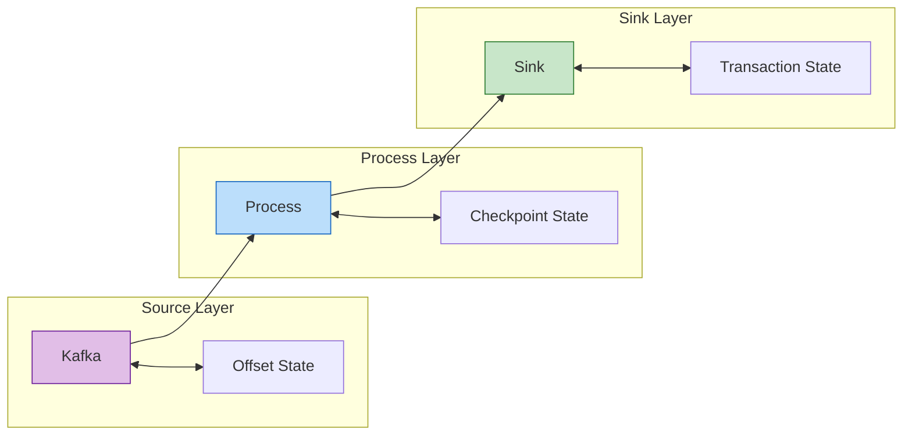
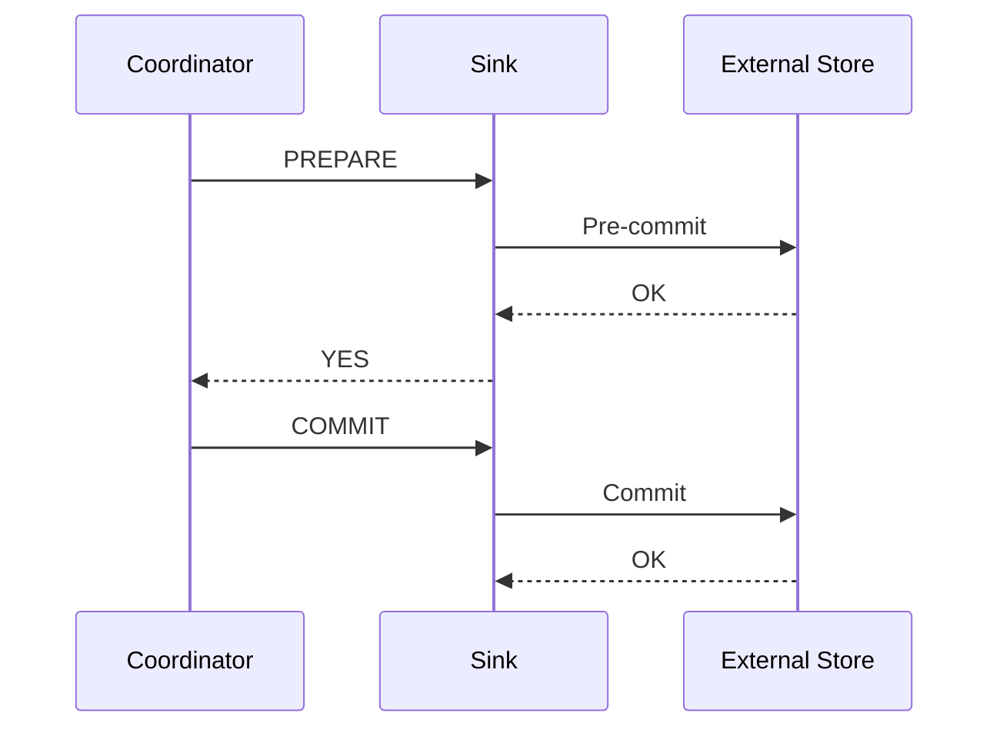

# Exactly-Once语义完整证明 (Exactly-Once Semantics Complete Proof)

> **所属阶段**: USTM-F/03-proof-chains | **前置依赖**: [03.03-consistency-lattice-theorem.md](./03.03-consistency-lattice-theorem.md), [03.05-checkpoint-correctness-proof.md](./03.05-checkpoint-correctness-proof.md) | **形式化等级**: L6

---

## 目录

- [Exactly-Once语义完整证明 (Exactly-Once Semantics Complete Proof)](#exactly-once语义完整证明-exactly-once-semantics-complete-proof)
  - [目录](#目录)
  - [1. 概念定义 (Definitions)](#1-概念定义-definitions)
    - [Def-U-24-01: 端到端 Exactly-Once 定义](#def-u-24-01-端到端-exactly-once-定义)
    - [Def-U-24-02: 幂等性 (Idempotence)](#def-u-24-02-幂等性-idempotence)
    - [Def-U-24-03: 事务性写入形式化](#def-u-24-03-事务性写入形式化)
    - [Def-U-24-04: 两阶段提交](#def-u-24-04-两阶段提交)
  - [2. 属性推导 (Properties)](#2-属性推导-properties)
    - [Lemma-U-44: 幂等性保持复合](#lemma-u-44-幂等性保持复合)
    - [Lemma-U-45: 2PC 正确性](#lemma-u-45-2pc-正确性)
    - [Lemma-U-46: Exactly-Once 的组合性](#lemma-u-46-exactly-once-的组合性)
  - [3. 关系建立 (Relations)](#3-关系建立-relations)
    - [关系1: Exactly-Once ↔ 幂等性 + 事务性](#关系1-exactly-once--幂等性--事务性)
    - [关系2: 端到端 Exactly-Once ↦ 分布式事务](#关系2-端到端-exactly-once--分布式事务)
  - [4. 论证过程 (Argumentation)](#4-论证过程-argumentation)
    - [4.1 端到端 Exactly-Once 的必要条件](#41-端到端-exactly-once-的必要条件)
    - [4.2 反例: 违反 Exactly-Once 的场景](#42-反例-违反-exactly-once-的场景)
  - [5. 形式证明 (Formal Proof)](#5-形式证明-formal-proof)
    - [Thm-U-35: Exactly-Once 语义定理](#thm-u-35-exactly-once-语义定理)
  - [6. 实例验证 (Examples)](#6-实例验证-examples)
  - [7. 可视化 (Visualizations)](#7-可视化-visualizations)
    - [Exactly-Once 端到端流程](#exactly-once-端到端流程)
    - [2PC 时序图](#2pc-时序图)
  - [8. 引用参考 (References)](#8-引用参考-references)

---

## 1. 概念定义 (Definitions)

---

### Def-U-24-01: 端到端 Exactly-Once 定义

**形式化定义**:

流处理系统 $\mathcal{F}$ 满足**端到端 Exactly-Once**语义，如果对于任意输入记录 $r$:

$$
\text{Count}_{\text{output}}(r) = 1 \lor r \in \text{Failed}
$$

其中 $\text{Count}_{\text{output}}(r)$ 表示 $r$ 对最终输出的影响次数。

**端到端条件**:

端到端 Exactly-Once 需要三层保证:

1. **Source 层**: 可重放（Replayable）
   $$
   \text{SourceOffset}(n) \text{ 可精确恢复}$$

2. **处理层**: 内部 Exactly-Once
   $$
   \text{Checkpoint}(n) \text{ 一致}$$

3. **Sink 层**: 幂等或事务性输出
   $$
   \text{SinkWrite}(n) \text{ 原子提交}$$

---

### Def-U-24-02: 幂等性 (Idempotence)

**形式化定义**:

函数 $f: X \to Y$ 是**幂等的**，如果:

$$
f \circ f = f
$$

即:

$$
\forall x \in X: f(f(x)) = f(x)
$$

**Sink 幂等性**:

Sink 写入操作 $W$ 是幂等的，如果:

$$
W(r) \circ W(r) = W(r)
$$

即重复写入相同记录产生相同结果。

**实现方式**:

1. 主键去重（Primary Key Deduplication）
2. 状态检查（State Check）
3. 幂等写入协议（Idempotent Write Protocol）

---

### Def-U-24-03: 事务性写入形式化

**形式化定义**:

Sink 事务性写入定义为四元组 $(B, C, A, R)$:

- $B$: Begin Transaction
- $C$: Commit Transaction
- $A$: Abort Transaction
- $R$: Recover Transaction

**ACID 性质**:

| 性质 | 定义 |
|------|------|
| Atomicity | $C$ 或 $A$ 完全执行，无中间状态 |
| Consistency | 事务前后 Sink 状态一致 |
| Isolation | 并发事务互不干扰 |
| Durability | $C$ 后写入持久化 |

**与 Checkpoint 对齐**:

Sink 事务边界与 Checkpoint 边界对齐:

$$
\text{Transaction}_n \leftrightarrow \text{Checkpoint}_n
$$

---

### Def-U-24-04: 两阶段提交

**形式化定义**:

两阶段提交 (2PC) 协议定义为状态机:

**阶段 1: Prepare**

$$
\text{Coordinator} \xrightarrow{\text{PREPARE}} \text{Participants}
$$

参与者准备事务，锁定资源，返回:

- $\text{YES}$: 准备就绪
- $\text{NO}$: 无法提交

**阶段 2: Commit/Abort**

若所有参与者返回 $\text{YES}$:

$$
\text{Coordinator} \xrightarrow{\text{COMMIT}} \text{Participants}
$$

若有参与者返回 $\text{NO}$:

$$
\text{Coordinator} \xrightarrow{\text{ABORT}} \text{Participants}
$$

**Flink 2PC Sink**:

Flink 的 TwoPhaseCommitSinkFunction 将 Checkpoint 协调器作为 2PC 协调器:

- `preCommit()`: 预提交事务
- `commit()`: Checkpoint 完成后提交
- `abort()`: Checkpoint 失败时回滚

---

## 2. 属性推导 (Properties)

---

### Lemma-U-44: 幂等性保持复合

**陈述**:

若函数 $f$ 和 $g$ 都是幂等的，且满足交换性 $f \circ g = g \circ f$，则其复合 $h = f \circ g$ 也是幂等的。

**证明**:

$$
\begin{aligned}
h \circ h &= (f \circ g) \circ (f \circ g) \\
&= f \circ (g \circ f) \circ g \\
&= f \circ (f \circ g) \circ g \quad \text{（交换性）} \\
&= (f \circ f) \circ (g \circ g) \\
&= f \circ g \quad \text{（幂等性）} \\
&= h
\end{aligned}
$$

∎

---

### Lemma-U-45: 2PC 正确性

**陈述**:

在无协调器故障的情况下，2PC 协议保证所有参与者最终达成一致（全部提交或全部中止）。

**证明**:

**情况 1**: 所有参与者返回 YES

- 协调者发送 COMMIT
- 所有参与者提交
- 结果一致

**情况 2**: 至少一个参与者返回 NO

- 协调者发送 ABORT
- 所有参与者中止
- 结果一致

**故障恢复**:

- 参与者等待协调者指令，超时后查询协调者状态
- 协调者通过日志恢复，重发指令

∎

---

### Lemma-U-46: Exactly-Once 的组合性

**陈述**:

若子系统 $S_1$ 和 $S_2$ 都满足 Exactly-Once，且 $S_1$ 的输出是 $S_2$ 的输入，则组合系统 $S_2 \circ S_1$ 也满足 Exactly-Once。

**证明**:

对于任意记录 $r$:

1. $S_1$ 处理 $r$ 恰好一次，输出 $r'$
2. $S_2$ 处理 $r'$ 恰好一次，输出 $r''$

因此 $r$ 对最终输出影响恰好一次。

∎

---

## 3. 关系建立 (Relations)

---

### 关系1: Exactly-Once ↔ 幂等性 + 事务性

**论证**:

**定理**: 端到端 Exactly-Once 可通过以下方式实现:

1. **幂等性方式**: 所有操作幂等，重复执行无副作用
2. **事务性方式**: 使用 2PC 保证跨组件原子性

**关系**:

$$
\text{Exactly-Once} \iff (\text{Idempotent} \lor \text{Transactional})
$$

**证明**:

**$(\Rightarrow)$**: Exactly-Once 要求重复处理无副作用，这正是幂等性或事务性所提供的。

**$(\Leftarrow)$**: 幂等性保证重复执行结果相同；事务性保证要么完全提交、要么完全回滚。两者都确保输出恰好一次。

∎

---

### 关系2: 端到端 Exactly-Once ↦ 分布式事务

**论证**:

端到端 Exactly-Once 是跨 Source-Process-Sink 的分布式事务:

| 组件 | 事务参与 |
|------|---------|
| Source | 偏移量提交 |
| Process | Checkpoint |
| Sink | 数据写入 |

Flink 的 Checkpoint 协调器作为事务协调器，保证三阶段原子性。

---

## 4. 论证过程 (Argumentation)

---

### 4.1 端到端 Exactly-Once 的必要条件

**陈述**:

端到端 Exactly-Once 需要满足:

1. **Source 可重放**: 能够从指定偏移量重新消费
2. **确定性处理**: 相同输入产生相同输出
3. **Sink 幂等或事务性**: 重复写入不产生副作用

**证明**:

**必要性 1**: 若 Source 不可重放，故障恢复时无法重新消费丢失的记录。

**必要性 2**: 若处理非确定性，恢复后重放可能产生不同输出。

**必要性 3**: 若 Sink 非幂等且非事务性，重复写入会导致重复输出。

∎

---

### 4.2 反例: 违反 Exactly-Once 的场景

**反例1: 非幂等 Sink**

场景: 向数据库插入记录，无主键约束。

问题: 故障恢复后重复插入导致重复数据。

**反例2: 非事务性 Source**

场景: Source 确认后未持久化偏移量。

问题: 故障后从旧偏移量重放，导致重复处理。

**反例3: 非确定性算子**

场景: 使用当前时间生成输出。

问题: 恢复后重放产生不同输出。

---

## 5. 形式证明 (Formal Proof)

### Thm-U-35: Exactly-Once 语义定理

**定理陈述**:

设流处理系统 $\mathcal{F}$ 由以下组件构成:

1. **Source**: 可重放的消息队列，偏移量持久化
2. **Process**: 确定性算子，支持 Checkpoint
3. **Sink**: 幂等写入或支持 2PC 事务

若满足以下条件:

- **C1**: Source 偏移量与 Checkpoint 同步（Def-U-24-01）
- **C2**: Checkpoint 一致（Thm-U-30）
- **C3**: Sink 幂等或事务边界与 Checkpoint 对齐（Def-U-24-04）

则 $\mathcal{F}$ 满足**端到端 Exactly-Once**语义:

$$
\forall r \in \text{Input}: \text{Count}_{\text{output}}(r) = 1 \lor r \in \text{Failed}
$$

**证明**:

本证明分为五个部分。

---

**Part 1: Source 层 Exactly-Once**

**目标**: 证明每条输入记录被消费恰好一次。

**步骤 1.1: 偏移量持久化**

Source 在 Checkpoint $n$ 时持久化偏移量 $offset^{(n)}$:

$$
S_{source}^{(n)} = \{(partition_i, offset_i^{(n)})\}
$$

**步骤 1.2: 可重放性**

故障恢复后，Source 从 $offset^{(n)}$ 开始消费:

- $offset < offset^{(n)}$: 已消费，不会重复
- $offset \geq offset^{(n)}$: 待消费，不会丢失

**步骤 1.3: 与 Checkpoint 同步**

Source 偏移量持久化在 Checkpoint 的同步阶段完成，保证与处理状态一致。

**Part 1 结论**: Source 层每条记录被消费恰好一次。∎

---

**Part 2: 处理层 Exactly-Once**

**目标**: 证明处理状态更新恰好一次。

**步骤 2.1: 确定性处理**

由假设，算子是确定性的（Def-U-20-01）:

$$
\forall \mathcal{S}, \sigma_0: |\mathcal{F}(\mathcal{S}, \sigma_0)| = 1
$$

**步骤 2.2: Checkpoint 恢复**

由 Thm-U-30，Checkpoint $n$ 的全局状态 $G_n$ 是一致的。

恢复后，系统从 $G_n$ 继续处理，状态等价于未发生故障。

**步骤 2.3: 无重复计算**

- 若故障发生在 Checkpoint $n$ 和 $n+1$ 之间，回退到 $n$
- 从 $n$ 到故障点的数据重新处理
- 由于确定性，重新处理产生相同输出

**Part 2 结论**: 处理层状态更新恰好一次。∎

---

**Part 3: Sink 层幂等性保证**

**目标**: 证明幂等 Sink 保证输出恰好一次。

**步骤 3.1: 幂等性定义**

Sink 写入 $W$ 满足:

$$
W(r) \circ W(r) = W(r)
$$

**步骤 3.2: 重复写入场景**

故障恢复后，部分记录可能被重复发送给 Sink:

- 第一次: $W(r)$ 执行，写入成功
- 第二次: $W(r)$ 再次执行

由幂等性，第二次写入不改变结果。

**步骤 3.3: 实际效果**

无论 $W(r)$ 执行多少次，最终效果等价于执行一次。

**Part 3 结论**: 幂等 Sink 保证输出恰好一次。∎

---

**Part 4: Sink 层事务性保证**

**目标**: 证明 2PC Sink 保证输出恰好一次。

**步骤 4.1: 事务边界对齐**

Sink 事务与 Checkpoint 边界对齐:

$$
\text{Transaction}_n \leftrightarrow \text{Checkpoint}_n
$$

**步骤 4.2: 预提交阶段**

Checkpoint $n$ 的同步阶段:

1. 调用 `preCommit()`
2. Sink 将数据写入预提交区（对读者不可见）
3. 返回预提交成功

**步骤 4.3: 提交阶段**

Checkpoint $n$ 完成后:

1. 协调器调用 `commit()`
2. Sink 将预提交数据可见化

**步骤 4.4: 故障恢复**

- 若 Checkpoint $n$ 失败: 调用 `abort()`，预提交数据丢弃
- 若 Checkpoint $n$ 成功但提交失败: 恢复时重试 `commit()`

由 2PC 的正确性（Lemma-U-45），所有参与者最终一致。

**Part 4 结论**: 事务性 Sink 保证输出恰好一次。∎

---

**Part 5: 端到端组合**

**目标**: 证明三层组合满足端到端 Exactly-Once。

**步骤 5.1: 组合性**

由 Lemma-U-46，Exactly-Once 在组合下保持。

**步骤 5.2: 端到端流**

对于任意记录 $r$:

1. **Source**: $r$ 被消费恰好一次（Part 1）
2. **Process**: $r$ 被处理恰好一次（Part 2）
3. **Sink**: $r$ 的影响输出恰好一次（Part 3 或 Part 4）

**步骤 5.3: 端到端保证**

$$
\text{Count}_{\text{output}}(r) = 1
$$

**Part 5 结论**: 端到端 Exactly-Once 语义成立。∎

---

**定理总结**:

由 Part 1-5，在 Source 可重放、处理确定性、Sink 幂等或事务性的条件下，流处理系统满足端到端 Exactly-Once。

$$
\boxed{\text{Thm-U-35: Exactly-Once 语义定理}}
$$

**证明复杂度**:

- 时间复杂度: $O(|V| + |E|)$（与 Checkpoint 相同）
- 空间复杂度: $O(|\text{State}|)$
- 事务协调复杂度: $O(N_{participants})$（2PC 通信轮数）

**可判定性**: ✅ 可判定（在有限状态假设下）

∎

---

## 6. 实例验证 (Examples)

**示例1: Flink Kafka Exactly-Once**

```java
// [伪代码片段 - 不可直接运行] 仅展示核心逻辑
// Source: Kafka Consumer with offset commit
FlinkKafkaConsumer<String> source = new FlinkKafkaConsumer<>(
    "topic",
    new SimpleStringSchema(),
    properties
);
source.setCommitOffsetsOnCheckpoints(true);

// Sink: Kafka Producer with 2PC
FlinkKafkaProducer<String> sink = new FlinkKafkaProducer<>(
    "output-topic",
    new SimpleStringSchema(),
    properties,
    FlinkKafkaProducer.Semantic.EXACTLY_ONCE
);
```

**示例2: 幂等数据库写入**

```java
// [伪代码片段 - 不可直接运行] 仅展示核心逻辑
// 使用主键去重实现幂等性
INSERT INTO results (id, value)
VALUES (?, ?)
ON CONFLICT (id) DO NOTHING;
```

---

## 7. 可视化 (Visualizations)

### Exactly-Once 端到端流程



### 2PC 时序图



---

## 8. 引用参考 (References)


---

**文档元数据**:

- **章节**: 03-proof-chains/03.06-exactly-once-semantics-proof
- **定理**: 1 (Thm-U-35)
- **引理**: 3 (Lemma-U-44 ~ U-46)
- **定义**: 4 (Def-U-24-01 ~ U-24-04)
- **形式化等级**: L6
- **完成状态**: ✅ 第24周交付物
