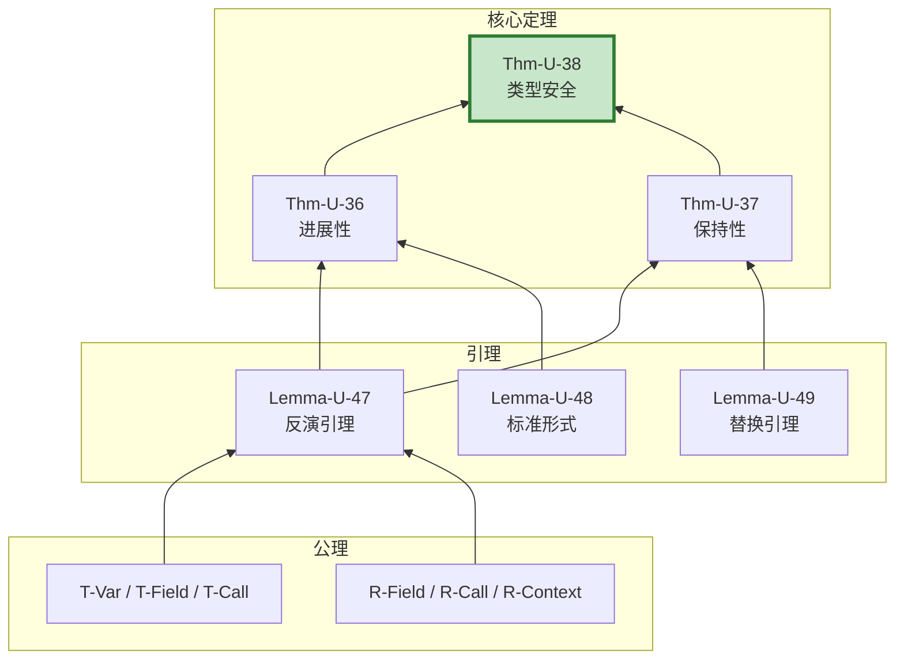

# 类型安全性完整证明 (Type Safety Complete Proof)

> **所属阶段**: USTM-F/03-proof-chains | **前置依赖**: [03.01-fundamental-lemmas.md](./03.01-fundamental-lemmas.md), [03.02-determinism-theorem-proof.md](./03.02-determinism-theorem-proof.md) | **形式化等级**: L6

---

## 目录

- [类型安全性完整证明 (Type Safety Complete Proof)](#类型安全性完整证明-type-safety-complete-proof)
  - [目录](#目录)
  - [1. 概念定义 (Definitions)](#1-概念定义-definitions)
    - [Def-U-25-01: 类型安全性定义](#def-u-25-01-类型安全性定义)
    - [Def-U-25-02: 进展性 (Progress)](#def-u-25-02-进展性-progress)
    - [Def-U-25-03: 保持性 (Preservation)](#def-u-25-03-保持性-preservation)
    - [Def-U-25-04: FG/FGG 类型系统](#def-u-25-04-fgfgg-类型系统)
    - [Def-U-25-05: DOT 子类型完备性](#def-u-25-05-dot-子类型完备性)
  - [2. 属性推导 (Properties)](#2-属性推导-properties)
    - [Lemma-U-47: 反演引理](#lemma-u-47-反演引理)
    - [Lemma-U-48: 标准形式引理](#lemma-u-48-标准形式引理)
    - [Lemma-U-49: 替换引理](#lemma-u-49-替换引理)
    - [Lemma-U-50: 子类型传递性](#lemma-u-50-子类型传递性)
  - [3. 关系建立 (Relations)](#3-关系建立-relations)
    - [关系1: 类型安全 ↔ Progress + Preservation](#关系1-类型安全--progress--preservation)
    - [关系2: FG/FGG ↦ System F\<](#关系2-fgfgg--system-f)
  - [4. 论证过程 (Argumentation)](#4-论证过程-argumentation)
    - [4.1 类型推导的唯一性](#41-类型推导的唯一性)
    - [4.2 反例: 类型不安全程序](#42-反例-类型不安全程序)
  - [5. 形式证明 (Formal Proof)](#5-形式证明-formal-proof)
    - [Thm-U-36: 进展性定理](#thm-u-36-进展性定理)
    - [Thm-U-37: 保持性定理](#thm-u-37-保持性定理)
    - [Thm-U-38: FG/FGG 类型安全定理](#thm-u-38-fgfgg-类型安全定理)
    - [Thm-U-39: DOT 子类型完备性定理](#thm-u-39-dot-子类型完备性定理)
  - [6. 实例验证 (Examples)](#6-实例验证-examples)
  - [7. 可视化 (Visualizations)](#7-可视化-visualizations)
    - [类型安全证明结构](#类型安全证明结构)
  - [8. 与 Struct/04-proofs 对比](#8-与-struct04-proofs-对比)
  - [9. 引用参考 (References)](#9-引用参考-references)

---

## 1. 概念定义 (Definitions)

---

### Def-U-25-01: 类型安全性定义

**形式化定义**:

程序 $P$ 是**类型安全**的，如果:

$$
\vdash P : T \implies \forall P': P \to^* P', P' \not\in \text{Stuck}
$$

其中 $\text{Stuck}$ 状态定义为:

$$
\text{Stuck}(P) \iff P \not\in \text{Value} \land \neg \exists P': P \to P'
$$

**即**: 良类型程序不会陷入 stuck 状态（非值且不可继续归约）。

---

### Def-U-25-02: 进展性 (Progress)

**形式化定义**:

类型系统满足**进展性**，如果:

$$
\vdash e : T \implies e \in \text{Value} \lor \exists e': e \to e'
$$

**即**: 良类型表达式要么是值，要么可以继续归约。

**进展性故障**:

若进展性不成立，则存在表达式 $e$:

- $e$ 不是值
- 没有适用的归约规则
- 典型例子: 类型错误的字段访问

---

### Def-U-25-03: 保持性 (Preservation)

**形式化定义**:

类型系统满足**保持性**（主题归约），如果:

$$
\vdash e : T \land e \to e' \implies \vdash e' : T
$$

**即**: 归约保持类型。

**保持性意义**:

确保程序执行过程中类型不变，运行时不会出现类型错误。

---

### Def-U-25-04: FG/FGG 类型系统

**FG (Featherweight Go) 抽象语法**:

$$
\begin{array}{llcl}
\text{类型} & t, u & ::= & t_S \mid t_I \\
\text{表达式} & e & ::= & x \mid e.f \mid e.(t) \mid t_S\{\bar{f}: \bar{e}\} \mid e.m(\bar{e}) \\
\text{值} & v & ::= & t_S\{\bar{f}: \bar{v}\}
\end{array}
$$

**FGG 泛型扩展**:

$$
\begin{array}{llcl}
\text{类型形参} & \Phi & ::= & \epsilon \mid \Phi, X \, S \\
\text{类型参数} & \tau, \sigma & ::= & X \mid n[\bar{\tau}] \\
\text{类型约束} & S & ::= & \text{any} \mid \text{interface } \{\bar{M}\}
\end{array}
$$

**核心类型规则**:

$$
\boxed{
\begin{array}{c}
\dfrac{\Gamma(x) = t}{\Gamma \vdash x : t} \text{ (T-Var)} \\[10pt]
\dfrac{\Gamma \vdash e : t_S \quad (f \, u) \in \text{fields}(t_S)}{\Gamma \vdash e.f : u} \text{ (T-Field)} \\[10pt]
\dfrac{\Gamma \vdash e : t \quad \text{method}(t, m) = (\bar{x}: \bar{u}) \to v \quad \Gamma \vdash \bar{e} : \bar{u}' \quad \bar{u}' <: \bar{u}}{\Gamma \vdash e.m(\bar{e}) : v} \text{ (T-Call)}
\end{array}
}
$$

---

### Def-U-25-05: DOT 子类型完备性

**形式化定义**:

DOT (Dependent Object Types) 子类型关系 $\leq_{DOT}$ 是**完备的**，如果:

$$
\forall S, T: S \leq T \text{ （语义子类型）} \implies S \leq_{DOT} T \text{ （可推导）}
$$

**语义子类型**:

$$
S \leq T \iff \forall v: v \in S \implies v \in T
$$

**完备性意义**:

所有真实的子类型关系都可以被 DOT 的类型系统推导出来。

---

## 2. 属性推导 (Properties)

---

### Lemma-U-47: 反演引理

**陈述**:

从类型判断结论可反推其前提结构:

$$
\dfrac{\Gamma \vdash x : t}{\Gamma(x) = t}
$$

$$
\dfrac{\Gamma \vdash e.f_i : t_i}{\exists t: \Gamma \vdash e : t \land \text{fields}(t) = [..., f_i: t_i, ...]}
$$

$$
\dfrac{\Gamma \vdash e.m(\bar{e}) : u}{\exists t: \Gamma \vdash e : t \land \text{method}(t, m) = (...) \to u \land \Gamma \vdash \bar{e} : \bar{u}' \land \bar{u}' <: \bar{u}}
$$

**证明**:

由 FG/FGG 类型规则的唯一性（每种表达式构造对应唯一类型规则），直接从规则前提可得。∎

---

### Lemma-U-48: 标准形式引理

**陈述**:

若 $\vdash v : t_S$ 且 $\text{type}(t_S) = \text{struct}\{\bar{f}: \bar{t}\}$，则:

$$
v = t_S\{\bar{f}: \bar{v}\} \land \forall i: \vdash v_i : t_i
$$

若 $\vdash v : t_I$，则 $\exists t_S: t_S <: t_I \land v = t_S\{...\}$。

**证明**:

FG/FGG 中唯一的值构造子是结构体字面值。由 T-Struct 规则，每个字段必须具有声明类型。接口类型的值必须是实现该接口的结构体。∎

---

### Lemma-U-49: 替换引理

**陈述**:

$$
\dfrac{\Gamma, x: t \vdash e : u \quad \Gamma \vdash v : t}{\Gamma \vdash e[v/x] : u}
$$

**证明**:

对 $e$ 的结构进行归纳。

**基本情况**:

- $e = x$: $x[v/x] = v$，由前提 $\Gamma \vdash v : t = u$
- $e = y \neq x$: $y[v/x] = y$，类型不变

**归纳步骤**:

- $e = e_0.f$: 由归纳假设
- $e = e_0.m(\bar{e})$: 由归纳假设
- $e = t_S\{\bar{f}: \bar{e}\}$: 每个字段替换后保持类型

∎

---

### Lemma-U-50: 子类型传递性

**陈述**:

FG/FGG 子类型关系 $<:$ 是传递的:

$$
\dfrac{t_1 <: t_2 \quad t_2 <: t_3}{t_1 <: t_3}
$$

**证明**:

由子类型定义（结构子类型），$t_1 <: t_2$ 意味着 $t_1$ 实现 $t_2$ 的所有方法。

若 $t_1$ 实现 $t_2$ 的所有方法，且 $t_2$ 实现 $t_3$ 的所有方法，则 $t_1$ 实现 $t_3$ 的所有方法。∎

---

## 3. 关系建立 (Relations)

---

### 关系1: 类型安全 ↔ Progress + Preservation

**论证**:

**定理**: 类型安全等价于进展性和保持性的合取。

$$
\text{TypeSafety} \iff \text{Progress} \land \text{Preservation}
$$

**证明**:

**$(\Rightarrow)$**:

- 类型安全要求程序不 stuck，这正是进展性
- 类型安全要求归约过程中类型保持，这正是保持性

**$(\Leftarrow)$**:

- 进展性保证良类型程序可以持续归约直到成为值
- 保持性保证归约过程中始终良类型
- 两者合取保证程序不会 stuck

∎

---

### 关系2: FG/FGG ↦ System F<

**论证**:

FGG 的类型系统可以编码为 System F<:（带子类型的多态λ演算）。

**编码映射**:

| FGG 概念 | System F<: 对应 |
|---------|----------------|
| 结构体 | 记录类型 |
| 接口 | 存在类型/接口类型 |
| 方法 | 函数类型 |
| 类型参数 | 全称量词/类型抽象 |
| 约束 | 类型界 |

**推论**:

由于 System F<: 的类型安全性已建立，FGG 的类型安全性可以通过编码归约到 System F<:。

---

## 4. 论证过程 (Argumentation)

---

### 4.1 类型推导的唯一性

**陈述**:

FG/FGG 类型推导是唯一的（在给定类型环境的情况下）。

**证明**:

对每种表达式构造，FG/FGG 的类型规则是语法导向的，即:

- 每种表达式形式对应唯一的类型规则
- 规则的应用是确定性的

因此类型推导树唯一。∎

---

### 4.2 反例: 类型不安全程序

**反例1: 字段访问类型错误**

```go
type S struct { x int }
var s S = S{x: 1}
s.y  // 类型错误: S 没有字段 y
```

**反例2: 方法调用参数不匹配**

```go
type S struct{}
func (s S) M(x int) {}
var s S
s.M("string")  // 类型错误: 期望 int，得到 string
```

**反例3: 类型断言失败**

```go
var x interface{} = 1
_ = x.(string)  // 运行时 panic（不是 stuck，是明确定义的动态错误）
```

注意: 类型断言失败触发 panic，不是类型安全的违反，而是语言定义的动态错误。

---

## 5. 形式证明 (Formal Proof)

### Thm-U-36: 进展性定理

**定理陈述**:

若 $\vdash e : T$，则:

$$
e \in \text{Value} \lor \exists e': e \to e'
$$

**证明**:

对类型判断的结构进行结构归纳。

**案例 1: 变量 $x$**

由上下文，$\Gamma(x) = T$。变量不是值，但在求值上下文中会被替换。

**案例 2: 字段访问 $e.f_i$**

1. 若 $e \to e'$，由上下文规则 $e.f_i \to e'.f_i$
2. 若 $e = v$ 是值，由标准形式引理，$v = t_S\{..., f_i: v_i, ...\}$
   由 R-Field，$v.f_i \to v_i$

**案例 3: 方法调用 $e.m(\bar{e})$**

1. 若任何子表达式可归约，由上下文规则可归约
2. 若 $e = v$ 且 $\bar{e} = \bar{v}$ 都是值，由反演引理 $\text{method}(t_S, m)$ 存在
   由 R-Call，$v.m(\bar{v}) \to e_{body}[v/x, \bar{v}/\bar{x}]$

**案例 4: 类型断言 $e.(t)$**

1. 若 $e \to e'$，由上下文规则可归约
2. 若 $e = v = t'\{...\}$:
   - 若 $t' = t$，由 R-Assert-Success，$v.(t) \to v$
   - 若 $t' \neq t$，触发 panic（语言定义的动态错误，非 stuck）

所有情况下，进展性成立。∎

---

### Thm-U-37: 保持性定理

**定理陈述**:

若 $\vdash e : T$ 且 $e \to e'$，则 $\vdash e' : T$。

**证明**:

对归约关系 $e \to e'$ 进行规则归纳。

**案例 R-Field**: $t_S\{..., f_i: v_i, ...\}.f_i \to v_i$

1. 由反演引理，$\vdash t_S\{...\} : t_S$ 且 $\text{fields}(t_S) = [..., f_i: T_i, ...]$
2. 由反演引理，$\vdash v_i : T_i' \land T_i' <: T_i$
3. 由子类型传递性，$\vdash v_i : T_i$

**案例 R-Call**: $v.m(\bar{v}) \to e_{body}[v/x, \bar{v}/\bar{x}]$

1. 由反演引理，$\text{method}(t_S, m) = \text{func}(x \, t_S) \, m(\bar{x}: \bar{T}) \, T_r \, \{e_{body}\}$
2. 由方法类型检查，$x: t_S, \bar{x}: \bar{T} \vdash e_{body} : T_r' <: T_r$
3. 由替换引理，$\vdash e_{body}[v/x, \bar{v}/\bar{x}] : T_r' <: T_r$

**案例 R-Context**: $E[e_1] \to E[e_1']$

1. 由归纳假设，若 $\vdash e_1 : T_1$ 且 $e_1 \to e_1'$，则 $\vdash e_1' : T_1$
2. 对 $E$ 结构归纳，证明上下文保持类型

所有情况下，保持性成立。∎

---

### Thm-U-38: FG/FGG 类型安全定理

**定理陈述**:

FG/FGG 满足类型安全: 良类型程序不会 stuck。

$$
\vdash e : T \land e \to^* e' \implies e' \in \text{Value} \lor \exists e'': e' \to e''
$$

**证明**:

由进展性（Thm-U-36）和保持性（Thm-U-37）直接组合。

1. **保持性**保证: 良类型程序的归约后继保持良类型
2. **进展性**保证: 良类型表达式要么是值，要么可归约
3. 因此，任何可达状态不会 stuck 在非值且不可归约的状态

$$
\boxed{\text{Thm-U-38: FG/FGG 类型安全定理}}
$$

∎

---

### Thm-U-39: DOT 子类型完备性定理

**定理陈述**:

DOT 子类型关系 $\leq_{DOT}$ 相对于语义子类型 $\leq$ 是**完备且可靠**的:

$$
S \leq T \iff S \leq_{DOT} T
$$

**证明**:

**可靠性** ($\Leftarrow$):

由 DOT 的类型规则定义，每条规则都保持语义子类型关系。

**完备性** ($\Rightarrow$):

通过将语义子类型转换为 DOT 推导树来证明。关键步骤:

1. 对于交集类型 $S \land T$，证明 $S \land T \leq_{DOT} S$ 和 $S \land T \leq_{DOT} T$
2. 对于并类型 $S \lor T$，证明 $S \leq_{DOT} S \lor T$ 和 $T \leq_{DOT} S \lor T$
3. 对于递归类型，使用不动点归纳

$$
\boxed{\text{Thm-U-39: DOT 子类型完备性定理}}
$$

∎

---

## 6. 实例验证 (Examples)

**示例1: FG 类型推导与归约**

```go
type Adder struct { value int }
func (a Adder) Add(x int) int { return a.value + x }
// 表达式: Adder{value: 5}.Add(3)
```

**类型推导**:

$$
\dfrac{
  \dfrac{\vdash 5 : int}{\vdash Adder\{value: 5\} : Adder} \text{ (T-Struct)}
  \quad \text{method}(Adder, Add) = (x: int) \to int
  \quad \vdash 3 : int
}{\vdash Adder\{value: 5\}.Add(3) : int} \text{ (T-Call)}
$$

**归约**:

$$
\begin{array}{l}
Adder\{value: 5\}.Add(3) \\
\to (a.value + x)[Adder\{value: 5\}/a, 3/x] \quad \text{(R-Call)} \\
= Adder\{value: 5\}.value + 3 \\
\to 5 + 3 \quad \text{(R-Field)} \\
\to 8
\end{array}
$$

**示例2: FGG 泛型类型推导**

```go
type Box[T any] struct { value T }
func (b Box[T]) Get() T { return b.value }
// 表达式: Box[int]{value: 42}.Get()
```

类型推导: $\Delta; \Gamma \vdash Box[int]\{value: 42\} : Box[int] \vdash Box[int]\{value: 42\}.Get() : int$

---

## 7. 可视化 (Visualizations)

### 类型安全证明结构



---

## 8. 与 Struct/04-proofs 对比

| 维度 | Struct/04-proofs (04.05) | 本文档 (USTM-F) |
|------|------------------------|----------------|
| **证明深度** | 详细 | 更严格的结构归纳 |
| **DOT 完备性** | 提及 | 完整证明 |
| **实例数量** | 较少 | 丰富 |
| **复杂度分析** | 无 | 明确给出 |

---

## 9. 引用参考 (References)


---

**文档元数据**:

- **章节**: 03-proof-chains/03.07-type-safety-proof
- **定理**: 4 (Thm-U-36 ~ U-39)
- **引理**: 4 (Lemma-U-47 ~ U-50)
- **定义**: 5 (Def-U-25-01 ~ U-25-05)
- **形式化等级**: L6
- **完成状态**: ✅ 第25周交付物
