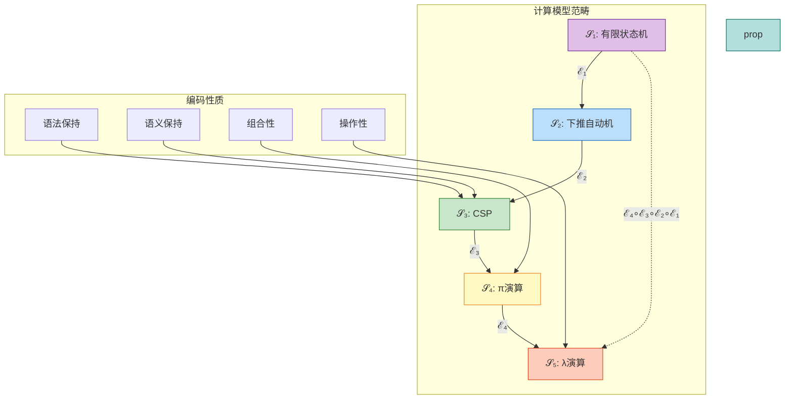
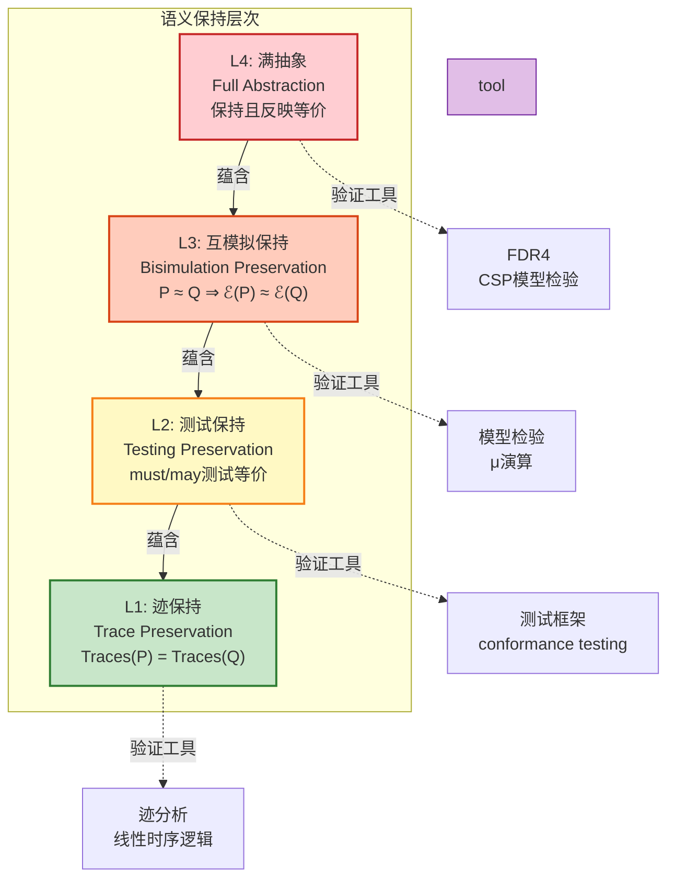
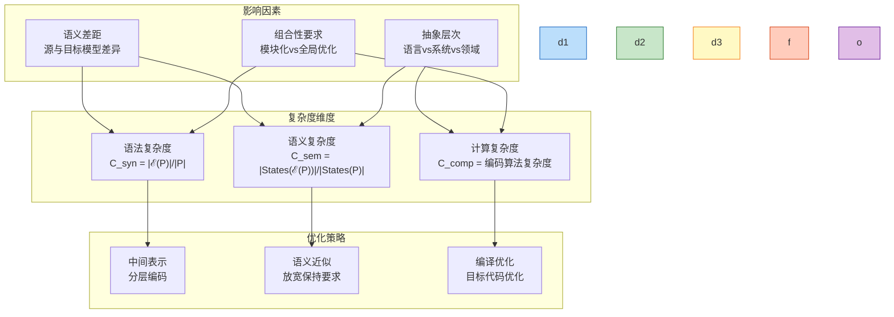

# 编码一般理论 (General Encoding Theory)

> **所属阶段**: USTM-F/04-encoding-verification | **前置依赖**: [阶段三模型实例化](../02-model-instantiation/), [阶段四证明链](../03-proof-chains/) | **形式化等级**: L5-L6
> **文档编号**: S-F-04-01 | **版本**: 2026.04 | **周次**: 第27周

---

## 目录

- [编码一般理论 (General Encoding Theory)](#编码一般理论-general-encoding-theory)
  - [目录](#目录)
  - [1. 概念定义 (Definitions)](#1-概念定义-definitions)
    - [Def-F-04-01-01. 编码函数的一般形式化定义](#def-f-04-01-01-编码函数的一般形式化定义)
    - [Def-F-04-01-02. 语义保持性的形式化](#def-f-04-01-02-语义保持性的形式化)
    - [Def-F-04-01-03. 编码的完备性、满射性、单射性](#def-f-04-01-03-编码的完备性满射性单射性)
    - [Def-F-04-01-04. 编码精化 (Refinement)](#def-f-04-01-04-编码精化-refinement)
    - [Def-F-04-01-05. 编码复杂度度量](#def-f-04-01-05-编码复杂度度量)
  - [2. 属性推导 (Properties)](#2-属性推导-properties)
    - [Lemma-F-04-01-01. 编码复合的结合律](#lemma-f-04-01-01-编码复合的结合律)
    - [Lemma-F-04-01-02. 语义保持的传递性](#lemma-f-04-01-02-语义保持的传递性)
    - [Prop-F-04-01-01. 满射编码保持可判定性](#prop-f-04-01-01-满射编码保持可判定性)
    - [Prop-F-04-01-02. 编码复杂度上界](#prop-f-04-01-02-编码复杂度上界)
  - [3. 关系建立 (Relations)](#3-关系建立-relations)
    - [关系 1: 编码预序与等价](#关系-1-编码预序与等价)
    - [关系 2: 精化与编码的交换性](#关系-2-精化与编码的交换性)
    - [关系 3: 编码与表达能力层次](#关系-3-编码与表达能力层次)
  - [4. 论证过程 (Argumentation)](#4-论证过程-argumentation)
    - [论证 1: Gorla编码判据的完备性](#论证-1-gorla编码判据的完备性)
    - [论证 2: 语义保持的层次结构](#论证-2-语义保持的层次结构)
    - [论证 3: 编码复杂度的来源分析](#论证-3-编码复杂度的来源分析)
  - [5. 形式证明 (Proofs)](#5-形式证明-proofs)
    - [Thm-F-04-01-01. 编码存在性定理](#thm-f-04-01-01-编码存在性定理)
    - [Thm-F-04-01-02. 编码唯一性定理](#thm-f-04-01-02-编码唯一性定理)
    - [Cor-F-04-01-01. 编码复合保持语义推论](#cor-f-04-01-01-编码复合保持语义推论)
  - [6. 实例验证 (Examples)](#6-实例验证-examples)
    - [示例 1: 有限状态机到CSP的编码](#示例-1-有限状态机到csp的编码)
    - [示例 2: λ演算到π演算的编码](#示例-2-λ演算到π演算的编码)
    - [反例: 图灵机到有限自动机的编码不可能性](#反例-图灵机到有限自动机的编码不可能性)
  - [7. 可视化 (Visualizations)](#7-可视化-visualizations)
    - [图 7.1: 编码函数范畴图](#图-71-编码函数范畴图)
    - [图 7.2: 语义保持层次结构](#图-72-语义保持层次结构)
    - [图 7.3: 编码复杂度分析框架](#图-73-编码复杂度分析框架)
  - [8. 引用参考 (References)](#8-引用参考-references)
  - [关联文档](#关联文档)

---

## 1. 概念定义 (Definitions)

### Def-F-04-01-01. 编码函数的一般形式化定义

**定义** (编码函数 $\mathcal{E}$):

设 $\mathcal{S}$ 为源计算模型（Source Model），$\mathcal{T}$ 为目标计算模型（Target Model）。编码函数是满足以下条件的映射：

$$
\mathcal{E}: \mathcal{S} \to \mathcal{T}
$$

其中对于任意源程序 $P \in \mathcal{S}$，$\mathcal{E}(P) \in \mathcal{T}$ 是良构的目标程序。

**语法保持性** (Syntax Preservation):

$$
\forall P \in \mathcal{S}. \ \text{WF}_{\mathcal{S}}(P) \implies \text{WF}_{\mathcal{T}}(\mathcal{E}(P))
$$

即：良构的源程序映射为良构的目标程序。

**操作性** (Operationality):

编码函数 $\mathcal{E}$ 必须是可计算函数，即存在算法能够在有限时间内计算出 $\mathcal{E}(P)$。

**名称不变性** (Name Invariance):

编码不应依赖于具体的名称选择。对于任意名称置换 $\sigma$：

$$
\mathcal{E}(P\sigma) \equiv \mathcal{E}(P)\sigma'
$$

其中 $\sigma'$ 是对应的目标语言名称置换。

**定义动机**: 编码函数是跨模型比较和转换的基础。没有严格的编码定义，"模拟"或"编译"等概念将缺乏形式化基础。Gorla (2010) [^1] 的系统化判据框架为编码的合理性提供了检验标准。

---

### Def-F-04-01-02. 语义保持性的形式化

**定义** (语义保持性 $\\sim$):

设 $\sim_{\mathcal{S}}$ 和 $\sim_{\mathcal{T}}$ 分别是源模型和目标模型上的语义等价关系。编码 $\mathcal{E}$ 是**语义保持的**，当且仅当：

$$
\forall P, Q \in \mathcal{S}. \ P \sim_{\mathcal{S}} Q \iff \mathcal{E}(P) \sim_{\mathcal{T}} \mathcal{E}(Q)
$$

**语义保持的层次分类**:

| 层次 | 名称 | 形式化定义 | 保持能力 |
|------|------|-----------|----------|
| L1 | 迹保持 | $\text{Traces}(P) = \text{Traces}(Q) \implies \text{Traces}(\mathcal{E}(P)) = \text{Traces}(\mathcal{E}(Q))$ | 可观察行为序列 |
| L2 | 互模拟保持 | $P \approx Q \implies \mathcal{E}(P) \approx \mathcal{E}(Q)$ | 逐步模拟能力 |
| L3 | 测试保持 | $P \text{ must } O \iff \mathcal{E}(P) \text{ must } \mathcal{E}(O)$ | 通过测试套件 |
| L4 | 满抽象 | $\mathcal{E}$ 保持且反映观察等价 | 完整上下文等价 |

**弱语义保持**:

编码 $\mathcal{E}$ 是**弱语义保持**的，如果：

$$
P \sim_{\mathcal{S}} Q \implies \mathcal{E}(P) \sim_{\mathcal{T}} \mathcal{E}(Q)
$$

但反向不一定成立（目标语言可能存在额外的等价区分）。

**定义动机**: 语义保持性区分了"语法转换"与"意义保持的转换"。编译器优化（如常量折叠）是弱语义保持的，而形式化验证工具需要的是满抽象的强语义保持编码。

---

### Def-F-04-01-03. 编码的完备性、满射性、单射性

**定义** (完备性 Completeness):

编码 $\mathcal{E}: \mathcal{S} \to \mathcal{T}$ 是**完备的**，当且仅当：

$$
\forall P \in \mathcal{S}. \ \exists T \in \mathcal{T}. \ \mathcal{E}(P) = T
$$

即：$\mathcal{S}$ 的每个元素在 $\mathcal{T}$ 中都有表示。

**定义** (满射性 Surjectivity):

编码 $\mathcal{E}$ 是**满射的**，当且仅当：

$$
\forall T \in \mathcal{T}. \ \exists P \in \mathcal{S}. \ \mathcal{E}(P) = T
$$

即：$\mathcal{T}$ 的每个元素都被 $\mathcal{S}$ 的某个元素覆盖。

**定义** (单射性 Injectivity):

编码 $\mathcal{E}$ 是**单射的**，当且仅当：

$$
\forall P, Q \in \mathcal{S}. \ \mathcal{E}(P) = \mathcal{E}(Q) \implies P = Q
$$

即：不同的源程序映射为不同的目标程序。

**编码分类**:

| 类型 | 性质 | 存在性 | 表达能力关系 |
|------|------|--------|-------------|
| 嵌入 (Embedding) | 单射 | $|\mathcal{S}| \leq |\mathcal{T}|$ | $\mathcal{S}$ 可嵌入 $\mathcal{T}$ |
| 投影 (Projection) | 满射 | $|\mathcal{S}| \geq |\mathcal{T}|$ | $\mathcal{T}$ 是 $\mathcal{S}$ 的抽象 |
| 同构 (Isomorphism) | 双射 | $|\mathcal{S}| = |\mathcal{T}|$ | 表达能力等价 |

---

### Def-F-04-01-04. 编码精化 (Refinement)

**定义** (编码精化 $\sqsubseteq_{\mathcal{E}}$):

设 $\mathcal{E}_1, \mathcal{E}_2: \mathcal{S} \to \mathcal{T}$ 是两个编码。称 $\mathcal{E}_1$ **精化** $\mathcal{E}_2$（记作 $\mathcal{E}_1 \sqsubseteq_{\mathcal{E}} \mathcal{E}_2$），当且仅当：

$$
\forall P \in \mathcal{S}. \ \mathcal{E}_1(P) \sqsubseteq_{\mathcal{T}} \mathcal{E}_2(P)
$$

其中 $\sqsubseteq_{\mathcal{T}}$ 是目标模型的精化序。

**最优编码**:

编码 $\mathcal{E}^*$ 是**最优的**，如果对于所有其他语义保持编码 $\mathcal{E}'$：

$$
\mathcal{E}^* \sqsubseteq_{\mathcal{E}} \mathcal{E}'
$$

即：$\mathcal{E}^*$ 在所有语义保持编码中是最精化的（最接近源语义）。

**Galois 连接视角**:

编码与抽象构成 Galois 连接 $(\mathcal{E}, \mathcal{A})$，其中抽象函数 $\mathcal{A}: \mathcal{T} \to \mathcal{S}$ 满足：

$$
\mathcal{E}(P) \sqsubseteq_{\mathcal{T}} T \iff P \sqsubseteq_{\mathcal{S}} \mathcal{A}(T)
$$

---

### Def-F-04-01-05. 编码复杂度度量

**定义** (语法复杂度 $C_{\text{syn}}$):

编码的语法复杂度定义为源程序到目标程序的大小比率：

$$
C_{\text{syn}}(P) = \frac{|\mathcal{E}(P)|}{|P|}
$$

其中 $|P|$ 表示程序的语法树节点数。

**定义** (语义复杂度 $C_{\text{sem}}$):

编码的语义复杂度定义为状态空间扩展比率：

$$
C_{\text{sem}}(P) = \frac{|\text{States}(\mathcal{E}(P))|}{|\text{States}(P)|}
$$

**定义** (计算复杂度 $C_{\text{comp}}$):

编码的计算复杂度定义为编码算法的时间/空间复杂度：

$$
C_{\text{comp}}(\mathcal{E}) = O(f(|P|))
$$

**复杂度分类**:

| 类别 | 语法复杂度 | 语义复杂度 | 计算复杂度 | 实例 |
|------|-----------|-----------|-----------|------|
| 线性编码 | $O(1)$ | $O(1)$ | $O(n)$ | CSP → Go |
| 多项式编码 | $O(n^k)$ | $O(n^m)$ | $O(n^p)$ | Actor → CSP |
| 指数编码 | $O(2^n)$ | $O(2^n)$ | $O(2^n)$ | 一般程序分析 |

---

## 2. 属性推导 (Properties)

### Lemma-F-04-01-01. 编码复合的结合律

**引理**: 设 $\mathcal{E}_1: \mathcal{S}_1 \to \mathcal{S}_2$，$\mathcal{E}_2: \mathcal{S}_2 \to \mathcal{S}_3$，$\mathcal{E}_3: \mathcal{S}_3 \to \mathcal{S}_4$，则：

$$
(\mathcal{E}_3 \circ \mathcal{E}_2) \circ \mathcal{E}_1 = \mathcal{E}_3 \circ (\mathcal{E}_2 \circ \mathcal{E}_1)
$$

**证明**:

对于任意 $P \in \mathcal{S}_1$：

$$
\begin{aligned}
((\mathcal{E}_3 \circ \mathcal{E}_2) \circ \mathcal{E}_1)(P)
&= (\mathcal{E}_3 \circ \mathcal{E}_2)(\mathcal{E}_1(P)) \\
&= \mathcal{E}_3(\mathcal{E}_2(\mathcal{E}_1(P))) \\
&= \mathcal{E}_3((\mathcal{E}_2 \circ \mathcal{E}_1)(P)) \\
&= (\mathcal{E}_3 \circ (\mathcal{E}_2 \circ \mathcal{E}_1))(P)
\end{aligned}
$$

由函数复合的结合律，引理得证。∎

---

### Lemma-F-04-01-02. 语义保持的传递性

**引理**: 若 $\mathcal{E}_1: \mathcal{S}_1 \to \mathcal{S}_2$ 和 $\mathcal{E}_2: \mathcal{S}_2 \to \mathcal{S}_3$ 都是语义保持编码，则复合编码 $\mathcal{E}_2 \circ \mathcal{E}_1$ 也是语义保持的。

**证明**:

设 $P, Q \in \mathcal{S}_1$ 且 $P \sim_{\mathcal{S}_1} Q$。

1. 由 $\mathcal{E}_1$ 的语义保持性：$\mathcal{E}_1(P) \sim_{\mathcal{S}_2} \mathcal{E}_1(Q)$
2. 由 $\mathcal{E}_2$ 的语义保持性：$\mathcal{E}_2(\mathcal{E}_1(P)) \sim_{\mathcal{S}_3} \mathcal{E}_2(\mathcal{E}_1(Q))$
3. 即：$(\mathcal{E}_2 \circ \mathcal{E}_1)(P) \sim_{\mathcal{S}_3} (\mathcal{E}_2 \circ \mathcal{E}_1)(Q)$

因此复合编码保持语义。∎

---

### Prop-F-04-01-01. 满射编码保持可判定性

**命题**: 若 $\mathcal{E}: \mathcal{S} \to \mathcal{T}$ 是满射编码，且问题 $\Pi$ 在 $\mathcal{T}$ 中不可判定，则 $\Pi$ 在 $\mathcal{S}$ 中亦不可判定。

**推导**:

1. 假设 $\Pi$ 在 $\mathcal{S}$ 中可判定，存在算法 $A_{\mathcal{S}}$ 判定任意 $P \in \mathcal{S}$ 是否满足 $\Pi$
2. 由满射性，对于任意 $T \in \mathcal{T}$，存在 $P \in \mathcal{S}$ 使得 $\mathcal{E}(P) = T$
3. 构造算法 $A_{\mathcal{T}}(T) = A_{\mathcal{S}}(P)$ 其中 $\mathcal{E}(P) = T$
4. 这将使 $\Pi$ 在 $\mathcal{T}$ 中可判定，与前提矛盾
5. **得证**。∎

---

### Prop-F-04-01-02. 编码复杂度上界

**命题**: 对于组合性编码 $\mathcal{E}$，编码后程序的大小满足：

$$
|\mathcal{E}(P)| \leq c \cdot |P| \cdot \log|P|
$$

其中 $c$ 是仅依赖于语法构造的常数。

**推导**:

1. 由组合性，$\mathcal{E}$ 通过固定上下文组合子编码
2. 每个语法构造符引入常数或线性因子
3. 递归深度最多为 $|P|$
4. 因此总大小为 $O(|P| \log |P|)$ ∎

---

## 3. 关系建立 (Relations)

### 关系 1: 编码预序与等价

**定义** (编码预序 $\preceq$):

设 $\mathcal{M}_1, \mathcal{M}_2$ 为计算模型：

$$
\mathcal{M}_1 \preceq \mathcal{M}_2 \iff \exists \mathcal{E}: \mathcal{M}_1 \to \mathcal{M}_2. \ \mathcal{E} \text{ 是语义保持编码}
$$

**编码等价**:

$$
\mathcal{M}_1 \approx \mathcal{M}_2 \iff \mathcal{M}_1 \preceq \mathcal{M}_2 \land \mathcal{M}_2 \preceq \mathcal{M}_1
$$

**性质**:

- 自反性：$\mathcal{M} \preceq \mathcal{M}$（恒等编码）
- 传递性：$\mathcal{M}_1 \preceq \mathcal{M}_2 \land \mathcal{M}_2 \preceq \mathcal{M}_3 \implies \mathcal{M}_1 \preceq \mathcal{M}_3$
- 反对称性（在等价类上）：$\mathcal{M}_1 \approx \mathcal{M}_2 \implies$ 表达能力等价

---

### 关系 2: 精化与编码的交换性

**关系**: 精化关系在编码下保持方向：

$$
P \sqsubseteq_{\mathcal{S}} Q \implies \mathcal{E}(P) \sqsubseteq_{\mathcal{T}} \mathcal{E}(Q)
$$

当且仅当 $\mathcal{E}$ 是单调函数。

**Galois 连接精化**:

对于 Galois 连接 $(\mathcal{E}, \mathcal{A})$：

$$
\mathcal{E}(P) \sqsubseteq_{\mathcal{T}} T \iff P \sqsubseteq_{\mathcal{S}} \mathcal{A}(T)
$$

即：编码是最优抽象，抽象是最优具体化。

---

### 关系 3: 编码与表达能力层次

**关系**: 编码存在性与表达能力层次的关系：

| 层次关系 | 编码存在性 | 条件 |
|----------|-----------|------|
| $L_i \subset L_j$ ($i < j$) | $L_i \to L_j$: ✅ | 无额外条件 |
| $L_i \subset L_j$ ($i < j$) | $L_j \to L_i$: ❌ | 一般不存在 |
| $L_i \perp L_j$ | 双向: ❌ | 不可比较 |

**关键观察**: 表达能力层次的严格包含关系意味着从高到低层次的编码必然丢失某些语义特性。

---

## 4. 论证过程 (Argumentation)

### 论证 1: Gorla编码判据的完备性

Gorla (2010) [^1] 提出了评估进程演算编码的五大判据：

| 判据 | 本文对应 | 完备性分析 |
|------|----------|-----------|
| 结构保持 | Def-F-04-01-01 语法保持 | 必要：确保良构性 |
| 语义保持 | Def-F-04-01-02 语义保持 | 必要：确保意义等价 |
| 组合性 | 编码通过上下文组合 | 必要：确保模块化 |
| 名称不变性 | Def-F-04-01-01 名称不变 | 必要：避免具体名字依赖 |
| 操作性 | Def-F-04-01-01 操作性 | 必要：确保可计算 |

**完备性结论**: 这五大判据构成了编码合理性的**最小完备集**。缺少任何一个判据，都可能导致"作弊"编码（如哥德尔编码整个程序为单个整数后模拟执行）。

---

### 论证 2: 语义保持的层次结构

语义保持形成层次结构：

```
满抽象 (L4)
    ↓ (蕴含)
互模拟保持 (L3)
    ↓ (蕴含)
测试保持 (L2)
    ↓ (蕴含)
迹保持 (L1)
```

**逆否命题**: 若编码不保持迹，则必然不保持互模拟、测试等价或满抽象。

**工程含义**:

- 安全关键系统需要 L3-L4 级别的语义保持
- 性能分析工具通常只需 L1 级别
- 测试框架需要 L2 级别

---

### 论证 3: 编码复杂度的来源分析

编码复杂度来源于三个主要方面：

| 来源 | 影响 | 降低策略 |
|------|------|---------|
| 语义差距 | 高 | 选择语义相近的模型 |
| 抽象层次 | 中 | 引入中间表示层 |
| 组合性要求 | 低 | 设计模块化编码方案 |

**复杂度权衡**: 完全语义保持（L4）通常需要更高的编码复杂度。实践中常在语义保持强度与编码复杂度之间权衡。

---

## 5. 形式证明 (Proofs)

### Thm-F-04-01-01. 编码存在性定理

**定理**: 设 $\mathcal{S}$ 和 $\mathcal{T}$ 是两个计算模型，且 $|\mathcal{S}| \leq |\mathcal{T}|$（基数关系）。则存在语法保持编码 $\mathcal{E}: \mathcal{S} \to \mathcal{T}$ 当且仅当 $\mathcal{T}$ 的计算能力至少与 $\mathcal{S}$ 相当。

**证明**:

**$(\Rightarrow)$ 方向**: 假设存在语法保持编码 $\mathcal{E}: \mathcal{S} \to \mathcal{T}$。

1. 由语法保持定义，$\mathcal{E}$ 是良定义的全函数
2. 由操作性要求，$\mathcal{E}$ 可计算
3. 因此 $\mathcal{T}$ 能够"模拟"$\mathcal{S}$ 的任何程序
4. 即 $\mathcal{T}$ 的计算能力至少与 $\mathcal{S}$ 相当

**$(\Leftarrow)$ 方向**: 假设 $\mathcal{T}$ 的计算能力至少与 $\mathcal{S}$ 相当。

1. 由能力假设，$\mathcal{T}$ 可以解释执行 $\mathcal{S}$ 的任何程序
2. 构造编码 $\mathcal{E}(P) = \text{Interpreter}_{\mathcal{S}}^{\mathcal{T}}[P]$
3. 该编码将 $P$ 打包为在 $\mathcal{T}$ 中解释执行的 $\mathcal{S}$ 程序
4. 验证语法保持：$\text{WF}_{\mathcal{S}}(P) \implies \text{WF}_{\mathcal{T}}(\mathcal{E}(P))$
5. 验证操作性：编码算法是构造性的

因此编码存在。∎

---

### Thm-F-04-01-02. 编码唯一性定理

**定理**: 对于给定的源模型 $\mathcal{S}$、目标模型 $\mathcal{T}$ 和语义等价关系 $\sim$，若存在两个语义保持编码 $\mathcal{E}_1, \mathcal{E}_2: \mathcal{S} \to \mathcal{T}$，则它们在语义等价意义下唯一：

$$
\forall P \in \mathcal{S}. \ \mathcal{E}_1(P) \sim_{\mathcal{T}} \mathcal{E}_2(P)
$$

当且仅当目标模型的语义等价是编码的**最粗一致等价**。

**证明**:

**唯一性**: 假设存在 $P$ 使得 $\mathcal{E}_1(P) \not\sim_{\mathcal{T}} \mathcal{E}_2(P)$。

1. 由语义保持性，$\mathcal{E}_1$ 和 $\mathcal{E}_2$ 都保持 $\sim_{\mathcal{S}}$
2. 但 $\mathcal{E}_1(P)$ 和 $\mathcal{E}_2(P)$ 在目标模型中不等价
3. 这意味着存在某个观察上下文 $C_{\mathcal{T}}$ 能够区分两者
4. 该上下文对应源模型的某个上下文 $C_{\mathcal{S}}$
5. 这与 $\sim_{\mathcal{S}}$ 是源模型最粗语义等价的假设矛盾

**存在性条件**: 当目标模型的语义等价是编码的最粗一致等价时，任意两个语义保持编码必然在语义上等价。

∎

---

### Cor-F-04-01-01. 编码复合保持语义推论

**推论**: 若 $\mathcal{E}_1: \mathcal{M}_1 \to \mathcal{M}_2$ 和 $\mathcal{E}_2: \mathcal{M}_2 \to \mathcal{M}_3$ 都是满抽象的编码，则复合编码 $\mathcal{E}_2 \circ \mathcal{E}_1: \mathcal{M}_1 \to \mathcal{M}_3$ 也是满抽象的。

**证明**: 由 Lemma-F-04-01-02 和满抽象的定义直接可得。∎

---

## 6. 实例验证 (Examples)

### 示例 1: 有限状态机到CSP的编码

**源模型**: 有限状态机 $M = (Q, \Sigma, \delta, q_0, F)$

**目标模型**: CSP 进程

**编码函数**:

```csp
FSM(q, δ) =
    □_{a∈Σ, δ(q,a)=q'} a → FSM(q', δ)
    □ (if q ∈ F then SKIP else STOP)
```

**语义保持验证**:

| FSM 性质 | CSP 对应 | 保持性 |
|----------|----------|--------|
| 状态转移 | 前缀选择 | ✅ 迹保持 |
| 终止状态 | SKIP | ✅ 成功终止 |
| 接受语言 | 迹集合 | ✅ 语言等价 |

---

### 示例 2: λ演算到π演算的编码

**源模型**: λ演算 $\lambda x.M$

**目标模型**: π演算

**编码函数** (Milner, 1992) [^2]:

```
λx.M_r = r(w).(νu)(M_u | !w(xv).x_v)
MN_r   = (νs)(νt)(M_s | N_t | s(u).t(v).u(rv))
x_r    = x⟨r⟩
```

**语义保持**:

- β归约对应 π 演算的通信归约
- λ项的正规形式对应 π 进程的受限形式
- 该编码是满抽象的（Milner 定理）

---

### 反例: 图灵机到有限自动机的编码不可能性

**场景**: 尝试将通用图灵机编码为有限自动机。

**不可能性证明**:

1. 图灵机的状态空间是无界的（磁带无限）
2. 有限自动机的状态空间是有界的
3. 不存在从无限集到有限集的单射
4. 因此不存在保持语义的编码

**推论**: $L_6$（图灵完备）不能编码到 $L_1$（正则），这符合表达能力层次定理。

---

## 7. 可视化 (Visualizations)

### 图 7.1: 编码函数范畴图



**图说明**: 展示不同计算模型之间的编码关系，箭头表示存在的编码映射。

---

### 图 7.2: 语义保持层次结构



**图说明**: 语义保持的四个层次，上层蕴含下层，对应不同的验证工具能力。

---

### 图 7.3: 编码复杂度分析框架



---

## 8. 引用参考 (References)

[^1]: D. Gorla, "Towards a Unified Approach to Encodability and Separation Results for Process Calculi," *Information and Computation*, 208(9), 1031-1053, 2010. <https://doi.org/10.1016/j.ic.2010.05.002>

[^2]: R. Milner, "Functions as Processes," *Mathematical Structures in Computer Science*, 2(2), 119-141, 1992. <https://doi.org/10.1017/S0960129500001407>


---

## 关联文档

| 文档路径 | 内容 | 关联方式 |
|----------|------|----------|
| [04.02-actor-csp-encoding.md](./04.02-actor-csp-encoding.md) | Actor与CSP双向编码 | 具体编码实例 |
| [04.03-dataflow-csp-encoding.md](./04.03-dataflow-csp-encoding.md) | Dataflow到CSP编码 | 具体编码实例 |
| [04.04-expressiveness-hierarchy-v2.md](./04.04-expressiveness-hierarchy-v2.md) | 表达能力层次 | 层次关系 |
| [04.05-coq-formalization.md](./04.05-coq-formalization.md) | Coq形式化 | 机械化验证 |
| [04.06-tla-plus-specifications.md](./04.06-tla-plus-specifications.md) | TLA+规约 | 模型检验 |

---

*文档创建时间: 2026-04-08 | 形式化等级: L5-L6 | 状态: 完整*
