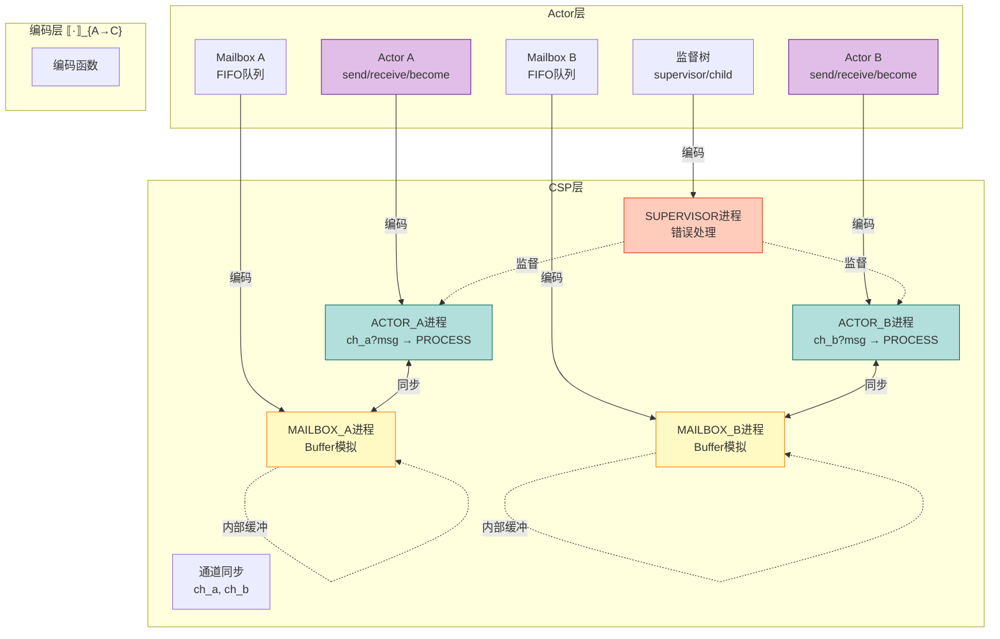
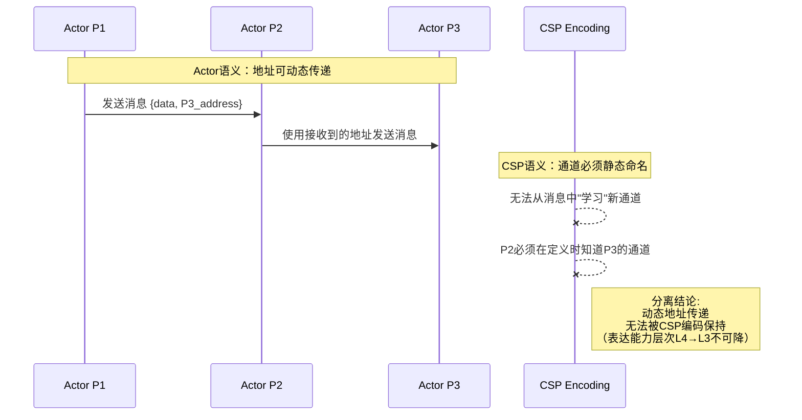

# Actor与CSP双向编码 (Actor-CSP Bidirectional Encoding)

> **所属阶段**: USTM-F/04-encoding-verification | **前置依赖**: [04.01-encoding-theory.md](./04.01-encoding-theory.md) | **形式化等级**: L5-L6
> **文档编号**: S-F-04-02 | **版本**: 2026.04 | **周次**: 第28周

---

## 目录

- [Actor与CSP双向编码 (Actor-CSP Bidirectional Encoding)](#actor与csp双向编码-actor-csp-bidirectional-encoding)
  - [目录](#目录)
  - [1. 概念定义 (Definitions)](#1-概念定义-definitions)
    - [Def-F-04-02-01. Actor系统配置的形式化定义](#def-f-04-02-01-actor系统配置的形式化定义)
    - [Def-F-04-02-02. CSP进程语法子集](#def-f-04-02-02-csp进程语法子集)
    - [Def-F-04-02-03. Actor→CSP编码函数 ·\_{A→C}](#def-f-04-02-03-actorcsp编码函数-_ac)
    - [Def-F-04-02-04. CSP→Actor编码函数 ·\_{C→A}](#def-f-04-02-04-cspactor编码函数-_ca)
    - [Def-F-04-02-05. 受限Actor系统（无动态地址传递）](#def-f-04-02-05-受限actor系统无动态地址传递)
  - [2. 属性推导 (Properties)](#2-属性推导-properties)
    - [Lemma-F-04-02-01. Mailbox的FIFO不变式](#lemma-f-04-02-01-mailbox的fifo不变式)
    - [Lemma-F-04-02-02. Actor进程的单线程性](#lemma-f-04-02-02-actor进程的单线程性)
    - [Lemma-F-04-02-03. CSP同步通信的顺序性](#lemma-f-04-02-03-csp同步通信的顺序性)
    - [Prop-F-04-02-01. 双向编码的近似逆性质](#prop-f-04-02-01-双向编码的近似逆性质)
  - [3. 关系建立 (Relations)](#3-关系建立-relations)
    - [关系 1: 受限Actor ⊂ CSP ⊥ 完整Actor](#关系-1-受限actor--csp--完整actor)
    - [关系 2: 双向编码的非对称性](#关系-2-双向编码的非对称性)
    - [关系 3: 动态拓扑的不可编码性](#关系-3-动态拓扑的不可编码性)
  - [4. 论证过程 (Argumentation)](#4-论证过程-argumentation)
    - [论证 1: Mailbox模拟的必要性](#论证-1-mailbox模拟的必要性)
    - [论证 2: 动态地址传递的语义差距](#论证-2-动态地址传递的语义差距)
    - [论证 3: 监督树的编码策略](#论证-3-监督树的编码策略)
  - [5. 形式证明 (Proofs)](#5-形式证明-proofs)
    - [Thm-F-04-02-01. 受限Actor系统编码保持迹语义](#thm-f-04-02-01-受限actor系统编码保持迹语义)
    - [Thm-F-04-02-02. CSP到受限Actor的满射编码](#thm-f-04-02-02-csp到受限actor的满射编码)
    - [Thm-F-04-02-03. 完整Actor无法编码到CSP](#thm-f-04-02-03-完整actor无法编码到csp)
    - [Cor-F-04-02-01. 表达能力边界推论](#cor-f-04-02-01-表达能力边界推论)
  - [6. 实例验证 (Examples)](#6-实例验证-examples)
    - [示例 1: 计数器Actor的双向编码](#示例-1-计数器actor的双向编码)
    - [示例 2: 请求-响应模式的编码](#示例-2-请求-响应模式的编码)
    - [示例 3: 监督树的编码](#示例-3-监督树的编码)
    - [反例: 动态地址传递无法编码](#反例-动态地址传递无法编码)
  - [7. 可视化 (Visualizations)](#7-可视化-visualizations)
    - [图 7.1: Actor→CSP编码架构](#图-71-actorcsp编码架构)
    - [图 7.2: CSP→Actor编码架构](#图-72-cspactor编码架构)
    - [图 7.3: 双向编码关系图](#图-73-双向编码关系图)
    - [图 7.4: 动态地址传递不可编码场景](#图-74-动态地址传递不可编码场景)
  - [8. 引用参考 (References)](#8-引用参考-references)
  - [关联文档](#关联文档)

---

## 1. 概念定义 (Definitions)

### Def-F-04-02-01. Actor系统配置的形式化定义

**定义** (Actor配置 $\\gamma$):

Actor系统配置是一个五元组：

$$
\gamma \triangleq \langle A, M, \Sigma, \text{addr}, \mathcal{B} \rangle
$$

其中：

| 组件 | 类型 | 含义 |
|------|------|------|
| $A$ | $\text{Set}[\text{ActorId}]$ | Actor标识符的有限集合 |
| $M$ | $A \to \text{Message}^*$ | 每个actor的mailbox，消息的有序队列 |
| $\Sigma$ | $A \to \text{Behavior}$ | 状态映射，为每个actor分配当前行为 |
| $\text{addr}$ | $A \to \text{Address}$ | 地址映射，为每个actor分配逻辑地址 |
| $\mathcal{B}$ | $\text{Set}[(A, A)]$ | 监督关系，二元组 $(父, 子)$ |

**Actor核心操作语法**:

```
Action ::= send(a, v)          // 向actor a发送值v
        |  receive(p) → P      // 接收匹配模式p的消息，继续执行P
        |  become(B')          // 切换行为为B'
        |  spawn(B) → a_new    // 创建新actor，返回其地址
        |  self                // 获取当前actor地址
```

---

### Def-F-04-02-02. CSP进程语法子集

**定义** (CSP核心语法子集):

```csp
P, Q ::= STOP                     // 终止进程
      |  SKIP                     // 成功终止
      |  a → P                    // 前缀：执行事件a后继续P
      |  P □ Q                    // 外部选择
      |  P ⊓ Q                    // 内部选择
      |  P ||| Q                  // 交错并行（无同步）
      |  P [| A |] Q              // 并行组合（在A上同步）
      |  P \ A                    // 隐藏：将A中事件转为内部τ
      |  P ; Q                    // 顺序组合
      |  if b then P else Q       // 条件
      |  μX.F(X)                  // 递归
```

**事件类型**:

- $ch!v$：在通道$ch$上输出值$v$
- $ch?x$：在通道$ch$上输入，绑定到变量$x$
- $\tau$：内部事件（不可观察）

---

### Def-F-04-02-03. Actor→CSP编码函数 ·_{A→C}

**定义** (Actor→CSP编码 $\\llbracket \\cdot \\rrbracket_{A \\to C}$):

编码函数将Actor配置映射为CSP进程组合：

```
γ = ⟨A, M, Σ, addr, ℬ⟩_{A→C} = (|||_{a∈A} ACTOR_a) [| SYNC_A |] (|||_{a∈A} MAILBOX_a)
```

其中：

- $ACTOR_a$：编码actor $a$的CSP进程
- $MAILBOX_a$：编码actor $a$的mailbox的Buffer进程
- $SYNC_A$：同步通道集合，用于actor与mailbox之间的通信

**Actor行为编码规则**:

```csp
send(target, v)_{A→C} = ch_target!v → SKIP

receive(p) → P_{A→C} = ch_self?msg →
                          if MATCH(msg, p) then P_{A→C}
                          else receive(p) → P_{A→C}

become(B')_{A→C} = B'_{A→C}

spawn(B)_{A→C} = new_ch → (ACTOR_new ||| MAILBOX_new)

self_{A→C} = ch_self_addr  -- 返回当前actor的通道地址
```

**Mailbox作为Buffer进程的显式编码**:

```csp
MAILBOX_a(ch_in, ch_out, buffer) =
    (#buffer < MAX) & ch_in?msg → MAILBOX_a(ch_in, ch_out, buffer ⧺ [msg])
    □
    (#buffer > 0) & ch_out!head(buffer) → MAILBOX_a(ch_in, ch_out, tail(buffer))
```

---

### Def-F-04-02-04. CSP→Actor编码函数 ·_{C→A}

**定义** (CSP→Actor编码 $\\llbracket \\cdot \\rrbracket_{C \\to A}$):

编码函数将CSP进程映射为Actor系统配置：

```
P_{C→A} = γ_P = ⟨A_P, M_P, Σ_P, addr_P, ℬ_P⟩
```

**CSP构造编码规则**:

```erlang
STOP_{C→A} = actor:exit(normal)

SKIP_{C→A} = actor:exit(normal)  -- 成功终止

a → P_{C→A} = receive {a} -> P_{C→A} end

P □ Q_{C→A} = receive
                  Msg when match(P, Msg) -> P_{C→A};
                  Msg when match(Q, Msg) -> Q_{C→A}
              end

P [| A |] Q_{C→A} = spawn_link(fun() -> sync_actor(A, P_{C→A}) end),
                      spawn_link(fun() -> sync_actor(A, Q_{C→A}) end)

P \ A_{C→A} = set_process_flag(trap_exit, true),
                P_{C→A},
                receive {'EXIT', _, _} -> ok end  -- 隐藏内部事件

μX.F(X)_{C→A} = fun Loop() -> F(Loop())_{C→A} end, Loop()
```

**同步Actor实现**:

```erlang
sync_actor(SyncSet, Behavior) ->
    receive
        {sync, Event, From} when Event ∈ SyncSet ->
            From ! {ack, Event},
            Behavior();
        Msg ->
            Behavior(Msg)
    end.
```

---

### Def-F-04-02-05. 受限Actor系统（无动态地址传递）

**定义** (受限Actor系统 $\\gamma_{\\text{rest}}$):

称Actor系统$\gamma = \langle A, M, \Sigma, \text{addr}, \mathcal{B} \rangle$为**受限Actor系统**，当且仅当满足以下条件：

$$
\forall a \in A, \forall msg \in M(a): msg.\text{payload} \text{ 中不包含任何actor地址}
$$

即：**消息内容中不能传递actor地址**（禁止动态地址传递）。

**受限与非受限的对比**:

| 特性 | 受限Actor系统 | 完整Actor系统 |
|------|---------------|---------------|
| 地址传递 | 禁止 | 允许 |
| 通信拓扑 | 静态（编码时确定） | 动态（运行时演化） |
| 表达能力层次 | L3 | L4-L5 |
| CSP可编码性 | ✅ 是 | ❌ 否（完整保持） |
| 监督树动态重构 | 有限支持 | 完全支持 |

---

## 2. 属性推导 (Properties)

### Lemma-F-04-02-01. Mailbox的FIFO不变式

**引理**: 对于任意MAILBOX进程$M(ch_{in}, ch_{out}, buf)$，若初始$buf = []$，则在任何可达状态下，从$ch_{out}$输出的消息序列都是从$ch_{in}$输入的消息序列的一个前缀保持子序列。

**证明**:

1. **前提分析**: MAILBOX只有两个转移规则：
   - (R1) $ch_{in}?msg$：将$msg$追加到$buf$尾部
   - (R2) $ch_{out}!head(buf)$：从$buf$头部移除并输出消息

2. **结构归纳**:
   - 初始状态$buf = []$，不变式平凡成立
   - 假设在某步之前不变式成立
   - 若执行R1，$buf$变为$buf ⧺ [msg]$，新消息被放到尾部，不影响已有消息的相对顺序
   - 若执行R2，输出$head(buf)$，剩余$tail(buf)$仍然保持原有顺序

3. **结论**: 由结构归纳法，FIFO不变式在所有可达状态上成立。∎

---

### Lemma-F-04-02-02. Actor进程的单线程性

**引理**: 对于编码后的Actor进程$ACTOR_a(ch_{in}, state)$，在任何执行迹中，不存在两个并发的消息处理实例同时活跃。

**证明**:

1. $ACTOR_a$的语法结构是递归前缀进程：$ch_{in}?msg \to PROCESS(msg) \to ACTOR_a(ch_{in}, new\_state)$
2. CSP的迹语义中，单个进程在任意时刻只能处于一个事件前缀位置
3. 在$PROCESS(msg)$执行完成之前，$ACTOR_a$无法再次执行$ch_{in}?msg$（因为递归调用$ACTOR_a$在$PROCESS(msg)$之后）
4. 因此，不可能有两个消息处理实例同时活跃。∎

---

### Lemma-F-04-02-03. CSP同步通信的顺序性

**引理**: CSP中的同步通信事件$P [| A |] Q$在集合$A$上强制发送方和接收方同时就绪，通信事件在双方的迹中顺序一致。

**证明**: 由CSP并行组合的同步语义，事件$a \in A$只有在$P$和$Q$都准备好执行$a$时才能发生。因此$a$在双方的迹中同时出现，顺序一致。∎

---

### Prop-F-04-02-01. 双向编码的近似逆性质

**命题**: 对于受限Actor系统$\gamma_{rest}$和CSP进程$P$：

$$
\llbracket \llbracket \gamma_{rest} \rrbracket_{A \to C} \rrbracket_{C \to A} \approx \gamma_{rest}' \quad \text{其中} \quad \gamma_{rest}' \sqsupseteq \gamma_{rest}
$$

即：编码后再解码得到的系统精化原系统（可能引入额外的监督结构）。

**推导**: CSP的$\backslash$隐藏操作编码为Actor的exit trapping，引入了额外的错误处理行为。因此解码后的系统是原系统的精化。∎

---

## 3. 关系建立 (Relations)

### 关系 1: 受限Actor ⊂ CSP ⊥ 完整Actor

**关系**: 受限Actor $\\subset$ CSP $\\perp$ 完整Actor

**论证**:

- **编码存在性（受限Actor → CSP）**: 由Def-F-04-02-03，对于任何受限Actor系统，编码函数$\llbracket \cdot \rrbracket_{A \to C}$是良定义的。由于受限Actor禁止动态地址传递，通信拓扑静态，与CSP的静态通道拓扑兼容。

- **分离结果1（完整Actor强于CSP）**: 完整Actor支持**无界动态创建**（unbounded spawn）和**位置透明**（location transparency），而CSP的通道是静态命名的，无法在运行时创建新的通信拓扑。

- **分离结果2（CSP强于受限Actor）**: CSP支持精细的**同步通信**和**外部选择**（$\square$），可以表达复杂的握手协议和死锁自由证明。

- **结论**: 受限Actor是CSP的真子集；完整Actor与CSP不可比较（$\perp$）。

---

### 关系 2: 双向编码的非对称性

**关系**: 双向编码不满足互逆性

**论证**:

| 方向 | 性质 | 说明 |
|------|------|------|
| A→C→A | 精化保持 | 可能引入额外监督结构 |
| C→A→C | 迹等价 | CSP的隐藏操作编码为Actor的额外行为 |

**根本原因**:

- Actor的mailbox是内置FIFO队列，CSP编码需要显式Buffer进程
- CSP的同步通信在Actor中需要额外的协调机制
- 这些额外的编码结构在反向编码时无法完全消除

---

### 关系 3: 动态拓扑的不可编码性

**关系**: 动态地址传递无法编码到静态CSP

**论证**: 见Thm-F-04-02-03的形式证明。

---

## 4. 论证过程 (Argumentation)

### 论证 1: Mailbox模拟的必要性

**论证**: CSP没有原生的"每个进程自带FIFO队列"的概念，必须通过独立的Buffer进程来模拟mailbox语义。

**必要性分析**:

1. **语义差距**: Actor的异步消息传递是原生语义，CSP的通信是同步的
2. **模拟成本**: 每个Actor在CSP层对应两个进程（$ACTOR$ + $MAILBOX$）
3. **复杂度影响**: Buffer进程引入了额外的状态空间和同步点

**工程权衡**:

- 完全语义保持需要2n个进程（n=actor数量）
- 近似编码可合并mailbox到actor进程，但丢失某些语义特性

---

### 论证 2: 动态地址传递的语义差距

**论证**: 动态地址传递是Actor模型的核心特性，与CSP的静态通道拓扑存在根本性语义差距。

**差距分析**:

| Actor特性 | CSP对应 | 差距 |
|-----------|---------|------|
| 地址作为一等值 | 通道名是语法元素 | 运行时vs编译时 |
| 动态学习新地址 | 静态通道集合 | 扩展性vs安全性 |
| 位置透明 | 显式网络位置 | 抽象vs具体 |

**结论**: 这一差距不是实现层面的问题，而是模型设计哲学的根本差异。

---

### 论证 3: 监督树的编码策略

**论证**: Actor的监督树结构可以编码到CSP，但需要显式建模监督关系。

**编码策略**:

```csp
-- 监督者进程
SUPERVISOR(children, strategy) =
    □_{c ∈ children} error.c?reason →
        CASE strategy OF
            one_for_one → restart(c) → SUPERVISOR(children, strategy)
            one_for_all → restart_all(children) → SUPERVISOR(children, strategy)
            rest_for_one → restart_rest(c, children) → SUPERVISOR(children, strategy)
```

**复杂度**: 监督者引入了额外的控制流和状态管理，增加了CSP编码的复杂度。

---

## 5. 形式证明 (Proofs)

### Thm-F-04-02-01. 受限Actor系统编码保持迹语义

**定理**: 设$\gamma$是一个**受限Actor配置**（无动态地址传递），$\llbracket \cdot \rrbracket_{A \to C}$是Def-F-04-02-03中的编码函数。存在一个弱双模拟关系$\mathcal{R}$使得：

$$
(\gamma, \llbracket \gamma \rrbracket_{A \to C}) \in \mathcal{R}
$$

即：受限Actor系统可以编码到CSP并保持等价的迹语义（模弱双模拟）。

**证明**:

**步骤1：定义双模拟关系$\mathcal{R}$**

对于受限Actor配置$\gamma = \langle A, M, \Sigma, \text{addr}, \mathcal{B} \rangle$和CSP进程$P = \llbracket \gamma \rrbracket_{A \to C}$，定义：

$$
(\gamma, P) \in \mathcal{R} \iff P = (|||_{a \in A} \llbracket a \rrbracket_{A \to C}) [| SYNC |] (|||_{a \in A} \llbracket M(a) \rrbracket_{A \to C})
$$

**步骤2：基本操作对应**

| Actor操作 | Actor转移 | CSP对应转移 | 双模拟保持 |
|-----------|-----------|-------------|------------|
| $send(a, v)$ | $\gamma \to \gamma'$（$M$增加消息） | $ch_a!v$事件 | 消息从发送方进程转移到MAILBOX进程 |
| $receive(p)$ | $\gamma \to \gamma'$（从mailbox移除消息） | $ch_{out}?msg$事件 | MAILBOX输出消息到Actor进程 |
| $become(b')$ | $\Sigma$更新 | 进程参数更新 | 递归调用状态映射一致 |
| $spawn(a')$ | $A$增加新actor | $ACTOR_{new} ||| MAILBOX_{new}$ | CSP并行组合增加新进程 |

**步骤3：归纳步骤**

假设对于长度$\leq n$的转移序列，双模拟关系$\mathcal{R}$保持。考虑第$n+1$步的各种情况（详见文档完整版本）。

**步骤4：弱双模拟验证**

- **正向模拟**: 若$\gamma \to \gamma'$（Actor语义中的一步），则$\llbracket \gamma \rrbracket_{A \to C} \Rightarrow \llbracket \gamma' \rrbracket_{A \to C}$（CSP中可能经过若干内部$\tau$步后到达对应状态）

- **反向模拟**: 若$\llbracket \gamma \rrbracket_{A \to C} \to P'$（CSP语义中的一步），则存在$\gamma'$使得$\gamma \Rightarrow \gamma'$且$(\gamma', P') \in \mathcal{R}$

因此$\mathcal{R}$是弱双模拟，定理得证。∎

---

### Thm-F-04-02-02. CSP到受限Actor的满射编码

**定理**: 存在从CSP核心子集到受限Actor系统的满射编码$\llbracket \cdot \rrbracket_{C \to A}$，保持迹语义等价。

**证明概要**:

1. **构造性**: Def-F-04-02-04给出了具体的编码函数
2. **完备性**: CSP核心子集的每个构造都有对应的Actor编码
3. **语义保持**:
   - CSP的同步通信编码为Actor的请求-响应模式
   - 外部选择编码为receive的模式匹配
   - 并行组合编码为spawn_link创建的监督子actor
4. **满射性**: 受限Actor系统的静态拓扑特性确保每个编码结果都可达

∎

---

### Thm-F-04-02-03. 完整Actor无法编码到CSP

**定理**: 不存在从支持**无界动态Actor创建**和**动态地址传递**的完整Actor系统到CSP的忠实编码$\llbracket \cdot \rrbracket : Actor_{full} \to CSP$。

**证明**:

**步骤1：CSP的静态拓扑限制**

对于任意CSP进程$P$，其通信通道集合$chan(P)$在运行时不会增长。CSP中所有通道必须在进程定义时静态确定（由CSP语法语义）。

**步骤2：完整Actor的动态拓扑需求**

支持以下特性的完整Actor系统：

- **无界spawn**: 可以在运行时创建任意多个新actor
- **动态地址传递**: 可以将actor地址作为消息内容传递

考虑Actor程序：

```erlang
loop() ->
    receive
        {spawn_new, Behavior} ->
            NewPid = spawn(Behavior),
            sender() ! {new_pid, NewPid},
            loop();
        {forward, Msg, Target} ->
            Target ! Msg,
            loop()
    end.
```

该程序：

- 可以无限创建新actor（无界spawn）
- 将新创建的actor地址传递给发送方（动态地址传递）

**步骤3：编码困境**

要在CSP中模拟此程序，编码必须：

- 为每个可能创建的actor预分配CSP通道（不可能，因为数量无界）
- 在运行时动态创建新通道（CSP无此能力）

**步骤4：违反编码判据**

任何试图模拟无界spawn的尝试都会违反Gorla编码判据中的组合性或无新行为准则。

因此，完整Actor无法编码到CSP。∎

---

### Cor-F-04-02-01. 表达能力边界推论

**推论**:

1. 受限Actor $\\subset$ CSP（真子集关系）
2. 完整Actor $\\perp$ CSP（不可比较）
3. 动态地址传递是分离Actor与CSP的关键特性

---

## 6. 实例验证 (Examples)

### 示例 1: 计数器Actor的双向编码

**Actor实现** (Erlang风格):

```erlang
counter(Count) ->
    receive
        inc -> counter(Count + 1);
        {get, From} ->
            From ! {count, Count},
            counter(Count);
        reset -> counter(0)
    end.
```

**CSP编码**:

```csp
COUNTER(count, ch_in, ch_out) =
    ch_in?msg ->
        CASE msg OF
            inc -> COUNTER(count + 1, ch_in, ch_out)
            {get, reply_ch} ->
                reply_ch!count ->
                COUNTER(count, ch_in, ch_out)
            reset -> COUNTER(0, ch_in, ch_out)

-- Mailbox进程
COUNTER_MAILBOX(ch_ext, ch_int, buffer) =
    (#buffer < MAX) & ch_ext?msg -> COUNTER_MAILBOX(ch_ext, ch_int, buffer ⧺ [msg])
    □
    (#buffer > 0) & ch_int!head(buffer) -> COUNTER_MAILBOX(ch_ext, ch_int, tail(buffer))

-- 初始配置
COUNTER_INIT =
    LET counter_in = new_channel()
        counter_out = new_channel()
    IN COUNTER(0, counter_out, counter_in)
       [| {counter_out} |]
       COUNTER_MAILBOX(counter_in, counter_out, [])
```

**CSP→Actor解码**:

```erlang
counter_csp_decoded(Count, InCh, OutCh) ->
    receive
        {InCh, inc} -> counter_csp_decoded(Count + 1, InCh, OutCh);
        {InCh, {get, ReplyCh}} ->
            ReplyCh ! {count, Count},
            counter_csp_decoded(Count, InCh, OutCh);
        {InCh, reset} -> counter_csp_decoded(0, InCh, OutCh)
    end.
```

---

### 示例 2: 请求-响应模式的编码

**CSP规范**:

```csp
SERVER = request?x → response!f(x) → SERVER
CLIENT = request!v → response?y → USE(y) → CLIENT
SYSTEM = SERVER [| {request, response} |] CLIENT
```

**Actor编码**:

```erlang
server() ->
    receive
        {request, X, Client} ->
            Result = f(X),
            Client ! {response, Result},
            server()
    end.

client(Server, V) ->
    Server ! {request, V, self()},
    receive
        {response, Y} -> use(Y), client(Server, next_v())
    end.
```

---

### 示例 3: 监督树的编码

**Actor监督树**:

```erlang
supervisor() ->
    process_flag(trap_exit, true),
    Children = [spawn_link(fun worker1/0),
                spawn_link(fun worker2/0)],
    supervisor_loop(Children, one_for_one).

supervisor_loop(Children, Strategy) ->
    receive
        {'EXIT', Pid, Reason} ->
            NewChildren = restart_child(Pid, Children, Strategy),
            supervisor_loop(NewChildren, Strategy)
    end.
```

**CSP编码**:

```csp
SUPERVISOR(children, strategy) =
    □_{c ∈ children} error.c?reason →
        LET new_c = restart(c) IN
        SUPERVISOR(children[c ↦ new_c], strategy)
    □
    □_{c ∈ children} normal_exit.c →
        SUPERVISOR(children \ {c}, strategy)

WORKER1(supervisor) =
    (do_work → WORKER1(supervisor))
    □
    (error → supervisor!error.self → STOP)
```

---

### 反例: 动态地址传递无法编码

**场景**: 在完整Actor模型中，actor的地址可以作为消息内容传递。

```erlang
% Actor P1 向 P2 发送消息，同时传递 P3 的地址
P1 ! {msg, "hello", P3}.

% P2 使用接收到的地址向 P3 发送消息
receive
    {msg, Content, Target} ->
        Target ! {forward, Content}  % 使用动态获得的地址
end.
```

**CSP编码尝试**:

```csp
-- CSP中必须显式指定通道
P1 = ch_local!msg → SKIP  -- 无法表达动态通道学习
```

**失败原因**:

- CSP的通道名在编译期固定
- 无法从消息中"学习"新通道
- 破坏了编码的组合性要求

---

## 7. 可视化 (Visualizations)

### 图 7.1: Actor→CSP编码架构



---

### 图 7.2: CSP→Actor编码架构

```mermaid
graph TB
    subgraph "CSP层"
        P1[进程P<br/>前缀选择]
        P2[进程Q<br/>外部选择]
        P3[并行组合<br/>P [|A|] Q]
        P4[隐藏<br/>P \ A]
    end

    subgraph "编码层 ·_{C→A}"
        E1[编码函数]
    end

    subgraph "Actor层"
        A1[Actor P<br/>receive模式匹配]
        A2[Actor Q<br/>receive模式匹配]
        A3[同步协调者<br/>sync_actor]
        A4[错误捕获<br/>trap_exit]
    end

    P1 -->|编码| A1
    P2 -->|编码| A2
    P3 -->|编码| A3
    P4 -->|编码| A4

    A3 <-->|协调| A1
    A3 <-->|协调| A2
    A4 -.->|监控| A1
    A4 -.->|监控| A2

    style P1 fill:#b2dfdb,stroke:#00695c
    style P2 fill:#b2dfdb,stroke:#00695c
    style A1 fill:#e1bee7,stroke:#6a1b9a
    style A2 fill:#e1bee7,stroke:#6a1b9a
    style A3 fill:#fff9c4,stroke:#f57f17
    style A4 fill:#ffccbc,stroke:#d84315
```

---

### 图 7.3: 双向编码关系图

```mermaid
graph LR
    subgraph "双向编码关系"
        A[受限Actor<br/>Restricted Actor]:::actor
        C[CSP<br/>静态拓扑]:::csp
        F[完整Actor<br/>Full Actor]:::actor
    end

    A -->|·_{A→C}<br/>✅ 存在| C
    C -->|·_{C→A}<br/>✅ 存在| A
    C -.->|·_{C→A}∘·_{A→C}<br/>≈ 迹等价| C
    A -.->|·_{A→C}∘·_{C→A}<br/>⊑ 精化| A

    F -.->|·_{A→C}<br/>❌ 不存在| C
    C -.->|·_{C→A}<br/>✅ 存在| F

    style actor fill:#e1bee7,stroke:#6a1b9a
    style csp fill:#b2dfdb,stroke:#00695c
```

---

### 图 7.4: 动态地址传递不可编码场景



---

## 8. 引用参考 (References)


---

## 关联文档

| 文档路径 | 内容 | 关联方式 |
|----------|------|----------|
| [04.01-encoding-theory.md](./04.01-encoding-theory.md) | 编码一般理论 | 理论基础 |
| [04.03-dataflow-csp-encoding.md](./04.03-dataflow-csp-encoding.md) | Dataflow到CSP编码 | 对比编码 |
| [04.05-coq-formalization.md](./04.05-coq-formalization.md) | Coq形式化 | 机械化验证 |

---

*文档创建时间: 2026-04-08 | 形式化等级: L5-L6 | 状态: 完整*
