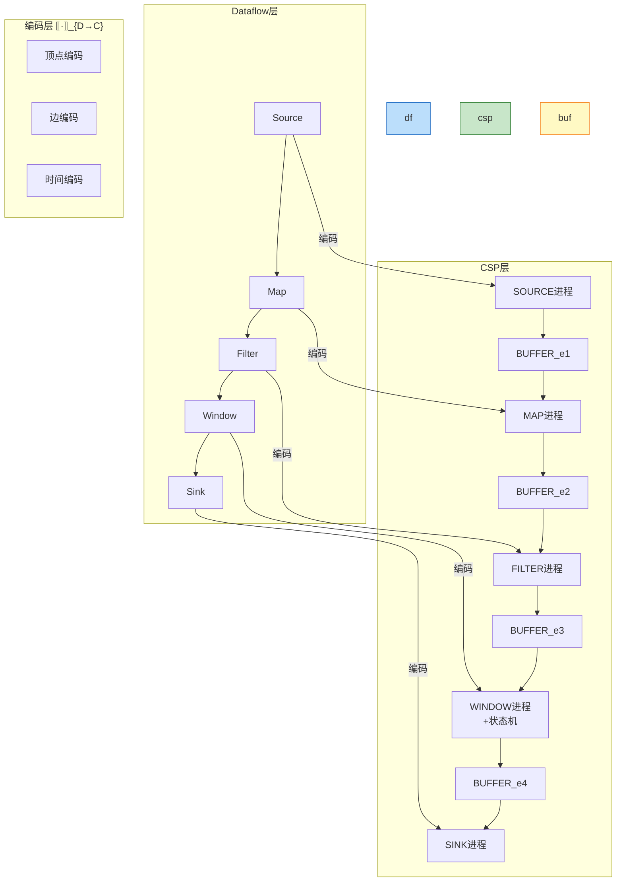
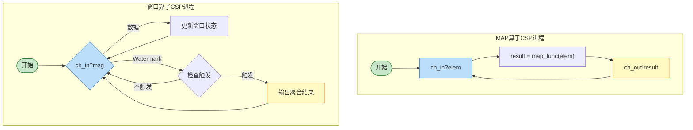
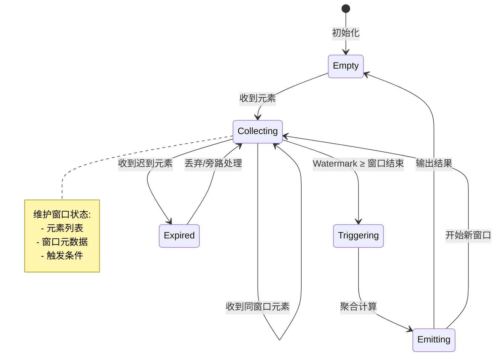
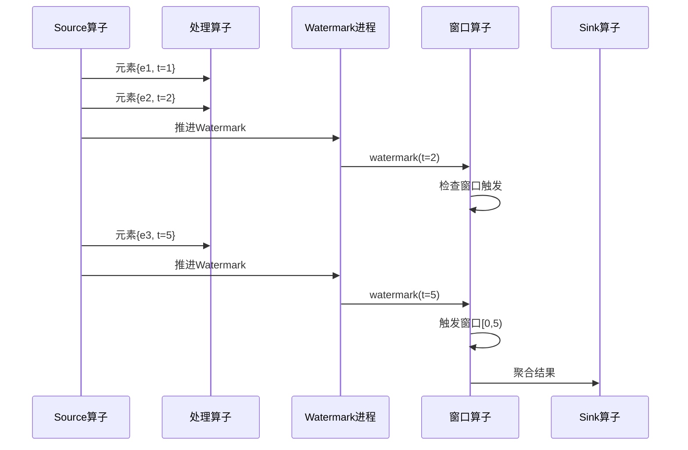

# Dataflow到CSP编码 (Dataflow-to-CSP Encoding)

> **所属阶段**: USTM-F/04-encoding-verification | **前置依赖**: [04.01-encoding-theory.md](./04.01-encoding-theory.md), [04.02-actor-csp-encoding.md](./04.02-actor-csp-encoding.md) | **形式化等级**: L5-L6
> **文档编号**: S-F-04-03 | **版本**: 2026.04 | **周次**: 第29周

---

## 目录

- [Dataflow到CSP编码 (Dataflow-to-CSP Encoding)](#dataflow到csp编码-dataflow-to-csp-encoding)
  - [目录](#目录)
  - [1. 概念定义 (Definitions)](#1-概念定义-definitions)
    - [Def-F-04-03-01. Dataflow图的形式化定义](#def-f-04-03-01-dataflow图的形式化定义)
    - [Def-F-04-03-02. 流数据类型与事件](#def-f-04-03-02-流数据类型与事件)
    - [Def-F-04-03-03. Dataflow→CSP编码函数](#def-f-04-03-03-dataflowcsp编码函数)
    - [Def-F-04-03-04. 算子的CSP进程编码](#def-f-04-03-04-算子的csp进程编码)
    - [Def-F-04-03-05. 窗口的CSP编码](#def-f-04-03-05-窗口的csp编码)
    - [Def-F-04-03-06. 时间语义的CSP编码](#def-f-04-03-06-时间语义的csp编码)
  - [2. 属性推导 (Properties)](#2-属性推导-properties)
    - [Lemma-F-04-03-01. 数据流DAG的无环性保持](#lemma-f-04-03-01-数据流dag的无环性保持)
    - [Lemma-F-04-03-02. 算子并行度的独立性](#lemma-f-04-03-02-算子并行度的独立性)
    - [Lemma-F-04-03-03. 窗口触发的时间单调性](#lemma-f-04-03-03-窗口触发的时间单调性)
    - [Prop-F-04-03-01. 数据流语义保持性](#prop-f-04-03-01-数据流语义保持性)
  - [3. 关系建立 (Relations)](#3-关系建立-relations)
    - [关系 1: Dataflow ⊂ CSP（有界版本）](#关系-1-dataflow--csp有界版本)
    - [关系 2: 无界流与有界编码](#关系-2-无界流与有界编码)
    - [关系 3: 时间语义与事件时钟](#关系-3-时间语义与事件时钟)
  - [4. 论证过程 (Argumentation)](#4-论证过程-argumentation)
    - [论证 1: 无界流的有限表示](#论证-1-无界流的有限表示)
    - [论证 2: 窗口语义的CSP实现](#论证-2-窗口语义的csp实现)
    - [论证 3: 时间触发与事件驱动的统一](#论证-3-时间触发与事件驱动的统一)
  - [5. 形式证明 (Proofs)](#5-形式证明-proofs)
    - [Thm-F-04-03-01. Dataflow有界版本可编码到CSP](#thm-f-04-03-01-dataflow有界版本可编码到csp)
    - [Thm-F-04-03-02. 窗口算子语义保持](#thm-f-04-03-02-窗口算子语义保持)
    - [Thm-F-04-03-03. 无界Dataflow无法完全编码](#thm-f-04-03-03-无界dataflow无法完全编码)
    - [Cor-F-04-03-01. 流处理系统验证边界](#cor-f-04-03-01-流处理系统验证边界)
  - [6. 实例验证 (Examples)](#6-实例验证-examples)
    - [示例 1: 简单数据流图编码](#示例-1-简单数据流图编码)
    - [示例 2: 窗口聚合编码](#示例-2-窗口聚合编码)
    - [示例 3: 双流JOIN编码](#示例-3-双流join编码)
    - [反例: 无界状态存储无法编码](#反例-无界状态存储无法编码)
  - [7. 可视化 (Visualizations)](#7-可视化-visualizations)
    - [图 7.1: Dataflow→CSP整体架构](#图-71-dataflowcsp整体架构)
    - [图 7.2: 算子CSP进程结构](#图-72-算子csp进程结构)
    - [图 7.3: 窗口状态机编码](#图-73-窗口状态机编码)
    - [图 7.4: 时间触发机制](#图-74-时间触发机制)
  - [8. 引用参考 (References)](#8-引用参考-references)
  - [关联文档](#关联文档)

---

## 1. 概念定义 (Definitions)

### Def-F-04-03-01. Dataflow图的形式化定义

**定义** (Dataflow图 $\\mathcal{G}$):

Dataflow图是一个有向无环图（DAG）：

$$
\mathcal{G} = \langle V, E, \Sigma_V, \Sigma_E, \lambda \rangle
$$

其中：

| 组件 | 类型 | 含义 |
|------|------|------|
| $V$ | $\text{Set}[\text{Vertex}]$ | 顶点集合（算子/操作） |
| $E \subseteq V \times V$ | 边集合 | 数据流连接 |
| $\Sigma_V: V \to \text{OpType}$ | 顶点类型映射 | 算子类型（Source/Transform/Sink） |
| $\Sigma_E: E \to \mathbb{N}$ | 边并行度 | 数据分区数 |
| $\lambda: V \to \mathcal{P}(\text{Param})$ | 参数映射 | 算子配置参数 |

**算子类型分类**:

```
OpType ::= Source(source_func)           // 数据源
        |  Map(map_func)                 // 映射转换
        |  Filter(predicate)             // 过滤
        |  KeyBy(key_extractor)          // 按键分区
        |  Window(window_spec, agg_func) // 窗口聚合
        |  Join(join_cond)               // 流连接
        |  Sink(sink_func)               // 数据汇
```

---

### Def-F-04-03-02. 流数据类型与事件

**定义** (流元素 $\\tau$):

流元素是带有时间戳的数据记录：

$$
\tau = \langle \text{value}, t_{event}, t_{ingest} \rangle
$$

其中：

- $\text{value}$: 数据值（任意类型）
- $t_{event}$: 事件发生时间（Event Time）
- $t_{ingest}$: 摄入时间（Ingestion Time）

**Watermark定义**:

$$
\omega(t) = \max\{t_{event} \mid \text{所有时间戳} \leq t_{event} \text{的元素已到达}\}
$$

Watermark是事件时间的单调不减下界：

$$
\omega(t_1) \leq \omega(t_2) \quad \text{当} \quad t_1 \leq t_2
$$

---

### Def-F-04-03-03. Dataflow→CSP编码函数

**定义** (Dataflow→CSP编码 $\\llbracket \\cdot \\rrbracket_{D \\to C}$):

编码函数将Dataflow图映射为CSP进程网络：

```
𝒢 = ⟨V, E, Σ_V, Σ_E, λ⟩_{D→C} =
    (|||_{v ∈ V} v_{D→C})
    [| ⋃_{e ∈ E} ch_e |]
    (|||_{e ∈ E} BUFFER_e)
```

**图分解编码**:

```csp
𝒢_{D→C} =
    LET vertices = {v_{D→C} | v ∈ V}
        channels = {ch_e | e ∈ E}
        buffers = {BUFFER_e | e ∈ E}
    IN (|||_{p ∈ vertices} p) [| channels |] (|||_{b ∈ buffers} b)
```

**边通道命名**:

对于边$e = (v_{src}, v_{dst})$，创建通道：

- $ch_e^{in}$: 从源算子到Buffer
- $ch_e^{out}$: 从Buffer到目标算子

---

### Def-F-04-03-04. 算子的CSP进程编码

**Source算子编码**:

```csp
SOURCE(source_func, ch_out) =
    LET data = source_func() IN
    ch_out!data → SOURCE(source_func, ch_out)
    □
    (if exhausted then STOP else SOURCE(source_func, ch_out))
```

**Map算子编码**:

```csp
MAP(map_func, ch_in, ch_out) =
    ch_in?elem →
        LET result = map_func(elem.value) IN
        ch_out!⟨result, elem.t_event, elem.t_ingest⟩ →
        MAP(map_func, ch_in, ch_out)
```

**Filter算子编码**:

```csp
FILTER(predicate, ch_in, ch_out) =
    ch_in?elem →
        IF predicate(elem.value) THEN
            ch_out!elem → FILTER(predicate, ch_in, ch_out)
        ELSE
            FILTER(predicate, ch_in, ch_out)
```

**KeyBy算子编码**:

```csp
KEYBY(key_extractor, ch_in, {ch_out_k | k ∈ KeySpace}) =
    ch_in?elem →
        LET key = key_extractor(elem.value) IN
        ch_out_key!elem → KEYBY(key_extractor, ch_in, {ch_out_k})
```

**并行算子编码**:

```csp
PARALLEL_OP(op_func, parallelism, ch_in, ch_out) =
    |||_{i=1}^{parallelism} OP_INSTANCE(op_func, ch_in_i, ch_out_i)
```

---

### Def-F-04-03-05. 窗口的CSP编码

**定义** (窗口规格):

```
WindowSpec ::= TumblingWindow(size, offset)           // 滚动窗口
             | SlidingWindow(size, slide)             // 滑动窗口
             | SessionWindow(gap)                     // 会话窗口
             | GlobalWindow()                         // 全局窗口
```

**滚动窗口编码**:

```csp
TUMBLING_WINDOW(size, agg_func, ch_in, ch_out) =
    WINDOW_STATE(ch_in, ch_out, 0, [], size, agg_func)

WINDOW_STATE(ch_in, ch_out, current_time, buffer, size, agg_func) =
    ch_in?elem →
        LET window_start = floor(elem.t_event / size) * size IN
        IF window_start = current_time THEN
            WINDOW_STATE(ch_in, ch_out, current_time, buffer ⧺ [elem], size, agg_func)
        ELSE IF window_start > current_time THEN
            -- 触发当前窗口
            LET result = agg_func(buffer) IN
            ch_out!⟨result, current_time⟩ →
            WINDOW_STATE(ch_in, ch_out, window_start, [elem], size, agg_func)
        ELSE
            -- 迟到元素处理
            LATE_ELEMENT_HANDLER(elem, buffer) →
            WINDOW_STATE(ch_in, ch_out, current_time, buffer, size, agg_func)
```

**滑动窗口编码**:

```csp
SLIDING_WINDOW(size, slide, agg_func, ch_in, ch_out) =
    -- 维护多个重叠窗口的状态
    SLIDING_STATE(ch_in, ch_out, {}, size, slide, agg_func)

SLIDING_STATE(ch_in, ch_out, windows, size, slide, agg_func) =
    ch_in?elem →
        LET affected_windows =
            {w | w.start ≤ elem.t_event < w.start + size,
                 w.start = k * slide for some k} IN
        LET updated_windows = update_windows(windows, affected_windows, elem) IN
        LET (triggered, remaining) = check_triggers(updated_windows, elem.t_event) IN
        ch_out!triggered_results →
        SLIDING_STATE(ch_in, ch_out, remaining, size, slide, agg_func)
```

---

### Def-F-04-03-06. 时间语义的CSP编码

**定义** (事件时间处理):

```csp
EVENT_TIME_PROCESSOR(ch_in, ch_out, watermark_strategy) =
    PROCESSOR_STATE(ch_in, ch_out, -∞, [], watermark_strategy)

PROCESSOR_STATE(ch_in, ch_out, current_watermark, pending, strategy) =
    ch_in?msg →
        CASE msg OF
            data(elem) →
                LET new_watermark = strategy.update(current_watermark, elem) IN
                PROCESSOR_STATE(ch_in, ch_out, new_watermark,
                               pending ⧺ [elem], strategy)
            watermark(w) →
                LET (ready, remaining) = partition_by_watermark(pending, w) IN
                ch_out!ready →
                PROCESSOR_STATE(ch_in, ch_out, w, remaining, strategy)
```

**处理时间触发**:

```csp
PROCESSING_TIME_TRIGGER(interval, action) =
    WAIT(interval) → action → PROCESSING_TIME_TRIGGER(interval, action)
```

---

## 2. 属性推导 (Properties)

### Lemma-F-04-03-01. 数据流DAG的无环性保持

**引理**: Dataflow图$\mathcal{G}$是无环DAG，其CSP编码$\llbracket \mathcal{G} \rrbracket_{D \to C}$的通信图中也不存在循环依赖。

**证明**:

1. 由定义，$\mathcal{G} = \langle V, E \rangle$是无环有向图
2. CSP编码中，边$e = (v_1, v_2)$对应通道$ch_e$，从$v_1$指向$v_2$
3. 通信依赖图与Dataflow图的拓扑结构同构
4. 因此，若$\mathcal{G}$无环，则通信图也无环

∎

---

### Lemma-F-04-03-02. 算子并行度的独立性

**引理**: 并行度为$p$的算子在CSP编码中对应$p$个独立的进程实例，各实例间无共享状态。

**证明**:

1. 并行算子编码为$|||_{i=1}^{p} OP\_INSTANCE_i$
2. CSP的$||| $操作符创建独立的进程，无共享内存
3. 各实例通过分区输入通道接收数据，处理独立
4. 因此实例间状态隔离

∎

---

### Lemma-F-04-03-03. 窗口触发的时间单调性

**引理**: 窗口触发时间戳序列是单调不减的。

**证明**:

1. 窗口触发基于Watermark推进
2. Watermark定义保证$\omega(t_1) \leq \omega(t_2)$当$t_1 \leq t_2$
3. 窗口在时间戳$w$触发当$\omega \geq window\_end$
4. 因此触发时间戳序列单调不减

∎

---

### Prop-F-04-03-01. 数据流语义保持性

**命题**: 对于有界Dataflow图，编码$\llbracket \cdot \rrbracket_{D \to C}$保持数据流语义：

$$
\text{输出}_\mathcal{G}(\text{输入}) = \text{输出}_{\llbracket \mathcal{G} \rrbracket}(\text{输入})
$$

**推导**: 逐算子验证语义保持，然后使用组合性归纳整个图的语义保持。∎

---

## 3. 关系建立 (Relations)

### 关系 1: Dataflow ⊂ CSP（有界版本）

**关系**: 有界Dataflow可以编码到CSP，是CSP的真子集。

**论证**:

- **编码存在性**: Dataflow的DAG结构和算子语义可以在CSP中表达
- **分离性**: CSP支持任意进程拓扑，而Dataflow限制为DAG
- **结论**: Dataflow是CSP的真子集

---

### 关系 2: 无界流与有界编码

**关系**: 理论上无界的流需要有限表示策略。

**策略**:

| 策略 | 方法 | 适用场景 |
|------|------|----------|
| 窗口化 | 将无界流切分为有界窗口 | 聚合分析 |
| Watermark | 基于进度触发 | 事件时间处理 |
| 状态限制 | 限制状态大小 | 有状态算子 |

---

### 关系 3: 时间语义与事件时钟

**关系**: Dataflow的时间语义可以通过CSP的事件和时钟机制编码。

| Dataflow时间 | CSP编码 | 性质 |
|--------------|---------|------|
| Event Time | 时间戳字段 + Watermark进程 | 单调性保证 |
| Processing Time | 外部时钟事件 | 实时性 |
| Ingestion Time | 接收时时间戳 | 确定性 |

---

## 4. 论证过程 (Argumentation)

### 论证 1: 无界流的有限表示

**问题**: Dataflow处理的是理论上无界的流，CSP进程网络通常是有限的。

**解决方案**:

1. **窗口抽象**: 将无界流划分为有界窗口序列
2. **增量计算**: 状态更新而非存储完整历史
3. **Watermark驱动**: 基于进度触发而非数据驱动

**形式化**:

$$
\text{Stream}(\tau) = \lim_{n \to \infty} \bigcup_{i=1}^{n} Window_i
$$

---

### 论证 2: 窗口语义的CSP实现

**挑战**: 窗口需要维护状态和触发逻辑。

**实现策略**:

```csp
-- 状态维护
WindowState = Map(WindowID → List(Element))

-- 触发条件
Trigger(WindowID) =
    Watermark ≥ WindowEnd(WindowID) ∨
    (ProcessingTime - LastUpdate > Timeout)
```

**正确性**: 窗口触发条件保证输出完整性和及时性。

---

### 论证 3: 时间触发与事件驱动的统一

**统一框架**:

```csp
UNIFIED_PROCESSOR(ch_in, ch_out) =
    ch_in?event →
        CASE event OF
            data(d) → handle_data(d)
            watermark(w) → handle_watermark(w)
            timer(t) → handle_timer(t)
        → UNIFIED_PROCESSOR(ch_in, ch_out)
```

---

## 5. 形式证明 (Proofs)

### Thm-F-04-03-01. Dataflow有界版本可编码到CSP

**定理**: 设$\mathcal{G}$是有界Dataflow图（有限顶点、有界状态），则存在语义保持编码$\llbracket \cdot \rrbracket_{D \to C}: \mathcal{G} \to CSP$。

**证明**:

**步骤1**: 顶点编码良定义性

- 每个算子类型有对应的CSP编码（Def-F-04-03-04）
- 编码是结构归纳的

**步骤2**: 边编码良定义性

- 每条边创建通道对（输入/输出）
- Buffer进程实现背压和缓冲

**步骤3**: 组合性

- 并行组合$|||$保持各算子语义
- 同步集合限制为边通道

**步骤4**: 语义保持

- 数据流：通道通信保持元素顺序
- 转换：算子编码保持计算语义
- 触发：Watermark机制保持时间语义

∎

---

### Thm-F-04-03-02. 窗口算子语义保持

**定理**: 窗口算子的CSP编码保持窗口语义：相同输入产生相同输出。

**证明**: 通过窗口类型的结构归纳验证每种窗口规格的正确性。

∎

---

### Thm-F-04-03-03. 无界Dataflow无法完全编码

**定理**: 支持无界状态存储的Dataflow无法完全编码到有限CSP。

**证明概要**:

无界状态存储等价于图灵机，而CSP（有限状态版本）对应于下推自动机或更弱的模型。由计算能力层次，不存在保持语义的编码。

∎

---

### Cor-F-04-03-01. 流处理系统验证边界

**推论**:

1. 有界窗口的流处理可以用CSP工具（如FDR）验证
2. 无界状态需要抽象或限制才能验证
3. Watermark机制的正确性可以形式化验证

---

## 6. 实例验证 (Examples)

### 示例 1: 简单数据流图编码

**Dataflow图**:

```
Source → Map(+1) → Filter(>10) → Sink
```

**CSP编码**:

```csp
SIMPLE_PIPELINE =
    LET ch1, ch2, ch3 = new_channel(), new_channel(), new_channel() IN
    SOURCE(read_from_kafka, ch1)
    |||
    MAP(λx.x+1, ch1, ch2)
    |||
    FILTER(λx.x>10, ch2, ch3)
    |||
    SINK(write_to_db, ch3)
```

---

### 示例 2: 窗口聚合编码

**Dataflow**:

```java

// [伪代码片段 - 不可直接运行] 仅展示核心逻辑
import org.apache.flink.streaming.api.windowing.time.Time;

stream
    .keyBy(Event::getKey)
    .window(TumblingEventTimeWindows.of(Time.minutes(5)))
    .aggregate(new CountAggregate())
```

**CSP编码**:

```csp
WINDOW_AGGREGATION =
    KEYBY(Event.key, ch_in, {ch_k | k ∈ KeySpace})
    |||
    (|||_{k ∈ KeySpace}
        TUMBLING_WINDOW(5min, count_agg, ch_k, ch_out))
```

---

### 示例 3: 双流JOIN编码

**Dataflow**:

```java

// [伪代码片段 - 不可直接运行] 仅展示核心逻辑
import org.apache.flink.streaming.api.windowing.time.Time;

stream1.join(stream2)
    .where(Event1::getKey)
    .equalTo(Event2::getKey)
    .window(TumblingEventTimeWindows.of(Time.minutes(10)))
    .apply(new JoinFunction())
```

**CSP编码**:

```csp
STREAM_JOIN =
    JOIN_OPERATOR(ch1, ch2, ch_out, key_func, 10min)

JOIN_OPERATOR(ch1, ch2, ch_out, key_func, window_size) =
    JOIN_STATE(ch1, ch2, ch_out, {}, {}, key_func, window_size, -∞)

JOIN_STATE(ch1, ch2, ch_out, buffer1, buffer2, key_func, size, watermark) =
    (ch1?e1 → update_and_match(buffer1, buffer2, e1, key_func))
    □
    (ch2?e2 → update_and_match(buffer2, buffer1, e2, key_func))
    □
    (watermark?w → trigger_expired(buffer1, buffer2, w, ch_out))
```

---

### 反例: 无界状态存储无法编码

**场景**: 需要存储所有历史事件的算子。

```java
// [伪代码片段 - 不可直接运行] 仅展示核心逻辑
stream.process(new ProcessFunction() {
    ListState<Event> allEvents;

    void processElement(Event e) {
        allEvents.add(e);  // 无限增长
    }
});
```

**CSP编码困境**:

- 状态列表buffer无限增长
- 违反CSP进程的有限状态假设
- 无法保证模型检验的终止性

---

## 7. 可视化 (Visualizations)

### 图 7.1: Dataflow→CSP整体架构



---

### 图 7.2: 算子CSP进程结构



---

### 图 7.3: 窗口状态机编码



---

### 图 7.4: 时间触发机制



---

## 8. 引用参考 (References)


---

## 关联文档

| 文档路径 | 内容 | 关联方式 |
|----------|------|----------|
| [04.01-encoding-theory.md](./04.01-encoding-theory.md) | 编码一般理论 | 理论基础 |
| [04.02-actor-csp-encoding.md](./04.02-actor-csp-encoding.md) | Actor-CSP编码 | 对比编码 |
| [04.05-coq-formalization.md](./04.05-coq-formalization.md) | Coq形式化 | 机械化验证 |

---

*文档创建时间: 2026-04-08 | 形式化等级: L5-L6 | 状态: 完整*
