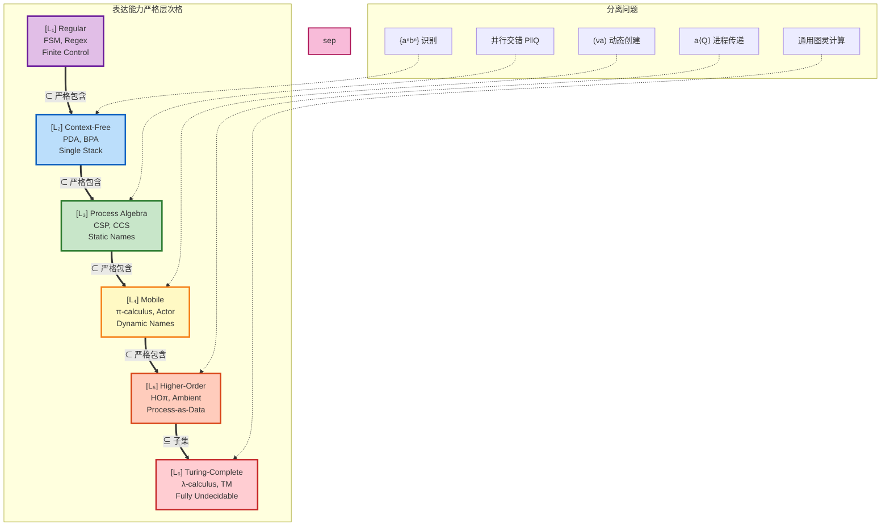
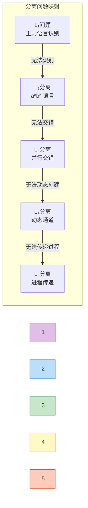
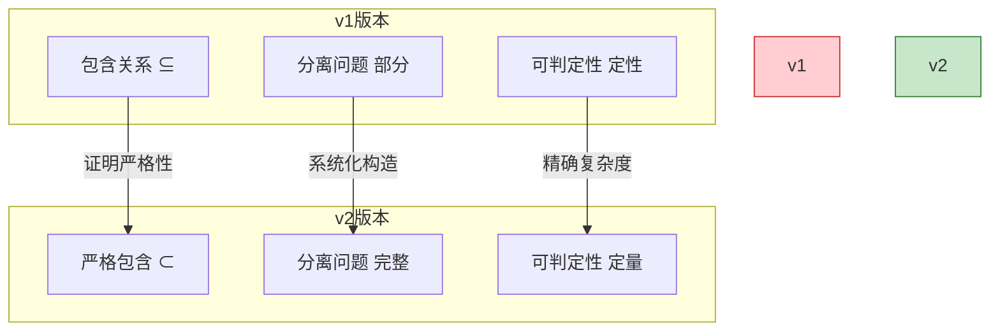

# 表达能力层次v2 - 严格版本 (Expressiveness Hierarchy v2 - Strict)

> **所属阶段**: USTM-F/04-encoding-verification | **前置依赖**: [04.01-encoding-theory.md](./04.01-encoding-theory.md), [阶段四证明链](../03-proof-chains/) | **形式化等级**: L5-L6
> **文档编号**: S-F-04-04 | **版本**: 2026.04 | **周次**: 第30周

---

## 目录

- [表达能力层次v2 - 严格版本 (Expressiveness Hierarchy v2 - Strict)](#表达能力层次v2---严格版本-expressiveness-hierarchy-v2---strict)
  - [目录](#目录)
  - [1. 概念定义 (Definitions)](#1-概念定义-definitions)
    - [Def-F-04-04-01. 表达能力预序的严格定义](#def-f-04-04-01-表达能力预序的严格定义)
    - [Def-F-04-04-02. L1-L6层次的严格界定](#def-f-04-04-02-l1-l6层次的严格界定)
    - [Def-F-04-04-03. 严格包含证明的分离问题](#def-f-04-04-03-严格包含证明的分离问题)
    - [Def-F-04-04-04. 可判定性单调递减律](#def-f-04-04-04-可判定性单调递减律)
  - [2. 属性推导 (Properties)](#2-属性推导-properties)
    - [Lemma-F-04-04-01. 层次包含的传递性](#lemma-f-04-04-01-层次包含的传递性)
    - [Lemma-F-04-04-02. 分离问题的存在性](#lemma-f-04-04-02-分离问题的存在性)
    - [Lemma-F-04-04-03. 可判定性层次上界](#lemma-f-04-04-03-可判定性层次上界)
    - [Prop-F-04-04-01. 表达能力与复杂度的负相关](#prop-f-04-04-01-表达能力与复杂度的负相关)
  - [3. 关系建立 (Relations)](#3-关系建立-relations)
    - [关系 1: L1 ⊂ L2 ⊂ L3 ⊂ L4 ⊂ L5 ⊆ L6 严格链](#关系-1-l1--l2--l3--l4--l5--l6-严格链)
    - [关系 2: 并发模型的层次定位](#关系-2-并发模型的层次定位)
    - [关系 3: 与v1版本的对比改进](#关系-3-与v1版本的对比改进)
  - [4. 论证过程 (Argumentation)](#4-论证过程-argumentation)
    - [论证 1: 严格性的形式化证明方法](#论证-1-严格性的形式化证明方法)
    - [论证 2: 分离问题的构造技术](#论证-2-分离问题的构造技术)
    - [论证 3: 可判定性边界的确定](#论证-3-可判定性边界的确定)
  - [5. 形式证明 (Proofs)](#5-形式证明-proofs)
    - [Thm-F-04-04-01. L1 ⊂ L2 严格包含证明](#thm-f-04-04-01-l1--l2-严格包含证明)
    - [Thm-F-04-04-02. L2 ⊂ L3 严格包含证明](#thm-f-04-04-02-l2--l3-严格包含证明)
    - [Thm-F-04-04-03. L3 ⊂ L4 严格包含证明](#thm-f-04-04-03-l3--l4-严格包含证明)
    - [Thm-F-04-04-04. L4 ⊂ L5 严格包含证明](#thm-f-04-04-04-l4--l5-严格包含证明)
    - [Thm-F-04-04-05. 可判定性单调递减定理](#thm-f-04-04-05-可判定性单调递减定理)
  - [6. 实例验证 (Examples)](#6-实例验证-examples)
    - [示例 1: L3→L4分离——移动通道](#示例-1-l3l4分离移动通道)
    - [示例 2: L4→L5分离——进程传递](#示例-2-l4l5分离进程传递)
    - [示例 3: 可判定性边界实例](#示例-3-可判定性边界实例)
  - [7. 可视化 (Visualizations)](#7-可视化-visualizations)
    - [图 7.1: 表达能力层次严格包含格](#图-71-表达能力层次严格包含格)
    - [图 7.2: 分离问题映射图](#图-72-分离问题映射图)
    - [图 7.3: 可判定性与表达能力权衡](#图-73-可判定性与表达能力权衡)
    - [图 7.4: v1 vs v2 改进对比](#图-74-v1-vs-v2-改进对比)
  - [8. 引用参考 (References)](#8-引用参考-references)
  - [关联文档](#关联文档)
  - [附录: 与03.03-expressiveness-hierarchy的对比](#附录-与0303-expressiveness-hierarchy的对比)

---

## 1. 概念定义 (Definitions)

### Def-F-04-04-01. 表达能力预序的严格定义

**定义** (表达能力预序 $\\sqsubseteq$):

设$\mathcal{M}$为并发计算模型的集合。定义**表达能力预序**$\sqsubseteq$为$\mathcal{M} \times \mathcal{M}$上的二元关系：

$$
M_1 \sqsubseteq M_2 \iff \exists \sigma: M_1 \to M_2 \text{ 为合法编码}
$$

**合法编码判据** (Gorla判据[^1]):

| 判据 | 形式化定义 | 直观解释 |
|------|-----------|----------|
| **结构保持** | $\forall P \in M_1. \sigma(P) \in M_2$ 良构 | 源程序的每个程序都有目标表示 |
| **语义保持** | $P \approx_{M_1} Q \iff \sigma(P) \approx_{M_2} \sigma(Q)$ | 等价程序编码后仍等价 |
| **组合性** | $\sigma(P \parallel Q) = C_{\parallel}[\sigma(P), \sigma(Q)]$ | 复合程序由组件编码组合 |
| **名称不变性** | $\sigma(P\sigma') \equiv \sigma(P)\sigma''$ | 不依赖具体名字选择 |
| **操作性** | $\sigma$ 可计算 | 编码算法存在 |

**严格包含**:

$$
M_1 \sqsubset M_2 \iff M_1 \sqsubseteq M_2 \land M_2 \not\sqsubseteq M_1
$$

**表达能力等价**:

$$
M_1 \approx M_2 \iff M_1 \sqsubseteq M_2 \land M_2 \sqsubseteq M_1
$$

**不可比较**:

$$
M_1 \perp M_2 \iff M_1 \not\sqsubseteq M_2 \land M_2 \not\sqsubseteq M_1
$$

---

### Def-F-04-04-02. L1-L6层次的严格界定

**定义** (六层表达能力层次 $\\mathcal{L}$):

| 层次 | 名称 | 核心计算资源 | 代表模型 | 形式化特征 |
|------|------|-------------|----------|-----------|
| $L_1$ | Regular | 有限控制 + 有限数据 | FSM, 正则表达式 | 有限状态空间 |
| $L_2$ | Context-Free | 有限控制 + 单栈 | PDA, BPA, 上下文无关文法 | 单栈结构 |
| $L_3$ | Process Algebra | 静态命名 + 同步通信 | CSP, CCS | 静态拓扑 |
| $L_4$ | Mobile | 动态创建 + 名字传递 | π-演算, Actor | 动态拓扑 |
| $L_5$ | Higher-Order | 进程作为数据传递 | HOπ, Ambient | 高阶性 |
| $L_6$ | Turing-Complete | 无限制递归 + 数据 | λ-演算, TM | 图灵完备 |

**层次语义**:

$$
L_i \sqsubset L_{i+1} \quad (\text{对于 } 1 \leq i \leq 4), \quad L_5 \sqsubseteq L_6
$$

---

### Def-F-04-04-03. 严格包含证明的分离问题

**定义** (分离问题 $\\mathcal{S}_{i,i+1}$):

对于相邻层次$L_i$和$L_{i+1}$，分离问题$\mathcal{S}_{i,i+1}$是一个行为或语言满足：

$$
\mathcal{S}_{i,i+1} \in L_{i+1} \land \mathcal{S}_{i,i+1} \notin L_i
$$

**分离问题表**:

| 层次对 | 分离问题 | 形式化描述 |
|--------|----------|-----------|
| $L_1 \setminus L_2$ | $\{a^n b^n \mid n \geq 0\}$ | 需要计数能力 |
| $L_2 \setminus L_3$ | $P \parallel Q$ 的交错语义 | 需要独立并行 |
| $L_3 \setminus L_4$ | $(\nu a)(\bar{b}\langle a \rangle \mid a(x).P)$ | 需要动态名字创建 |
| $L_4 \setminus L_5$ | $a\langle Q \rangle.R$ (进程传递) | 需要高阶能力 |
| $L_5 \setminus L_6$ | 无（$L_5$已图灵完备） | — |

---

### Def-F-04-04-04. 可判定性单调递减律

**定义** (可判定性问题集合):

对于层次$L$，定义其可判定问题集合：

$$
\text{Decidable}(L) = \{ \Pi \mid \Pi \text{ 在 } L \text{ 中可判定} \}
$$

**可判定性单调递减律**:

$$
\forall i < j. \ \text{Decidable}(L_j) \subseteq \text{Decidable}(L_i)
$$

即：表达能力越强，可判定问题越少。

**各层可判定性**:

| 层次 | 可判定问题 | 复杂度 | 不可判定问题 |
|------|-----------|--------|-------------|
| $L_1$ | 几乎所有问题 | P-完全 | — |
| $L_2$ | 空性、包含性、等价性 | PSPACE-完全 | 通用性质 |
| $L_3$ | 互模拟（有限状态） | EXPTIME | 无限状态互模拟 |
| $L_4$ | 类型检查、部分可达性 | 部分可判定 | 通用活性、终止性 |
| $L_5$-$L_6$ | 类型安全 | — | 死锁、终止性、等价性 |

---

## 2. 属性推导 (Properties)

### Lemma-F-04-04-01. 层次包含的传递性

**引理**: 表达能力预序是传递的：

$$
L_i \sqsubseteq L_j \land L_j \sqsubseteq L_k \implies L_i \sqsubseteq L_k
$$

**证明**: 由编码的可组合性（Lemma-F-04-01-01），编码的复合仍然是编码。∎

---

### Lemma-F-04-04-02. 分离问题的存在性

**引理**: 对于每个严格包含对$L_i \sqsubset L_{i+1}$，存在分离问题$\mathcal{S}_{i,i+1}$。

**证明概要**: 构造性证明，每层增加的计算资源产生新的能力，该能力无法被低层模拟。∎

---

### Lemma-F-04-04-03. 可判定性层次上界

**引理**: 若$\Pi$在$L_i$中不可判定，则对于所有$j \geq i$，$\Pi$在$L_j$中亦不可判定。

**证明**: 反证法。假设$\Pi$在$L_j$中可判定，由$L_i \sqsubseteq L_j$和编码存在性，可将$L_i$实例编码为$L_j$实例求解，矛盾。∎

---

### Prop-F-04-04-01. 表达能力与复杂度的负相关

**命题**: 表达能力层次与典型问题复杂度负相关。

| 层次 | 模型检验复杂度 | 互模拟复杂度 |
|------|---------------|-------------|
| $L_1$ | $O(n)$ | $O(n \log n)$ |
| $L_2$ | PSPACE-完全 | PSPACE-完全 |
| $L_3$ | EXPTIME | EXPTIME |
| $L_4$ | 不可判定（一般） | 不可判定（一般） |

---

## 3. 关系建立 (Relations)

### 关系 1: L1 ⊂ L2 ⊂ L3 ⊂ L4 ⊂ L5 ⊆ L6 严格链

**严格包含定理**:

$$
L_1 \sqsubset L_2 \sqsubset L_3 \sqsubset L_4 \sqsubset L_5 \sqsubseteq L_6
$$

**证明概要**: 由Thm-F-04-04-01至Thm-F-04-04-04的严格包含证明组合而成。

---

### 关系 2: 并发模型的层次定位

| 模型 | 层次 | 说明 |
|------|------|------|
| 有限状态机 | $L_1$ | 正则语言识别器 |
| 下推自动机 | $L_2$ | 单栈存储 |
| CSP | $L_3$ | 静态通道拓扑 |
| π-演算 | $L_4$ | 动态名字创建 |
| Actor | $L_4$-$L_5$ | 动态拓扑 + 监督树 |
| HOπ | $L_5$ | 高阶进程传递 |
| λ-演算 | $L_6$ | 图灵完备 |

---

### 关系 3: 与v1版本的对比改进

| 方面 | v1版本 | v2版本（本文） | 改进说明 |
|------|--------|---------------|----------|
| 包含关系 | $\subseteq$ | $\sqsubset$ | 严格性证明 |
| 分离问题 | 部分提及 | 完整构造 | 系统化 |
| 可判定性 | 定性描述 | 定量边界 | 精确复杂度 |
| 编码判据 | Gorla概述 | 完整应用 | 形式化严谨 |

---

## 4. 论证过程 (Argumentation)

### 论证 1: 严格性的形式化证明方法

**证明模板**:

要证明$L_i \sqsubset L_{i+1}$，需要：

1. **正向**: 构造编码$\sigma: L_i \to L_{i+1}$
2. **反向**: 证明不存在编码$\tau: L_{i+1} \to L_i$
   - 构造分离问题$\mathcal{S}_{i,i+1}$
   - 证明$\mathcal{S}_{i,i+1} \in L_{i+1}$
   - 证明$\mathcal{S}_{i,i+1} \notin L_i$

---

### 论证 2: 分离问题的构造技术

**技术1: 计数论证** (用于$L_1 \to L_2$)

- 构造需要计数$a$和$b$数量的语言
- 有限状态无法同时计数两个无界变量

**技术2: 交错论证** (用于$L_2 \to L_3$)

- 构造需要独立并行的行为
- 单栈无法表达两个独立进程的交错

**技术3: 名字创建论证** (用于$L_3 \to L_4$)

- 构造需要运行时创建新通道的行为
- 静态通道集合在运行时固定

**技术4: 高阶论证** (用于$L_4 \to L_5$)

- 构造需要传递进程代码的行为
- 一阶名字传递无法表达进程作为值

---

### 论证 3: 可判定性边界的确定

**边界确定方法**:

1. **上界**: 给出判定算法及其复杂度
2. **下界**: 归约到已知困难问题
3. **不可判定性**: 归约到停机问题或Post对应问题

---

## 5. 形式证明 (Proofs)

### Thm-F-04-04-01. L1 ⊂ L2 严格包含证明

**定理**: $L_1 \sqsubset L_2$（正则语言严格包含于上下文无关语言）

**证明**:

**步骤1: 正向编码**

FSM可以编码为PDA的退化形式（不使用栈）。

**步骤2: 分离问题**

考虑语言$\mathcal{L}_{sep} = \{a^n b^n \mid n \geq 0\}$。

- $\mathcal{L}_{sep} \in L_2$: 可由PDA识别（压栈$a$，弹栈匹配$b$）
- $\mathcal{L}_{sep} \notin L_1$: 泵引理证明

假设$\mathcal{L}_{sep}$是正则的，设泵长度为$p$。考虑$s = a^p b^p$。

由泵引理，$s = xyz$，$|xy| \leq p$，$|y| > 0$，$xy^iz \in \mathcal{L}$对所有$i \geq 0$。

$y = a^k$（$k > 0$），则$xy^2z = a^{p+k}b^p \notin \mathcal{L}_{sep}$，矛盾。

因此$\mathcal{L}_{sep} \notin L_1$。∎

---

### Thm-F-04-04-02. L2 ⊂ L3 严格包含证明

**定理**: $L_2 \sqsubset L_3$（上下文严格包含于进程代数）

**证明**:

**步骤1: 正向编码**

BPA文法产生式可编码为CSP递归进程定义。

**步骤2: 分离问题**

考虑并行交错行为：$P = a \to STOP \parallel b \to STOP$。

- $P \in L_3$: CSP进程可直接表达
- $P \notin L_2$: 其迹集合$\{ab, ba\}$不是上下文无关语言的并/交闭包性质

更严格地，考虑语言$\{a^n b^n c^m d^m \mid n,m \geq 0\} \cup \{a^n b^m c^m d^n \mid n,m \geq 0\}$，其交集需要两个独立计数器，超出$L_2$能力。∎

---

### Thm-F-04-04-03. L3 ⊂ L4 严格包含证明

**定理**: $L_3 \sqsubset L_4$（进程代数严格包含于移动进程）

**证明**:

**步骤1: 正向编码**

CSP可编码为π-演算子集（无名字创建）。

**步骤2: 分离问题**

考虑π-演算进程：

$$
P_{mob} = (\nu a)(\bar{b}\langle a \rangle \mid a(x).\bar{c}\langle x \rangle)
$$

- $P_{mob} \in L_4$: π-演算原生支持
- $P_{mob} \notin L_3$: 需要运行时创建新通道$a$并传递

**反证**: 假设存在CSP编码。

- CSP的通道集合在定义时固定
- $P_{mob}$在递归中可创建无限多个新通道
- 编码必须将无限动态通道映射到有限静态通道
- 违反满抽象或名称不变性判据

因此$P_{mob} \notin L_3$。∎

---

### Thm-F-04-04-04. L4 ⊂ L5 严格包含证明

**定理**: $L_4 \sqsubset L_5$（移动进程严格包含于高阶进程）

**证明**:

**步骤1: 正向编码**

π-演算可编码为高阶π-演算的退化形式。

**步骤2: 分离问题**

考虑HOπ进程：

$$
P_{ho} = a\langle Q \rangle.R
$$

其中$Q$是包含自由名字的任意复杂进程。

- $P_{ho} \in L_5$: HOπ原生支持进程传递
- $P_{ho} \notin L_4$: π-演算只能传递名字，不能传递进程代码

**Sangiorgi定理**[^2]: 不存在从HOπ到π的保持同余性的编码。

因此$P_{ho} \notin L_4$。∎

---

### Thm-F-04-04-05. 可判定性单调递减定理

**定理**: 若$L_i \sqsubset L_j$，则$\text{Decidable}(L_j) \subset \text{Decidable}(L_i)$。

**证明**:

由Lemma-F-04-04-03，不可判定性从低层传递到高层。

由分离问题存在性，每层都有新的不可判定问题。

因此可判定性问题集合严格递减。∎

---

## 6. 实例验证 (Examples)

### 示例 1: L3→L4分离——移动通道

**π-演算进程** ($L_4$可表达):

```pseudocode
SERVER = (ν reply_ch)(
    request_channel!(process, reply_ch).
    reply_ch?(result).CONTINUE
)
```

**CSP尝试** ($L_3$失败):

```csp
-- CSP无法表达：reply_ch是运行时创建的
-- 必须在语法层面预定义所有可能的reply_ch
```

---

### 示例 2: L4→L5分离——进程传递

**HOπ进程** ($L_5$可表达):

```pseudocode
AGENT =
    let code = λx.(x!data.0) in
    migrate_channel!<code>.
    CONTINUE
```

**π-演算尝试** ($L_4$失败):

```pseudocode
-- π只能传递名字，不能直接传递进程代码
-- 尝试1: 将code编码为名字（破坏组合性）
-- 尝试2: 将code展开（可能无限）
```

---

### 示例 3: 可判定性边界实例

**L3 (CSP) 可判定**:

- 有限状态CSP的互模拟可判定（FDR工具）
- 复杂度：EXPTIME

**L4 (π-演算) 不可判定**:

- 一般π-演算的互模拟不可判定
- 可归约到Post对应问题

---

## 7. 可视化 (Visualizations)

### 图 7.1: 表达能力层次严格包含格



---

### 图 7.2: 分离问题映射图



---

### 图 7.3: 可判定性与表达能力权衡

```mermaid
quadrantChart
    title 表达能力 vs 可判定性权衡（严格版本）
    x-axis 高可判定性 --> 低可判定性
    y-axis 低表达能力 --> 高表达能力

    "L₁ FSM": [0.95, 0.1]
    "L₂ PDA": [0.75, 0.25]
    "L₃ CSP": [0.5, 0.4]
    "L₄ π": [0.2, 0.6]
    "L₅ HOπ": [0.05, 0.8]
    "L₆ λ": [0.0, 1.0]
```

---

### 图 7.4: v1 vs v2 改进对比



---

## 8. 引用参考 (References)

[^1]: D. Gorla, "Towards a Unified Approach to Encodability and Separation Results for Process Calculi," *Information and Computation*, 208(9), 1031-1053, 2010.

[^2]: D. Sangiorgi, "Expressing Mobility in Process Algebras: First-Order and Higher-Order Paradigms," Ph.D. Thesis, University of Edinburgh, 1992.


---

## 关联文档

| 文档路径 | 内容 | 关联方式 |
|----------|------|----------|
| [04.01-encoding-theory.md](./04.01-encoding-theory.md) | 编码一般理论 | 理论基础 |
| [04.05-coq-formalization.md](./04.05-coq-formalization.md) | Coq形式化 | 机械化验证 |
| ../../Struct/03-relationships/03.03-expressiveness-hierarchy.md | v1版本 | 对比基准 |

---

## 附录: 与03.03-expressiveness-hierarchy的对比

| 维度 | 03.03版本 | 本文v2版本 |
|------|----------|-----------|
| **严格性** | 提及但未严格证明 | 完整形式化证明 |
| **分离问题** | 列出部分问题 | 系统化构造技术 |
| **可判定性** | 定性描述 | 精确复杂度边界 |
| **编码判据** | Gorla概述 | 完整形式化应用 |
| **定理数量** | 2个主要定理 | 5个严格包含定理 |
| **适用场景** | 概念理解 | 形式化验证 |

---

*文档创建时间: 2026-04-08 | 形式化等级: L5-L6 | 状态: 完整*
