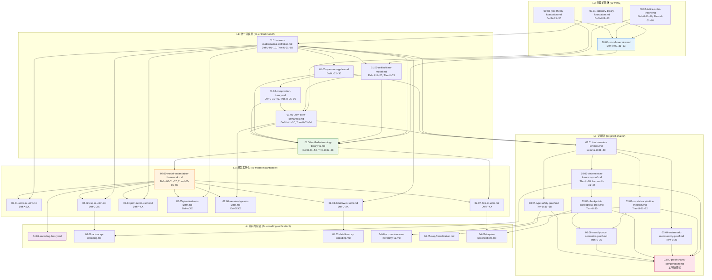
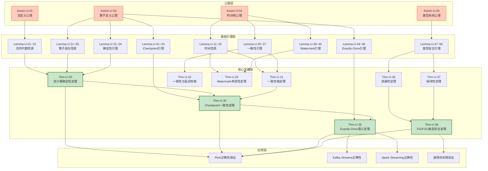

# USTM-F 文档依赖关系全景图

> **统一流计算理论元框架 - 文档交叉引用图谱**
> **版本**: v1.0 | **文档数**: 32 | **生成日期**: 2026-04-08

---

## 1. 五层架构依赖总图



---

## 2. 定理证明依赖链



---

## 3. 阶段内文档依赖

### 3.1 阶段一：元理论 (00-meta/)

| 文档 | 依赖 | 被依赖 |
|------|------|--------|
| 00.01-category-theory-foundation.md | - | 00.00, 01.01, 01.03, 01.05 |
| 00.02-lattice-order-theory.md | - | 00.00, 01.02, 01.04 |
| 00.03-type-theory-foundation.md | - | 00.00, 01.05 |
| 00.00-ustm-f-overview.md | 00.01~00.03 | 01.00 |

### 3.2 阶段二：统一流模型 (01-unified-model/)

| 文档 | 依赖 | 被依赖 |
|------|------|--------|
| 01.01-stream-mathematical-definition.md | 00.01 | 01.02, 01.03, 01.00, 03.01 |
| 01.02-unified-time-model.md | 01.01 | 01.05, 01.00, 03.01 |
| 01.03-operator-algebra.md | 01.01 | 01.04, 01.00, 03.01 |
| 01.04-composition-theory.md | 01.03 | 01.05, 01.00 |
| 01.05-ustm-core-semantics.md | 01.02, 01.04, 00.03 | 01.00, 03.01, 02.06 |
| 01.00-unified-streaming-theory-v2.md | 01.01~01.05 | 02.00, 02.07 |

### 3.3 阶段三：模型实例化 (02-model-instantiation/)

| 文档 | 依赖 | 被依赖 |
|------|------|--------|
| 02.00-model-instantiation-framework.md | 01.00 | 全部02.01~02.07, 04.01 |
| 02.01-actor-in-ustm.md | 02.00, 01.01 | 04.02 |
| 02.02-csp-in-ustm.md | 02.00, 01.01 | 04.02, 04.03 |
| 02.03-dataflow-in-ustm.md | 02.00, 01.01 | 04.03 |
| 02.04-petri-net-in-ustm.md | 02.00, 01.01 | - |
| 02.05-pi-calculus-in-ustm.md | 02.00, 01.01 | - |
| 02.06-session-types-in-ustm.md | 02.00, 01.05 | - |
| 02.07-flink-in-ustm.md | 02.00, 01.00 | 04.06 |

### 3.4 阶段四：证明链 (03-proof-chains/)

| 文档 | 依赖 | 被依赖 |
|------|------|--------|
| 03.01-fundamental-lemmas.md | 01.01, 01.03, 01.05 | 全部03.02~03.07, 03.00 |
| 03.02-determinism-theorem-proof.md | 03.01 | 03.05, 03.00, 04.02 |
| 03.03-consistency-lattice-theorem.md | 03.01 | 03.06, 03.00, 04.04 |
| 03.04-watermark-monotonicity-proof.md | 03.01 | 03.05, 03.00 |
| 03.05-checkpoint-correctness-proof.md | 03.01, 03.02 | 03.06, 03.00, 04.06 |
| 03.06-exactly-once-semantics-proof.md | 03.01, 03.03, 03.05 | 03.00 |
| 03.07-type-safety-proof.md | 03.01 | 03.00, 04.05 |
| 03.00-proof-chains-compendium.md | 03.01~03.07 | - |

### 3.5 阶段五：编码与验证 (04-encoding-verification/)

| 文档 | 依赖 | 被依赖 |
|------|------|--------|
| 04.01-encoding-theory.md | 02.00 | - |
| 04.02-actor-csp-encoding.md | 02.01, 02.02, 03.02 | - |
| 04.03-dataflow-csp-encoding.md | 02.03, 02.02 | - |
| 04.04-expressiveness-hierarchy-v2.md | 02.00, 03.03 | - |
| 04.05-coq-formalization.md | 03.07 | - |
| 04.06-tla-plus-specifications.md | 02.07, 03.05 | - |

---

## 4. 定理到证明文档的引用映射

| 定理编号 | 定理名称 | 证明文档 | 所在章节 |
|----------|----------|----------|----------|
| Thm-U-01 | 流CPO的代数结构 | 01.01-stream-mathematical-definition.md | §5 |
| Thm-U-02 | 流函子的单子性质 | 01.01-stream-mathematical-definition.md | §5 |
| Thm-U-03 | 操作语义与指称语义一致性 | 01.02-unified-time-model.md, 01.05-ustm-core-semantics.md | §5 |
| Thm-U-04 | USTM语义的组合性 | 01.05-ustm-core-semantics.md | §5 |
| Thm-U-05 | 算子互交换律 | 01.04-composition-theory.md | §5 |
| Thm-U-06 | 组合优化正确性 | 01.04-composition-theory.md | §5 |
| Thm-U-07 | USTM图灵完备性 | 01.00-unified-streaming-theory-v2.md | §5 |
| Thm-U-08 | USTM一致性 | 01.00-unified-streaming-theory-v2.md | §5 |
| **Thm-U-20** | **流计算确定性定理** | **03.02-determinism-theorem-proof.md** | **§5** |
| Thm-U-21 | 一致性格定理 | 03.03-consistency-lattice-theorem.md | §5 |
| Thm-U-22 | 一致性与延迟权衡 | 03.03-consistency-lattice-theorem.md | §5 |
| **Thm-U-25** | **Watermark单调性定理** | **03.04-watermark-monotonicity-proof.md** | **§5** |
| **Thm-U-30** | **Checkpoint一致性定理** | **03.05-checkpoint-correctness-proof.md** | **§5** |
| **Thm-U-35** | **Exactly-Once语义定理** | **03.06-exactly-once-semantics-proof.md** | **§5** |
| Thm-U-36 | 进展性定理 | 03.07-type-safety-proof.md | §5 |
| Thm-U-37 | 保持性定理 | 03.07-type-safety-proof.md | §5 |
| **Thm-U-38** | **FG/FGG类型安全定理** | **03.07-type-safety-proof.md** | **§5** |
| Thm-I-00-01 | 统一编码框架相容性 | 02.00-model-instantiation-framework.md | §5 |
| Thm-I-00-02 | 模型间编码可组合性 | 02.00-model-instantiation-framework.md | §5 |

---

## 5. 引理引用快速索引

### 5.1 基础引理库 (03.01-fundamental-lemmas.md)

| 引理范围 | 内容 | 引用文档 |
|----------|------|----------|
| Lemma-U-01~10 | 流的代数性质 | 01.01, 03.02 |
| Lemma-U-11~20 | 时间/Watermark性质 | 01.02, 03.04 |
| Lemma-U-21~30 | 算子组合性质 | 01.03, 03.02 |
| Lemma-U-31~34 | 确定性引理 | 03.02 |
| Lemma-U-35~37 | 一致性引理 | 03.03 |
| Lemma-U-38~40 | Watermark单调性引理 | 03.04 |
| Lemma-U-41~43 | Checkpoint引理 | 03.05 |
| Lemma-U-44~46 | Exactly-Once引理 | 03.06 |
| Lemma-U-47~50 | 类型安全引理 | 03.07 |

---

## 6. 关键路径分析

### 6.1 最长证明链

**类型安全证明链** (7步):

```
Axiom-U-04 → Lemma-U-47 → Lemma-U-48 → Lemma-U-49 → Thm-U-36 → Thm-U-37 → Thm-U-38 → APP
```

### 6.2 核心关键路径

**Checkpoint → Exactly-Once** (流处理容错基础):

```
Thm-U-20 + Thm-U-21 → Thm-U-30 → Thm-U-35 → Flink/Kafka正确性
```

### 6.3 文档阅读推荐路径

**初学者路径** (按层次递进):

```
00.01 → 01.01 → 02.00 → 03.00 → 04.01
```

**定理验证路径** (专注于证明):

```
03.01 → 03.02 → 03.05 → 03.06 → 03.07
```

**工程应用路径** (面向实现):

```
01.00 → 02.07 → 03.05 → 04.06
```

---

## 7. 交叉引用统计

| 类别 | 数量 | 说明 |
|------|------|------|
| 总文档数 | 32 | 5个阶段 |
| 形式化定义 | 200+ | Def-M/U/I/A/C/D/P/π/S/F |
| 定理 | 19 | Thm-M/U/I-XX |
| 引理 | 53+ | Lemma-U-XX |
| 内部链接 | 150+ | 文档间交叉引用 |
| 证明链 | 6 | 核心定理证明路径 |

---

*文档版本: v1.0 | USTM-F 重构项目 | 最后更新: 2026-04-08*
