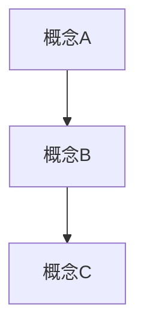
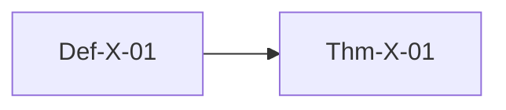

# USTM-F 文档模板

> **文档类型**: [阶段一/二/三/四/五] | **形式化等级**: L1-L6 | **编号**: XX.XX-xxx

---

## 目录

- [USTM-F 文档模板](#ustm-f-文档模板)
  - [目录](#目录)
  - [0. 前置依赖](#0-前置依赖)
  - [1. 概念定义 (Definitions)](#1-概念定义-definitions)
    - [Def-X-01: \[定义名称\]](#def-x-01-定义名称)
  - [2. 属性推导 (Properties)](#2-属性推导-properties)
    - [Lemma-X-01: \[引理名称\]](#lemma-x-01-引理名称)
  - [3. 关系建立 (Relations)](#3-关系建立-relations)
  - [4. 论证过程 (Argumentation)](#4-论证过程-argumentation)
    - [4.1 辅助定理](#41-辅助定理)
    - [4.2 反例分析](#42-反例分析)
    - [4.3 边界讨论](#43-边界讨论)
  - [5. 形式证明 (Formal Proof)](#5-形式证明-formal-proof)
    - [Thm-X-01: \[定理名称\]](#thm-x-01-定理名称)
  - [6. 实例验证 (Examples)](#6-实例验证-examples)
    - [示例1: \[名称\]](#示例1-名称)
    - [示例2: \[名称\]](#示例2-名称)
  - [7. 可视化 (Visualizations)](#7-可视化-visualizations)
  - [8. 引用参考 (References)](#8-引用参考-references)
  - [附录](#附录)
    - [A. 符号表](#a-符号表)
    - [B. 依赖图](#b-依赖图)

## 0. 前置依赖

列出本文档依赖的其他文档：

- 依赖1: [文档链接]
- 依赖2: [文档链接]

---

## 1. 概念定义 (Definitions)

### Def-X-01: [定义名称]

**形式化定义**:

```
数学符号定义
```

**直观解释**:
[用自然语言解释定义]

**示例**:
[具体例子]

---

## 2. 属性推导 (Properties)

### Lemma-X-01: [引理名称]

**陈述**:

```
给定...，则...
```

**证明**:

1. 步骤1...
2. 步骤2...
3. 因此...

**∎**

---

## 3. 关系建立 (Relations)

与其他概念/模型/系统的关系：

- 与[概念A]的关系: ...
- 与[概念B]的关系: ...

---

## 4. 论证过程 (Argumentation)

### 4.1 辅助定理

### 4.2 反例分析

### 4.3 边界讨论

---

## 5. 形式证明 (Formal Proof)

### Thm-X-01: [定理名称]

**定理陈述**:

```
形式化陈述
```

**证明**:

```
完整的、严格的、从公理出发的证明
每一步都必须是逻辑推导
```

**证明复杂度**: [时间/空间复杂度]
**可判定性**: [是/否]

**∎**

---

## 6. 实例验证 (Examples)

### 示例1: [名称]

```python
# 代码示例
```

### 示例2: [名称]

```coq
(* Coq形式化 *)
```

---

## 7. 可视化 (Visualizations)



---

## 8. 引用参考 (References)


---

## 附录

### A. 符号表

| 符号 | 含义 |
|------|------|
| $\mathcal{C}$ | 范畴 |
| $\mathbb{S}$ | 流类型 |

### B. 依赖图


