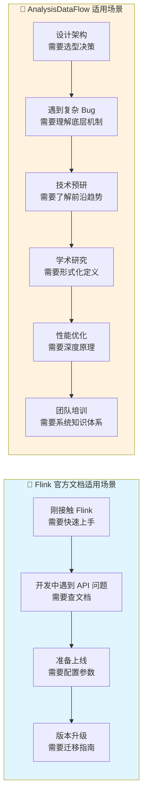
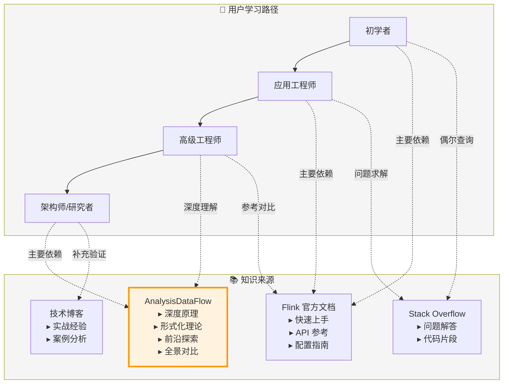
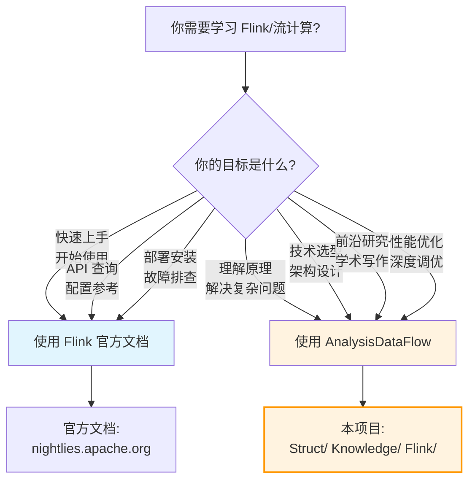

# AnalysisDataFlow 价值主张

> **定位**: 流计算领域的"形式化理论补充 + 前沿探索实验室"
>
> **使命**: 为流计算研究者和高级工程师提供官方文档之外的深度知识

---

## 1. 项目定位声明

### 1.1 核心定位

```
┌─────────────────────────────────────────────────────────────────┐
│                                                                 │
│   Apache Flink 官方文档          AnalysisDataFlow (本项目)       │
│   ─────────────────────          ─────────────────────          │
│                                                                 │
│   📖 "How to use"                🔬 "Why it works"              │
│   📖 "What to do"                🔬 "What lies beneath"         │
│   📖 "Quick start"               🔬 "Deep understanding"        │
│                                                                 │
│   ━━━━━━━━━━━━━━━━━━━━━━━━━━━━━━━━━━━━━━━━━━━━━━━━━━━━━━━━━━━   │
│                                                                 │
│   我们的角色: 官方文档的「理论补充者」和「前沿探索者」            │
│                                                                 │
└─────────────────────────────────────────────────────────────────┘
```

### 1.2 价值主张公式

```
AnalysisDataFlow = 形式化理论深度 + 前沿技术探索 + 全景对比视野
                 ─────────────────────────────────────────────────
                 官方文档未覆盖的「深度知识缺口」
```

---

## 2. 与 Flink 官方文档对比矩阵

### 2.1 多维度对比

| 维度 | Flink 官方文档 | AnalysisDataFlow (本项目) |
|------|----------------|---------------------------|
| **首要目标** | 帮助用户快速上手并正确使用 | 帮助用户深度理解原理并做技术决策 |
| **内容焦点** | 稳定特性的操作指南 | 前沿探索与理论基础 |
| **叙述风格** | 实用主义、简洁明了 | 形式化分析、严格论证 |
| **目标受众** | 应用工程师、初学者 | 研究者、架构师、高级工程师 |
| **更新节奏** | 随版本发布更新 | 持续跟踪前沿研究与社区动态 |
| **深度层次** | API 层面、配置层面 | 原理层面、架构层面、理论层面 |
| **广度覆盖** | 专注 Flink 生态 | 多引擎对比、跨范式分析 |
| **代码示例** | 简洁、可直接运行 | 深度、带原理说明 |
| **可视化** | 架构示意图 | 决策树、对比矩阵、知识图谱 |
| **数学形式化** | 无 | 定理/定义/证明体系 |

### 2.2 内容类型对比

| 内容类型 | 官方文档 | 本项目 |
|----------|----------|--------|
| API 参考手册 | ✅ 完整详细 | ❌ 不重复 |
| 安装部署指南 | ✅ 逐步教程 | ❌ 不重复 |
| 配置参数说明 | ✅ 详尽罗列 | ❌ 不重复 |
| Checkpoint 原理 | ⚠️ 概念概述 | ✅ 形式化证明 |
| Exactly-Once 语义 | ⚠️ 机制说明 | ✅ 严格定义与证明 |
| Watermark 理论 | ⚠️ 使用指南 | ✅ 单调性定理 |
| 引擎对比选型 | ❌ 不涉及 | ✅ 多维度对比矩阵 |
| 前沿技术趋势 | ❌ 不涉及 | ✅ AI Agents、流数据库等 |
| 形式化验证 | ❌ 不涉及 | ✅ TLA+、Smart Casual |
| 类型系统分析 | ❌ 不涉及 | ✅ Session Types、DOT |
| 设计模式总结 | ❌ 不涉及 | ✅ 45+ 流处理模式 |
| 反模式识别 | ❌ 不涉及 | ✅ 10+ 反模式分析 |

### 2.3 使用场景对比



---

## 3. 三大核心价值

### 3.1 价值一：形式化理论深度

> **我们相信：深度理解原理是做出正确技术决策的基础**

| 理论领域 | 具体内容 | 代表文档 |
|----------|----------|----------|
| **进程演算** | CCS/CSP/π-calculus 建模流计算 | `Struct/01-foundation/` |
| **类型系统** | Session Types、FGG、DOT | `Struct/03-relationships/` |
| **正确性证明** | Checkpoint 正确性、Exactly-Once 语义 | `Struct/04-proofs/` |
| **一致性模型** | 流计算一致性层级体系 | `Struct/02-properties/` |
| **形式化验证** | TLA+、Coq、Smart Casual | `Struct/07-tools/` |

**核心价值点**:

- 提供严格的数学定义，消除概念歧义
- 建立定理-引理-证明的完整论证链条
- 为工程实践提供理论支撑

### 3.2 价值二：前沿技术探索

> **我们追踪：流计算领域的最新发展趋势与研究方向**

| 前沿领域 | 具体内容 | 代表文档 |
|----------|----------|----------|
| **AI Agents** | Flink + LLM 集成、智能决策流 | `Flink/06-ai-ml/flip-531-ai-agents-ga-guide.md` |
| **流数据库** | RisingWave、Materialize 对比 | `Knowledge/06-frontier/streaming-database-frontier.md` |
| **边缘计算** | 边缘流处理架构 | `Knowledge/06-frontier/edge-computing-streaming.md` |
| **多模态处理** | 文本/图像/视频统一流处理 | `Knowledge/06-frontier/multimodal-streaming-architecture.md` |
| **图流处理** | 时序图神经网络(TGN) | `Flink/05-ecosystem/05.04-graph/` |
| **Serverless** | 无服务器流处理成本优化 | `Flink/04-runtime/04.01-deployment/serverless-flink-ga-guide.md` |

**核心价值点**:

- 提前布局未来 1-3 年的技术趋势
- 深度分析新兴技术的原理与适用场景
- 为技术预研提供决策依据

### 3.3 价值三：全景对比视野

> **我们提供：跨引擎、跨范式、跨场景的全景技术视野**

#### 多引擎对比

| 对比维度 | 覆盖引擎 |
|----------|----------|
| 流处理引擎 | Flink vs Spark Streaming vs Kafka Streams vs RisingWave |
| 消息队列 | Kafka vs Pulsar vs Redpanda vs RabbitMQ |
| 存储系统 | Paimon vs Iceberg vs Hudi vs Delta Lake |
| 流数据库 | Flink vs RisingWave vs Materialize vs Timeplus |

#### 多范式分析

| 范式对比 | 分析内容 |
|----------|----------|
| 流 vs 批 | Dataflow 模型的统一性分析 |
| 有界 vs 无界 | 窗口语义与 Watermark 机制 |
| 实时 vs 离线 | 延迟-吞吐量权衡理论 |

#### 多场景覆盖

| 业务场景 | 覆盖领域 |
|----------|----------|
| 金融 | 实时风控、高频交易、欺诈检测 |
| 电商 | 实时推荐、库存管理、订单处理 |
| IoT | 边缘计算、时序分析、设备监控 |
| 游戏 | 实时对战、玩家行为分析 |

---

## 4. 互补关系图示



---

## 5. 读者选择指南

### 5.1 决策树：你应该使用哪个资源？



### 5.2 快速对照表

| 如果你需要... | 选择资源 | 本项目相关入口 |
|--------------|----------|----------------|
| 学习 Flink DataStream API | 官方文档 | ❌ 不重复 |
| 理解 Checkpoint 底层机制 | 本项目 | `Struct/04-proofs/` |
| 部署 Flink 集群 | 官方文档 | ❌ 不重复 |
| 选择流处理引擎 | 本项目 | `Knowledge/04-technology-selection/` |
| 查找 SQL 函数用法 | 官方文档 | ❌ 不重复 |
| 理解 Watermark 理论 | 本项目 | `Struct/02-properties/` |
| 了解 Flink 2.x 新特性 | 两者结合 | `Flink/08-roadmap/` |
| 学习流处理设计模式 | 本项目 | `Knowledge/02-design-patterns/` |
| 配置 Checkpoint 参数 | 官方文档 | ❌ 不重复 |
| 验证 Exactly-Once 正确性 | 本项目 | `Struct/04-proofs/` |

---

## 6. 内容边界原则

### 6.1 ✅ 我们专注的内容

| 类别 | 说明 | 示例 |
|------|------|------|
| **形式化理论** | 数学定义、定理、证明 | Checkpoint 正确性证明 |
| **架构原理** | 底层机制与设计决策 | Watermark 传播机制分析 |
| **前沿探索** | 最新技术趋势与研究 | AI Agents、流数据库 |
| **全景对比** | 多引擎/多范式对比 | Flink vs RisingWave |
| **设计模式** | 可复用的工程模式 | 45+ 流处理模式 |
| **反模式** | 常见错误与规避策略 | 10+ 反模式分析 |
| **技术选型** | 决策框架与对比矩阵 | 技术选型决策树 |

### 6.2 ❌ 我们不重复的内容

| 类别 | 说明 | 替代资源 |
|------|------|----------|
| **基础 API 文档** | 类/方法参考 | [Flink 官方 API 文档](https://nightlies.apache.org/flink/flink-docs-stable/) |
| **安装教程** | 环境搭建步骤 | [Flink 官方 QuickStart](https://nightlies.apache.org/flink/flink-docs-stable/docs/try-flink/local_installation/) |
| **配置参数列表** | 参数名与默认值 | [Flink 官方 Configuration](https://nightlies.apache.org/flink/flink-docs-stable/docs/deployment/config/) |
| **简单代码示例** | Hello World 级别 | [Flink 官方 Examples](https://nightlies.apache.org/flink/flink-docs-stable/docs/learn-flink/overview/) |
| **版本发布说明** | 变更日志 | [Flink 官方 Release Notes](https://nightlies.apache.org/flink/flink-docs-stable/release-notes/) |

---

## 7. 引用与参考


---

> **总结**: AnalysisDataFlow 不是 Flink 官方文档的替代品，而是其深度补充。我们服务于需要理解原理、做出技术决策、探索前沿的研究者和高级工程师。
