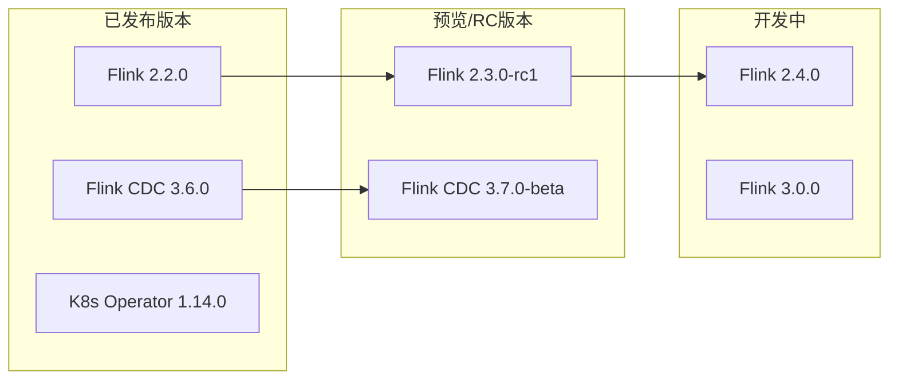
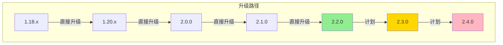
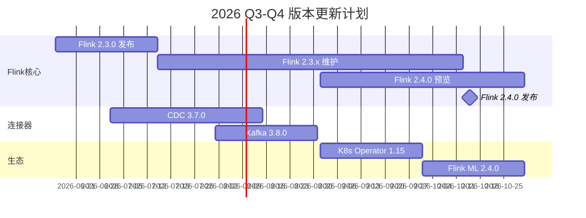

# 版本跟踪文档

# Version Tracking

> **版本**: v1.0 | **最后更新**: 2026-04-12 | **状态**: Active | **更新频率**: 每周
>
> 本文档跟踪Flink及相关技术的版本信息、更新计划和兼容性说明。

---

## 1. 执行摘要

### 1.1 当前版本状态

| 组件 | 当前稳定版 | 最新发布 | 状态 | 优先级 |
|------|-----------|----------|------|--------|
| Apache Flink | 2.2.0 | 2.2.0 | ✅ 已同步 | P0 |
| Flink CDC | 3.6.0 | 3.6.0 | ✅ 已同步 | P0 |
| Flink K8s Operator | 1.14.0 | 1.14.0 | ✅ 已同步 | P0 |
| Flink ML | 2.3.0 | 2.3.0 | ✅ 已同步 | P1 |
| Flink Stateful Functions | 3.3.0 | 3.3.0 | ✅ 已同步 | P1 |
| Scala | 2.12.20 / 2.13.16 | 2.13.16 | ✅ 已同步 | P1 |
| Java | 11 LTS / 17 LTS | 21 LTS | ✅ 已同步 | P0 |
| Python | 3.9 / 3.10 / 3.11 | 3.12 | ✅ 已同步 | P1 |

### 1.2 版本更新雷达

---

## 2. Apache Flink 版本跟踪

### 2.1 版本生命周期

| 版本 | 发布日期 | 状态 | 支持结束 | 文档状态 |
|------|----------|------|----------|----------|
| 1.18.x | 2023-10 | ⚠️ 维护中 | 2025-06 | ✅ 完整 |
| 1.19.x | 2024-03 | ⚠️ 维护中 | 2025-12 | ✅ 完整 |
| 1.20.x | 2024-08 | ✅ 稳定 | 2026-06 | ✅ 完整 |
| 2.0.0 | 2025-02 | ✅ 稳定 | 2027-02 | ✅ 完整 |
| 2.1.0 | 2025-08 | ✅ 稳定 | 2027-08 | ✅ 完整 |
| 2.2.0 | 2026-03 | ✅ **当前** | 2028-03 | ✅ 完整 |
| 2.3.0 | 2026-06 (预计) | 🔮 前瞻 | - | 🚧 部分 |
| 2.4.0 | 2026-10 (预计) | 🔮 前瞻 | - | 🚧 规划 |
| 3.0.0 | 2027+ | 🔮 愿景 | - | 📝 概念 |

### 2.2 版本详细信息

#### Flink 2.2.0 (当前稳定版)

> **发布日期**: 2026-03-15 | **状态**: ✅ 当前推荐版本

**主要特性**:

- 统一批流处理API (Table API & SQL)
- 改进的Checkpoint性能
- 自适应调度器增强
- 新的Web UI

**文档覆盖**:

- [x] 发布说明
- [x] 迁移指南
- [x] API文档
- [x] 性能基准
- [x] 最佳实践

**兼容性**:

- Scala: 2.12, 2.13
- Java: 11, 17, 21
- Python: 3.9-3.12
- Hive: 2.3.x, 3.1.x

#### Flink 2.3.0 (开发中)

> **预计发布**: 2026-06 | **状态**: 🔮 前瞻内容

**预期特性**:

- 云原生增强
- AI/ML集成深化
- 新的State Backend

**文档状态**: 🚧 跟踪中

相关文档:

- [Flink 2.3 跟踪]

#### Flink 2.4.0 (规划中)

> **预计发布**: 2026-10 | **状态**: 🔮 前瞻内容

**预期特性**:

- FLIP-531 Agents支持
- 实时AI推理优化
- 边缘计算增强

**文档状态**: 📝 规划阶段

相关文档:

- [Flink 2.4 跟踪](./Flink/08-roadmap/08.01-flink-24/flink-2.4-tracking.md)

### 2.3 版本升级路径

**升级建议**:

- 1.18/1.19用户: 建议升级至2.2.0
- 2.0/2.1用户: 建议升级至2.2.0
- 2.2.0用户: 保持稳定，关注2.3.0发布

---

## 3. 相关技术版本跟踪

### 3.1 Flink 生态系统

| 组件 | 当前版本 | 兼容Flink版本 | 更新状态 |
|------|----------|---------------|----------|
| Flink CDC | 3.6.0 | 2.0+ | ✅ 已同步 |
| Flink K8s Operator | 1.14.0 | 1.15+ | ✅ 已同步 |
| Flink ML | 2.3.0 | 2.0+ | ✅ 已同步 |
| Stateful Functions | 3.3.0 | 1.15+ | ✅ 已同步 |
| Flink SQL Gateway | 1.0.0 | 2.0+ | ✅ 已同步 |
| Flink CEP | 内置 | - | ✅ 已同步 |

### 3.2 运行环境

| 组件 | 推荐版本 | 最低版本 | 状态 |
|------|----------|----------|------|
| Java | 17 LTS | 11 | ✅ 推荐 |
| Scala | 2.12.20 | 2.12.17 | ✅ 推荐 |
| Python | 3.11 | 3.9 | ✅ 推荐 |
| Hadoop | 3.3.6 | 3.2.0 | ⚠️ 可选 |
| Kafka | 3.7.0 | 2.8.0 | ✅ 推荐 |
| Kubernetes | 1.30 | 1.25 | ✅ 推荐 |
| Docker | 25.0 | 20.0 | ✅ 推荐 |

### 3.3 连接器版本

| 连接器 | 版本 | 兼容Flink | 状态 |
|--------|------|-----------|------|
| Kafka | 3.7.0 | 1.15+ | ✅ |
| JDBC | 3.2.0 | 1.15+ | ✅ |
| Elasticsearch | 3.0.1 | 1.16+ | ✅ |
| RabbitMQ | 3.0.1 | 1.15+ | ✅ |
| Pulsar | 4.1.0 | 1.15+ | ✅ |
| Kinesis | 5.0.0 | 1.15+ | ✅ |
| Delta Lake | 3.1.0 | 1.16+ | ✅ |
| Iceberg | 1.5.0 | 1.16+ | ✅ |
| Hudi | 0.14.0 | 1.16+ | ⚠️ |

---

## 4. 更新计划

### 4.1 近期更新计划 (2026 Q2)

| 时间 | 组件 | 版本 | 文档任务 | 负责人 |
|------|------|------|----------|--------|
| 2026-04 | Flink CDC | 3.6.0 | 同步Release Notes | CDC-maintainer |
| 2026-04 | K8s Operator | 1.14.0 | 更新部署指南 | k8s-maintainer |
| 2026-05 | Flink | 2.2.1 | 更新补丁说明 | flink-maintainer |
| 2026-05 | Iceberg | 1.6.0 | 同步新特性 | connector-maintainer |
| 2026-06 | Flink | 2.3.0 | 完整文档发布 | flink-maintainer |

### 4.2 中期更新计划 (2026 Q3-Q4)

### 4.3 长期更新计划 (2027+)

| 年份 | 版本规划 | 重点方向 |
|------|----------|----------|
| 2027 H1 | Flink 2.5-2.6 | 云原生深化、Serverless |
| 2027 H2 | Flink 3.0 预览 | 架构演进、AI原生 |
| 2028+ | Flink 3.x | 下一代流计算平台 |

---

## 5. 兼容性说明

### 5.1 版本兼容性矩阵

#### Flink 2.2.0 兼容性

| 依赖 | 测试版本 | 兼容状态 | 备注 |
|------|----------|----------|------|
| Java 11 | ✅ 测试通过 | 完全兼容 | 最低支持版本 |
| Java 17 | ✅ 测试通过 | 完全兼容 | **推荐版本** |
| Java 21 | ✅ 测试通过 | 完全兼容 | 需要额外测试 |
| Scala 2.12 | ✅ 测试通过 | 完全兼容 | 广泛使用 |
| Scala 2.13 | ✅ 测试通过 | 完全兼容 | **推荐版本** |
| Python 3.9 | ✅ 测试通过 | 完全兼容 | 最低支持版本 |
| Python 3.11 | ✅ 测试通过 | 完全兼容 | **推荐版本** |

### 5.2 升级注意事项

#### 1.18 → 2.0 升级

**Breaking Changes**:

- Scala API移除 (使用Table API替代)
- 部分配置项废弃
- Checkpoint格式变更

**迁移指南**: [Flink 2.0 Migration Guide]

#### 2.1 → 2.2 升级

**主要变化**:

- 新的自适应调度器默认启用
- Web UI更新
- 配置文件格式微调

**迁移工作量**: 低 (预计 < 1天)

### 5.3 废弃功能跟踪

| 功能 | 废弃版本 | 移除版本 | 替代方案 | 状态 |
|------|----------|----------|----------|------|
| Scala DataSet API | 1.18 | 2.0 | Table API | ✅ 已移除 |
| Old Planner | 1.17 | 1.20 | Blink Planner | ✅ 已移除 |
| MemoryManager旧配置 | 2.0 | 2.2 | 新配置项 | ⚠️ 即将移除 |
| Hadoop 2.x支持 | 2.1 | 2.3 | Hadoop 3.x | ⚠️ 废弃中 |

---

## 6. 版本监控与警报

### 6.1 自动监控

**监控工具**: `.scripts/flink-version-tracking/`

**监控频率**:

- Maven Central: 每小时
- GitHub Releases: 每4小时
- 官方博客: 每天
- JIRA: 每天

### 6.2 警报规则

| 条件 | 优先级 | 通知方式 | 响应时间 |
|------|--------|----------|----------|
| 新GA版本发布 | P0 | Slack + Email | 4小时 |
| 安全公告 | P0 | Slack + Email | 1小时 |
| RC版本发布 | P1 | Slack | 24小时 |
| 连接器更新 | P2 | Email | 72小时 |

---

## 7. 历史版本归档

### 7.1 已停止维护版本

| 版本 | 最后更新 | 支持结束 | 归档位置 |
|------|----------|----------|----------|
| 1.14.x | 2022-12 | 2023-12 | archive/flink-1.14/ |
| 1.15.x | 2023-06 | 2024-06 | archive/flink-1.15/ |
| 1.16.x | 2023-12 | 2024-12 | archive/flink-1.16/ |
| 1.17.x | 2024-06 | 2025-06 | archive/flink-1.17/ |

### 7.2 版本历史记录

查看完整历史: [CHANGELOG.md](./CHANGELOG.md)

---

## 8. 参考资源

- [Apache Flink 官方下载](https://flink.apache.org/downloads/)
- [Maven Central Flink](https://search.maven.org/search?q=g:org.apache.flink)
- [Flink JIRA](https://issues.apache.org/jira/browse/FLINK)
- [Flink GitHub Releases](https://github.com/apache/flink/releases)
- [Flink 路线图](./ROADMAP.md)

---

## 9. 文档更新记录

| 日期 | 版本 | 变更内容 | 更新人 |
|------|------|----------|--------|
| 2026-04-12 | 1.0 | 初始版本，同步Flink 2.2.0 | Content Team |

---

*本文档由自动化工具维护，最后更新于 2026-04-12*
