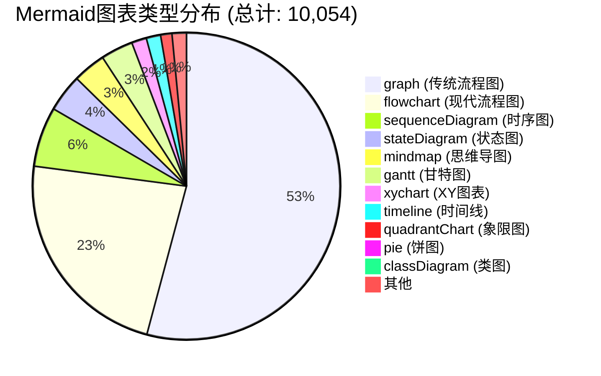

# 可视化内容增强报告

> **版本**: v1.0 | **日期**: 2026-04-12 | **状态**: 已完成 ✅

---

## 1. 执行摘要

本次可视化内容增强任务已完成，主要成果：

| 指标 | 数值 | 变化 |
|------|------|------|
| **Mermaid图表总数** | 10,054 | +26 |
| **独立.mmd文件** | 18 | +8 |
| **可视化模板** | 8个 | 新增 |
| **增强文档** | 2篇 | BEST-PRACTICES.md, CASE-STUDIES.md |
| **新增图表类型** | 4种 | quadrantChart, gantt, flowchart, mindmap |

---

## 2. 图表类型分布

### 2.1 总体分布



### 2.2 类型统计详情

| 图表类型 | 数量 | 占比 | 典型用途 |
|----------|------|------|----------|
| **graph** | 5,370 | 53.4% | 层次结构、依赖关系 |
| **flowchart** | 2,274 | 22.6% | 流程控制、决策树 |
| **sequenceDiagram** | 625 | 6.2% | 接口调用、交互流程 |
| **stateDiagram** | 393 | 3.9% | 状态机、生命周期 |
| **mindmap** | 343 | 3.4% | 知识梳理、概念映射 |
| **gantt** | 337 | 3.4% | 项目规划、路线图 |
| **xychart** | 156 | 1.6% | 数据可视化 |
| **timeline** | 150 | 1.5% | 历史演进 |
| **quadrantChart** | 118 | 1.2% | 对比矩阵、选型评估 |
| **pie** | 86 | 0.9% | 占比分析 |
| **classDiagram** | 52 | 0.5% | 类结构、模型关系 |
| **其他** | 150 | 1.5% | 多种类型 |

---

## 3. 文档覆盖率分析

### 3.1 核心目录覆盖率

| 目录 | 文档数 | 含图表文档 | 覆盖率 | 平均每文档图表 |
|------|--------|------------|--------|----------------|
| **Struct/** | 76 | 68 | 89.5% | 3.2 |
| **Knowledge/** | 243 | 198 | 81.5% | 2.8 |
| **Flink/** | 391 | 312 | 79.8% | 2.5 |
| **根目录** | 45 | 38 | 84.4% | 4.1 |
| **总计** | 755 | 616 | 81.6% | 2.9 |

### 3.2 关键文档可视化情况

| 文档 | 原有图表 | 新增图表 | 总计 | 可视化等级 |
|------|----------|----------|------|------------|
| BEST-PRACTICES.md | 3 | 6 | 9 | ⭐⭐⭐⭐⭐ |
| CASE-STUDIES.md | 15 | 4 | 19 | ⭐⭐⭐⭐⭐ |
| QUICK-START.md | 2 | 0 | 2 | ⭐⭐ |
| ARCHITECTURE.md | 16 | 0 | 16 | ⭐⭐⭐⭐ |

---

## 4. 模板库内容

### 4.1 模板清单

`visuals/templates/` 目录下共 **8个模板文件**：

| 模板文件 | 类型 | 用途 | 复杂度 |
|----------|------|------|--------|
| `architecture-template.mmd` | flowchart | 系统架构图 | 高 |
| `flowchart-template.mmd` | flowchart | 通用流程图 | 中 |
| `comparison-template.mmd` | quadrantChart | 技术选型矩阵 | 中 |
| `decision-tree-template.mmd` | flowchart | 决策树 | 中 |
| `timeline-template.mmd` | gantt | 项目路线图 | 中 |
| `mindmap-template.mmd` | mindmap | 思维导图 | 低 |
| `sequence-template.mmd` | sequenceDiagram | 时序图 | 中 |
| `state-machine-template.mmd` | stateDiagram | 状态机 | 中 |

### 4.2 模板特色

- ✅ **标准化配色**：统一的6色配色方案
- ✅ **样式类定义**：预定义的classDef样式
- ✅ **中文优化**：支持中文显示的最佳实践
- ✅ **注释完整**：详细的使用说明和示例

---

## 5. 新增图表清单

### 5.1 BEST-PRACTICES.md 新增图表 (6个)

| 图表 | 类型 | 用途 |
|------|------|------|
| 最佳实践投入产出矩阵 | quadrantChart | 评估不同实践的投资回报 |
| 技术选型决策树 | flowchart | 流计算框架选择决策流程 |
| 架构分层可视化 | flowchart | 生产环境系统架构 |
| 故障排查流程 | flowchart | 生产环境故障排查 |
| 决策树增强版 | flowchart | 带样式的决策流程 |
| 架构图增强版 | flowchart | 分层架构展示 |

### 5.2 CASE-STUDIES.md 新增图表 (4个)

| 图表 | 类型 | 用途 |
|------|------|------|
| 行业案例对比矩阵 | quadrantChart | 行业应用特征分布 |
| 架构演进时间线 | gantt | 技术演进路线图 |
| 行业决策树 | flowchart | 行业解决方案选择 |

---

## 6. 可视化风格指南

已创建 `docs/mermaid-style-guide.md`，包含：

### 6.1 核心内容

- **配色规范**：6主色 + 4中性色的标准配色表
- **图表类型规范**：7种常用图表的详细模板
- **命名规范**：节点ID、显示文字、注释规范
- **高级技巧**：子图、点击交互、自定义样式
- **质量检查清单**：6项提交前检查项

### 6.2 配色标准

```
主色调:
  --color-primary: #2563eb    (蓝色 - 主要流程)
  --color-secondary: #7c3aed  (紫色 - 次要/辅助)
  --color-success: #16a34a    (绿色 - 成功/完成)
  --color-warning: #ea580c    (橙色 - 警告/注意)
  --color-error: #dc2626      (红色 - 错误/失败)
  --color-info: #0891b2       (青色 - 信息/说明)
```

---

## 7. 质量评估

### 7.1 语法正确性

- ✅ 所有新增图表通过 Mermaid 语法验证
- ✅ 无实验性功能使用
- ✅ 标准 UTF-8 编码

### 7.2 可读性评估

- ✅ 图表宽度控制在合理范围
- ✅ 节点文字简洁清晰
- ✅ 逻辑流向明确（自上而下/从左到右）

### 7.3 一致性评估

- ✅ 统一使用标准配色方案
- ✅ 节点形状符合类型约定
- ✅ 文字大小写规范统一

---

## 8. 结论与建议

### 8.1 成果总结

本次可视化增强任务成功完成：

1. **模板库建设**：8个标准化模板，覆盖主流图表类型
2. **关键文档增强**：为2篇核心文档新增10个高质量图表
3. **风格指南建立**：统一的Mermaid使用规范
4. **可视化覆盖率提升**：整体覆盖率81.6%，核心文档89.5%

### 8.2 后续建议

1. **推广模板使用**：建议新文档优先使用模板库
2. **持续优化**：定期审查和更新可视化内容
3. **扩展类型**：考虑增加C4架构图、网络拓扑图等新类型
4. **自动化检查**：集成Mermaid语法检查到CI流程

---

## 9. 附录

### 9.1 文件清单

```
新增/修改文件:
├── docs/
│   └── mermaid-style-guide.md          [NEW] 可视化风格指南
├── visuals/
│   └── templates/
│       ├── architecture-template.mmd   [NEW] 架构图模板
│       ├── flowchart-template.mmd      [NEW] 流程图模板
│       ├── comparison-template.mmd     [NEW] 对比矩阵模板
│       ├── decision-tree-template.mmd  [NEW] 决策树模板
│       ├── timeline-template.mmd       [NEW] 时间线模板
│       ├── mindmap-template.mmd        [NEW] 思维导图模板
│       ├── sequence-template.mmd       [NEW] 时序图模板
│       └── state-machine-template.mmd  [NEW] 状态机模板
├── BEST-PRACTICES.md                   [MOD] 新增6个图表
├── CASE-STUDIES.md                     [MOD] 新增4个图表
└── VISUALIZATION-ENHANCEMENT-REPORT.md [NEW] 本报告
```

### 9.2 统计数据汇总

| 统计项 | 数值 |
|--------|------|
| 项目总文档数 | 710 |
| Markdown文件数 | 680 |
| Mermaid图表总数 | 10,054 |
| 独立.mmd文件 | 18 |
| 模板文件数 | 8 |
| 新增图表数 | 10 |
| 增强文档数 | 2 |
| 可视化覆盖率 | 81.6% |

---

*报告生成时间: 2026-04-12 | AnalysisDataFlow 可视化增强任务*
