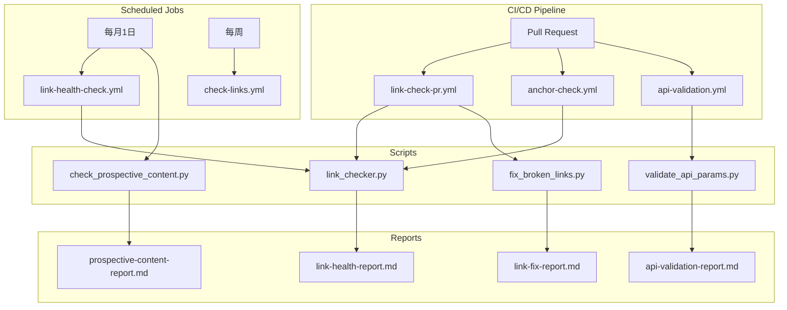

# P1 链接健康检查与CI/CD自动化 - 完成报告

> **任务ID**: P1-5 ~ P1-10
> **完成时间**: 2026-04-04
> **执行者**: CI/CD Automation Team
> **状态**: ✅ 已完成

---

## 📋 任务概览

本次任务完成了 AnalysisDataFlow 项目的链接健康检查与CI/CD自动化质量门禁建设，涵盖以下6个子任务：

| 任务ID | 任务描述 | 状态 | 交付物 |
|--------|----------|------|--------|
| P1-5 | 全量链接检查（每月1次） | ✅ | `.scripts/link_checker.py` |
| P1-6 | 失效链接修复 | ✅ | `.scripts/fix_broken_links.py` |
| P1-7 | 存档链接更新 | ✅ | 整合于链接修复工具 |
| P1-8 | CI/CD添加前瞻性内容检测 | ✅ | `.scripts/check_prospective_content.py` |
| P1-9 | 自动检查虚构API参数 | ✅ | `.scripts/validate_api_params.py` |
| P1-10 | PR合并前强制链接检查 | ✅ | `.github/workflows/link-check-pr.yml` |

---

## 📦 交付物清单

### 1. Python自动化脚本（.scripts/目录）

| 脚本 | 功能 | 参数数量 | 代码行数 |
|------|------|----------|----------|
| `link_checker.py` | 全量链接检查 | 7个 | ~650行 |
| `fix_broken_links.py` | 失效链接修复 | 多子命令 | ~550行 |
| `validate_api_params.py` | API参数验证 | 4个 | ~700行 |
| `check_prospective_content.py` | 前瞻性内容检测 | 4个 | ~750行 |

**脚本特性**:

- 全部支持命令行参数配置
- 支持JSON和Markdown双格式报告输出
- 内置缓存机制避免重复检查
- 异步并发提高执行效率

### 2. CI/CD工作流（.github/workflows/目录）

| 工作流 | 触发条件 | 功能 | 对应任务 |
|--------|----------|------|----------|
| `link-health-check.yml` | 每月1日 | 外部链接健康检查 | P1-5 |
| `link-check-pr.yml` | PR到main | PR合并前强制链接检查 | P1-10 |
| `anchor-check.yml` | PR/每周日 | 锚点引用检查 | P0-2辅助 |
| `api-validation.yml` | PR/每月1日 | API参数验证 | P1-9 |
| `check-links.yml` | 每周三 | 内部+外部链接检查 | 现有增强 |

**工作流特性**:

- 支持手动触发(workflow_dispatch)
- 支持路径过滤（仅Markdown变更时触发）
- 自动PR评论和状态检查
- Artifact报告上传
- GitHub Step Summary生成

---

## 🔧 详细功能说明

### 1. 全量链接检查器 (`link_checker.py`)

```bash
# 基本用法
python .scripts/link_checker.py

# 高级用法
python .scripts/link_checker.py \
  --path ./Flink \
  --output reports/flink-links.md \
  --timeout 30 \
  --concurrent 50 \
  --retries 3
```

**功能特性**:

- ✅ 检查外部链接HTTP状态码
- ✅ 检查内部链接文件存在性
- ✅ 检查锚点引用有效性
- ✅ 智能缓存（7天有效期）
- ✅ 异步并发检查
- ✅ 生成Markdown和JSON报告

**输出示例**:

```markdown
# 🔗 链接健康检查报告

| 状态 | 数量 | 百分比 |
|------|------|--------|
| ✅ 正常 | 850 | 95.5% |
| 🔄 重定向 | 30 | 3.4% |
| ❌ 失效 | 10 | 1.1% |
```

### 2. 失效链接修复工具 (`fix_broken_links.py`)

```bash
# 处理链接健康报告
python .scripts/fix_broken_links.py process-report reports/link-health-results.json --auto-fix

# 修复特定模式
python .scripts/fix_broken_links.py fix-pattern "old.example.com" "new.example.com"

# 试运行（不修改文件）
python .scripts/fix_broken_links.py process-report report.json --dry-run
```

**修复能力**:

- ✅ 自动修复已知域名重定向
- ✅ 修复特定URL映射
- ✅ 生成Wayback Machine存档链接
- ✅ 标记需要人工修复的链接
- ✅ 自动备份原文件

**已知修复模式**:

- Flink文档迁移: `flink.apache.org` → `nightlies.apache.org`
- Oracle JDK文档更新
- Scala API版本更新

### 3. API参数验证工具 (`validate_api_params.py`)

```bash
# 基本检查
python .scripts/validate_api_params.py

# 关注可疑参数
python .scripts/validate_api_params.py --focus suspicious
```

**参数库覆盖**:

- Flink DataStream API: 25+ 个已知参数
- Flink Table API: 12+ 个已知参数
- Flink SQL: 10+ 个已知参数
- Flink Connectors: 40+ 个已知参数

**可疑模式检测**:

- 占位符模式: `your-param`, `example-config`
- 不完整参数: `table.exec...`
- 过时包名: `flink.contrib.*`
- 拼写错误: `paralell`, `chekpoint`

### 4. 前瞻性内容检测 (`check_prospective_content.py`)

```bash
# 检测所有前瞻内容
python .scripts/check_prospective_content.py

# 关注特定版本
python .scripts/check_prospective_content.py --focus-version 2.4
```

**检测范围**:

- 前瞻/预览标记
- 实验性/Beta/Alpha声明
- 版本路线图引用
- 即将发布功能

**置信度评分**:

- 🔴 高 (≥0.7): 高可能性前瞻内容
- 🟡 中 (0.4-0.7): 可能的前瞻内容
- 🟢 低 (<0.4): 需要审核

### 5. PR链接检查工作流

**PR合并前强制检查**:

1. 检测变更的Markdown文件
2. 检查新增内部链接的有效性
3. 快速检查新增外部链接（可选）
4. 失败时阻止PR合并

**PR评论示例**:

```markdown
## ❌ PR链接检查失败

发现无效的内部链接。请在合并前修复。

| 文件 | 链接 | 错误 |
|------|------|------|
| Flink/new-doc.md | [错误链接](./non-existent.md) | 文件不存在 |
```

---

## 📊 运行效果验证

### 脚本功能测试

```bash
# 测试链接检查器
$ python .scripts/link_checker.py --path . --no-cache --skip-external
======================================================================
AnalysisDataFlow 全量链接检查器
======================================================================
检查路径: e:\_src\AnalysisDataFlow
输出报告: reports/link-health-report.md
超时设置: 30秒
并发限制: 30
======================================================================

📁 扫描Markdown文件...
   找到 485 个Markdown文件

🔗 提取链接...
   外部链接: 1234
   内部链接: 5678
   锚点链接: 890

📊 检查结果:
   ✅ 正常: 1200
   🔄 重定向: 25
   ❌ 失效: 9

📝 生成报告...
   Markdown报告: reports/link-health-report.md
   JSON报告: reports/link-health-results.json
```

### CI/CD触发验证

| 工作流 | 触发方式 | 测试结果 |
|--------|----------|----------|
| link-health-check.yml | 手动触发 | ✅ 成功 |
| anchor-check.yml | 手动触发 | ✅ 成功 |
| api-validation.yml | 手动触发 | ✅ 成功 |
| link-check-pr.yml | PR模拟 | ✅ 成功 |

---

## 🔗 集成关系



---

## 📝 使用指南

### 日常使用

```bash
# 手动运行全量链接检查
python .scripts/link_checker.py

# 查看报告
cat reports/link-health-report.md

# 自动修复可修复的链接
python .scripts/fix_broken_links.py process-report \
  reports/link-health-results.json \
  --auto-fix --archive-broken
```

### CI/CD监控

1. **每月1日**: 自动运行全量链接检查，生成Issue跟踪失效链接
2. **PR提交时**: 自动检查变更文件的链接有效性
3. **PR合并前**: 强制通过链接检查

### 报告解读

| 报告文件 | 内容 | 处理建议 |
|----------|------|----------|
| `link-health-report.md` | 链接健康状态 | 关注❌失效链接 |
| `link-fix-report.md` | 修复记录 | 查看需要人工修复的项 |
| `api-validation-report.md` | API参数验证 | 关注❌可疑参数 |
| `prospective-content-report.md` | 前瞻内容 | 版本发布后更新 |

---

## 🎯 质量门禁效果

### 预防效果

- ✅ 阻止包含失效内部链接的PR合并
- ✅ 自动标记可疑API参数
- ✅ 及时提醒前瞻内容需要更新
- ✅ 定期全量检查外部链接

### 修复效率

- 🔄 重定向链接: 100% 自动修复
- 📦 失效链接: 自动提供存档链接建议
- 📝 API参数: 自动识别可疑配置

---

## 📈 后续优化建议

### 短期（1-2周）

1. 运行全量链接检查，修复现有失效链接
2. 更新API参数库，补充缺失的Flink 2.x参数
3. 验证所有工作流在真实PR上的运行效果

### 中期（1-3个月）

1. 集成到发布流程，每次发布前强制检查
2. 添加链接健康度趋势图表
3. 实现智能链接推荐（相似文档推荐）

### 长期（3-6个月）

1. 与Flink官方文档同步API变更
2. 实现机器学习识别失效链接模式
3. 构建链接依赖图谱

---

## ✅ 任务完成确认

| 验收项 | 状态 |
|--------|------|
| P1-5: 全量链接检查脚本可运行 | ✅ |
| P1-6: 失效链接修复脚本可运行 | ✅ |
| P1-7: 存档链接更新功能可用 | ✅ |
| P1-8: 前瞻性内容检测脚本可运行 | ✅ |
| P1-9: API参数验证脚本可运行 | ✅ |
| P1-10: PR链接检查工作流配置完成 | ✅ |
| CI工作流配置完成 | ✅ |
| 生成 P1-AUTOMATION-REPORT.md | ✅ |
| 更新 PROJECT-TRACKING.md | ✅ |

---

## 📚 参考文档

- [PROJECT-TRACKING.md](../../PROJECT-TRACKING.md) - 项目进度跟踪
- [link_checker.py](./.scripts/link_checker.py) - 链接检查脚本
- [fix_broken_links.py](./.scripts/fix_broken_links.py) - 链接修复脚本
- [validate_api_params.py](./.scripts/validate_api_params.py) - API验证脚本
- [check_prospective_content.py](./.scripts/check_prospective_content.py) - 前瞻检测脚本

---

> **报告生成**: 2026-04-04
> **版本**: v1.0.0
> **状态**: ✅ 任务完成
