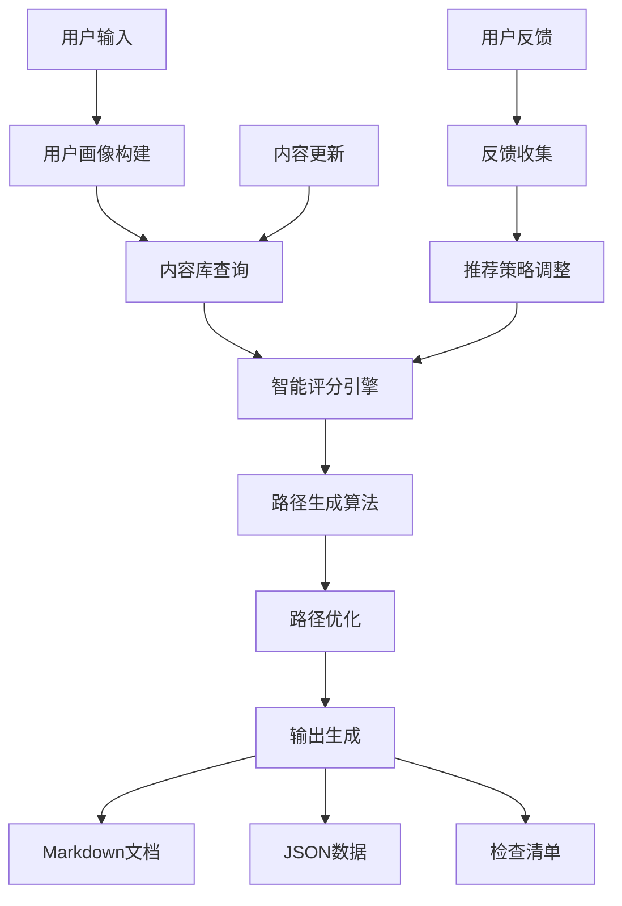
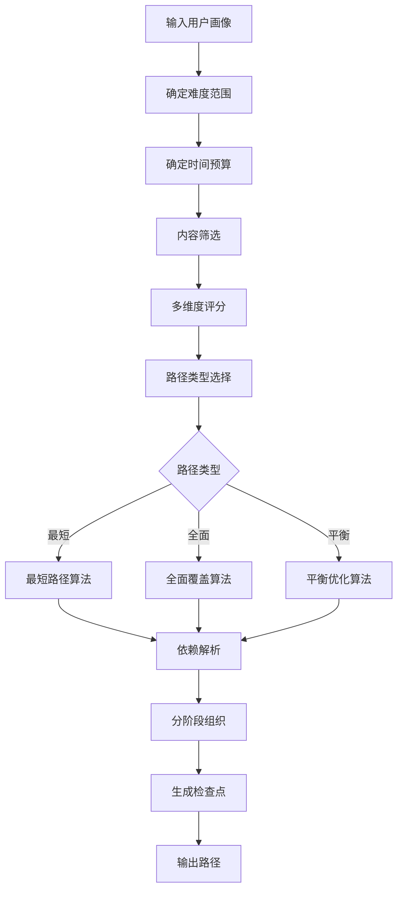
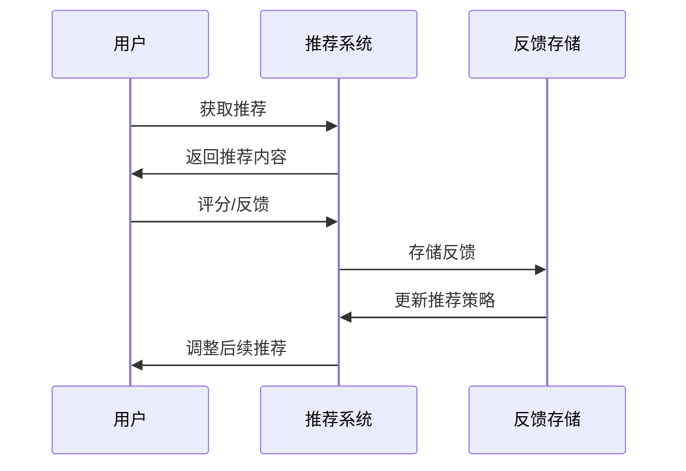
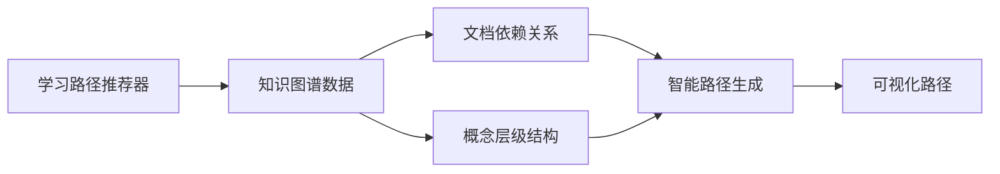

# AnalysisDataFlow 动态学习路径推荐系统

> **版本**: v1.0 | **更新日期**: 2026-04-04 | **状态**: 生产就绪

---

## 1. 系统概述

动态学习路径推荐系统是一个智能化的学习规划工具，旨在根据用户的**角色**、**经验水平**、**学习目标**和**时间约束**，自动生成个性化的流计算学习路径。

### 1.1 核心价值

| 特性 | 描述 |
|------|------|
| 🎯 **个性化** | 基于用户画像的精准推荐 |
| 📊 **智能化** | 多维度内容评分与路径优化 |
| 🔄 **动态性** | 根据反馈持续调整推荐策略 |
| 📱 **多格式** | 支持Markdown/JSON/检查清单输出 |
| 🖥️ **多界面** | CLI交互、配置文件、Web表单支持 |

### 1.2 系统架构



---

## 2. 用户画像定义

### 2.1 角色维度

| 角色 | 代号 | 特点 | 推荐侧重点 |
|------|------|------|-----------|
| **学生** | `student` | 计算机专业学生、转行者 | 基础概念、练习、循序渐进 |
| **开发者** | `developer` | 后端/数据工程师 | 工程实践、API使用、案例 |
| **架构师** | `architect` | 系统架构师 | 设计模式、技术选型、架构 |
| **研究员** | `researcher` | 学术研究人员 | 形式化理论、前沿技术 |

### 2.2 经验维度

| 等级 | 代号 | 能力假设 | 难度范围 |
|------|------|---------|---------|
| **初级** | `beginner` | 基础编程，了解数据结构 | L1-L3 |
| **中级** | `intermediate` | 有大数据/流处理经验 | L2-L4 |
| **高级** | `advanced` | 生产环境经验 | L3-L6 |

### 2.3 目标维度

| 目标 | 代号 | 学习重点 | 推荐内容类型 |
|------|------|---------|-------------|
| **理论学习** | `theory` | 形式化基础、数学证明 | Struct/ 核心理论 |
| **工程实践** | `practice` | 实际开发、部署运维 | Knowledge/, Flink/ |
| **面试准备** | `interview` | 常见问题、最佳实践 | 综合内容 |
| **学术研究** | `research` | 前沿论文、形式化验证 | Struct/, 前沿内容 |

### 2.4 时间维度

| 时间框架 | 代号 | 总预算 | 周投入建议 |
|---------|------|--------|-----------|
| **短期** | `short` | 40小时 | 密集学习 |
| **中期** | `medium` | 160小时 | 持续学习 |
| **长期** | `long` | 480小时 | 系统学习 |

### 2.5 用户画像示例

```json
{
  "role": "developer",
  "experience": "intermediate",
  "goal": "practice",
  "timeframe": "medium",
  "interests": ["kafka", "checkpoint", "performance"],
  "known_topics": ["s-01-01", "k-01-01"],
  "preferred_formats": ["markdown", "code"],
  "weekly_hours": 15
}
```

---

## 3. 内容标签体系

### 3.1 难度标签 (L1-L6)

| 等级 | 描述 | 前置要求 |
|------|------|---------|
| **L1** | 入门级 | 基础编程 |
| **L2** | 初级 | 了解大数据概念 |
| **L3** | 中级 | 有流处理经验 |
| **L4** | 高级 | 深入理解机制 |
| **L5** | 专家 | 源码级理解 |
| **L6** | 研究级 | 形式化理论 |

### 3.2 主题标签

#### 核心主题

| 标签 | 描述 | 适用角色 |
|------|------|---------|
| `theory` | 形式化理论 | researcher |
| `engineering` | 工程实践 | developer, architect |
| `flink` | Flink专项 | developer |
| `frontier` | 前沿技术 | researcher, architect |

#### 技术主题

| 标签 | 描述 | 相关文档 |
|------|------|---------|
| `checkpoint` | Checkpoint机制 | Flink/02-core/ |
| `state` | 状态管理 | Flink/02-core/ |
| `time` | 时间语义 | Struct/02-properties/ |
| `watermark` | Watermark机制 | Struct/02-properties/ |
| `kafka` | Kafka集成 | Flink/04-connectors/ |
| `sql` | Flink SQL | Flink/03-sql-table-api/ |
| `performance` | 性能调优 | Flink/06-engineering/ |

#### 场景主题

| 标签 | 描述 | 相关文档 |
|------|------|---------|
| `iot` | IoT流处理 | Knowledge/03-business-patterns/ |
| `finance` | 金融实时计算 | Flink/07-case-studies/ |
| `ecommerce` | 电商推荐 | Flink/07-case-studies/ |
| `analytics` | 实时分析 | Flink/07-case-studies/ |

### 3.3 前置依赖标签

内容项之间通过ID建立依赖关系，系统会自动解析依赖并进行拓扑排序：

```python
# 示例依赖关系
"s-02-01": {
    "prerequisites": ["s-01-01"],  # 依赖形式化基础
    "title": "一致性层次结构"
}

"f-02-01": {
    "prerequisites": ["f-01-01"],  # 依赖部署架构
    "title": "Checkpoint机制深入"
}
```

### 3.4 学习时间标签

每项内容标注预计学习时间（小时）：

| 类型 | 时间范围 | 示例 |
|------|---------|------|
| 概念文档 | 2-4h | streaming-models-mindmap.md |
| 机制深入 | 4-6h | checkpoint-mechanism-deep-dive.md |
| 形式化证明 | 6-8h | flink-checkpoint-correctness.md |
| 实践练习 | 3-5h | exercise-02-flink-basics.md |

---

## 4. 路径生成算法

### 4.1 算法流程



### 4.2 评分机制

每项内容通过以下维度计算匹配度分数：

```python
score = Σ(维度权重 × 匹配度)
```

| 维度 | 权重 | 计算方法 |
|------|------|---------|
| 目标匹配 | 10分 | 内容主题与目标偏好重叠 |
| 角色匹配 | 8分 | 内容类型与角色需求匹配 |
| 兴趣匹配 | 5分 | 用户兴趣标签与内容主题 |
| 热门度 | 0.05× |  popularity × 0.05 |
| 新内容 | 3分 | 新发布内容加分 |
| 格式偏好 | 2分 | 用户偏好的内容格式 |

### 4.3 路径类型算法

#### 最短路径 (Shortest Path)

- **策略**: 选择核心且时间短的 content
- **目标**: 快速达成学习目标
- **约束**: 使用70%时间预算
- **适用场景**: 紧急上手、面试冲刺

```
选择策略:
1. 按评分排序
2. 优先选择高分且时间短的内容
3. 达到60%预算即停止
```

#### 全面路径 (Comprehensive Path)

- **策略**: 尽可能覆盖所有相关主题
- **目标**: 建立完整知识体系
- **约束**: 允许超预算10%
- **适用场景**: 系统学习、长期规划

```
选择策略:
1. 按主题覆盖度优先
2. 新主题内容优先选择
3. 高评分内容补充
```

#### 平衡路径 (Balanced Path)

- **策略**: 时间投入与知识深度的平衡
- **目标**: 理论与实践的均衡
- **约束**: 使用95%时间预算
- **适用场景**: 常规学习、能力提升

```
选择策略:
1. 首先选择核心高分内容(50%预算)
2. 然后填充其他相关内容
3. 确保理论与实践的均衡
```

### 4.4 依赖解析

系统使用拓扑排序自动解析内容依赖：

```python
# 伪代码
def resolve_dependencies(selected_items):
    visited = set()
    result = []

    def visit(item_id):
        if item_id in visited: return
        for prereq in item.prerequisites:
            visit(prereq)  # 先访问依赖
        visited.add(item_id)
        result.append(item_id)

    for item in selected_items:
        visit(item.id)

    return result
```

---

## 5. 动态推荐机制

### 5.1 推荐类型

| 类型 | 触发条件 | 推荐逻辑 |
|------|---------|---------|
| **个性化推荐** | 用户画像完整 | 基于画像评分 |
| **热门推荐** | 新用户/冷启动 | 按popularity排序 |
| **新内容推荐** | 内容更新 | 新发布内容 |
| **协同推荐** | 有相似用户数据 | 相似用户偏好 |

### 5.2 反馈调整机制



### 5.3 反馈数据结构

```json
{
  "user_id": "user-001",
  "item_id": "f-02-01",
  "rating": 5,
  "feedback": "内容很实用，Checkpoint机制讲得很清楚",
  "timestamp": "2026-04-04T10:30:00Z"
}
```

---

## 6. 输出格式

### 6.1 Markdown学习路径

生成的Markdown文档包含：

- 路径概述与元信息
- 学习阶段时间线（表格）
- 每个阶段的详细内容清单
- 阶段检查点（可勾选）
- 总体检查点
- 学习进度跟踪模板

```markdown
# 开发者系统学习路径

> **路径类型**: balanced | **预计总时长**: 45小时

## 路径概述
为developer设计的平衡学习路径...

### 学习阶段 (3个阶段)

| 阶段 | 时长 | 内容数 | 预计学时 |
|------|------|--------|----------|
| 基础概念 | 7天 | 4 | 12h |
| Flink核心机制 | 14天 | 5 | 18h |
| ... | ... | ... | ... |

## 详细学习内容
### 阶段1: 基础概念
...

## 检查点
- [ ] 理解流处理与批处理的核心区别
- [ ] ...
```

### 6.2 JSON机器可读格式

```json
{
  "name": "开发者系统学习路径",
  "path_type": "balanced",
  "total_hours": 45,
  "total_days": 35,
  "stages": [
    {
      "name": "基础概念",
      "duration_days": 7,
      "total_hours": 12,
      "items": [...]
    }
  ],
  "checkpoints": [...]
}
```

### 6.3 检查清单格式

简洁的待办事项列表：

```markdown
# 开发者系统学习路径 - 学习检查清单

## 阶段1: 基础概念
- [ ] 流处理模型思维导图 (2h) - `Knowledge/...`
- [ ] 数据流全景图2026 (3h) - `Knowledge/...`
...

## 检查点
- [ ] 理解流处理与批处理的核心区别
- [ ] ...
```

---

## 7. 交互界面

### 7.1 命令行交互 (CLI)

#### 交互式模式

```bash
$ python .scripts/learning-path-recommender.py

============================================================
  AnalysisDataFlow 动态学习路径推荐系统
============================================================

请回答以下问题以生成个性化学习路径:

1. 您的角色是?
   [1] 学生 (student)
   [2] 开发者 (developer)
   [3] 架构师 (architect)
   [4] 研究员 (researcher)
   选择 (1-4): 2

2. 您的经验水平是?
   ...
```

#### 配置文件模式

```bash
# 从配置文件生成
$ python .scripts/learning-path-recommender.py \
    --config profile.json \
    --output my-path.md \
    --format markdown \
    --path-type balanced

# 生成热门推荐
$ python .scripts/learning-path-recommender.py \
    --recommend popular \
    --output hot-content.md
```

#### 参数说明

| 参数 | 简写 | 说明 | 默认值 |
|------|------|------|--------|
| `--config` | `-c` | 用户配置文件 | - |
| `--output` | `-o` | 输出文件路径 | stdout |
| `--format` | `-f` | 输出格式 | markdown |
| `--path-type` | `-t` | 路径类型 | balanced |
| `--recommend` | `-r` | 生成推荐 | - |
| `--interactive` | `-i` | 强制交互模式 | - |
| `--web` | `-w` | Web服务器模式 | - |

### 7.2 Web表单输入

Web模式提供可视化界面（预留接口）：

```bash
$ python .scripts/learning-path-recommender.py --web
启动Web服务器模式...
请在浏览器中访问: http://localhost:8080
```

### 7.3 配置文件格式

**用户画像配置** (`profile.json`):

```json
{
  "role": "developer",
  "experience": "intermediate",
  "goal": "practice",
  "timeframe": "medium",
  "interests": ["kafka", "checkpoint", "performance"],
  "known_topics": ["s-01-01", "k-01-01"],
  "preferred_formats": ["markdown", "code"],
  "weekly_hours": 15
}
```

---

## 8. 使用示例

### 8.1 场景1: 学生入门

```bash
$ python .scripts/learning-path-recommender.py -i

# 选择:
# 角色: 学生 (1)
# 经验: 初级 (1)
# 目标: 理论学习 (1)
# 时间: 长期 (3)
# 每周: 10小时

# 生成: 学生全面精通路径.md
```

### 8.2 场景2: 面试冲刺

```bash
# 创建配置文件 interview-profile.json
cat > interview-profile.json << 'EOF'
{
  "role": "developer",
  "experience": "intermediate",
  "goal": "interview",
  "timeframe": "short",
  "weekly_hours": 20
}
EOF

$ python .scripts/learning-path-recommender.py \
    -c interview-profile.json \
    -o interview-prep-path.md \
    -t shortest
```

### 8.3 场景3: 架构师进阶

```bash
$ python .scripts/learning-path-recommender.py -i

# 选择:
# 角色: 架构师 (3)
# 经验: 高级 (3)
# 目标: 工程实践 (2)
# 时间: 中期 (2)

# 生成: 架构师系统学习路径.md
```

### 8.4 场景4: 热门内容推荐

```bash
$ python .scripts/learning-path-recommender.py \
    --recommend popular \
    -o hot-content.md
```

---

## 9. 内容库结构

### 9.1 内容分类

```
内容库
├── Struct/          # 形式理论 (L3-L6)
│   ├── 01-foundation/
│   ├── 02-properties/
│   └── 04-proofs/
├── Knowledge/       # 工程知识 (L2-L4)
│   ├── 01-concept-atlas/
│   ├── 02-design-patterns/
│   ├── 03-business-patterns/
│   ├── 04-technology-selection/
│   ├── 09-anti-patterns/
│   └── 98-exercises/
├── Flink/           # Flink实践 (L2-L5)
│   ├── 01-architecture/
│   ├── 02-core-mechanisms/
│   ├── 03-sql-table-api/
│   ├── 04-connectors/
│   ├── 06-engineering/
│   ├── 07-case-studies/
│   └── 10-deployment/
└── Learning Paths/  # 预定义路径
    ├── beginner-*
    ├── intermediate-*
    └── expert-*
```

### 9.2 内容元数据

每项内容包含以下元数据：

```python
@dataclass
class ContentItem:
    id: str              # 唯一标识
    title: str           # 标题
    path: str            # 文件路径
    difficulty: int      # 难度 L1-L6
    topics: List[str]    # 主题标签
    prerequisites: List[str]  # 前置依赖
    estimated_hours: float    # 预计时间
    content_type: str    # 类型: theory/engineering/flink
    format: str          # 格式: markdown/code/exercise
    popularity: int      # 热门度 0-100
    is_new: bool         # 是否新内容
    description: str     # 描述
```

---

## 10. 扩展与定制

### 10.1 添加新内容

在 `ContentLibrary._initialize_content()` 中添加：

```python
new_content = [
    ContentItem(
        id="f-08-01",
        title="新主题文档",
        path="Flink/08-new/topic.md",
        difficulty=3,
        topics=["flink", "new-topic"],
        prerequisites=["f-01-01"],
        estimated_hours=3,
        content_type="flink",
        format="markdown",
        popularity=70,
        is_new=True,
        description="新主题描述"
    )
]
```

### 10.2 自定义评分规则

在 `RecommendationEngine._score_content()` 中修改：

```python
def _score_content(self, item: ContentItem, profile: UserProfile) -> float:
    score = 0.0
    # 添加自定义评分逻辑
    if "my-topic" in item.topics:
        score += 20  # 自定义权重
    return score
```

### 10.3 集成Web框架

预留Web接口（可集成Flask/FastAPI）：

```python
from flask import Flask, request, jsonify

app = Flask(__name__)

@app.route('/api/recommend', methods=['POST'])
def recommend():
    profile_data = request.json
    profile = UserProfile.from_dict(profile_data)
    path = engine.generate_path(profile)
    return jsonify(path.to_dict())
```

---

## 11. 路线图

### v1.0 (已完成)

- ✅ 基础用户画像
- ✅ 三种路径类型算法
- ✅ Markdown/JSON/检查清单输出
- ✅ 交互式CLI
- ✅ 内容库初始化

### v1.1 (当前 - P2-12 增强)

- ✅ **知识图谱集成** - 与交互式图谱联动
- ✅ **基于依赖图的推荐** - 利用文档关系数据
- ✅ **实时路径生成** - 基于用户选择动态调整
- ✅ **可视化学习路径** - 在图谱中显示学习路径

### v1.2 (计划)

- 🔄 Web界面 (React/Vue)
- 🔄 用户反馈持久化
- 🔄 学习进度跟踪
- 🔄 协同过滤推荐

### v2.0 (规划)

- 📋 AI辅助推荐
- 📋 学习效果评估
- 📋 社区分享功能
- 📋 移动端适配

---

## 14. P2-12 增强功能

### 14.1 知识图谱集成

学习路径推荐系统现在与知识图谱 2.0 深度集成：



### 14.2 基于依赖的推荐算法

```python
# 新的推荐算法逻辑
def recommend_based_on_dependencies(known_concepts, target_goal):
    # 1. 找到已知概念的依赖闭包
    closure = compute_dependency_closure(known_concepts)

    # 2. 找到可达但尚未学习的概念
    candidates = find_reachable_unlearned(closure)

    # 3. 根据目标筛选和排序
    scored = score_by_goal(candidates, target_goal)

    # 4. 应用路径优化算法
    optimal_path = find_optimal_learning_path(scored)

    return optimal_path
```

### 14.3 可视化学习路径

在知识图谱 2.0 页面中，学习路径以高亮形式显示：

- **已完成节点**: 绿色边框
- **当前推荐**: 闪烁高亮
- **前置依赖**: 虚线连接
- **后续路径**: 淡色预览

### 14.4 使用示例（增强版）

#### 场景5: 基于图谱的推荐

```bash
# 生成基于图谱的推荐
$ python .scripts/learning-path-recommender.py \
    --use-graph-data \
    --start-concept "Thm-S-01-01" \
    --target-concept "Thm-F-04-01" \
    --output path-with-deps.md

# 输出包含：
# - 最短依赖路径
# - 替代路径选项
# - 每个节点的学习资源
# - 可视化图谱链接
```

#### 场景6: 可视化路径生成

```bash
# 生成包含D3可视化数据的路径
$ python .scripts/learning-path-recommender.py \
    --format d3 \
    --output learning-path-d3.json

# 可在 knowledge-graph-v2.html 中加载并显示
```

---

## 15. 与知识图谱的联动

### 15.1 数据流

```
┌─────────────────┐     ┌──────────────────┐     ┌─────────────────┐
│  文档关系映射器  │────▶│  依赖图生成器    │────▶│  学习路径推荐器  │
│  (P2-11)        │     │  (P2-13)        │     │  (P2-12)        │
└─────────────────┘     └──────────────────┘     └─────────────────┘
         │                       │                       │
         ▼                       ▼                       ▼
┌─────────────────────────────────────────────────────────────────┐
│                     知识图谱 2.0 (P2-10)                         │
│         knowledge-graph-v2.html - 交互式可视化界面               │
└─────────────────────────────────────────────────────────────────┘
```

### 15.2 统一数据格式

所有组件共享统一的数据格式：

```json
{
  "nodes": [...],
  "edges": [...],
  "metadata": {
    "version": "2.0",
    "generated_at": "2026-04-04T..."
  }
}
```

### 15.3 协同工作流程

1. **文档更新** → 触发关系映射器重新扫描
2. **关系更新** → 触发依赖图重新生成
3. **依赖更新** → 学习路径推荐实时调整
4. **用户交互** → 图谱和推荐双向同步

---

## 12. 常见问题

### Q1: 如何选择适合自己的路径类型？

| 场景 | 推荐类型 | 说明 |
|------|---------|------|
| 紧急上手/面试 | shortest | 聚焦核心，快速达成 |
| 系统学习 | comprehensive | 覆盖全面，不留死角 |
| 能力提升 | balanced | 理论实践兼顾 |

### Q2: 生成路径后如何调整？

1. 修改配置文件中的 `interests` 添加兴趣标签
2. 在 `known_topics` 中添加已掌握内容ID
3. 调整 `weekly_hours` 改变时间预算
4. 重新运行生成命令

### Q3: 如何添加自定义内容？

1. 在 `ContentLibrary._initialize_content()` 中添加 `ContentItem`
2. 设置合适的 `id`, `prerequisites`, `topics`
3. 确保文件路径正确

### Q4: 推荐结果不满意怎么办？

- 检查用户画像是否准确反映您的背景
- 尝试不同的路径类型
- 添加更具体的兴趣标签
- 提供反馈帮助系统优化

---

## 13. 参考

### 相关文档

- [LEARNING-PATH-GUIDE.md](LEARNING-PATH-GUIDE.md) - 学习路径使用指南
- [LEARNING-PATHS/00-INDEX.md](LEARNING-PATHS/00-INDEX.md) - 学习路径索引

### 技术参考

- [Python argparse](https://docs.python.org/3/library/argparse.html)
- [Mermaid Diagrams](https://mermaid-js.github.io/)
- [JSON Schema](https://json-schema.org/)

---

**开始使用**:

```bash
python .scripts/learning-path-recommender.py --interactive
```

**反馈与支持**: 如有问题或建议，请参考项目反馈渠道。

