> **状态**: 🔮 前瞻内容 | **风险等级**: 高 | **最后更新**: 2026-04
> 
> 此文档描述的内容处于早期规划阶段，可能与最终实现不符。请以 Apache Flink 官方发布为准。
# AnalysisDataFlow 可视化知识地图

> **版本**: v2.8 | **更新日期**: 2026-04-03 | **状态**: 生产就绪 ✅
>
> 本文档通过 Mermaid 图表展示 AnalysisDataFlow 项目的知识体系结构，帮助读者快速导航和理解内容组织。

---

## 目录

- [AnalysisDataFlow 可视化知识地图](#analysisdataflow-可视化知识地图)
  - [目录](#目录)
  - [1. 文档依赖关系图](#1-文档依赖关系图)
    - [1.1 三层知识流转架构](#11-三层知识流转架构)
    - [1.2 关键定理依赖链](#12-关键定理依赖链)
  - [2. 主题分类脑图](#2-主题分类脑图)
    - [2.1 流计算知识体系全景](#21-流计算知识体系全景)
  - [3. 学习路径图](#3-学习路径图)
    - [3.1 角色化学习路径](#31-角色化学习路径)
    - [3.2 文档阅读顺序建议](#32-文档阅读顺序建议)
  - [4. 技术选型决策树](#4-技术选型决策树)
    - [4.1 流处理引擎选型](#41-流处理引擎选型)
    - [4.2 流数据库选型](#42-流数据库选型)
    - [4.3 一致性级别选择](#43-一致性级别选择)
    - [4.4 并发范式选型](#44-并发范式选型)
  - [5. 最新添加内容高亮](#5-最新添加内容高亮)
    - [5.1 v2.8 迭代新增内容](#51-v28-迭代新增内容)
    - [5.2 前沿技术矩阵 (新增)](#52-前沿技术矩阵-新增)
  - [6. 项目统计总览](#6-项目统计总览)
    - [6.1 总体统计](#61-总体统计)
    - [6.2 完成状态](#62-完成状态)
    - [6.3 形式化等级分布](#63-形式化等级分布)
  - [引用参考](#引用参考)

---

## 1. 文档依赖关系图

### 1.1 三层知识流转架构

下图展示了 **Struct/** (形式化理论) → **Knowledge/** (工程实践) → **Flink/** (技术实现) 的知识流转路径，以及关键定理和定义的依赖链。

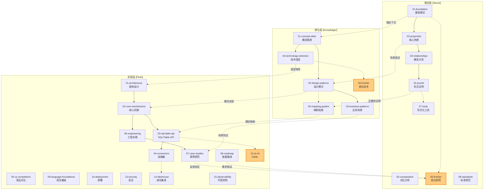

### 1.2 关键定理依赖链

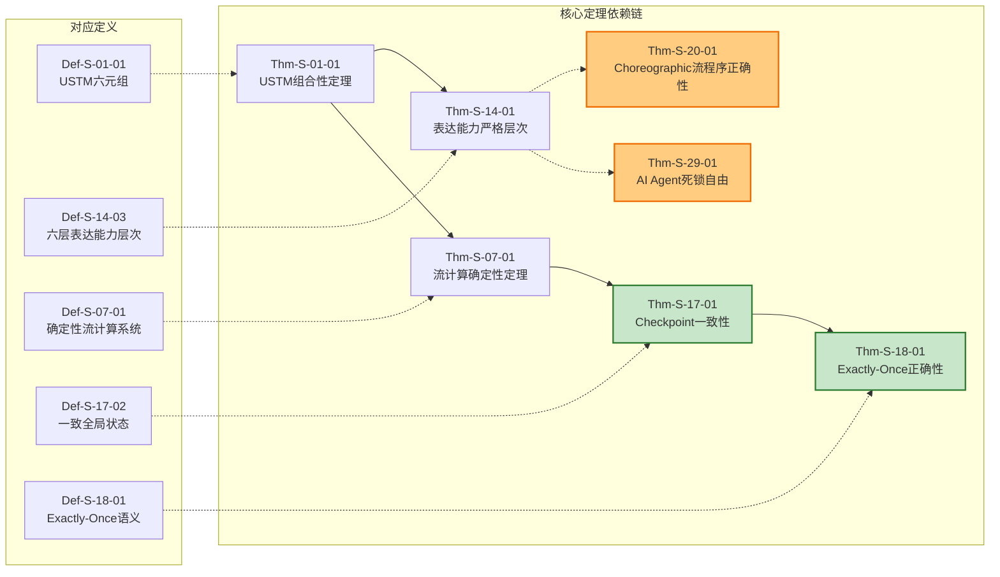

---

## 2. 主题分类脑图

### 2.1 流计算知识体系全景

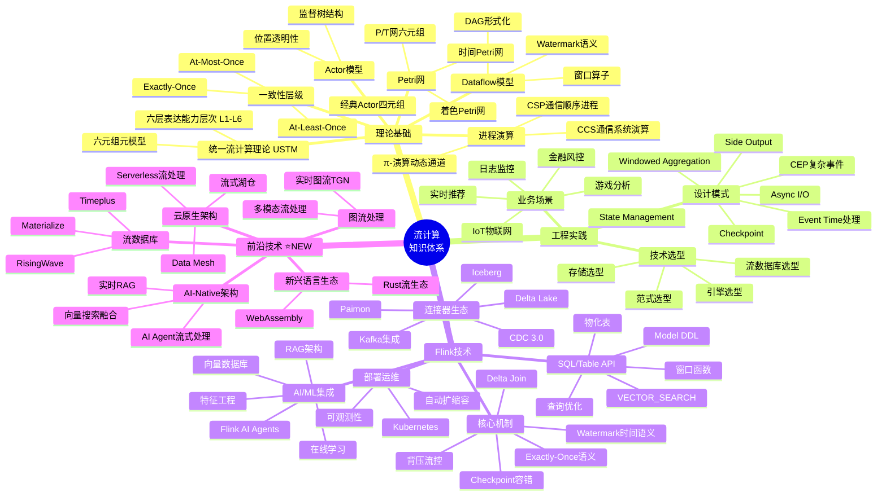

---

## 3. 学习路径图

### 3.1 角色化学习路径

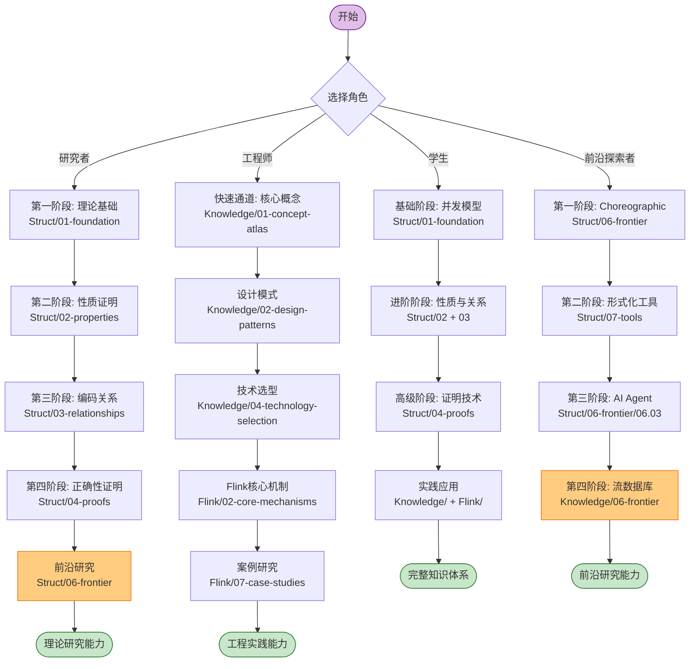

### 3.2 文档阅读顺序建议

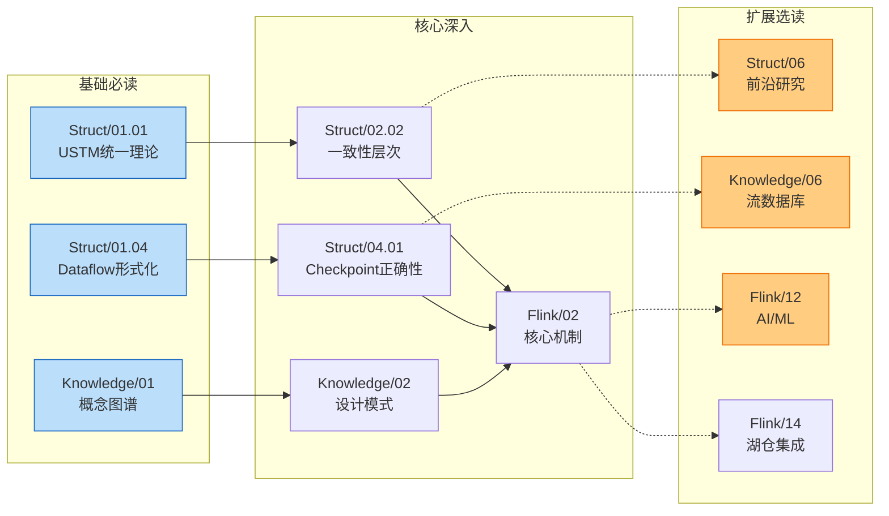

---

## 4. 技术选型决策树

### 4.1 流处理引擎选型

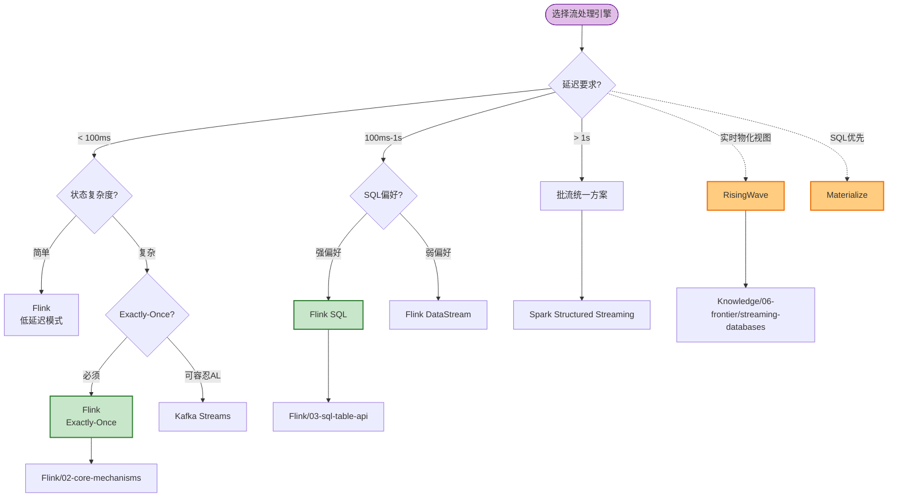

### 4.2 流数据库选型

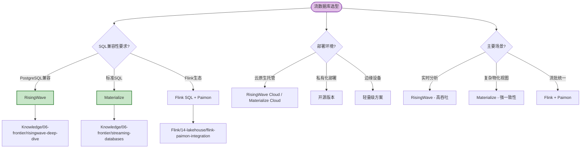

### 4.3 一致性级别选择

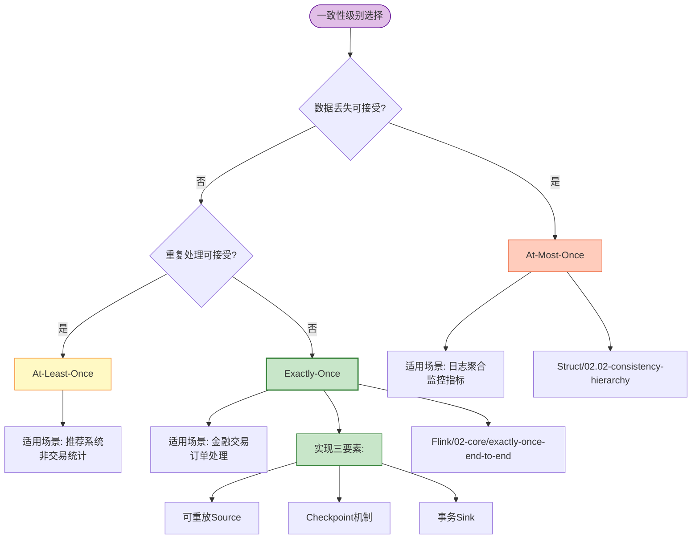

### 4.4 并发范式选型

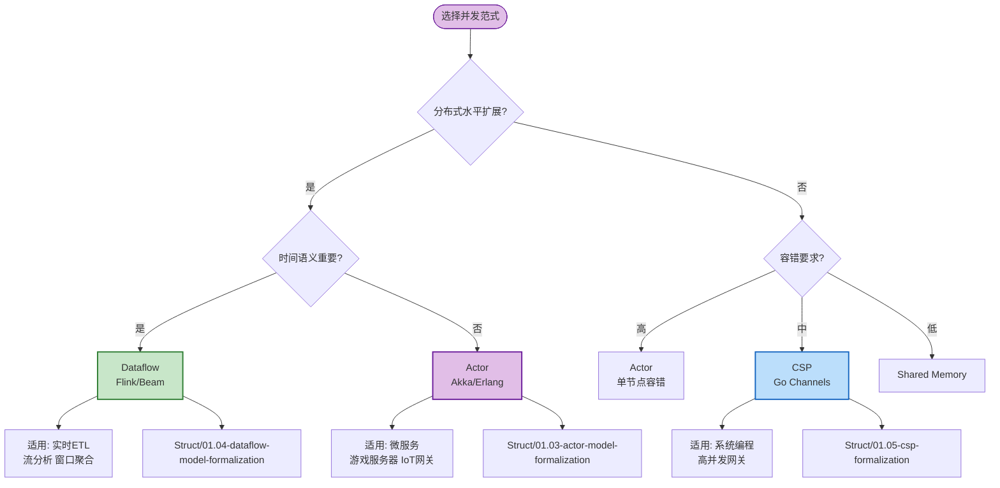

---

## 5. 最新添加内容高亮

### 5.1 v2.8 迭代新增内容

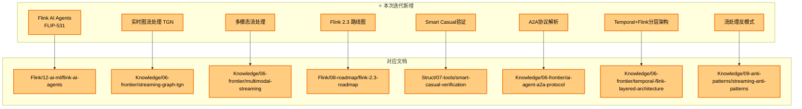

### 5.2 前沿技术矩阵 (新增)

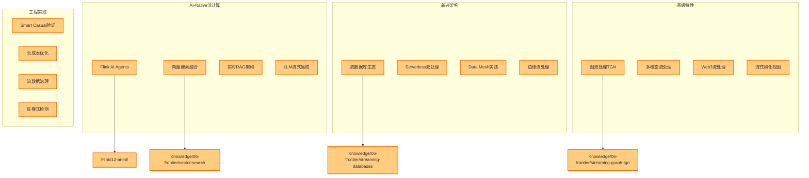

---

## 6. 项目统计总览

### 6.1 总体统计

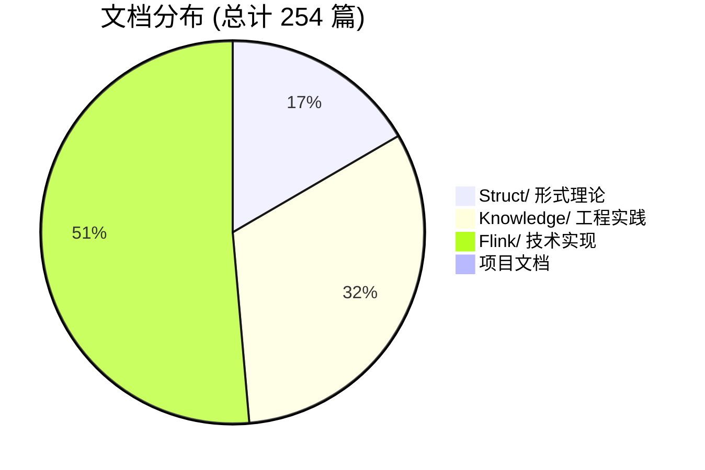

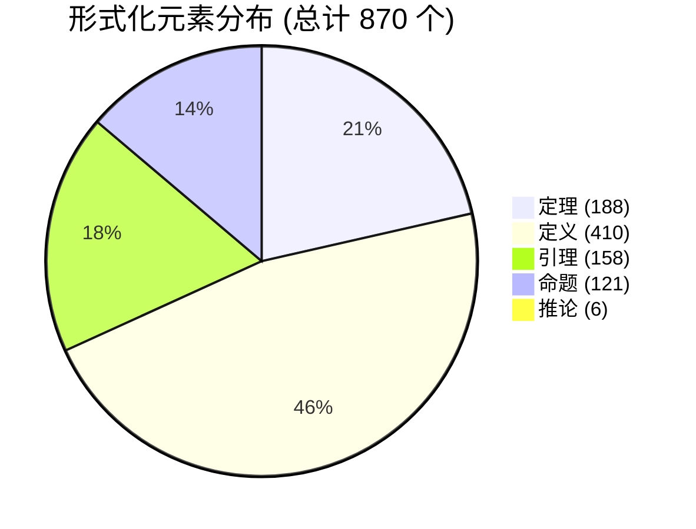

### 6.2 完成状态

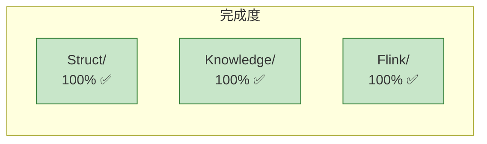

### 6.3 形式化等级分布

| 等级 | 名称 | 描述 | 数量 |
|:----:|------|------|:----:|
| L1 | Regular | 有限状态，P-完全 | 2 |
| L2 | Context-Free | 单栈，PSPACE-完全 | 5 |
| L3 | Process Algebra | 静态命名，EXPTIME | 25 |
| L4 | Mobile | 动态拓扑，部分可判定 | 55 |
| L5 | Higher-Order | 进程作为数据 | 65 |
| L6 | Turing-Complete | 完全不可判定 | 18 |

```mermaid
bar title 形式化等级分布
    y-axis 数量
    x-axis [L1, L2, L3, L4, L5, L6]
    bar [2, 5, 25, 55, 65, 18]
```

---

## 引用参考


---

*地图创建时间: 2026-04-03*
*版本: v2.8*
*适用项目: AnalysisDataFlow*
*维护说明: 新增文档后需更新本地图*

