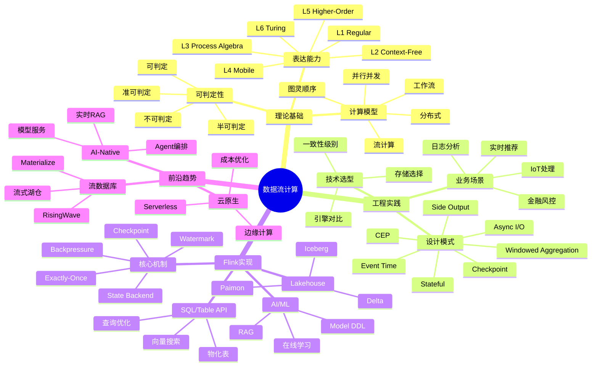

> **状态**: 🔮 前瞻内容 | **风险等级**: 高 | **最后更新**: 2026-04
>
> 此文档描述的内容处于早期规划阶段，可能与最终实现不符。请以 Apache Flink 官方发布为准。
>
# AnalysisDataFlow 可视化体系规划

> **目标**: 构建完整的决策推理判断树图、思维导图、多维矩阵对比、场景树图等可视化体系
> **核心**: 围绕数据流计算的方方面面
> **层次**: 层次间 → 层次内模型间 → 模型内理论间 → 定理推理判断间

---

## 一、项目主题体系梳理

### 1.1 三层架构总览

```
┌─────────────────────────────────────────────────────────────────┐
│                        数据流计算知识体系                         │
├─────────────────────────────────────────────────────────────────┤
│  Layer 3: Flink/ 技术实现层                                      │
│  ├── 架构设计 (1.x→2.0演进、分离状态)                             │
│  ├── 核心机制 (Checkpoint、Exactly-Once、Watermark、Backpressure)│
│  ├── SQL/Table API (查询优化、物化表、向量搜索)                   │
│  ├── AI/ML集成 (Model DDL、在线学习、RAG)                        │
│  ├── Lakehouse集成 (Paimon、Iceberg、Delta)                     │
│  └── 部署运维 (K8s、Serverless、成本优化)                        │
├─────────────────────────────────────────────────────────────────┤
│  Layer 2: Knowledge/ 工程实践层                                   │
│  ├── 概念图谱 (并发范式矩阵、流模型心智图)                          │
│  ├── 设计模式 (7大核心模式、反模式)                                │
│  ├── 业务场景 (11个真实案例: Uber/Netflix/阿里双11)                 │
│  ├── 技术选型 (引擎/存储/范式/流数据库)                             │
│  ├── 前沿技术 (流数据库、AI Agent、Temporal、边缘计算)              │
│  └── 标准规范 (数据治理、安全合规)                                 │
├─────────────────────────────────────────────────────────────────┤
│  Layer 1: Struct/ 形式化理论层                                   │
│  ├── 基础理论 (USTM、进程演算、Actor、Dataflow、CSP、Petri网)      │
│  ├── 性质推导 (确定性、一致性、Watermark单调性、活性/安全性)        │
│  ├── 关系建立 (模型编码、表达能力层次L1-L6)                        │
│  ├── 形式证明 (Checkpoint正确性、Exactly-Once正确性)              │
│  ├── 前沿研究 (Choreographic、AI Agent会话类型、pDOT)             │
│  └── 形式化工具 (TLA+、Coq、Iris、模型检查)                       │
└─────────────────────────────────────────────────────────────────┘
```

### 1.2 核心主题网络

```
数据流计算 (核心)
    │
    ├── 理论基础
    │   ├── 计算模型谱系
    │   │   ├── 图灵顺序计算
    │   │   ├── 并行并发计算
    │   │   ├── 分布式计算
    │   │   ├── 流计算 (Dataflow)
    │   │   ├── 工作流计算 (Temporal)
    │   │   └── 新兴范式 (边缘/神经形态/量子)
    │   │
    │   ├── 可判定性谱系
    │   │   ├── 不可判定性 (分布式共识、LLM Agent)
    │   │   ├── 半可判定性 (流计算CEP、无限流)
    │   │   ├── 准可判定性 (工作流、Saga补偿)
    │   │   └── 可判定性 (高效算法、有限状态)
    │   │
    │   └── 表达能力层次 (L1-L6)
    │       ├── L1: Regular (FSM)
    │       ├── L2: Context-Free (PDA)
    │       ├── L3: Process Algebra (CSP/CCS)
    │       ├── L4: Mobile (π-calculus/Actor)
    │       ├── L5: Higher-Order (HOπ)
    │       └── L6: Turing-Complete
    │
    ├── 工程实现
    │   ├── 流处理引擎
    │   │   ├── Apache Flink (标杆)
    │   │   ├── Kafka Streams
    │   │   ├── Spark Streaming
    │   │   └── 流数据库 (RisingWave/Materialize)
    │   │
    │   ├── 核心机制
    │   │   ├── Checkpoint (分布式快照)
    │   │   ├── Exactly-Once (端到端一致性)
    │   │   ├── Watermark (事件时间处理)
    │   │   ├── State Management (状态后端)
    │   │   └── Backpressure (流量控制)
    │   │
    │   ├── 设计模式
    │   │   ├── Event Time Processing
    │   │   ├── Windowed Aggregation
    │   │   ├── CEP Complex Event
    │   │   ├── Async I/O Enrichment
    │   │   ├── Stateful Computation
    │   │   ├── Side Output
    │   │   └── Checkpoint Recovery
    │   │
    │   └── 业务场景
    │       ├── 金融实时风控
    │       ├── 实时推荐系统
    │       ├── IoT物联网处理
    │       ├── 日志分析监控
    │       └── 实时数仓
    │
    └── 前沿趋势
        ├── AI-Native流处理
        │   ├── AI Agent编排 (MCP/A2A/Temporal)
        │   ├── 实时RAG (向量搜索+流处理)
        │   └── 模型服务与在线学习
        │
        ├── 流数据库生态
        │   ├── RisingWave (PostgreSQL兼容)
        │   ├── Materialize (强一致性)
        │   └── 流式湖仓 (Paimon/Iceberg)
        │
        └── 云原生演进
            ├── Serverless流处理
            ├── 边缘流计算
            └── 成本优化与FinOps
```

---

## 二、可视化体系规划

### 2.1 层次之间可视化

| 可视化类型 | 文件路径 | 内容描述 |
|-----------|---------|---------|
| **知识流转图** | `visuals/struct-knowledge-flink-flow.md` | 展示理论→实践→实现的转化路径 |
| **判定性分层图** | `visuals/decidability-hierarchy.md` | 展示三层架构在可判定性谱系中的位置 |
| **依赖关系图** | `visuals/layer-dependencies.md` | 展示三层之间的依赖和反馈关系 |

### 2.2 层次内模型之间可视化

#### Struct/ 内部模型关系

| 可视化类型 | 文件路径 | 内容描述 |
|-----------|---------|---------|
| **模型对比矩阵** | `visuals/model-comparison-matrix.md` | CCS/CSP/π/Actor/Dataflow/Petri六维对比 |
| **表达能力层次图** | `visuals/expressiveness-hierarchy.md` | L1-L6层次及模型归属 |
| **编码关系图** | `visuals/model-encoding-graph.md` | Actor→CSP、Flink→π等编码关系 |
| **选择决策树** | `visuals/model-selection-tree.md` | 如何为场景选择合适的计算模型 |

#### Knowledge/ 内部模式关系

| 可视化类型 | 文件路径 | 内容描述 |
|-----------|---------|---------|
| **设计模式关系图** | `visuals/pattern-relationships.md` | 7大模式之间的依赖和组合关系 |
| **场景-模式映射矩阵** | `visuals/scenario-pattern-matrix.md` | 11个场景与7个模式的映射 |
| **技术选型决策树** | `visuals/tech-selection-trees.md` | 引擎/存储/范式/一致性选型 |
| **反模式-模式对应图** | `visuals/anti-pattern-mapping.md` | 反模式与正确模式的对应 |

#### Flink/ 内部模块关系

| 可视化类型 | 文件路径 | 内容描述 |
|-----------|---------|---------|
| **架构演进图** | `visuals/flink-evolution.md` | 1.x→2.0架构演进对比 |
| **核心机制关系图** | `visuals/flink-core-mechanisms.md` | Checkpoint/Exactly-Once/Watermark关系 |
| **SQL-DataStream映射** | `visuals/sql-datastream-mapping.md` | Table API与DataStream的对应关系 |
| **版本特性矩阵** | `visuals/flink-version-matrix.md` | 各版本特性对比矩阵 |

### 2.3 模型内理论之间可视化

| 可视化类型 | 文件路径 | 内容描述 |
|-----------|---------|---------|
| **USTM元模型图** | `visuals/ustm-meta-model.md` | USTM六元组及各组件关系 |
| **进程演算演化树** | `visuals/process-calculus-evolution.md` | CCS→CSP→π→Actor的演化关系 |
| **Dataflow操作符图** | `visuals/dataflow-operators.md` | Source/Transform/Sink及中间操作符 |
| **一致性层次图** | `visuals/consistency-hierarchy.md` | AM→AL→EO的层次关系 |

### 2.4 定理推理判断之间可视化

| 可视化类型 | 文件路径 | 内容描述 |
|-----------|---------|---------|
| **定理依赖图** | `visuals/theorem-dependencies.md` | 定理之间的依赖关系（如Checkpoint→Exactly-Once） |
| **证明技术图谱** | `visuals/proof-techniques.md` | 各种证明方法及其应用 |
| **正确性论证链** | `visuals/correctness-argumentation.md` | Flink正确性的完整论证链 |
| **形式化工具选择树** | `visuals/formal-tool-selection.md` | TLA+/Coq/Iris选择决策树 |

---

## 三、关键可视化详细设计

### 3.1 决策推理判断树图

#### 3.1.1 流计算技术选型决策树

```
数据流计算需求
    │
    ├── 延迟要求 < 100ms?
    │   ├── 是 → 低延迟路径
    │   │           ├── 需要Exactly-Once?
    │   │           │   ├── 是 → Flink低延迟模式
    │   │           │   └── 否 → Kafka Streams
    │   │           └── 状态复杂度?
    │   │               ├── 简单 → HashMap State
    │   │               └── 复杂 → RocksDB Tuning
    │   └── 否 → 标准延迟路径
    │
    ├── 状态规模 > 1TB?
    │   ├── 是 → 对象存储方案
    │   │           ├── 需要SQL查询? → RisingWave
    │   │           └── 纯流处理 → Flink + ForSt
    │   └── 否 → 本地存储方案
    │
    ├── 需要长期运行工作流?
    │   ├── 是 → Temporal + Flink分层架构
    │   └── 否 → 纯流处理方案
    │
    └── AI/ML集成需求?
        ├── 是 → Flink ML/AI Agents
        └── 否 → 标准DataStream
```

#### 3.1.2 一致性级别选择决策树

```
数据丢失可接受?
    ├── 是 → At-Most-Once
    │           └── 适用: 日志聚合、监控指标
    └── 否 → 重复处理可接受?
                ├── 是 → At-Least-Once
                │           └── 适用: 推荐系统、非交易统计
                └── 否 → Exactly-Once
                            ├── 需要事务Sink? → 2PC Sink
                            └── 幂等Sink可行? → 幂等写入
```

### 3.2 多维矩阵对比

#### 3.2.1 计算模型六维对比矩阵

| 维度 | CCS | CSP | π-calculus | Actor | Dataflow | Petri网 |
|------|-----|-----|-----------|-------|----------|---------|
| **通信方式** | 同步 | 多路同步 | 移动性 | 异步消息 | 数据流 | 令牌传递 |
| **表达能力** | L3 | L3 | L4 | L4 | L4 | L2-L4 |
| **可判定性** | EXPTIME | EXPTIME | 部分不可判定 | 部分不可判定 | 准可判定 | 可判定 |
| **适用场景** | 协议验证 | 并发控制 | 动态拓扑 | 分布式容错 | 流处理 | 工作流 |
| **工具支持** | CWB | FDR | 有限 | Akka | Flink | CPN Tools |
| **学习曲线** | 陡峭 | 中等 | 陡峭 | 平缓 | 中等 | 中等 |

#### 3.2.2 流处理引擎八维对比矩阵

| 维度 | Flink | RisingWave | Materialize | ksqlDB | Spark Streaming |
|------|-------|-----------|-------------|--------|-----------------|
| **延迟** | 毫秒级 | 亚秒级 | 亚秒级 | 毫秒级 | 秒级 |
| **SQL兼容** | Flink SQL | PostgreSQL | PostgreSQL | KSQL | Spark SQL |
| **状态存储** | 本地RocksDB | S3对象存储 | 托管存储 | RocksDB+Kafka | 内存/磁盘 |
| **Exactly-Once** | ✅ 原生 | ✅ 原生 | ✅ 严格 | ⚠️ EOS | ⚠️ 微批 |
| **物化视图** | 需配合 | ✅ 原生 | ✅ 原生 | ⚠️ 有限 | ❌ |
| **部署模式** | 自托管/云 | 自托管/云 | 仅云 | 自托管/云 | 自托管/云 |
| **开源许可** | Apache 2.0 | Apache 2.0 | BSL | CCL | Apache 2.0 |
| **最佳场景** | 复杂流处理 | 实时分析 | 强一致需求 | Kafka生态 | 批流统一 |

### 3.3 场景树图

#### 3.3.1 业务场景层次树

```
实时数据处理场景
    │
    ├── 金融领域
    │   ├── 实时风控
    │   │   ├── 欺诈检测 (CEP模式)
    │   ├── 交易监控
    │   │   └── 异常交易识别 (Event Time + Window)
    │   └── 实时清算
    │       └── 撮合引擎 (低延迟 + 状态管理)
    │
    ├── 电商领域
    │   ├── 实时推荐
    │   │   ├── 个性化推荐 (Async I/O + 特征工程)
    │   ├── 库存管理
    │   │   └── 实时库存更新 (Exactly-Once)
    │   └── 价格监控
    │       └── 动态定价 (Windowed Aggregation)
    │
    ├── IoT领域
    │   ├── 设备监控
    │   │   ├── 传感器聚合 (Event Time + Watermark)
    │   ├── 预测性维护
    │   │   └── 异常检测 (CEP + ML预测)
    │   └── 边缘处理
    │       └── 边缘-云协同 (分层架构)
    │
    └── 运营领域
        ├── 日志分析
        │   ├── 实时日志处理 (Side Output + 聚合)
        ├── 用户行为分析
        │   └── Clickstream分析 (Session Window)
        └── 实时监控
            └── APM指标聚合 (Tumbling Window)
```

### 3.4 思维导图

#### 3.4.1 数据流计算完整知识体系



---

## 四、执行计划

### 4.1 第一批：核心决策树（P0）

| 序号 | 任务 | 文件 | 预计时间 |
|-----|------|------|---------|
| 1 | 流计算技术选型决策树 | `visuals/selection-tree-streaming.md` | 2h |
| 2 | 一致性级别决策树 | `visuals/selection-tree-consistency.md` | 1h |
| 3 | 并发范式选型决策树 | `visuals/selection-tree-paradigm.md` | 2h |
| 4 | 形式化工具选择树 | `visuals/selection-tree-formal.md` | 1h |

### 4.2 第二批：多维对比矩阵（P0）

| 序号 | 任务 | 文件 | 预计时间 |
|-----|------|------|---------|
| 5 | 计算模型六维对比矩阵 | `visuals/matrix-models.md` | 2h |
| 6 | 流处理引擎八维对比矩阵 | `visuals/matrix-engines.md` | 2h |
| 7 | 设计模式适用矩阵 | `visuals/matrix-patterns.md` | 1.5h |
| 8 | 业务场景-技术映射矩阵 | `visuals/matrix-scenarios.md` | 2h |

### 4.3 第三批：层次关系图（P1）

| 序号 | 任务 | 文件 | 预计时间 |
|-----|------|------|---------|
| 9 | 知识流转图（三层） | `visuals/layer-knowledge-flow.md` | 2h |
| 10 | 判定性分层图 | `visuals/layer-decidability.md` | 1.5h |
| 11 | Struct内部模型关系图 | `visuals/struct-model-relations.md` | 2h |
| 12 | Knowledge模式关系图 | `visuals/knowledge-pattern-relations.md` | 1.5h |

### 4.4 第四批：场景与论证（P1）

| 序号 | 任务 | 文件 | 预计时间 |
|-----|------|------|---------|
| 13 | 业务场景层次树 | `visuals/scenario-hierarchy.md` | 2h |
| 14 | 定理依赖关系图 | `visuals/theorem-dependencies.md` | 2h |
| 15 | 正确性论证链 | `visuals/correctness-chain.md` | 2h |
| 16 | 完整知识体系思维导图 | `visuals/mindmap-complete.md` | 3h |

### 4.5 第五批：综合可视化（P2）

| 序号 | 任务 | 文件 | 预计时间 |
|-----|------|------|---------|
| 17 | 项目总览仪表盘 | `visuals/dashboard-overview.md` | 3h |
| 18 | 学习路径引导图 | `visuals/learning-paths.md` | 2h |
| 19 | 前沿技术雷达图 | `visuals/radar-frontier.md` | 2h |
| 20 | 综合索引可视化 | `visuals/index-visual.md` | 2h |

---

## 五、总计

| 批次 | 任务数 | 预计总时间 | 优先级 |
|-----|-------|-----------|-------|
| 第一批 | 4 | 6h | P0 |
| 第二批 | 4 | 7.5h | P0 |
| 第三批 | 4 | 7h | P1 |
| 第四批 | 4 | 9h | P1 |
| 第五批 | 4 | 9h | P2 |
| **总计** | **20** | **38.5h** | - |

建议执行顺序：P0 → P1 → P2

---

*计划编制完成，等待用户确认*
