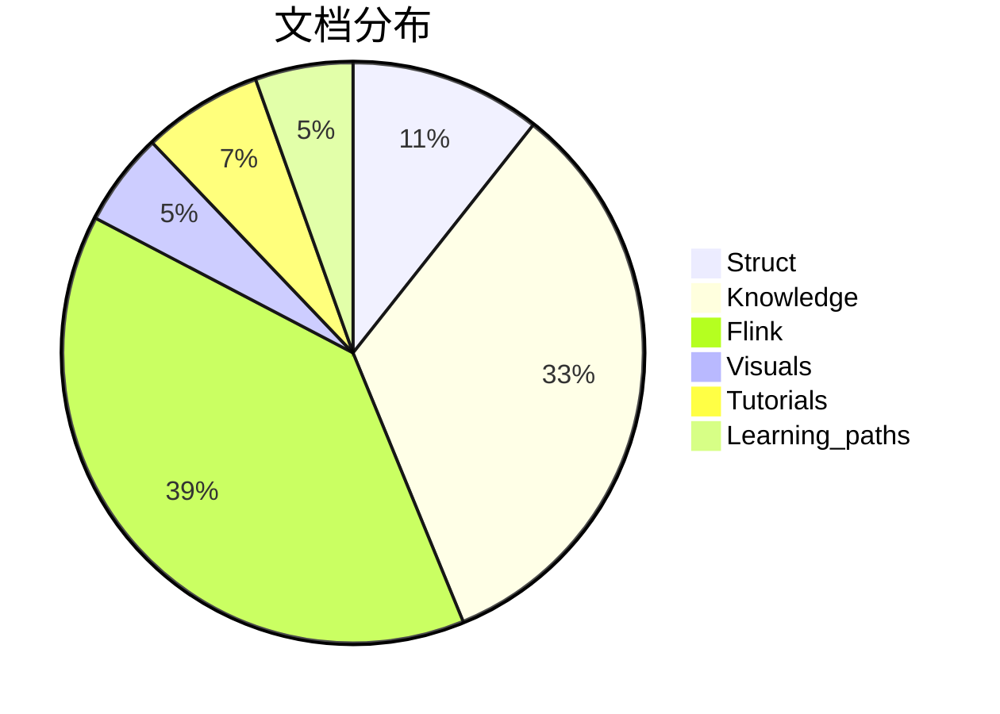
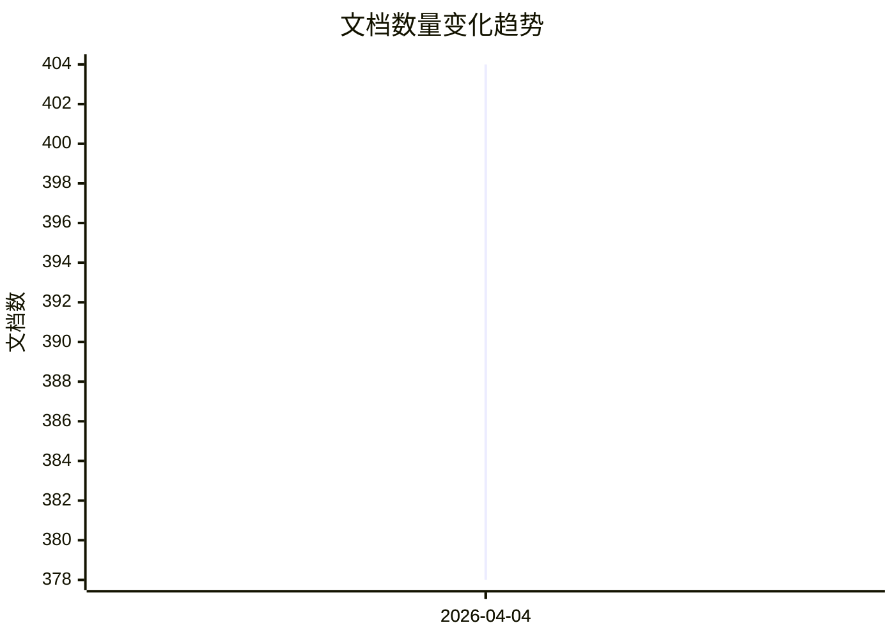
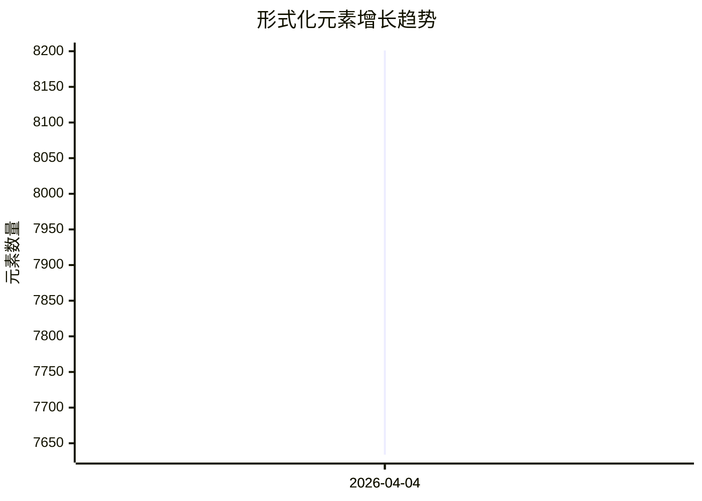
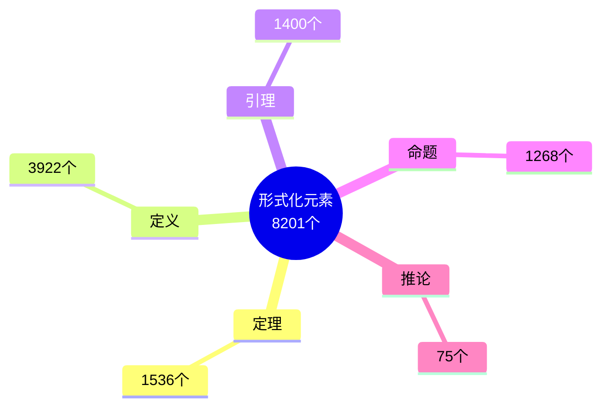
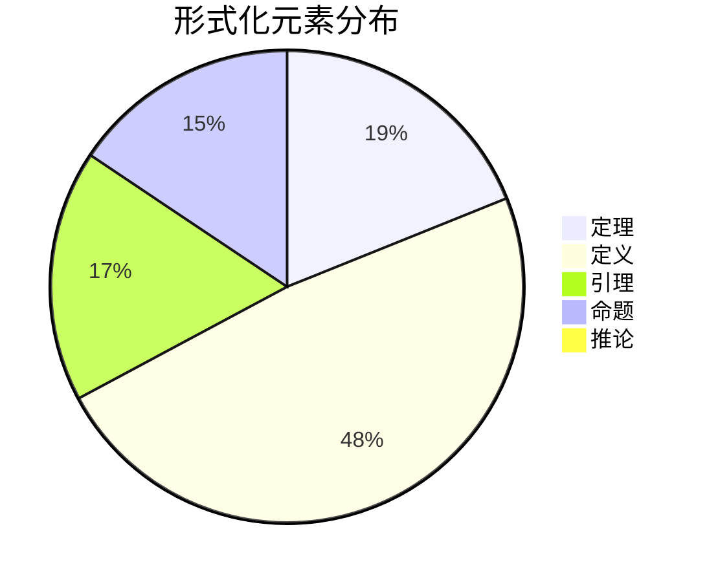
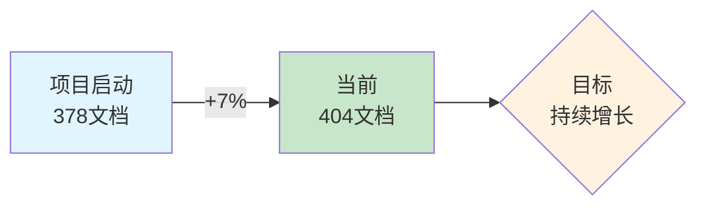
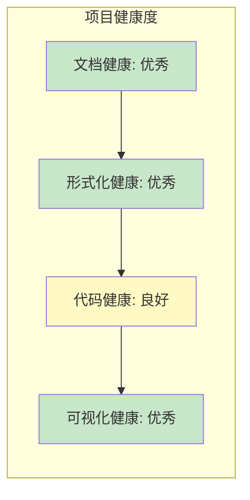

# 📊 AnalysisDataFlow 项目统计仪表盘

> **自动生成**: 2026-04-04 06:59:18
> **统计周期**: 实时 | **更新频率**: 每日

---

## 导航

- [📊 AnalysisDataFlow 项目统计仪表盘](#-analysisdataflow-项目统计仪表盘)
  - [导航](#导航)
  - [概览指标](#概览指标)
    - [详细统计](#详细统计)
    - [形式化元素明细](#形式化元素明细)
  - [进度总览](#进度总览)
    - [📐 Struct/](#-struct)
    - [📚 Knowledge/](#-knowledge)
    - [🔥 Flink/](#-flink)
    - [📊 Visuals/](#-visuals)
    - [📁 Tutorials/](#-tutorials)
    - [📁 Learning\_paths/](#-learning_paths)
  - [目录分析](#目录分析)
    - [详细统计](#详细统计-1)
  - [趋势图表](#趋势图表)
    - [文档数量趋势](#文档数量趋势)
    - [形式化元素趋势](#形式化元素趋势)
    - [代码示例趋势](#代码示例趋势)
  - [形式化元素分布](#形式化元素分布)
    - [分布饼图](#分布饼图)
  - [增长分析](#增长分析)
    - [本周增长](#本周增长)
    - [累计增长](#累计增长)
    - [增长趋势图](#增长趋势图)
  - [对比矩阵](#对比矩阵)
    - [各目录效率指标](#各目录效率指标)
    - [热力图](#热力图)
  - [质量指标](#质量指标)
    - [文档质量评分](#文档质量评分)
    - [质量雷达](#质量雷达)
    - [健康度指标](#健康度指标)
  - [说明](#说明)
    - [相关文档](#相关文档)

---

## 概览指标

<div align="center">

| 📚 文档 | 🔬 形式化元素 | 💻 代码示例 | 📈 可视化 |
|:------:|:------------:|:----------:|:---------:|
| **404** | **8201** | **2922** | **1695** |
| 篇技术文档 | 个定理/定义/引理 | 个代码片段 | 个Mermaid图表 |

</div>

### 详细统计

| 指标 | 数值 | 说明 |
|------|------|------|
| 文档总数 | 404 | Markdown技术文档 |
| 总行数 | 367,009 | 文本行数 |
| 总大小 | 11.96 MB | 文档体积 |
| 形式化元素 | 8201 | 定理+定义+引理+命题+推论 |
| 代码示例 | 2922 | 可运行代码片段 |
| Mermaid图表 | 1695 | 架构图/流程图/时序图 |

### 形式化元素明细

| 类型 | 数量 | 占比 | 可视化 |
|------|------|------|--------|
| 定理 (Thm) | 1536 | 19% | ███░░░░░░░░░░░░░░░░░ |
| 定义 (Def) | 3922 | 48% | █████████░░░░░░░░░░░ |
| 引理 (Lemma) | 1400 | 17% | ███░░░░░░░░░░░░░░░░░ |
| 命题 (Prop) | 1268 | 15% | ███░░░░░░░░░░░░░░░░░ |
| 推论 (Cor) | 75 | 1% | ░░░░░░░░░░░░░░░░░░░░ |

---

## 进度总览

### 📐 Struct/

```
进度: [████████████░░░░░░░░░░░░░░░░░░] 43%
文档: 43 | 形式化元素: 1877
```

### 📚 Knowledge/

```
进度: [██████████████████████████████] 100%
文档: 134 | 形式化元素: 2154
```

### 🔥 Flink/

```
进度: [██████████████████████████████] 100%
文档: 157 | 形式化元素: 3737
```

### 📊 Visuals/

```
进度: [██████░░░░░░░░░░░░░░░░░░░░░░░░] 21%
文档: 21 | 形式化元素: 418
```

### 📁 Tutorials/

```
进度: [████████░░░░░░░░░░░░░░░░░░░░░░] 27%
文档: 27 | 形式化元素: 15
```

### 📁 Learning_paths/

```
进度: [██████░░░░░░░░░░░░░░░░░░░░░░░░] 22%
文档: 22 | 形式化元素: 0
```


---

## 目录分析



### 详细统计

| 目录 | 文档数 | 大小 | 行数 | 定理 | 定义 | 引理 | 代码示例 | 图表 |
|------|--------|------|------|------|------|------|----------|------|
| Flink | 157 | 6090KB | 189,082 | 681 | 1840 | 536 | 1788 | 828 |
| Knowledge | 134 | 3771KB | 108,253 | 305 | 1069 | 320 | 755 | 535 |
| Learning_paths | 22 | 186KB | 7,126 | 0 | 0 | 0 | 59 | 14 |
| Struct | 43 | 1336KB | 35,401 | 380 | 835 | 470 | 89 | 144 |
| Tutorials | 27 | 436KB | 15,846 | 0 | 8 | 2 | 212 | 46 |
| Visuals | 21 | 426KB | 11,301 | 170 | 170 | 72 | 19 | 128 |

---

## 趋势图表

### 文档数量趋势



### 形式化元素趋势



### 代码示例趋势

```mermaid
xychart-beta
    title "代码示例增长趋势"
    x-axis [2026-04-04, 2026-04-04]
    y-axis "代码示例数"
    line [2508, 2922]
```

---

## 形式化元素分布



### 分布饼图



---

## 增长分析

### 本周增长

| 指标 | 上周 | 本周 | 增长 | 增长率 |
|------|------|------|------|--------|
| 文档数 | 378 | 404 | 26 | +6.9% |
| 形式化元素 | 7634 | 8201 | 567 | +7.4% |
| 代码示例 | 2508 | 2922 | 414 | +16.5% |

### 累计增长

| 指标 | 初始 | 当前 | 总增长 |
|------|------|------|--------|
| 文档数 | 378 | 404 | +6.9% |
| 形式化元素 | 7634 | 8201 | +7.4% |
| 代码示例 | 2508 | 2922 | +16.5% |

### 增长趋势图



---

## 对比矩阵

### 各目录效率指标

| 目录 | 文档/千行 | 形式化/文档 | 代码/文档 | 图表/文档 |
|------|----------|------------|----------|----------|
| Struct | 1.21 | 43.65 | 2.07 | 3.35 |
| Knowledge | 1.24 | 16.07 | 5.63 | 3.99 |
| Flink | 0.83 | 23.8 | 11.39 | 5.27 |
| Visuals | 1.86 | 19.9 | 0.9 | 6.1 |
| Tutorials | 1.7 | 0.56 | 7.85 | 1.7 |
| Learning_paths | 3.09 | 0.0 | 2.68 | 0.64 |

### 热力图


---

## 质量指标

### 文档质量评分

| 指标 | 数值 | 目标 | 评分 | 状态 |
|------|------|------|------|------|
| 形式化密度 | 20.3 元素/文档 | ≥3.0 | ★★★★★ | ✅ |
| 代码密度 | 7.2 示例/文档 | ≥5.0 | ★★★☆☆ | ✅ |
| 可视化密度 | 4.2 图表/文档 | ≥1.5 | ★★★★☆ | ✅ |

### 质量雷达

```mermaid
radar
    title 项目质量雷达图
    axis 形式化严谨性 "代码丰富度" "可视化程度" "文档完整性" "结构规范性"
    area Current 202.9950495049505, 14.465346534653465, 12.586633663366339, 9, 8
```

### 健康度指标



---

---

## 说明

- 📊 本仪表盘由 `dashboard-generator.py` 自动生成
- 🔄 更新频率: 每日自动更新
- 📈 数据来源: `.stats/project-stats.json`
- 📜 历史记录: `.stats/stats-history.json`

### 相关文档

- [项目主文档](../../README.md)
- [进度跟踪](../../PROJECT-TRACKING.md)
- [定理注册表](../../THEOREM-REGISTRY.md)

---

*AnalysisDataFlow Project Dashboard v1.0*
