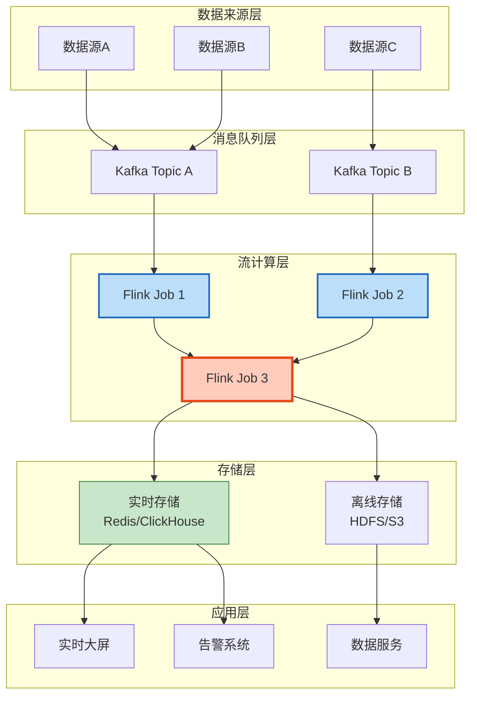

# 🏆 工业案例展示模板

> **用途**: 审核通过案例的标准化展示格式
> **适用对象**: 已收录到 `case-studies/verified/` 的案例
> **版本**: v1.0

---

## 📋 案例展示结构

```
案例展示页面结构:

┌─────────────────────────────────────────────────────────────┐
│  🏆 案例标题                                                  │
│  公司名称 + 行业标签 + 技术栈标签                              │
├─────────────────────────────────────────────────────────────┤
│  ┌─────────────┐  ┌─────────────────────────────────────┐   │
│  │ 公司Logo    │  │ 一句话简介                          │   │
│  │             │  │                                     │   │
│  └─────────────┘  └─────────────────────────────────────┘   │
├─────────────────────────────────────────────────────────────┤
│  📊 核心指标卡片                                             │
│  [吞吐量] [延迟] [数据规模] [集群规模]                        │
├─────────────────────────────────────────────────────────────┤
│  🏗️ 系统架构图                                               │
│  ┌─────────────────────────────────────────────────────┐   │
│  │                                                     │   │
│  │              Mermaid 架构图                        │   │
│  │                                                     │   │
│  └─────────────────────────────────────────────────────┘   │
├─────────────────────────────────────────────────────────────┤
│  📝 案例详情                                                 │
│  背景挑战 → 解决方案 → 实施过程 → 成果收益                   │
├─────────────────────────────────────────────────────────────┤
│  💡 经验总结                                                 │
│  最佳实践 + 踩过的坑 + 技术选型建议                          │
├─────────────────────────────────────────────────────────────┤
│  👥 贡献者信息                                               │
│  提交人信息 + 致谢 + 相关链接                                │
└─────────────────────────────────────────────────────────────┘
```

---

## 🎨 视觉设计规范

### 颜色方案

| 元素 | 颜色 | 色值 | 用途 |
|------|------|------|------|
| 主色调 | 深蓝 | `#1565C0` | 标题、重点 |
| 辅色调 | 青色 | `#00838F` | 副标题、标签 |
| 强调色 | 橙色 | `#F57C00` | 关键数据、CTA |
| 成功色 | 绿色 | `#2E7D32` | 正向指标 |
| 背景色 | 浅灰 | `#F5F5F5` | 卡片背景 |

### 排版规范

| 元素 | 字体大小 | 字重 | 样式 |
|------|----------|------|------|
| 案例标题 | 32px | Bold | - |
| 公司名称 | 24px | Medium | - |
| 章节标题 | 20px | SemiBold | 左侧边框3px |
| 正文 | 16px | Regular | 行高1.6 |
| 标注 | 14px | Regular | 灰色 #666 |

---

## 📐 公司Logo放置规范

### Logo区域设计

```
┌─────────────────────────────────────────────────────────┐
│  公司Logo展示区域                                         │
├─────────────────────────────────────────────────────────┤
│                                                         │
│    ┌─────────────┐                                      │
│    │             │   阿里巴巴                            │
│    │   Logo      │   电商行业 · Apache Flink           │
│    │   200x200   │                                      │
│    │             │   "双11实时大屏背后的流计算架构"      │
│    │             │                                      │
│    └─────────────┘                                      │
│                                                         │
│  规格: 200x200px 白色背景                                 │
│  格式: PNG/SVG 透明背景优先                               │
│  备选: 公司名称首字母 + 行业色块                          │
│                                                         │
└─────────────────────────────────────────────────────────┘
```

### 匿名案例Logo处理

| 匿名级别 | Logo处理方式 | 示例 |
|----------|--------------|------|
| 完全公开 | 使用公司官方Logo | `logo-alibaba.png` |
| 半匿名 | 使用行业通用图标 | `icon-ecommerce.svg` |
| 完全匿名 | 使用技术栈图标组合 | `flink-kafka-badge.svg` |

### 行业图标映射

| 行业 | 图标 | 颜色 |
|------|------|------|
| 金融 | 💰 或 🏦 | #1B5E20 |
| 电商 | 🛒 或 📦 | #E65100 |
| IoT | 🔧 或 📡 | #0D47A1 |
| 游戏 | 🎮 或 🎯 | #4A148C |
| 社交 | 💬 或 👥 | #006064 |
| 基础设施 | ⚙️ 或 🔧 | #37474F |

---

## 🏗️ 架构图模板

### 标准架构图格式

```markdown
### 系统架构图



```

### 架构图样式规范

| 组件类型 | 填充色 | 边框色 | 边框宽度 | 说明 |
|----------|--------|--------|----------|------|
| 数据源 | #FFF9C4 | #F57F17 | 1px | 黄色系 |
| 消息队列 | #E1BEE7 | #6A1B9A | 1px | 紫色系 |
| Flink Job | #BBDEFB | #1565C0 | 2px | 蓝色系 |
| 核心处理 | #FFCCBC | #E64A19 | 3px | 橙色系加粗 |
| 存储 | #C8E6C9 | #2E7D32 | 1px | 绿色系 |
| 应用 | #F8BBD9 | #C2185B | 1px | 粉色系 |

---

## 📊 效果数据展示模板

### 核心指标卡片

```markdown
### 📊 核心性能指标

<div align="center">

| 指标类别 | 具体指标 | 数值 | 说明 |
|:--------:|:--------:|:----:|:----:|
| **吞吐量** | 峰值处理 | 100万 TPS | 双11峰值 |
| **延迟** | P99延迟 | 50ms | 端到端 |
| **规模** | 数据量 | 10 TB/天 | 日处理量 |
| **可用性** | SLA | 99.99% | 年度 |

</div>
```

### 对比效果展示

```markdown
### 📈 优化效果对比

```

优化前                    优化后                    提升幅度
┌──────────┐             ┌──────────┐             ┌──────────┐
│          │             │  ████    │             │          │
│  ████    │  延迟       │  ████    │   延迟      │   85%    │
│  ████    │  850ms      │          │   120ms     │   ↓      │
│  ████    │             │          │             │          │
└──────────┘             └──────────┘             └──────────┘

┌──────────┐             ┌──────────┐             ┌──────────┐
│          │             │  ████████│             │          │
│  ████    │  识别率     │  ████████│   识别率    │   17%    │
│  ████    │  82%        │  ████████│   96.5%     │   ↑      │
│  ████    │             │  ████████│             │          │
└──────────┘             └──────────┘             └──────────┘

```
```

### 详细数据表格

```markdown
### 📋 详细性能数据

#### 吞吐量指标

| 指标项 | 峰值 | 日常 | 备注 |
|:-------|-----:|-----:|:-----|
| 事件吞吐量 | 1,000,000 TPS | 200,000 TPS | 双11峰值 vs 日常 |
| 数据摄入速率 | 500 MB/s | 100 MB/s | 峰值时段 |
| 日处理数据量 | 50 TB | 10 TB | 压缩前 |

#### 延迟分布

| 分位 | 延迟 | 说明 |
|:----:|-----:|:-----|
| P50 | 30ms | 中位数 |
| P95 | 45ms | 95%请求 |
| P99 | 50ms | 99%请求 |
| P99.9 | 80ms | 极端情况 |

#### 资源使用

| 组件 | 数量 | 配置 | 利用率 |
|:-----|-----:|:-----|-------:|
| JobManager | 3 | 8C16G | 40% |
| TaskManager | 20 | 16C32G | 65% |
| Kafka Broker | 9 | 16C32G | 55% |
```

---

## 📝 完整案例展示模板

```markdown
# 🏆 [案例标题]

> **所属阶段**: Knowledge/10-case-studies/ |
> **技术栈**: [主要技术] |
> **行业**: [行业类型]

---

## 📋 基本信息

<div align="center">


### [公司名称]

**[行业标签]** · **[技术栈标签]**

> "[一句话案例亮点]"

</div>

---

## 📊 核心指标

| 🚀 吞吐量 | ⚡ 延迟 | 📦 数据规模 | 🖥️ 集群规模 |
|:---------:|:-------:|:-----------:|:-----------:|
| [X] TPS | [Y] ms | [Z] TB/天 | [N] 节点 |

---

## 🎯 业务背景

### 场景描述
[描述业务场景和核心价值]

### 面临挑战
- 挑战1：[描述]
- 挑战2：[描述]
- 挑战3：[描述]

---

## 🏗️ 系统架构

### 架构图

```mermaid
[架构图代码]
```

### 技术栈

| 层级 | 技术组件 | 版本 | 用途 |
|:-----|:---------|:-----|:-----|
| 数据采集 | [技术] | [版本] | [用途] |
| 消息队列 | [技术] | [版本] | [用途] |
| 流计算 | [技术] | [版本] | [用途] |
| 存储 | [技术] | [版本] | [用途] |

---

## 💡 解决方案

### 核心设计

[描述核心设计方案]

### 关键技术点

1. **[技术点1]**：[说明]
2. **[技术点2]**：[说明]
3. **[技术点3]**：[说明]

---

## 📈 实施效果

### 性能提升

| 指标 | 优化前 | 优化后 | 提升幅度 |
|:-----|-------:|-------:|---------:|
| [指标1] | [前值] | [后值] | [提升] |
| [指标2] | [前值] | [后值] | [提升] |
| [指标3] | [前值] | [后值] | [提升] |

### 业务价值

- [价值点1]
- [价值点2]
- [价值点3]

---

## 🎓 经验总结

### 最佳实践

1. [实践1]
2. [实践2]
3. [实践3]

### 踩过的坑

1. [坑1]：[解决方案]
2. [坑2]：[解决方案]

### 技术选型建议

[提供技术选型建议]

---

## 🔒 隐私说明

本案例已按 **[公开级别]** 级别进行脱敏处理：

- [x] 敏感信息已移除
- [x] 数据已脱敏
- [x] 已获授权发布

---

## 👥 贡献者

**案例提交**: [提交人姓名/ID]

**技术审核**: [审核人]

**提交日期**: [日期]

---

## 🔗 相关链接

- [公司内部文档]（如有）
- [相关演讲/博客]
- [GitHub 代码]（如有）

---

*本案例收录于 AnalysisDataFlow 工业案例集*
*收录日期: [日期] | 案例ID: CS-[XXX]*

```

---

## 🎨 可视化组件库

### 指标徽章

```markdown
<!-- 吞吐量徽章 -->


<!-- 延迟徽章 -->


<!-- 技术栈徽章 -->


```

### 进度条组件

```markdown
<!-- 指标完成度 -->
**架构完整度**: ████████░░ 80%

**数据详实度**: █████████░ 90%

**技术深度**: ███████░░░ 70%
```

### 标签云

```markdown
**标签**:
`实时风控` `Flink CEP` `Kafka` `Redis`
` exactly-once` `P99<100ms` `金融级`
```

---

## 📱 多平台适配

### GitHub 展示

- 使用 GitHub 支持的 Mermaid 图表
- 使用 Emoji 增强可读性
- 保持表格在 GitHub 预览下的格式

### 网站展示

- 支持响应式布局
- 支持深色/浅色模式切换
- 架构图支持缩放交互

### PDF 导出

- 固定布局确保打印效果
- 图片使用高分辨率版本
- 分页控制避免内容截断

---

## ✅ 案例展示检查清单

### 内容检查

- [ ] 公司Logo清晰可辨识
- [ ] 一句话简介准确概括案例亮点
- [ ] 核心指标数据完整
- [ ] 架构图清晰可读
- [ ] 效果数据有对比依据
- [ ] 经验总结有可复用性
- [ ] 贡献者信息完整

### 格式检查

- [ ] 标题层级正确
- [ ] 表格格式正确
- [ ] 代码块语法高亮
- [ ] Mermaid 图表可渲染
- [ ] 链接可点击
- [ ] 图片正常显示

### 隐私检查

- [ ] 敏感信息已脱敏
- [ ] 授权声明已确认
- [ ] 公开级别正确标注

---

*模板版本: v1.0*
*最后更新: 2026-04-12*
