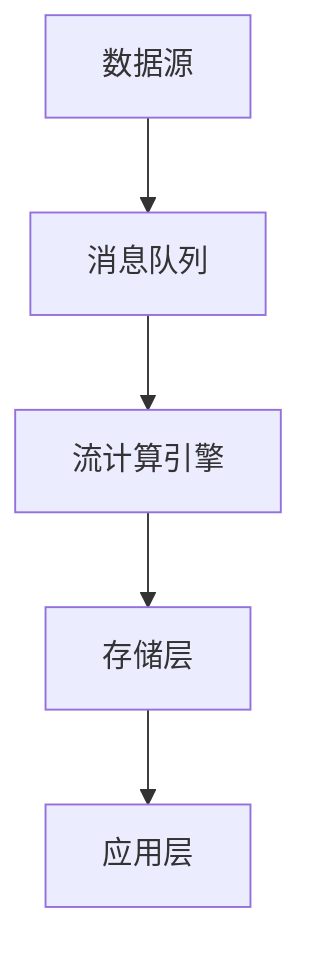

# 🏭 工业案例模板

> 使用说明：复制此模板并填写所有标记为 **必填** 的部分

---

## 📋 基本信息

| 项目 | 内容 |
|------|------|
| **公司名称** | **必填** - 公司/组织全称 |
| **所属行业** | **必填** - 电商/金融/物流/游戏/物联网/社交/广告/其他 |
| **案例提交人** | **必填** - 您的姓名或昵称 |
| **提交日期** | YYYY-MM-DD |

### 联系人信息（不公开）

- 邮箱：**必填**
- GitHub ID：
- 其他联系方式：

---

## 🎯 使用场景

### 业务场景概述（一句话描述）
**必填**

> 例如：基于 Flink 的电商实时风控决策系统

### 详细业务描述
**必填**

描述：
1. 业务背景与挑战
2. 为什么选择流计算方案
3. 系统要解决的核心问题
4. 业务价值

---

## 📊 数据规模

### 吞吐量指标
**必填**

| 指标项 | 峰值 | 日常 | 备注 |
|--------|------|------|------|
| 事件吞吐量 | ___ 事件/秒 | ___ 事件/秒 | |
| 数据量 | ___ GB/天 | ___ GB/天 | |
| 数据摄入速率 | ___ MB/s | ___ MB/s | |

### 集群规模
**必填**

| 组件 | 数量 | 配置规格 |
|------|------|----------|
| JobManager | ___ 个 | ___ CPU / ___ GB 内存 |
| TaskManager | ___ 个 | ___ CPU / ___ GB 内存 |
| 其他 | ___ 个 | |

### 状态与窗口规模
**必填**

| 指标项 | 数值 | 说明 |
|--------|------|------|
| 总状态大小 | ___ GB | |
| 单作业最大状态 | ___ GB | |
| 窗口时间跨度 | ___ | |

### 延迟要求

- 端到端延迟：< ___ ms
- 容错恢复时间（RTO）：< ___ 分钟

---

## 🏗️ 架构图

### 系统架构图
**必填**

建议使用 Mermaid 语法：

### 技术栈清单
**必填**

| 层级 | 技术组件 | 版本 | 用途 |
|------|----------|------|------|
| 数据采集 | | | |
| 消息队列 | | | |
| 流计算引擎 | | | |
| 状态存储 | | | |
| 数据存储 | | | |
| 资源调度 | | | |
| 监控告警 | | | |

---

## 🎓 经验总结

### 技术选型决策

为什么选择当前技术栈？考虑过哪些替代方案？

### 核心挑战与解决方案
**必填 - 至少1-2个**

#### 挑战1：
- **问题描述**：
- **解决方案**：
- **关键配置**：

#### 挑战2：
- **问题描述**：
- **解决方案**：
- **关键配置**：

### 最佳实践建议
**必填 - 至少3条**

1. 
2. 
3. 

### 踩过的坑

1. 
2. 

---

## 📈 项目成果

### 量化指标

| 指标项 | 优化前 | 优化后 | 提升幅度 |
|--------|--------|--------|----------|
| | | | |

---

## 🔒 隐私与授权

### 敏感信息处理

- [ ] 已移除内部主机名/IP地址
- [ ] 已脱敏业务敏感指标
- [ ] 已移除内部项目代号

### 授权声明
**必填**

- [ ] 我确认提交的信息不包含公司机密数据
- [ ] 我授权项目方将此案例用于展示和宣传（按以下级别）：
  - [ ] **完全公开** - 可公开公司名称和所有细节
  - [ ] **半匿名** - 公开行业类型和内容，隐藏公司名称
  - [ ] **完全匿名** - 仅展示技术细节

---

## 📎 附加材料

- 相关文档链接：
- 代码片段：
- 其他补充：

---

<!-- 提交前检查清单：
- [ ] 所有必填项已填写
- [ ] 架构图已提供
- [ ] 敏感信息已脱敏
- [ ] 授权声明已勾选
- [ ] 格式符合模板要求
-->
