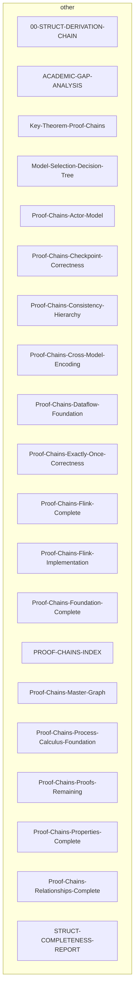

# 文档交叉引用分析报告

生成时间: The current date is: 周日 2026/04/12
Enter the new date: (yy-mm-dd)

## 📊 统计概览

| 指标 | 数值 |
|------|------|
| 文档总数 | 704 |
| 引用总数 | 0 |
| 平均每文档引用 | 0.0 |
| 孤立文档数 | 704 |
| 生成推荐数 | 0 |

## 🔗 引用网络可视化

## 📉 孤立文档（引用数<2）

| 文档路径 | 标题 | 出链 | 入链 |
|----------|------|------|------|
| Struct\00-STRUCT-DERIVATION-CHAIN.md | Struct/ 推导链全景图 {#struct-推导链全景图}... | 0 | 0 |
| Struct\ACADEMIC-GAP-ANALYSIS.md | 学术前沿差距分析... | 0 | 0 |
| Struct\Key-Theorem-Proof-Chains.md | 关键定理证明链... | 0 | 0 |
| Struct\Model-Selection-Decision-Tree.md | 并发与分布式计算模型选择决策树... | 0 | 0 |
| Struct\Proof-Chains-Actor-Model.md | Actor 模型定理完整推导链... | 0 | 0 |
| Struct\Proof-Chains-Checkpoint-Correctness.md | 推导链: Checkpoint 正确性完整证明... | 0 | 0 |
| Struct\Proof-Chains-Consistency-Hierarchy.md | 推导链: 一致性层级定理完整推导... | 0 | 0 |
| Struct\Proof-Chains-Cross-Model-Encoding.md | 推导链: 跨模型编码正确性... | 0 | 0 |
| Struct\Proof-Chains-Dataflow-Foundation.md | Dataflow 基础定理完整推导链... | 0 | 0 |
| Struct\Proof-Chains-Exactly-Once-Correctness.md | 推导链: Exactly-Once 端到端正确性... | 0 | 0 |
| Struct\Proof-Chains-Flink-Complete.md | Flink 层全量定理推导链文档... | 0 | 0 |
| Struct\Proof-Chains-Flink-Implementation.md | 推导链: Flink 实现定理完整推导链... | 0 | 0 |
| Struct\Proof-Chains-Foundation-Complete.md | Foundation 层（01-foundation）全量定义推导链... | 0 | 0 |
| Struct\PROOF-CHAINS-INDEX.md | 核心定理推导链总索引 (Proof Chains Master Index)... | 0 | 0 |
| Struct\Proof-Chains-Master-Graph.md | 50核心定理依赖总图 (Proof Chains Master Graph)... | 0 | 0 |

## 🔥 热点文档（Top 15）

| 排名 | 文档路径 | 总分 | 出链 | 入链 |
|------|----------|------|------|------|
| 1 | Struct\00-STRUCT-DERIVATION-CHAIN.md | 0 | 0 | 0 |
| 2 | Struct\ACADEMIC-GAP-ANALYSIS.md | 0 | 0 | 0 |
| 3 | Struct\Key-Theorem-Proof-Chains.md | 0 | 0 | 0 |
| 4 | Struct\Model-Selection-Decision-Tree.md | 0 | 0 | 0 |
| 5 | Struct\Proof-Chains-Actor-Model.md | 0 | 0 | 0 |
| 6 | Struct\Proof-Chains-Checkpoint-Correctness.md | 0 | 0 | 0 |
| 7 | Struct\Proof-Chains-Consistency-Hierarchy.md | 0 | 0 | 0 |
| 8 | Struct\Proof-Chains-Cross-Model-Encoding.md | 0 | 0 | 0 |
| 9 | Struct\Proof-Chains-Dataflow-Foundation.md | 0 | 0 | 0 |
| 10 | Struct\Proof-Chains-Exactly-Once-Correctness.md | 0 | 0 | 0 |
| 11 | Struct\Proof-Chains-Flink-Complete.md | 0 | 0 | 0 |
| 12 | Struct\Proof-Chains-Flink-Implementation.md | 0 | 0 | 0 |
| 13 | Struct\Proof-Chains-Foundation-Complete.md | 0 | 0 | 0 |
| 14 | Struct\PROOF-CHAINS-INDEX.md | 0 | 0 | 0 |
| 15 | Struct\Proof-Chains-Master-Graph.md | 0 | 0 | 0 |

## 🗺️ 目录间映射推荐（Top 15）

| 源文档 | 目标文档 | 分数 | 原因 | 置信度 |
|--------|----------|------|------|--------|
