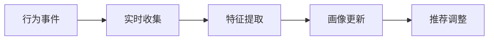
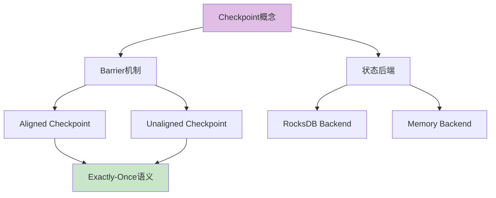
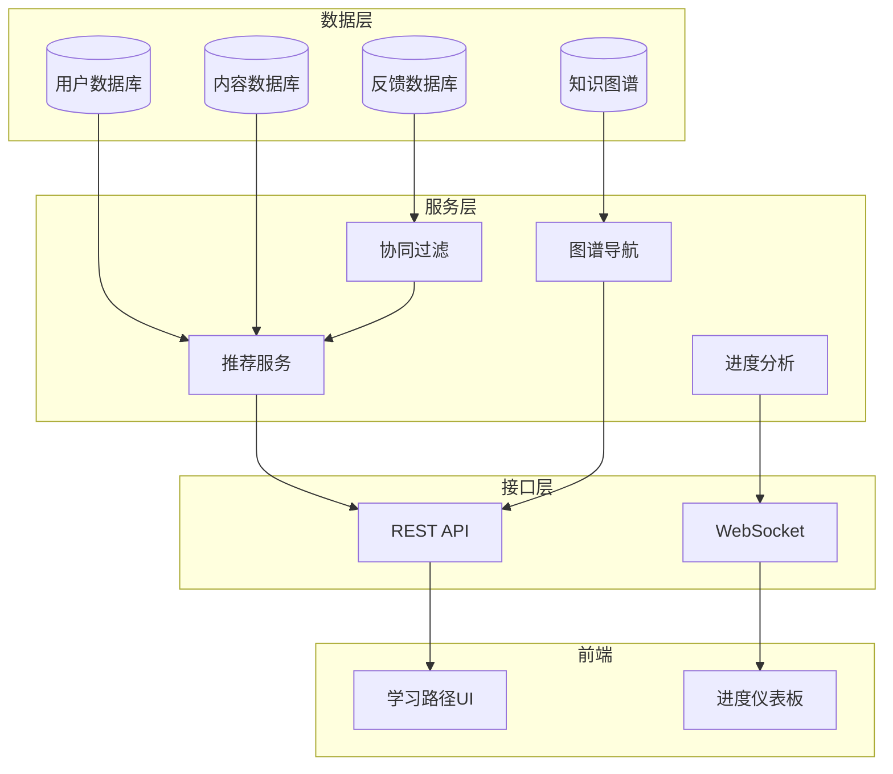

# P3-8 学习路径个性化推荐系统扩展

> **版本**: v2.0 | **日期**: 2026-04-04 | **基于**: P2-12 社区反馈系统
>
> 扩展 P2-12 的动态学习路径推荐系统，实现更智能的个性化推荐

---

## 1. 扩展概述

### 1.1 P2-12 基础功能回顾

P2-12 已实现：

- ✅ 用户画像收集（角色、经验、目标、时间）
- ✅ 内容库管理（难度、主题、依赖关系）
- ✅ 基础推荐算法（评分 + 过滤）
- ✅ 路径生成（最短/平衡/全面）
- ✅ 输出格式（Markdown/JSON/Checklist）

### 1.2 P3-8 扩展目标

```
P2-12 基础系统
     ↓
P3-8 增强功能
├── 用户行为分析
├── 协作过滤推荐
├── 知识图谱导航
├── 实时进度跟踪
├── 自适应难度调整
└── 社区数据融合
```

---

## 2. 用户行为分析

### 2.1 行为数据收集

```python
@dataclass
class UserBehavior:
    user_id: str
    event_type: str  # view, complete, skip, bookmark, rate
    content_id: str
    timestamp: datetime
    duration_seconds: int
    completion_percentage: float
    difficulty_rating: Optional[int]  # 1-5
    helpful_rating: Optional[int]  # 1-5
```

### 2.2 行为指标计算

| 指标 | 计算方式 | 用途 |
|------|----------|------|
| 内容亲和力 | 停留时长 × 完成率 | 判断内容适合度 |
| 学习速度 | 内容数 / 天数 | 调整路径密度 |
| 难度偏好 | 评分加权平均 | 推荐合适难度 |
| 主题兴趣 | 浏览/完成主题分布 | 个性化主题权重 |

### 2.3 行为分析流程



---

## 3. 协作过滤推荐

### 3.1 用户相似度计算

```python
def calculate_user_similarity(user1: UserProfile, user2: UserProfile) -> float:
    # 基于内容的相似度
    role_sim = 1.0 if user1.role == user2.role else 0.5
    goal_sim = 1.0 if user1.goal == user2.goal else 0.3

    # 基于行为的相似度
    behavior_sim = cosine_similarity(
        user1.content_interactions,
        user2.content_interactions
    )

    return 0.3 * role_sim + 0.2 * goal_sim + 0.5 * behavior_sim
```

### 3.2 物品协同过滤

```python
def item_based_recommend(user: UserProfile, n: int = 10) -> List[ContentItem]:
    # 找到用户已完成的相似内容
    completed = user.get_completed_items()
    candidates = []

    for item in completed:
        similar_items = find_similar_items(item, top_k=5)
        for sim_item, similarity in similar_items:
            if sim_item not in completed:
                candidates.append((sim_item, similarity))

    # 按相似度排序
    candidates.sort(key=lambda x: x[1], reverse=True)
    return [item for item, _ in candidates[:n]]
```

---

## 4. 知识图谱导航

### 4.1 图谱结构

```
节点类型:
├── Concept (概念) - Checkpoint, Watermark, etc.
├── Pattern (模式) - Event Time Processing, etc.
├── Technique (技术) - Flink SQL, Async I/O
├── Proof (证明) - Checkpoint Correctness
└── Example (示例) - Code samples

边类型:
├── depends_on (依赖) - A 依赖 B
├── implements (实现) - Flink 实现 模式
├── proves (证明) - 证明 定理
└── related_to (相关) - 相关概念
```

### 4.2 图谱导航算法

```python
class KnowledgeGraphNavigator:
    def find_learning_path(
        self,
        start_concepts: List[str],
        target_concepts: List[str],
        user_level: str
    ) -> List[LearningNode]:
        # 使用A*算法在知识图谱中寻找最优路径
        path = astar_search(
            graph=self.knowledge_graph,
            start=start_concepts,
            goal=target_concepts,
            heuristic=self.difficulty_heuristic,
            constraint=lambda n: n.difficulty <= user_max_difficulty
        )
        return path
```

### 4.3 可视化导航界面



---

## 5. 实时进度跟踪

### 5.1 进度数据模型

```python
@dataclass
class LearningProgress:
    user_id: str
    path_id: str
    started_at: datetime
    current_stage: int
    completed_items: Set[str]
    time_spent: Dict[str, int]  # content_id -> seconds
    quiz_scores: Dict[str, float]
    estimated_completion: datetime
```

### 5.2 自适应调整

```python
def adapt_path(progress: LearningProgress) -> LearningPath:
    # 如果进度落后,简化路径
    if is_behind_schedule(progress):
        return simplify_path(progress.path, factor=0.8)

    # 如果进度超前,增加进阶内容
    if is_ahead_of_schedule(progress):
        return enrich_path(progress.path, advanced_content=True)

    # 如果某个主题困难,增加辅助材料
    for item in progress.struggling_items:
        add_prerequisite_material(progress.path, item)

    return progress.path
```

---

## 6. 社区数据融合

### 6.1 社区反馈集成

```python
@dataclass
class CommunityInsight:
    content_id: str
    avg_rating: float
    completion_rate: float
    common_difficulties: List[str]
    helpful_resources: List[str]
    discussion_count: int
```

### 6.2 热门路径推荐

```python
def get_trending_paths(time_window: str = "30d") -> List[LearningPath]:
    # 分析社区数据,找出最受欢迎的路径
    path_popularity = {}

    for feedback in get_recent_feedback(time_window):
        path_id = feedback.path_id
        if path_id not in path_popularity:
            path_popularity[path_id] = {
                "completions": 0,
                "ratings": [],
                "users": set()
            }

        if feedback.event == "completed":
            path_popularity[path_id]["completions"] += 1
        path_popularity[path_id]["ratings"].append(feedback.rating)
        path_popularity[path_id]["users"].add(feedback.user_id)

    # 计算热度分数
    for path_id, stats in path_popularity.items():
        stats["score"] = (
            stats["completions"] * 2 +
            np.mean(stats["ratings"]) * 10 +
            len(stats["users"])
        )

    return sorted_paths_by_score
```

---

## 7. 实现架构

### 7.1 系统架构图



### 7.2 API端点

```python
# 扩展后的API
@app.post("/api/v2/recommendations/personalized")
async def get_personalized_recommendations(
    user_id: str,
    context: RecommendationContext
) -> RecommendationResponse:
    """获取个性化推荐(增强版)"""

    # 获取用户画像
    profile = await get_enhanced_profile(user_id)

    # 多路召回
    content_based = content_based_recommend(profile)
    collaborative = collaborative_filter(user_id)
    graph_based = graph_navigation_recommend(profile)

    # 融合排序
    recommendations = fusion_rank(
        content_based, collaborative, graph_based,
        weights=[0.4, 0.3, 0.3]
    )

    return RecommendationResponse(
        items=recommendations,
        explanation=generate_explanation(recommendations),
        next_milestones=predict_milestones(profile, recommendations)
    )
```

---

## 8. 评估指标

### 8.1 推荐质量

| 指标 | 目标值 | 计算方式 |
|------|--------|----------|
| 点击率 | >15% | 推荐点击 / 推荐展示 |
| 完成率 | >40% | 完成学习 / 开始学习 |
| 满意度 | >4.2/5 | 用户评分平均 |
| 多样性 | >0.7 | 推荐内容主题分散度 |

### 8.2 学习效率

| 指标 | 目标值 | 说明 |
|------|--------|------|
| 目标达成时间 | 缩短20% | 对比无推荐系统 |
| 知识保持率 | >75% | 一周后测试成绩 |
| 返工率 | <10% | 需要重新学习内容比例 |

---

## 9. 实施计划

| 阶段 | 时间 | 交付物 |
|------|------|--------|
| Phase 1 | Week 1-2 | 行为收集系统 |
| Phase 2 | Week 3-4 | 协同过滤实现 |
| Phase 3 | Week 5-6 | 知识图谱集成 |
| Phase 4 | Week 7-8 | 实时进度跟踪 |
| Phase 5 | Week 9-10 | A/B测试与优化 |

---

## 10. 参考

- [learning-path-recommender.py] - 基础推荐系统
- [P2-12-COMMUNITY-FEEDBACK-SYSTEM.md](../archive/deprecated/P2-12-COMMUNITY-FEEDBACK-SYSTEM.md) - 社区反馈系统
- [knowledge-graph.html](../knowledge-graph.html) - 知识图谱可视化

---

*本文档是 P2-12 学习路径推荐系统的扩展设计*
