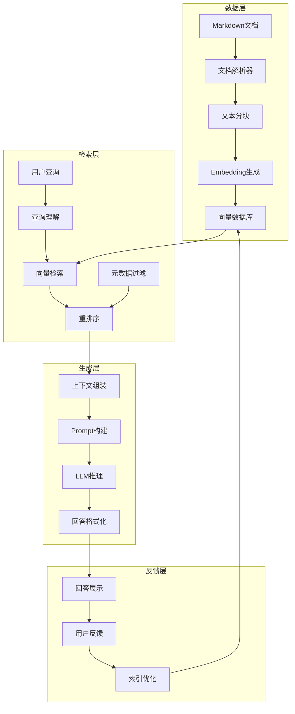
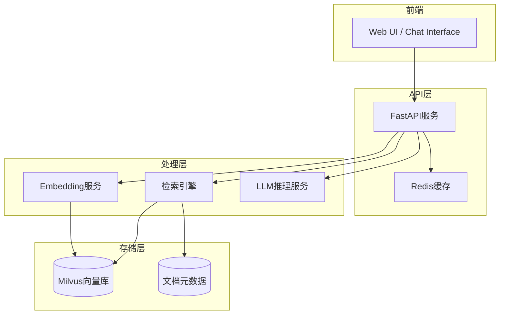

# AnalysisDataFlow RAG 问答系统架构设计

> **版本**: v1.0 | **日期**: 2026-04-04 | **状态**: 设计文档
>
> RAG (Retrieval-Augmented Generation) 架构用于构建项目智能问答机器人

---

## 1. 架构概述

### 1.1 什么是 RAG

RAG (检索增强生成) 是一种将信息检索与文本生成相结合的AI架构：

```
用户查询 → 向量检索 → 上下文组装 → LLM生成 → 结构化回答
```

### 1.2 系统架构图



---

## 2. 核心组件

### 2.1 文档处理管道


**分块策略**:

| 策略 | 适用场景 | 块大小 | 重叠 |
|------|----------|--------|------|
| 固定大小 | 通用场景 | 512 tokens | 50 tokens |
| 章节分割 | 结构化文档 | 按标题 | 无 |
| 语义分割 | 概念密集型 | 语义边界 | 100 tokens |
| 代码块保留 | 技术文档 | 完整代码块 | 无 |

### 2.2 向量检索

**检索流程**:

```python
# 伪代码
query_embedding = embed(query)
candidates = vector_db.similarity_search(
    query_embedding,
    k=20,
    filter={"category": "Flink"}  # 元数据过滤
)
# 重排序
reranked = reranker.rerank(query, candidates, top_k=5)
```

**检索优化**:

- **混合检索**: 向量相似度 + 关键词匹配
- **查询扩展**: 同义词、相关术语扩展
- **重排序**: Cross-encoder 精排
- **多路召回**: 标题、内容、标签分别检索

### 2.3 提示工程

**系统提示模板**:

```markdown
You are an expert assistant for AnalysisDataFlow, a comprehensive knowledge base
for stream computing theory and Flink engineering.

Guidelines:
1. Base your answers strictly on the provided context
2. Cite document sources using [Doc: path/to/doc.md]
3. For code examples, ensure they are syntactically correct
4. If the answer cannot be found in the context, say so clearly
5. Structure complex answers with clear headings

Context:
{retrieved_context}

User Question: {question}

Provide a comprehensive answer:
```

---

## 3. 技术选型

### 3.1 组件对比

| 组件 | 选项A | 选项B | 选项C | 推荐 |
|------|-------|-------|-------|------|
| Embedding | OpenAI ada-002 | BGE-large | E5-large | BGE-large |
| 向量DB | Pinecone | Milvus | Chroma | Milvus |
| LLM | GPT-4 | Claude-3 | Llama-3 | Claude-3 |
| 重排序 | Cohere | BGE-reranker | 自研 | BGE-reranker |

### 3.2 部署架构



---

## 4. 实现细节

### 4.1 文档向量化

```python
# 核心处理流程
class DocumentProcessor:
    def process(self, md_file: Path) -> List[DocumentChunk]:
        # 1. 解析Markdown
        doc = self.parse_markdown(md_file)

        # 2. 按章节分块
        chunks = self.chunk_by_sections(doc)

        # 3. 生成Embedding
        for chunk in chunks:
            chunk.embedding = self.embed(chunk.text)
            chunk.metadata = {
                "source": str(md_file),
                "title": doc.title,
                "category": doc.category,
                "theorems": doc.theorems,
                "difficulty": doc.difficulty
            }

        return chunks
```

### 4.2 检索API设计

```python
# FastAPI端点
@app.post("/api/query")
async def query(request: QueryRequest) -> QueryResponse:
    # 1. 查询理解
    intent = await understand_intent(request.question)

    # 2. 向量检索
    query_embedding = embed(request.question)
    candidates = vector_db.search(
        query_embedding,
        filters=intent.filters,
        top_k=20
    )

    # 3. 重排序
    reranked = reranker.rerank(request.question, candidates, top_k=5)

    # 4. 生成回答
    context = build_context(reranked)
    answer = llm.generate(request.question, context)

    return QueryResponse(
        answer=answer,
        sources=[c.source for c in reranked],
        confidence=calculate_confidence(reranked)
    )
```

### 4.3 查询意图分类

| 意图类型 | 示例 | 处理策略 |
|----------|------|----------|
| 概念定义 | "什么是Checkpoint?" | 优先检索定义类文档 |
| 原理解析 | "Explain Exactly-Once semantics" | 检索证明和机制文档 |
| 代码示例 | "Show me Kafka connector example" | 优先代码片段 |
| 故障排查 | "Checkpoint timeout solution" | 检索反模式和故障文档 |
| 对比分析 | "Flink vs Spark Streaming" | 检索对比类文档 |

---

## 5. 性能优化

### 5.1 索引优化

- **增量更新**: 仅处理变更文档
- **批量Embedding**: 减少API调用
- **分层索引**: 按目录建立子索引
- **缓存策略**: 热门查询结果缓存

### 5.2 检索优化

- **预过滤**: 按分类/难度先过滤
- **近似搜索**: HNSW算法加速
- **查询缓存**: 相似查询复用结果
- **异步加载**: 后台预加载上下文

---

## 6. 评估指标

### 6.1 检索质量

| 指标 | 目标值 | 说明 |
|------|--------|------|
| Recall@5 | >0.8 | 前5结果包含正确答案比例 |
| NDCG@5 | >0.75 | 排序质量 |
| MRR | >0.7 | 平均倒数排名 |

### 6.2 生成质量

| 指标 | 评估方式 | 目标 |
|------|----------|------|
| 准确性 | 人工评估 | >4.0/5.0 |
| 完整性 | 检查清单 | 覆盖主要要点 |
| 引用准确率 | 自动验证 | >95% |
| 响应时间 | P95 | <3s |

---

## 7. 部署方案

### 7.1 本地部署

```yaml
# docker-compose.yml
version: '3.8'
services:
  api:
    build: ./rag-api
    ports:
      - "8000:8000"
    environment:
      - MILVUS_HOST=milvus
      - LLM_API_KEY=${LLM_API_KEY}

  milvus:
    image: milvusdb/milvus:latest
    ports:
      - "19530:19530"

  redis:
    image: redis:alpine
    ports:
      - "6379:6379"
```

### 7.2 云端部署

- **向量数据库**: Managed Milvus / Pinecone
- **LLM**: Azure OpenAI / AWS Bedrock
- **API服务**: Kubernetes / Container Apps
- **监控**: Prometheus + Grafana

---

## 8. 未来扩展

### 8.1 多模态支持

- 图表理解 (Mermaid图解析)
- 代码执行验证
- 视频教程检索

### 8.2 个性化

- 用户画像学习
- 历史查询分析
- 难度自适应

### 8.3 主动推荐

- 相关内容推送
- 学习路径建议
- 知识缺口识别

---

## 9. 参考

- [Building RAG Systems](https://www.pinecone.io/learn/series/rag/)
- [LangChain RAG Tutorial](https://python.langchain.com/docs/use_cases/question_answering/)
- [Milvus Documentation](https://milvus.io/docs)

---

*本文档遵循 AnalysisDataFlow 六段式模板规范*
