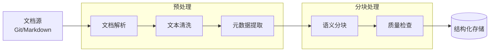
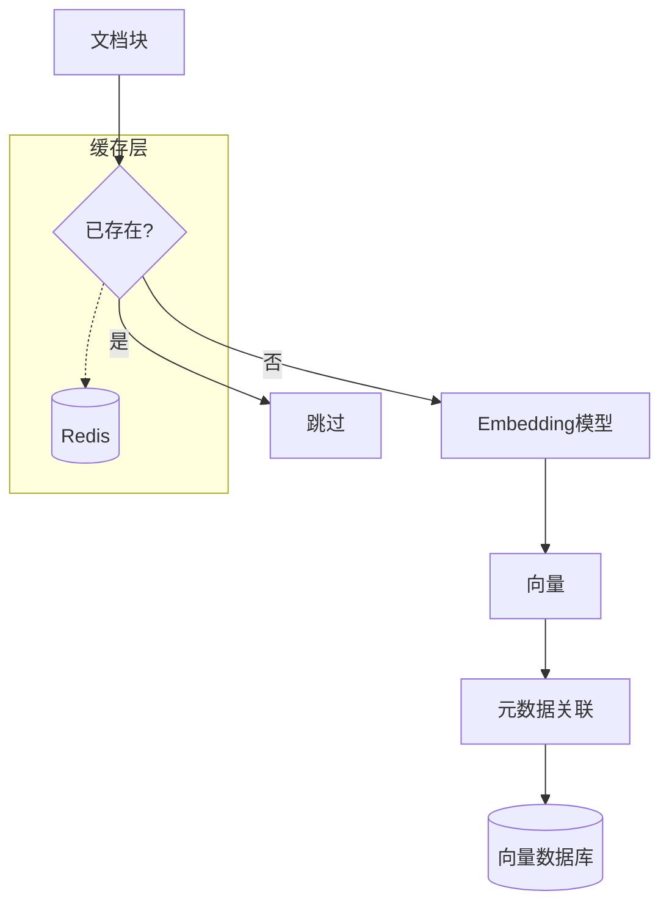
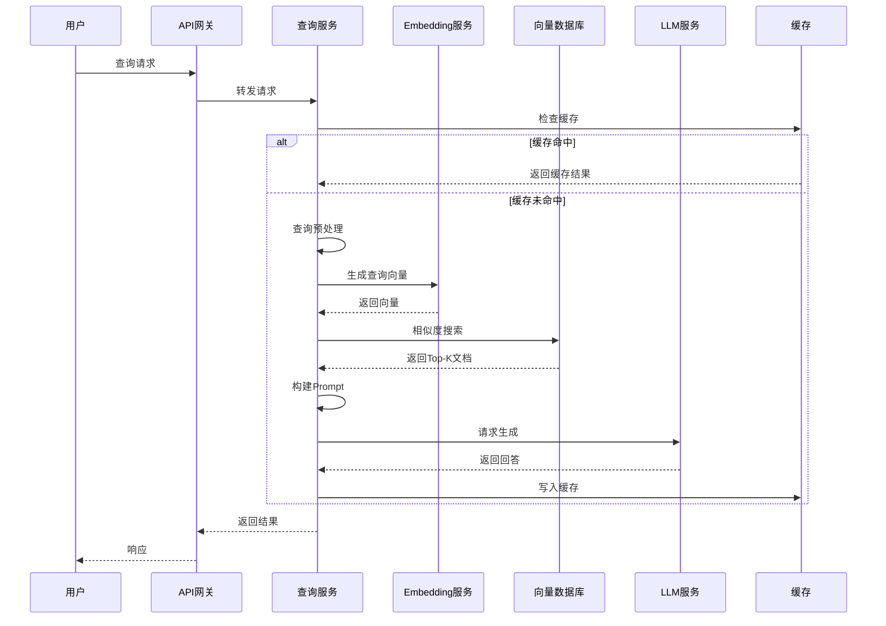

# AI搜索增强方案设计文档

> **项目**: P3-2 | **类型**: 技术设计文档 | **版本**: v1.0 | **日期**: 2026-04-04

## 1. 概述

本文档定义了为知识库系统集成的AI辅助搜索功能，包括语义搜索、智能摘要和问答机器人三大核心能力。

---

## 2. 智能搜索功能

### 2.1 语义搜索（向量相似度）

```
┌─────────────────────────────────────────────────────────────────┐
│                     语义搜索架构                                  │
├─────────────────────────────────────────────────────────────────┤
│                                                                 │
│   ┌─────────────┐    ┌─────────────┐    ┌───────────────────┐   │
│   │   用户查询   │───▶│  Query编码  │───▶│  向量相似度计算    │   │
│   └─────────────┘    │  (Embedding)│    │  (余弦/点积)      │   │
│                      └─────────────┘    └─────────┬─────────┘   │
│                                                   │             │
│   ┌───────────────────────────────────────────────┘             │
│   ▼                                                             │
│   ┌─────────────┐    ┌─────────────┐    ┌─────────────┐        │
│   │  Top-K检索   │───▶│  相关性排序  │───▶│  结果返回    │        │
│   └─────────────┘    └─────────────┘    └─────────────┘        │
│                           │                                     │
│                           ▼                                     │
│                    ┌─────────────┐                              │
│                    │  重排序模型   │                              │
│                    │ (Cross-Encoder)│                           │
│                    └─────────────┘                              │
│                                                                 │
└─────────────────────────────────────────────────────────────────┘
```

**核心能力**:

- 基于语义理解的文档匹配（而非仅关键词匹配）
- 支持自然语言查询（如"Flink的checkpoint机制如何实现容错"）
- 相似概念关联（如"Dataflow"可匹配"流计算模型"）

**技术参数**:

| 参数 | 值 | 说明 |
|------|-----|------|
| 向量维度 | 768/1024/1536 | 根据Embedding模型选择 |
| 相似度度量 | Cosine Similarity | 归一化后使用内积加速 |
| 默认Top-K | 10 | 可配置 |
| 相似度阈值 | 0.7 | 低于此值的结果过滤 |

### 2.2 关键词+语义混合搜索

**混合评分公式**:

```
Final_Score = α × Semantic_Score + β × BM25_Score + γ × Metadata_Score

其中:
- α = 0.6 (语义权重)
- β = 0.3 (关键词权重)
- γ = 0.1 (元数据权重，如标题匹配、标签匹配)
```

**实现策略**:

1. **并行查询**: 同时执行向量搜索和BM25搜索
2. **结果融合**: 使用RRF (Reciprocal Rank Fusion)算法合并结果
3. **动态权重**: 根据查询类型自动调整权重

```python
# RRF融合算法
def reciprocal_rank_fusion(vector_results, keyword_results, k=60):
    scores = {}

    for rank, doc in enumerate(vector_results):
        scores[doc.id] = scores.get(doc.id, 0) + 1/(k + rank + 1)

    for rank, doc in enumerate(keyword_results):
        scores[doc.id] = scores.get(doc.id, 0) + 1/(k + rank + 1)

    return sorted(scores.items(), key=lambda x: x[1], reverse=True)
```

### 2.3 相关文档推荐

**推荐策略**:

| 策略 | 说明 | 应用场景 |
|------|------|----------|
| 内容相似度 | 基于向量相似度推荐相关文档 | 阅读某文档后推荐 |
| 协同过滤 | 基于用户阅读行为推荐 | 热门文档发现 |
| 图谱关联 | 基于知识图谱的关系推荐 | 深度探索主题 |
| 时序关联 | 同一任务/工作流中的文档 | 工作场景 |

### 2.4 搜索结果排序优化

**多阶段排序**:

```
阶段1: 粗排 (向量检索)     → 召回1000个候选
阶段2: 精排 (Cross-Encoder) → 重排序Top 100
阶段3: 个性化调整           → 基于用户历史调整Top 20
```

---

## 3. 文档摘要生成

### 3.1 自动提取关键信息

**关键信息类型**:

- 核心概念定义
- 重要配置参数
- 代码示例
- 最佳实践要点
- 常见陷阱/注意事项

**提取技术**:

```
┌─────────────────────────────────────────────────────────────┐
│                   关键信息提取流水线                          │
├─────────────────────────────────────────────────────────────┤
│                                                             │
│  输入文档 ──▶ 文本分块 ──▶ 实体识别 ──▶ 重要性评分 ──▶ 结构化输出 │
│                │              │            │                 │
│                ▼              ▼            ▼                 │
│            [滑动窗口]    [NER模型]    [TF-IDF+              │
│            [语义边界]    [术语词典]     语义重要性]           │
│                                                             │
└─────────────────────────────────────────────────────────────┘
```

### 3.2 TL;DR摘要生成

**生成策略**:

- **抽取式**: 从原文提取关键句子（适合技术文档）
- **生成式**: 使用LLM生成流畅摘要（适合概念性文档）
- **混合式**: 先抽取关键内容，再生成连贯摘要

**TL;DR模板**:

```markdown
## TL;DR

**一句话总结**: [文档核心观点，限50字]

**关键点**:
- 🔑 [关键发现/概念 1]
- 🔑 [关键发现/概念 2]
- 🔑 [关键发现/概念 3]

**适用场景**: [何时参考本文档]

**前置知识**: [阅读本文档前需要了解的内容]
```

### 3.3 多层级摘要

| 层级 | 粒度 | 长度 | 生成方式 |
|------|------|------|----------|
| 全文摘要 | 整篇文档 | 200-300字 | LLM生成 |
| 章节摘要 | H2标题区块 | 50-100字 | 抽取+生成 |
| 段落摘要 | 单个段落 | 20-30字 | 抽取式 |
| 代码摘要 | 代码块 | 功能描述 | 静态分析+LLM |

---

## 4. 问答机器人设计

### 4.1 RAG架构（检索增强生成）

```
┌─────────────────────────────────────────────────────────────────────────┐
│                          RAG系统架构                                      │
├─────────────────────────────────────────────────────────────────────────┤
│                                                                         │
│   ┌─────────────────────────────────────────────────────────────────┐   │
│   │                         查询处理层                               │   │
│   │  ┌─────────────┐  ┌─────────────┐  ┌─────────────────────────┐  │   │
│   │  │ 查询理解    │─▶│ 意图分类    │─▶│ 查询重写/扩展           │  │   │
│   │  │             │  │             │  │ (Query Expansion)       │  │   │
│   │  └─────────────┘  └─────────────┘  └─────────────────────────┘  │   │
│   └─────────────────────────────────────────────────────────────────┘   │
│                                    │                                    │
│                                    ▼                                    │
│   ┌─────────────────────────────────────────────────────────────────┐   │
│   │                         检索层                                   │   │
│   │  ┌─────────────┐  ┌─────────────┐  ┌─────────────────────────┐  │   │
│   │  │ 向量检索    │  │ 关键词检索  │  │ 混合排序                │  │   │
│   │  │ (Top-K=20)  │  │ (BM25)      │  │ (RRF融合)               │  │   │
│   │  └─────────────┘  └─────────────┘  └─────────────────────────┘  │   │
│   └─────────────────────────────────────────────────────────────────┘   │
│                                    │                                    │
│                                    ▼                                    │
│   ┌─────────────────────────────────────────────────────────────────┐   │
│   │                         上下文构建层                             │   │
│   │  ┌─────────────┐  ┌─────────────┐  ┌─────────────────────────┐  │   │
│   │  │ 文档分块    │─▶│ 相关性过滤  │─▶│ 上下文组装              │  │   │
│   │  │             │  │ (阈值0.75)  │  │ (Token限制: 4000)       │  │   │
│   │  └─────────────┘  └─────────────┘  └─────────────────────────┘  │   │
│   └─────────────────────────────────────────────────────────────────┘   │
│                                    │                                    │
│                                    ▼                                    │
│   ┌─────────────────────────────────────────────────────────────────┐   │
│   │                         生成层                                   │   │
│   │  ┌─────────────┐  ┌─────────────┐  ┌─────────────────────────┐  │   │
│   │  │ Prompt构建  │─▶│ LLM生成     │─▶│ 后处理                  │  │   │
│   │  │             │  │             │  │ (格式化/引用标注)       │  │   │
│   │  └─────────────┘  └─────────────┘  └─────────────────────────┘  │   │
│   └─────────────────────────────────────────────────────────────────┘   │
│                                                                         │
└─────────────────────────────────────────────────────────────────────────┘
```

### 4.2 上下文理解

**上下文管理**:

- **文档上下文**: 当前查询相关的文档内容
- **对话上下文**: 多轮对话历史
- **用户上下文**: 用户角色、权限、偏好

**上下文窗口策略**:

```python
# 上下文优先级排序
def build_context_window(query, retrieved_docs, chat_history, max_tokens=4000):
    contexts = []
    used_tokens = 0

    # 1. 系统提示 (固定)
    system_tokens = 500
    used_tokens += system_tokens

    # 2. 对话历史 (最近3轮)
    for msg in chat_history[-3:]:
        msg_tokens = estimate_tokens(msg)
        if used_tokens + msg_tokens > max_tokens * 0.3:
            break
        contexts.append(msg)
        used_tokens += msg_tokens

    # 3. 检索文档 (按相关性排序)
    for doc in sorted(retrieved_docs, key=lambda x: x.score, reverse=True):
        doc_tokens = estimate_tokens(doc.content)
        if used_tokens + doc_tokens > max_tokens:
            break
        contexts.append(doc)
        used_tokens += doc_tokens

    return contexts
```

### 4.3 多轮对话支持

**对话状态管理**:

```
┌─────────────────────────────────────────────────────────────┐
│                     对话状态机                               │
├─────────────────────────────────────────────────────────────┤
│                                                             │
│  [开始] ──▶ [意图识别] ──▶ [澄清需求] ──▶ [检索文档]         │
│                              │                    │         │
│                              ▼                    ▼         │
│                         [等待用户] ◀────── [生成回答]        │
│                              │                    │         │
│                              └────────────────────┘         │
│                                    (多轮循环)                │
│                                                             │
└─────────────────────────────────────────────────────────────┘
```

**指代消解示例**:

```
用户: "Flink的Checkpoint机制是什么？"
AI: "Checkpoint是Flink的容错机制，通过..."
用户: "它的工作原理是什么？" ← "它"指代"Checkpoint"
AI: "Checkpoint的工作原理包括三个阶段：触发、快照、确认..."
```

### 4.4 引用来源标注

**引用格式**:

```markdown
根据[^1]和[^2]的描述，Flink的Checkpoint机制...

[^1]: 4.1-stream-processing-fundamentals.md, 第3.2节 "Checkpoint机制"
[^2]: flink-checkpoint-internals.md, 第2节 "Checkpoint流程"
```

**实现方式**:

1. 检索时保留文档元数据（标题、路径、章节）
2. LLM Prompt中明确要求标注引用
3. 后处理验证引用准确性
4. 前端渲染为可点击链接

---

## 5. 技术方案

### 5.1 向量数据库选择

| 特性 | Pinecone | Milvus | Weaviate | Qdrant |
|------|----------|--------|----------|--------|
| **部署方式** | 全托管 | 自托管/K8s | 自托管/云 | 自托管/云 |
| **成本** | $$$ | $$ | $$ | $ |
| **性能** | 高 | 高 | 中高 | 高 |
| **扩展性** | 自动 | 手动配置 | 手动配置 | 手动配置 |
| **混合搜索** | 原生支持 | 原生支持 | 原生支持 | 原生支持 |
| **社区活跃度** | 中 | 高 | 中 | 高 |
| **中文支持** | 好 | 好 | 一般 | 好 |

**推荐方案**: **Milvus** (开源、高性能、中文社区活跃)

**Milvus架构选择**:

```yaml
# docker-compose.yml 单机版
version: '3.5'
services:
  etcd:
    image: quay.io/coreos/etcd:v3.5.5
    # ...
  minio:
    image: minio/minio:RELEASE.2023-03-20T20-16-18Z
    # ...
  standalone:
    image: milvusdb/milvus:v2.3.3
    # ...
```

### 5.2 Embedding模型选择

| 模型 | 维度 | 语言 | 性能 | 适用场景 |
|------|------|------|------|----------|
| **text-embedding-3-large** | 3072 | 多语言 | ⭐⭐⭐⭐⭐ | 高质量需求 |
| **text-embedding-3-small** | 1536 | 多语言 | ⭐⭐⭐⭐ | 成本敏感 |
| **BAAI/bge-large-zh** | 1024 | 中文优化 | ⭐⭐⭐⭐⭐ | 中文为主 |
| **BAAI/bge-base-zh** | 768 | 中文优化 | ⭐⭐⭐⭐ | 性价比 |
| **sentence-transformers/all-MiniLM-L6-v2** | 384 | 英文 | ⭐⭐⭐ | 快速原型 |

**推荐方案**:

- **生产环境**: `BAAI/bge-large-zh` (中文技术文档优化)
- **备选**: `text-embedding-3-small` (OpenAI API，快速上线)

### 5.3 LLM选择

| 模型 | 上下文长度 | 成本 | 中文能力 | 推荐场景 |
|------|-----------|------|----------|----------|
| GPT-4 | 128K | $$$$ | 优秀 | 复杂推理 |
| GPT-3.5-Turbo | 16K | $$ | 良好 | 通用问答 |
| Claude 3 Haiku | 200K | $ | 良好 | 长文档处理 |
| 文心一言ERNIE | 8K | ¥ | 优秀 | 国内合规 |
| 通义千问 | 32K | ¥ | 优秀 | 国内合规 |
| Llama 2 13B | 4K | 自托管 | 一般 | 私有化部署 |

**推荐方案**:

- **MVP阶段**: GPT-3.5-Turbo (快速验证)
- **生产环境**: 通义千问 / 文心一言 (国内合规+成本)
- **私有化**: Llama 2 + 微调 (数据敏感场景)

### 5.4 索引更新策略

**增量更新流程**:

```
┌─────────────────────────────────────────────────────────────────┐
│                     文档变更检测                                 │
├─────────────────────────────────────────────────────────────────┤
│                                                                 │
│   Git Webhook / 定时扫描                                        │
│          │                                                      │
│          ▼                                                      │
│   ┌─────────────┐                                               │
│   │ 变更检测     │                                               │
│   │ (文件哈希)   │                                               │
│   └──────┬──────┘                                               │
│          │                                                      │
│    ┌─────┴─────┐                                                │
│    ▼           ▼                                                │
│ ┌──────┐   ┌──────┐                                             │
│ │新增  │   │更新  │──▶ 重新分块 ──▶ 重新编码 ──▶ 更新向量库      │
│ └──────┘   └──────┘                                             │
│               │                                                 │
│               ▼                                                 │
│          ┌──────┐                                               │
│          │删除  │──▶ 从向量库删除对应向量                        │
│          └──────┘                                               │
│                                                                 │
└─────────────────────────────────────────────────────────────────┘
```

**更新策略**:

| 策略 | 触发条件 | 延迟 | 适用场景 |
|------|----------|------|----------|
| 实时更新 | Webhook | <1分钟 | 关键文档 |
| 定时更新 | Cron (每6小时) | 6小时 | 一般文档 |
| 批量更新 | 累积N个变更 | 按需 | 大量变更 |

---

## 6. 数据流设计

### 6.1 文档处理流水线



**分块策略**:

| 分块方式 | 块大小 | 重叠 | 适用场景 |
|----------|--------|------|----------|
| 固定字符 | 500 | 50 | 通用 |
| 递归字符 | 1000 | 100 | 保持语义 |
| Markdown | 按标题 | - | 技术文档 |
| 语义分块 | 动态 | - | 高质量需求 |

**Markdown分块示例**:

```python
def split_markdown(content):
    """按标题层级分块"""
    chunks = []
    current_chunk = {"level": 0, "title": "", "content": ""}

    for line in content.split('\n'):
        if line.startswith('#'):
            # 保存当前块
            if current_chunk["content"]:
                chunks.append(current_chunk)
            # 开始新块
            level = len(line.split()[0])
            current_chunk = {
                "level": level,
                "title": line.lstrip('# '),
                "content": line + '\n'
            }
        else:
            current_chunk["content"] += line + '\n'

    return chunks
```

### 6.2 向量生成流程



**批处理优化**:

- 批量编码: 每次32-64个文本块
- 异步处理: 使用消息队列
- 缓存策略: Redis缓存已编码内容

### 6.3 查询处理流程



---

## 7. 实现路线图

### 7.1 MVP功能 (4周)

**第1周: 基础设施搭建**

- [ ] 部署Milvus向量数据库
- [ ] 搭建Embedding服务 (BGE模型)
- [ ] 实现文档解析和分块

**第2周: 核心搜索**

- [ ] 实现语义搜索API
- [ ] 实现关键词搜索API
- [ ] 基础排序算法

**第3周: RAG问答**

- [ ] 集成LLM (GPT-3.5)
- [ ] 实现基础RAG流程
- [ ] 引用标注功能

**第4周: 集成测试**

- [ ] 端到端测试
- [ ] 性能基准测试
- [ ] 文档和部署

### 7.2 完整功能 (8周)

**第5-6周: 功能增强**

- [ ] 混合搜索优化
- [ ] 多轮对话支持
- [ ] 文档摘要生成

**第7-8周: 系统集成**

- [ ] 前端UI开发
- [ ] 用户反馈收集
- [ ] 监控和日志

**第9-10周: 性能优化**

- [ ] 查询缓存优化
- [ ] 索引构建优化
- [ ] 响应速度优化

**第11-12周: 企业特性**

- [ ] 用户权限管理
- [ ] 使用统计面板
- [ ] API限流和计费

### 7.3 性能优化路线图

| 阶段 | 目标 | 措施 |
|------|------|------|
| **即时** | P95 < 2s | 查询缓存、连接池 |
| **短期** | P95 < 1s | 预计算、索引优化 |
| **中期** | P95 < 500ms | 边缘缓存、CDN |
| **长期** | P95 < 200ms | 本地模型、硬件加速 |

---

## 8. 技术架构图

```
┌─────────────────────────────────────────────────────────────────────────────┐
│                              前端层                                          │
│  ┌─────────────────┐  ┌─────────────────┐  ┌─────────────────────────────┐  │
│  │   搜索页面       │  │   问答界面       │  │   管理后台                   │  │
│  │   (React/Vue)   │  │   (Chat UI)     │  │   (Admin Panel)             │  │
│  └─────────────────┘  └─────────────────┘  └─────────────────────────────┘  │
└─────────────────────────────────────────────────────────────────────────────┘
                                       │
                                       ▼
┌─────────────────────────────────────────────────────────────────────────────┐
│                              API网关层                                       │
│  ┌─────────────────────────────────────────────────────────────────────┐    │
│  │  FastAPI / Flask                                                    │    │
│  │  - 认证授权 (JWT)                                                   │    │
│  │  - 限流熔断                                                         │    │
│  │  - 请求路由                                                         │    │
│  └─────────────────────────────────────────────────────────────────────┘    │
└─────────────────────────────────────────────────────────────────────────────┘
                                       │
                                       ▼
┌─────────────────────────────────────────────────────────────────────────────┐
│                              服务层                                          │
│  ┌───────────────┐  ┌───────────────┐  ┌───────────────┐  ┌──────────────┐ │
│  │  搜索服务      │  │  问答服务      │  │  摘要服务      │  │  索引服务     │ │
│  │               │  │               │  │               │  │              │ │
│  │ - 语义搜索    │  │ - RAG流程     │  │ - 关键提取    │  │ - 文档处理   │ │
│  │ - 混合排序    │  │ - 多轮对话    │  │ - TL;DR生成   │  │ - 向量编码   │ │
│  │ - 推荐引擎    │  │ - 引用标注    │  │ - 层级摘要    │  │ - 增量更新   │ │
│  └───────┬───────┘  └───────┬───────┘  └───────┬───────┘  └──────┬───────┘ │
│          │                  │                  │                 │         │
└──────────┼──────────────────┼──────────────────┼─────────────────┼─────────┘
           │                  │                  │                 │
           └──────────────────┴──────────────────┘                 │
                              │                                     │
                              ▼                                     ▼
┌─────────────────────────────────────────────────────────┐  ┌──────────────┐
│                      数据层                              │  │   模型层     │
│  ┌─────────────────┐  ┌───────────────────────────────┐ │  │ ┌──────────┐ │
│  │  Milvus         │  │  PostgreSQL                   │ │  │ │ Embedding│ │
│  │  (向量存储)      │  │  (元数据/对话历史)              │ │  │ │ BGE-Large│ │
│  └─────────────────┘  └───────────────────────────────┘ │  │ └──────────┘ │
│  ┌─────────────────┐  ┌───────────────────────────────┐ │  │ ┌──────────┐ │
│  │  Redis          │  │  Elasticsearch                │ │  │ │ LLM      │ │
│  │  (缓存/会话)     │  │  (全文索引)                    │ │  │ │ GPT/通义 │ │
│  └─────────────────┘  └───────────────────────────────┘ │  │ └──────────┘ │
└─────────────────────────────────────────────────────────┘  └──────────────┘
```

---

## 9. 成本估算

### 9.1 基础设施成本 (月度)

| 组件 | 配置 | 预估成本 |
|------|------|----------|
| Milvus | 4核16G | ¥800-1200 |
| PostgreSQL | 2核8G | ¥300-500 |
| Redis | 2核4G | ¥200-400 |
| API服务器 | 2核4G × 2 | ¥600-1000 |
| **总计** | | **¥1900-3100** |

### 9.2 API调用成本 (月度，按10万查询)

| 服务 | 单价 | 用量 | 成本 |
|------|------|------|------|
| Embedding | $0.0001/1K tokens | 50M tokens | $5 |
| GPT-3.5 | $0.0015/1K tokens | 20M tokens | $30 |
| **总计** | | | **~¥250** |

---

## 10. 风险评估与应对

| 风险 | 影响 | 可能性 | 应对措施 |
|------|------|--------|----------|
| 向量搜索召回率低 | 高 | 中 | 多模型对比、调优阈值 |
| LLM幻觉 | 高 | 中 | 严格引用约束、人工审核 |
| 响应延迟高 | 中 | 中 | 多级缓存、异步处理 |
| 数据隐私 | 高 | 低 | 私有化部署、数据脱敏 |
| 成本超支 | 中 | 中 | 用量监控、分级限流 |

---

## 11. 附录

### 11.1 参考实现

```python
# 核心搜索API示例
@app.post("/api/search")
async def semantic_search(query: SearchQuery):
    # 1. 生成查询向量
    query_vector = embedding_model.encode(query.text)

    # 2. 向量检索
    vector_results = milvus_client.search(
        collection_name="docs",
        data=[query_vector],
        limit=20,
        output_fields=["id", "content", "metadata"]
    )

    # 3. 关键词检索
    keyword_results = es_client.search(
        index="docs",
        body={"query": {"match": {"content": query.text}}}
    )

    # 4. 结果融合
    fused_results = reciprocal_rank_fusion(
        vector_results, keyword_results
    )

    return {"results": fused_results[:10]}
```

### 11.2 Prompt模板

```markdown
# RAG问答Prompt

你是一个专业的技术文档助手。基于以下参考资料回答用户问题。

## 参考资料
{context}

## 用户问题
{question}

## 回答要求
1. 仅基于提供的参考资料回答
2. 引用来源使用 [^1] 格式标注
3. 如果资料不足，明确告知用户
4. 回答简洁准确，优先使用中文

## 回答
```

---

**文档版本历史**:

| 版本 | 日期 | 修改内容 | 作者 |
|------|------|----------|------|
| v1.0 | 2026-04-04 | 初始版本 | AI Assistant |
