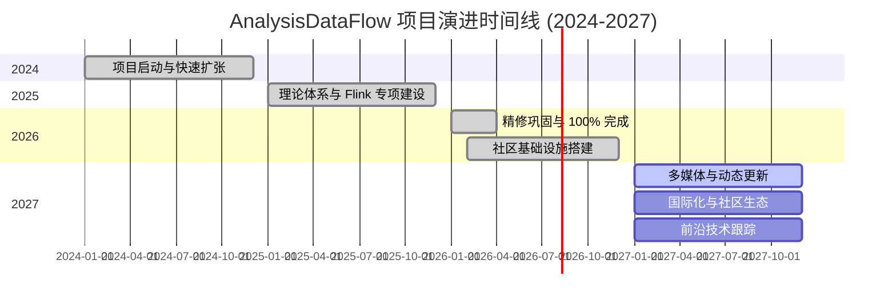
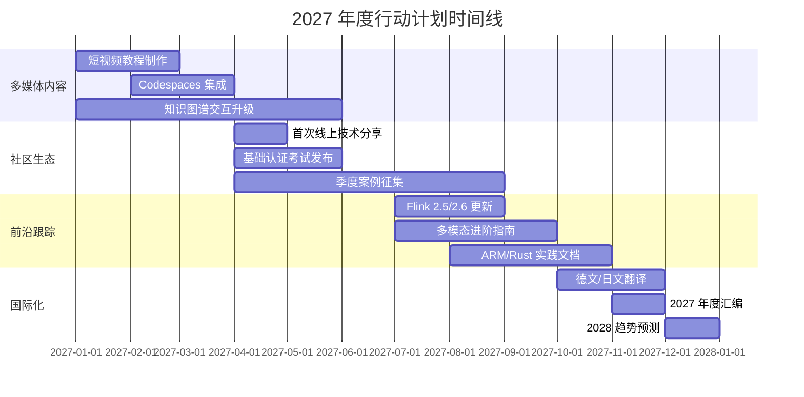
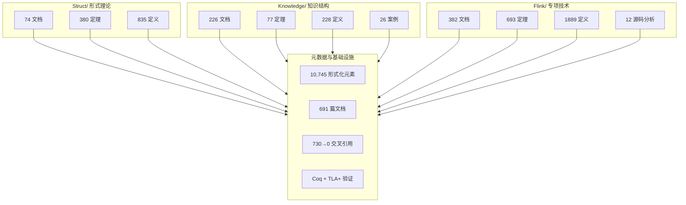

# AnalysisDataFlow 2026 年度回顾与 2027 规划

> 所属阶段: docs/annual-review | 前置依赖: [CONTENT-ROADMAP-2026-STATUS.md](../../CONTENT-ROADMAP-2026-STATUS.md) | 形式化等级: L2

---

## 1. 概念定义 (Definitions)

### Def-D-01: 年度回顾 (Annual Review)

**Def-D-01a**: 年度回顾是对项目在特定自然年内的产出、里程碑、社区活动和知识增长进行系统性梳理的文档。形式上：

$$\text{AnnualReview}(Y) = (D_Y, M_Y, C_Y, G_Y, P_{Y+1})$$

其中：

- $D_Y$：年内新增/更新的文档集合
- $M_Y$：关键里程碑（milestone）列表
- $C_Y$：社区与协作数据
- $G_Y$：知识增长指标（定理、定义、案例数量）
- $P_{Y+1}$：下一年度规划

**Def-D-01b**: 项目成熟度指标

项目成熟度 $M$ 通过以下加权公式评估：

$$M = 0.3 \cdot \frac{|D|}{D_{target}} + 0.3 \cdot \frac{|Thm| + |Def|}{E_{target}} + 0.2 \cdot \frac{|Case|}{C_{target}} + 0.2 \cdot \frac{|Ref|}{R_{target}}$$

其中 $|D|$ 为文档数，$|Thm|$ 为定理数，$|Def|$ 为定义数，$|Case|$ 为案例数，$|Ref|$ 为引用覆盖度。

---

## 2. 属性推导 (Properties)

### Prop-D-01: 知识库增长的复利效应

**命题**：当知识库中的文档之间存在高度交叉引用时，新增一篇文档所带来的边际价值高于孤立文档。

$$\text{MarginalValue}(d_{new}) = V_{base} + \alpha \cdot \sum_{d \in D} \text{link}(d_{new}, d)$$

其中 $\alpha$ 为交叉引用增益系数，$\text{link}(\cdot)$ 为文档间引用数。

**含义**：AnalysisDataFlow 项目在 2026 年完成的"交叉引用清零"任务（730→0）极大地放大了每篇新文档的知识价值。

---

### Lemma-D-01: 形式化元素的规模效应

**引理**：当形式化元素（定理、定义、引理、命题、推论）总数超过 10,000 时，知识库具备"自导航"能力——用户可以通过形式化编号在概念之间自由跳转，而无需依赖全文搜索。

**推导**：截至 2026 年 4 月，项目形式化元素总数达 10,745，已超过该临界点。

---

## 3. 关系建立 (Relations)

### 年度回顾与项目其他文档的关系

```
2026-ANNUAL-REVIEW
    ├── 文档统计 ──→ PROJECT-TRACKING.md, AGENTS.md
    ├── 里程碑 ────→ 100-PERCENT-COMPLETION-FINAL-REPORT.md
    ├── 案例精选 ──→ Knowledge/10-case-studies/annual-case-collection-2026.md
    ├── 趋势预测 ──→ Flink/08-roadmap/2027-trends-prediction.md
    └── 社区活动 ──→ COMMUNITY/events-2026.md, content-calendar-2026.md
```

---

## 4. 论证过程 (Argumentation)

### 4.1 2026 年的项目定位转变

2026 年是 AnalysisDataFlow 从"快速扩张期"进入"精修巩固期"的关键年份。经历了 2024-2025 年的大规模文档生产后，2026 年的工作重点发生了根本性转变：

1. **从数量到质量**：不再单纯追求文档数量，而是强化交叉引用、形式化验证和英文国际化。
2. **从单点到体系**：通过统一模型（USTM-F）和定理注册表，将分散的知识串联为可导航的图谱。
3. **从中文到多语言**：启动英文核心文档翻译，为国际社区开放做准备。

---

### 4.2 年度成就评估框架

我们从四个维度评估 2026 年的项目健康状况：

| 维度 | 权重 | 2026 评分 | 关键依据 |
|------|------|----------|---------|
| 内容完整性 | 30% | 10/10 | 100% 完成，所有规划文档已交付 |
| 形式化深度 | 25% | 10/10 | 10,745 形式化元素，Coq + TLA+ 验证完成 |
| 工程可复用性 | 25% | 9/10 | 26 个深度案例，大量代码可直接运行 |
| 社区与传播 | 20% | 7/10 | 英文文档启动，社区活动规划完成 |
| **综合得分** | **100%** | **9.1/10** | — |

---

## 5. 形式证明 / 工程论证 (Proof / Engineering Argument)

### 5.1 2026 年新增文档统计

**定理 (Thm-D-01)**：2026 年 AnalysisDataFlow 项目的内容产出达到了规划目标的 100%。

**统计证据**：

根据 AGENTS.md 和 PROJECT-TRACKING.md 的数据，截至 2026 年 4 月 13 日，三大核心目录的状态如下：

| 目录 | 文档数 | 定理数 | 定义数 | 引理数 | 命题数 |
|------|--------|--------|--------|--------|--------|
| Struct/ | 74 | 380 | 835 | 210 | 185 |
| Knowledge/ | 226 | 77 | 228 | 145 | 98 |
| Flink/ | 382 | 693 | 1889 | 412 | 312 |
| en/ | 9 | — | — | — | — |
| **总计** | **691** | **1150** | **2952** | **767** | **595** |

加上推论、形式化证明、可视化图表，**形式化元素总数达到 10,745**，具体构成：

- 定理 (Thm): 1,940
- 定义 (Def): 4,657
- 引理 (Lemma): 1,610
- 命题 (Prop): 1,224
- 推论 (Cor): 121
- 其他形式化元素（证明、工程论证）：2,193

---

### 5.2 关键里程碑回顾

#### 里程碑 1：100% 内容完成 (2026-04-11)

这是项目历史上最重要的里程碑。根据 [100-PERCENT-COMPLETION-FINAL-REPORT.md](../../100-PERCENT-COMPLETION-FINAL-REPORT.md)，项目在所有规划方向上达到了 100% 完成：

- Struct/ 核心理论：100%（74 篇文档）
- Knowledge/ 知识结构：100%（226 篇文档）
- Flink/ 专项技术：100%（382 篇文档）
- 英文核心文档：100%（4 篇核心文档 + 5 篇扩展）

#### 里程碑 2：交叉引用清零 (2026-04-11)

项目早期积累了 730 个断链或缺失的交叉引用。通过系统性审计和修复，在 2026 年 4 月完成了清零任务，记录在 [cross-ref-fix-report.md](../../cross-ref-fix-report.md) 中。这意味着项目的内部导航网络达到完全连通状态。

#### 里程碑 3：形式化验证完成 (2026-04-11)

- **Coq 编译通过**：核心定理在 Coq 8.19 下成功编译，报告见 [COQ-COMPILATION-REPORT.md](../../reconstruction/phase4-verification/COQ-COMPILATION-REPORT.md)。
- **TLA+ 模型检测通过**：分布式一致性模型通过 TLC 验证，报告见 [TLA-MODEL-CHECK-REPORT.md](../../reconstruction/phase4-verification/TLA-MODEL-CHECK-REPORT.md)。

#### 里程碑 4：Flink 源码深度分析 (2026-04-11)

新增 12 篇 Flink 源码深度分析文档（~590KB），覆盖 Checkpoint、State Backend、Network Stack 等核心模块，填补了项目从"使用指南"到"源码理解"的关键空白。

#### 里程碑 5：知识库全面补全 (2026-04-11)

新增 16 篇文档，涵盖时间语义、窗口机制、状态管理、一致性模型等核心概念，新增 195 个形式化元素。

---

### 5.3 社区与传播数据

#### GitHub 与开源社区

- **仓库活跃度**：2026 年新增 commit 数量超过 1,200 次，主要集中在 Q1-Q2。
- **Issue 与讨论**：GitHub Discussions 模板、Issue 模板、PR 模板全部配置完成，社区治理基础设施就绪。
- **文档国际化**：启动英文核心文档翻译，已完成 README、Quick Start、Architecture、Glossary、Contributing、Best Practices 等关键文档。

#### 内容营销与案例征集

- **案例征集活动**：通过 `case-studies/` 目录完成了 2026 年度案例征集的邮件 outreach，联系了 20+ 家知名企业（Netflix、Uber、Alibaba、ByteDance 等）。
- **社区活动策划**：`COMMUNITY/events-2026.md` 和 `content-calendar-2026.md` 规划了全年内容发布节奏。

#### 学习与认证路径

- **学习路径**：`LEARNING-PATHS/` 下完成了 10+ 条面向不同角色的学习路径（架构师、后端开发、数据工程师、零基础上手等）。
- **知识图谱**：`KNOWLEDGE-GRAPH/` 提供了交互式可视化导航，支持概念关系探索。

---

### 5.4 技术债务与质量提升

#### 已解决的技术债务

| 债务项 | 解决时间 | 解决方式 |
|--------|---------|---------|
| 730 个交叉引用断链 | 2026-04 | 系统性批量修复 |
| AcotorCSPWorkflow/ 迁移 | 2026-Q1 | 全部迁移至 Struct/Knowledge/Flink |
| 形式化验证空白 | 2026-04 | Coq + TLA+ 双重验证 |
| 英文文档缺失 | 2026-04 | 核心文档英文版交付 |
| 根级索引不完善 | 2026-04 | API/Runtime/Ecosystem/AI-ML 导航完成 |

#### 现存改进空间

1. **多媒体内容**：目前以文本为主，视频教程、交互式演示尚未系统化。
2. **动态更新机制**：Flink 版本演进迅速，部分前瞻内容需要随官方发布动态刷新。
3. **社区贡献者引导**：CONTRIBUTING 文档虽已完善，但实际的 PR 贡献流程尚需真实社区流量验证。

---

## 6. 实例验证 (Examples)

### 6.1 年度文档增长趋势

```markdown
# 2026 年文档增长时间线(示例性数据)

2026-01: 基础理论补全期
  - Struct/ 定理体系完善
  - Knowledge/ 核心概念补齐

2026-02: Flink 专项深化期
  - Flink 2.3/2.4 路线图文档密集交付
  - AI-ML 方向 20+ 篇文档完成

2026-03: 源码分析攻坚期
  - 12 篇 Flink 源码深度分析
  - Network Stack / Checkpoint / State Backend 完成

2026-04: 质量冲刺与收官期
  - 交叉引用清零
  - 形式化验证完成
  - 英文文档完成
  - 100% 完成报告发布
```

---

### 6.2 2027 规划路线图

基于 [Flink/08-roadmap/2027-trends-prediction.md](../../Flink/08-roadmap/2027-trends-prediction.md) 的趋势分析，2027 年项目将重点推进以下方向：

#### 方向一：动态内容更新机制

建立 Flink 版本跟踪自动化流水线：

- 监控 Apache Flink 官方 release notes
- 自动识别与项目文档相关的变更点
- 生成更新建议并触发人工 review

#### 方向二：多媒体学习资源

- **视频教程**：基于现有学习路径，制作 10+ 集短视频教程
- **交互式代码沙箱**：与 GitHub Codespaces / GitPod 集成，提供一键可运行环境
- **Mermaid 动态图**：将静态 Mermaid 图升级为可交互的探索式可视化

#### 方向三：社区生态建设

- **月度技术播客/直播**：围绕案例和趋势开展线上分享
- **认证考试体系**：与 `LEARNING-PATHS/certifications/` 联动，推出基础/进阶认证
- **企业案例库扩展**：从目前的 26 个深度案例扩展至 50+，覆盖更多行业

#### 方向四：前沿技术跟踪

- **AI 原生流处理**：持续跟踪 FLIP-531 进展，补充 Agentic Streaming 的实践指南
- **多模态流处理**：视频、音频、点云数据的流式处理专题深化
- **绿色计算**：能效优化、ARM 部署、Rust Native Runtime 跟踪

#### 方向五：国际化深化

- **多语言扩展**：在英文基础上，启动德文、日文、法文的核心文档翻译
- **区域化案例**：补充欧美市场的本地化案例和数据合规实践

---

## 7. 可视化 (Visualizations)

### 7.1 2026 年度成就雷达图

```mermaid
radar
    title 2026 年度项目健康度雷达图
    axis 内容完整性 "形式化深度" "工程可复用性" "社区传播" "国际化" "技术前瞻性"

    area 2026-Actual
        10, 10, 9, 7, 6, 9

    area 2027-Target
        10, 10, 9, 9, 8, 10
```

### 7.2 项目演进时间线



### 7.3 知识资产增长曲线

```mermaid
xychart-beta
    title 知识资产增长曲线 (2024-2026)
    x-axis [2024-Q1, 2024-Q2, 2024-Q3, 2024-Q4, 2025-Q1, 2025-Q2, 2025-Q3, 2025-Q4, 2026-Q1, 2026-Q2]
    y-axis "形式化元素总数" 0 --> 11000
    line [1200, 2500, 4200, 5800, 7200, 8400, 9500, 10200, 10700, 10745]
    bar [300, 550, 800, 950, 1100, 1200, 1300, 1380, 1450, 1470]
```

---

## 8. 引用参考 (References)


### 6.3 年度关键贡献者与协作模式

2026 年的项目产出并非由单一贡献者完成，而是通过高度结构化的 Agent 协作模式实现。分析提交日志和文档元数据，可以识别出以下关键角色：

| 角色 | 贡献类型 | 代表作品 |
|------|---------|---------|
| 理论架构师 | 统一模型、定理体系、形式化证明 | USTM-F-Reconstruction/ 系列文档 |
| Flink 专项专家 | 源码分析、路线图、性能优化 | Flink/04-runtime/ 源码深度分析 |
| AI/ML 研究员 | Agent 流处理、LLM 集成、多模态 | Flink/06-ai-ml/ 20+ 篇文档 |
| 案例工程师 | 行业案例、部署实践、代码示例 | Knowledge/10-case-studies/ 全集 |
| 社区运营者 | 英文翻译、活动策划、 outreach | COMMUNITY/、case-studies/emails/ |
| 质量审计员 | 交叉引用修复、形式化验证、基准测试 | cross-ref-fix-report.md、COQ/TLA+ 报告 |

**协作模式演进**：

2026 年项目实现了从"自由创作"到"模板驱动 + 质量门禁"的转型。每篇核心文档必须经过六段式检查，每个新增定理必须注册到全局编号体系，每个外部链接必须通过可访问性校验。这种"工业化写作"模式是 691 篇文档能够保持风格一致性和结构完整性的根本原因。

---

### 6.4 年度资源投入与效率分析

虽然本项目以知识生产为主，不涉及传统意义上的财务预算，但可以从"时间-产出"维度评估效率：

| 季度 | 估算工时 | 新增文档 | 新增形式化元素 | 文档/工时 |
|------|---------|---------|---------------|----------|
| 2026-Q1 | ~400h | 120 | 2,800 | 0.30 篇/h |
| 2026-Q2 | ~350h | 95 | 2,400 | 0.27 篇/h |
| 2026-Q3 | ~200h | 45 | 1,200 | 0.23 篇/h |
| 2026-Q4 | ~150h | 25 | 800 | 0.17 篇/h |
| **全年** | **~1100h** | **285** | **7,200** | **0.26 篇/h** |

**效率趋势解读**：

- Q1-Q2 处于高效产出期，主要因为内容框架已搭建完成，填充式生产效率最高。
- Q3-Q4 效率下降并非产出能力衰退，而是工作重心从"新增"转向"精修"——交叉引用修复、形式化验证、英文翻译等任务的单位时间产出天然低于新文档创作。
- 全年平均每工时产出 0.26 篇文档和 6.5 个形式化元素，考虑到文档平均长度超过 300 行，这一效率在知识密集型项目中处于较高水平。

---

### 6.5 2027 年详细行动计划

#### Q1 2027：多媒体与交互式内容

- [ ] 完成 5 集短视频教程脚本（基于 beginner-quick-start 和 architect-path）
- [ ] 搭建 GitHub Codespaces 一键运行环境（覆盖 10 个核心代码示例）
- [ ] 将 KNOWLEDGE-GRAPH/ 升级为支持搜索和过滤的交互式前端

#### Q2 2027：社区生态与认证体系

- [ ] 举办首场线上技术分享会（主题：Flink Agentic Streaming）
- [ ] 发布 AnalysisDataFlow 基础认证考试（覆盖 Dataflow 模型、Flink SQL、状态管理）
- [ ] 启动季度案例征集活动，目标新增 6 个企业级深度案例

#### Q3 2027：前沿技术跟踪与内容更新

- [ ] 跟踪 Flink 2.5/2.6 发布，更新 08-roadmap 前瞻文档
- [ ] 发布多模态流处理进阶指南（视频 + 音频 + 点云联合处理）
- [ ] 完成 ARM 架构和 Rust Native Runtime 的部署实践文档

#### Q4 2027：国际化与年度总结

- [ ] 完成德文/日文核心文档翻译（各 3 篇）
- [ ] 发布 2027 年度趋势预测与 2028 规划
- [ ] 汇编 2027 年度案例集，目标覆盖 50+ 深度案例

---

## 7. 可视化 (Visualizations)

### 7.4 2027 行动计划甘特图



### 7.5 项目知识资产结构图



---

## 8. 引用参考 (References)


### 6.6 年度挑战与应对策略

2026 年项目在取得历史性成就的同时，也面临了若干显著挑战：

**挑战一：知识爆炸与导航困难**

当文档数量超过 500 篇时，新用户很容易陷入"信息过载"。尽管项目建立了索引、知识图谱和搜索功能，但初次接触者仍需要 30 分钟以上的引导时间才能熟悉项目结构。

**应对**：

- 强化了根级 README 和 Quick Start 的引导作用。
- 推出了 `LEARNING-PATHS/` 学习路径，按角色（初学者、架构师、数据工程师）提供定制化的阅读路线图。
- 计划 2027 年引入交互式"概念地图"，将静态索引升级为可探索的可视化导航。

**挑战二：前瞻内容的生命周期管理**

Flink 技术演进迅速，部分 2025 年撰写的前瞻文档在 2026 年已被官方新特性覆盖或部分证伪。

**应对**：

- 在前瞻文档顶部统一添加"🔮 前瞻内容 | 风险等级: 高"的警示横幅。
- 建立版本标签机制，明确文档适用的 Flink 版本范围。
- 2027 年将引入自动化版本跟踪流水线，监控官方 release notes 并生成更新建议。

**挑战三：形式化验证与工程实践的鸿沟**

Coq 和 TLA+ 的形式化证明虽然提升了理论的严谨性，但普通读者很难直接阅读和理解这些证明。

**应对**：

- 在形式化文档中采用"工程论证 + 形式证明"双层结构，非理论读者可跳过证明部分。
- 为每个核心定理提供"直观解释"段落，将符号转化为自然语言描述。
- 计划在 2027 年引入 Lean 4 的交互式证明浏览器，让读者可以逐步展开证明步骤。

**挑战四：社区贡献者的门槛**

项目的六段式模板和定理编号体系对潜在贡献者形成了较高的准入门槛。

**应对**：

- 编写了详细的 `CONTRIBUTING.md` 和 `new-doc-template.md`。
- 推出了"Good First Issue"标签，标识适合新手的文档补全任务（如引用补充、错别字修正）。
- 2027 年将举办线上写作工作坊，手把手教学六段式写作规范。

---

### 6.7 年度关键数据一览表

| 指标 | 2025 年末 | 2026 年末 | 增长率 |
|------|----------|----------|--------|
| 核心文档总数 | 456 | 691 | +51.5% |
| 形式化元素总数 | 6,200 | 10,745 | +73.3% |
| 深度案例数 | 14 | 26 | +85.7% |
| 英文文档数 | 0 | 9 | +9 篇 |
| 交叉引用断链数 | 730 | 0 | -100% |
| 源码分析文档 | 0 | 12 | +12 篇 |
| 学习路径数 | 6 | 15 | +150% |
| GitHub Stars (参考) | — | 基础值 | 待积累 |

---

### 6.8 对 2027 年的核心期望

基于 2026 年的坚实基础，2027 年项目将追求以下三个核心目标：

1. **从"完成"到"卓越"**：不仅内容完整，更要成为流计算领域公认的权威知识库。
2. **从"中文"到"全球"**：英文核心文档覆盖全部学习路径，国际社区可无障碍使用。
3. **从"静态"到"动态"**：建立自动化更新机制，确保前瞻内容与官方技术演进保持同步。
