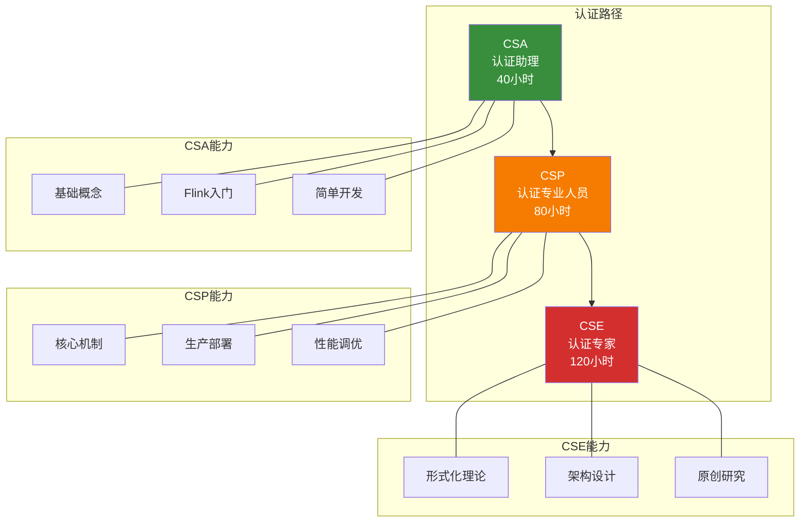

# AnalysisDataFlow 认证课程体系索引

> **版本**: v1.0 | **更新日期**: 2026-04-08

## 课程体系结构

```
docs/certification/
├── README.md                          # 认证体系总览
├── CERTIFICATION-INDEX.md             # 本文件：完整索引
├── schedule-2026.md                   # 2026年考试时间表
│
├── csa/                               # 初级认证
│   ├── syllabus-csa.md               # 课程大纲
│   ├── exam-guide-csa.md             # 考试说明
│   ├── labs/                         # 实验指导
│   │   ├── README.md
│   │   ├── lab-01-time-semantics.md
│   │   └── ... (16个实验)
│   ├── quizzes/                      # 练习题库
│   │   ├── README.md
│   │   ├── fundamentals.md
│   │   └── ... (6个章节)
│   └── resources/                    # 学习资源
│       ├── README.md
│       └── capstone-project-csa.md
│
├── csp/                               # 中级认证
│   ├── syllabus-csp.md               # 课程大纲
│   ├── exam-guide-csp.md             # 考试说明
│   ├── labs/                         # 实验指导
│   │   ├── README.md
│   │   └── ... (20个实验)
│   ├── quizzes/                      # 练习题库
│   │   ├── README.md
│   │   └── ... (9个章节)
│   └── resources/                    # 学习资源
│       └── README.md
│
└── cse/                               # 高级认证
    ├── syllabus-cse.md               # 课程大纲
    ├── exam-guide-cse.md             # 考试说明
    ├── labs/                         # 研究/设计实验室
    │   ├── README.md
    │   ├── research-01-csp-modeling.md
    │   ├── design-01-multi-region.md
    │   └── ... (12个研究课题)
    ├── quizzes/                      # 练习题库(预留)
    │   └── README.md
    └── resources/                    # 学习资源
        └── README.md
```

## 快速导航

### 按认证等级

| 等级 | 全称 | 学习时长 | 考试形式 | 入口 |
|------|------|----------|----------|------|
| **CSA** | Certified Streaming Associate | 40小时 | 在线选择题 | [课程大纲](./csa/syllabus-csa.md) |
| **CSP** | Certified Streaming Professional | 80小时 | 实操+笔试 | [课程大纲](./csp/syllabus-csp.md) |
| **CSE** | Certified Streaming Expert | 120小时 | 项目+论文+答辩 | [课程大纲](./cse/syllabus-cse.md) |

### 按考试安排

- [2026年考试时间表](./schedule-2026.md)
- [考试报名入口]([认证系统 - 待部署])

### 按学习阶段

**初学者**（无流计算经验）:

1. [CSA 课程大纲](./csa/syllabus-csa.md)
2. [CSA 实验指导](./csa/labs/)
3. [CSA 练习题库](./csa/quizzes/)
4. [CSA 考试说明](./csa/exam-guide-csa.md)

**进阶者**（有流计算经验）:

1. [CSP 课程大纲](./csp/syllabus-csp.md)
2. [CSP 实验指导](./csp/labs/)
3. [CSP 练习题库](./csp/quizzes/)
4. [CSP 考试说明](./csp/exam-guide-csp.md)

**专家**（架构师/研究员）:

1. [CSE 课程大纲](./cse/syllabus-cse.md)
2. [CSE 研究实验室](./cse/labs/)
3. [CSE 考试说明](./cse/exam-guide-cse.md)

## 认证金字塔



## 课程统计

| 统计项 | CSA | CSP | CSE | 合计 |
|--------|-----|-----|-----|------|
| 模块数 | 8 | 10 | 6 | 24 |
| 实验/研究数 | 16 | 20 | 12 | 48 |
| 练习题数 | 300+ | 500+ | - | 800+ |
| 学习时长 | 40h | 80h | 120h | 240h |
| 考试费用 | ¥299 | ¥899 | ¥3999 | - |

## 认证价值

### 职业发展

| 认证 | 对应职位 | 年薪范围 | 行业认可度 |
|------|----------|----------|------------|
| CSA | 初级数据工程师 | 15-25万 | ⭐⭐⭐☆☆ |
| CSP | 高级数据工程师 | 25-40万 | ⭐⭐⭐⭐☆ |
| CSE | 流计算架构师/专家 | 40-80万 | ⭐⭐⭐⭐⭐ |

### 企业认可

- **阿里巴巴**: CSA/CSP 作为技术岗加分项
- **字节跳动**: CSP/CSE 作为高级工程师认定依据
- **美团**: 认证可作为晋升参考
- **开源社区**: Flink Committer 申请加分

## 学习建议

### 路径选择

**路径 A: 标准路径**（推荐）

```
CSA → CSP → CSE
(40h)  (80h)  (120h)
```

**路径 B: 有经验者**

```
经验认证 → CSP → CSE
```

**路径 C: 研究者**

```
CSP → CSE（研究型）
```

### 时间投入建议

| 学习节奏 | 每日投入 | CSA | CSP | CSE |
|----------|----------|-----|-----|-----|
| 全职学习 | 8h/天 | 1周 | 2周 | 3周 |
| 集中学习 | 2h/天 | 4周 | 8周 | 12周 |
| 业余学习 | 1h/天 | 8周 | 16周 | 24周 |

## 常见问题速查

| 问题 | 答案 |
|------|------|
| 零基础可以考 CSA 吗？ | 可以，CSA 专为零基础设计 |
| 可以跳级考吗？ | CSP/CSE 需要前置条件，但可通过经验认证豁免 |
| 证书有效期多久？ | CSA 永久，CSP/CSE 3年（可续期） |
| 考试未通过怎么办？ | 首次免费重考，后续收取重考费 |
| 有中文考试吗？ | 有，提供中文和英文两种版本 |

## 联系方式

- **课程咨询**: <certification@analysisdataflow.org>
- **考试支持**: <exam-tech@analysisdataflow.org>
- **社区论坛**: <[社区讨论版 - 待部署]>
- **官方网站**: <[认证系统 - 待部署]>

---

**开始您的认证之旅** → [选择认证等级](#快速导航)
