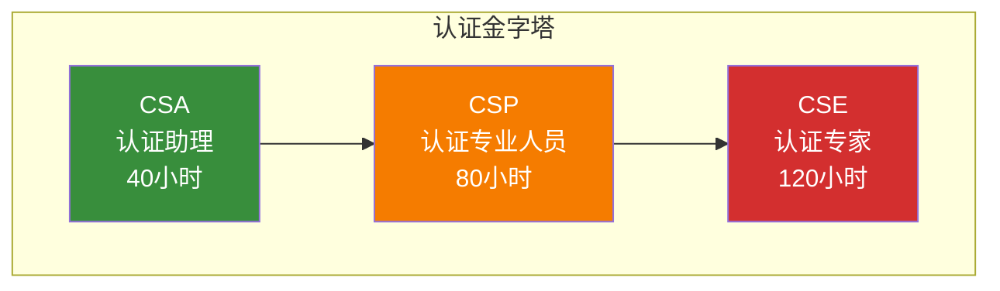
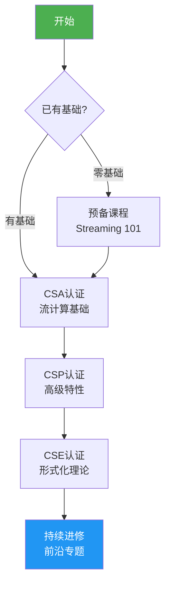
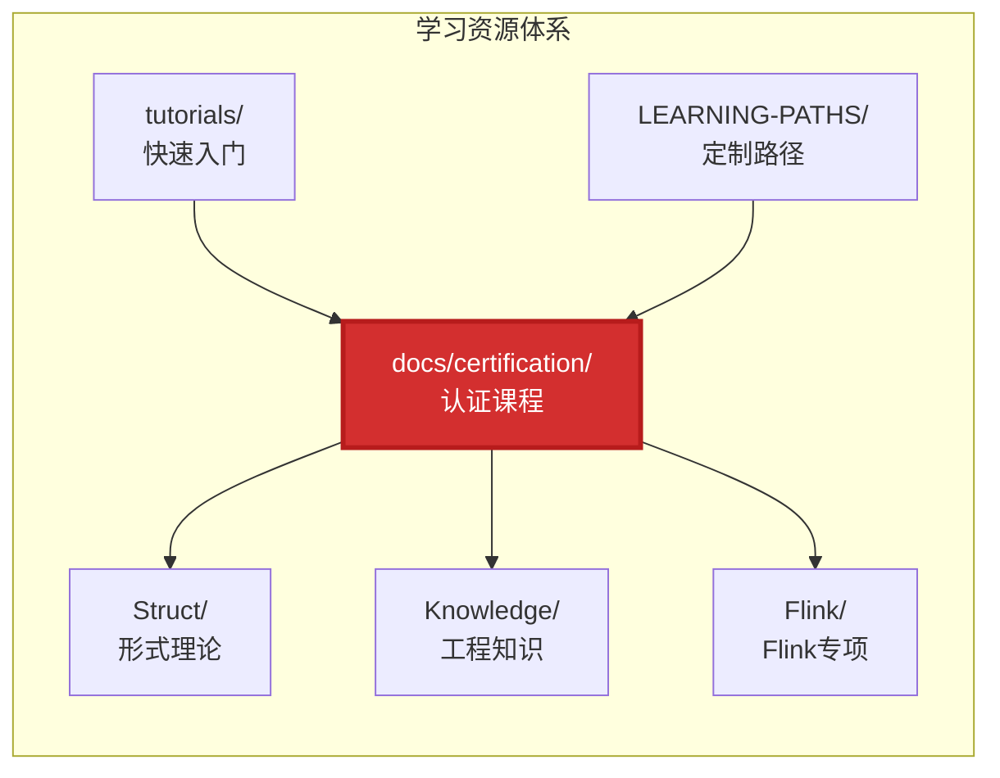
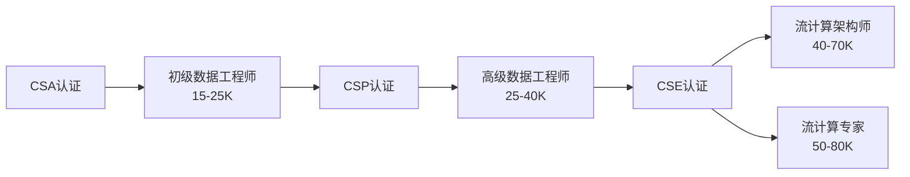

# AnalysisDataFlow 流计算认证课程体系

> **版本**: v1.0 | **生效日期**: 2026-04-08 | **形式化等级**: L2-L5

## 1. 认证体系概述

AnalysisDataFlow 认证体系是业界首个**理论与实践并重**的流计算专业认证，覆盖从入门到专家的全阶段能力培养。

### 1.1 认证等级

| 等级 | 全称 | 定位 | 学习时长 | 考试形式 | 有效期 |
|------|------|------|----------|----------|--------|
| **CSA** | Certified Streaming Associate | 初级认证 | 40小时 | 在线选择题 | 永久 |
| **CSP** | Certified Streaming Professional | 中级认证 | 80小时 | 实操+笔试 | 3年 |
| **CSE** | Certified Streaming Expert | 高级认证 | 120小时 | 项目+论文 | 3年 |

### 1.2 能力模型对照

| 能力维度 | CSA | CSP | CSE |
|----------|-----|-----|-----|
| **理论知识** | 基础概念理解 | 机制原理掌握 | 形式化理论深度 |
| **工程实践** | 简单作业开发 | 复杂系统实现 | 架构设计与优化 |
| **故障排查** | 常见问题识别 | 复杂问题诊断 | 根因分析与调优 |
| **架构设计** | - | 组件选型能力 | 全栈架构设计 |
| **形式化方法** | - | - | 定理证明与建模 |

## 2. 学习路径总览

### 2.1 推荐学习顺序

### 2.2 与其他学习资源的关系

## 3. 认证详情

### 3.1 CSA - 认证助理

**目标受众**: 数据开发新手、后端转流计算工程师、在校学生

**核心能力**:

- 理解流计算基础概念（Event Time vs Processing Time、Window、State）
- 能够使用 Flink 开发简单 DataStream 作业
- 掌握基础运维操作（启停作业、查看日志）

**课程结构**:

- 8个核心模块，每模块 5 小时
- 20% 理论 + 80% 实践

**考试形式**:

- 60道单选题，90分钟
- 70分及格
- 在线考试，即时出分

[查看 CSA 详细大纲 →](./csa/syllabus-csa.md)

### 3.2 CSP - 认证专业人员

**前置要求**: CSA 认证 或 1年以上流计算经验

**目标受众**: 数据工程师、Flink 开发者、技术 lead

**核心能力**:

- 深入理解 Checkpoint、Exactly-Once、Watermark 等核心机制
- 能够设计并实现生产级流处理系统
- 具备性能调优和故障排查能力

**课程结构**:

- 10个核心模块，每模块 8 小时
- 40% 理论 + 60% 实践

**考试形式**:

- 实操考试：3小时，完成指定系统开发
- 笔试：60道题目（选择+简答），120分钟
- 实操70分 + 笔试70分，双及格

[查看 CSP 详细大纲 →](./csp/syllabus-csp.md)

### 3.3 CSE - 认证专家

**前置要求**: CSP 认证 或 3年以上流计算架构经验

**目标受众**: 流计算架构师、研究员、技术专家

**核心能力**:

- 掌握形式化理论（进程演算、类型系统、一致性模型）
- 能够进行系统架构设计与优化
- 具备解决复杂技术问题的创新能力

**课程结构**:

- 6个核心模块，每模块 20 小时
- 60% 理论 + 40% 实践

**考试形式**:

- 项目实战：2周，完成架构设计与实现
- 技术论文：3000字以上，评审通过
- 答辩：30分钟技术答辩

[查看 CSE 详细大纲 →](./cse/syllabus-cse.md)

## 4. 考试时间表

[查看 2026 年完整考试时间表 →](./schedule-2026.md)

### 近期考试安排

| 考试日期 | 等级 | 报名截止 | 考试形式 |
|----------|------|----------|----------|
| 2026-04-26 | CSA | 2026-04-19 | 在线 |
| 2026-05-10 | CSP | 2026-04-26 | 线上实操 |
| 2026-05-24 | CSA | 2026-05-17 | 在线 |
| 2026-06-14 | CSE | 2026-05-31 | 项目评审 |

## 5. 学习资源导航

### 5.1 官方文档索引

| 等级 | 必读文档 |
|------|----------|
| CSA | `tutorials/00-5-MINUTE-QUICK-START.md` `Knowledge/01-concept-atlas/streaming-models-mindmap.md` `Flink/01-getting-started/` |
| CSP | `Flink/02-core-mechanisms/checkpoint-mechanism-deep-dive.md` `Knowledge/02-design-patterns/` `Knowledge/09-anti-patterns/` |
| CSE | `Struct/01-foundations/` `Struct/02-properties/` `Flink/06-formal-verification/` |

### 5.2 推荐书籍

1. **《Streaming Systems》** - Tyler Akidau et al. (CSA/CSP)
2. **《Designing Data-Intensive Applications》** - Martin Kleppmann (CSP/CSE)
3. **《Communication and Concurrency》** - Robin Milner (CSE)

## 6. 认证价值

### 6.1 职业发展

### 6.2 企业认可

- 阿里云认证合作伙伴优先录取
- 字节跳动、美团等头部企业认可
- 开源社区贡献者资质证明

## 7. 常见问题

### Q1: 零基础可以考 CSA 吗？

**可以**。CSA 专为零基础设计，建议先完成 `tutorials/00-5-MINUTE-QUICK-START.md` 作为预备。

### Q2: 认证可以跳级考吗？

**CSP 和 CSE 需要前置条件**，但可通过"经验认证"通道申请豁免：

- CSP: 1年以上流计算项目经验
- CSE: 3年以上架构设计经验 + 技术成果

### Q3: 考试未通过怎么办？

- 免费重考 1 次（需间隔 14 天）
- 后续重考收费：CSA ¥200, CSP ¥500, CSE ¥1000

### Q4: 认证有效期过后如何续期？

- CSP/CSE 需在到期前 6 个月内完成继续教育
- 续期要求：完成指定学分或重新考试

## 8. 联系与支持

- **课程咨询**: <certification@analysisdataflow.org>
- **技术支持**: <support@analysisdataflow.org>
- **社区论坛**: <https://discuss.analysisdataflow.org>

---

**开始您的流计算认证之旅 →** [选择适合的认证等级](#3-认证详情)

---

*本认证体系基于 AnalysisDataFlow 项目知识体系构建，持续更新迭代中。*
