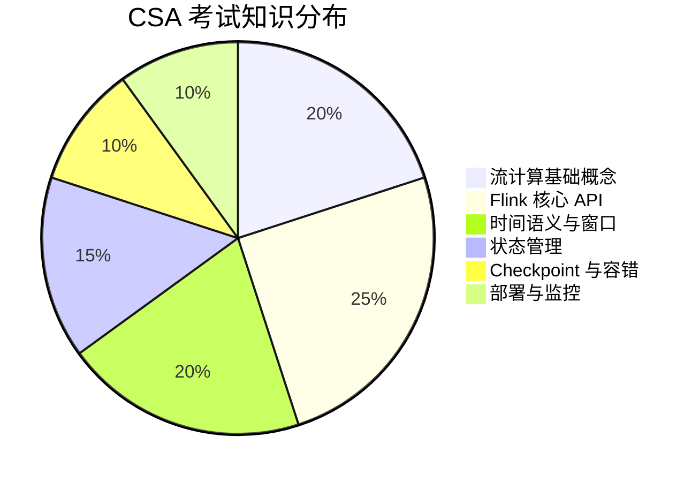
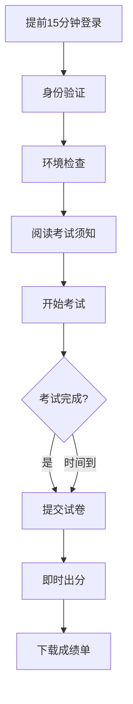
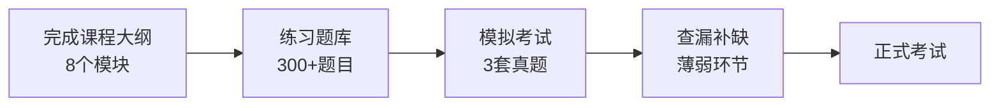

# CSA 认证考试说明

> **版本**: v1.0 | **生效日期**: 2026-04-08
>
> **Certified Streaming Associate Exam Guide**

## 1. 考试概述

| 项目 | 说明 |
|------|------|
| **考试名称** | CSA - Certified Streaming Associate |
| **考试代码** | CSA-FLINK-001 |
| **考试形式** | 在线选择题 |
| **考试时长** | 90 分钟 |
| **题目数量** | 60 题 |
| **及格分数** | 70%（42/60） |
| **考试费用** | ¥299 / $49 |
| **有效期** | 永久有效 |

## 2. 考试范围

### 2.1 知识领域分布



### 2.2 详细考点

#### 领域 1: 流计算基础概念 (20%)

| 考点 | 权重 | 能力要求 |
|------|------|----------|
| 批处理 vs 流处理 | 5% | 理解两种范式的区别和适用场景 |
| 时间语义 | 8% | 区分 Event/Processing/Ingestion Time |
| 窗口类型 | 7% | 掌握 Tumbling/Sliding/Session/Global Window |

#### 领域 2: Flink 核心 API (25%)

| 考点 | 权重 | 能力要求 |
|------|------|----------|
| 环境设置 | 5% | 配置 StreamExecutionEnvironment |
| DataStream API | 10% | 使用 map/filter/flatMap/keyBy 等操作 |
| Source/Sink | 5% | 接入 Kafka、文件、Socket 等 |
| Table API/SQL 基础 | 5% | 基本 SQL 查询能力 |

#### 领域 3: 时间语义与窗口 (20%)

| 考点 | 权重 | 能力要求 |
|------|------|----------|
| Watermark 机制 | 8% | 理解 Watermark 的作用和生成 |
| 窗口分配器 | 7% | 选择合适的窗口类型 |
| 窗口计算 | 5% | 增量聚合与全量聚合 |

#### 领域 4: 状态管理 (15%)

| 考点 | 权重 | 能力要求 |
|------|------|----------|
| 状态类型 | 8% | ValueState/ListState/MapState 的区别 |
| 状态 TTL | 4% | 配置状态过期策略 |
| 状态后端 | 3% | 了解三种状态后端的特点 |

#### 领域 5: Checkpoint 与容错 (10%)

| 考点 | 权重 | 能力要求 |
|------|------|----------|
| Checkpoint 配置 | 5% | 启用和配置 Checkpoint |
| 一致性语义 | 5% | 理解 At-Least-Once 和 Exactly-Once |

#### 领域 6: 部署与监控 (10%)

| 考点 | 权重 | 能力要求 |
|------|------|----------|
| 部署模式 | 5% | 了解 Local/Standalone/YARN/K8s 模式 |
| 监控基础 | 5% | 使用 Web UI 查看作业状态 |

## 3. 题型说明

### 3.1 单选题（45题，每题1.5分，共67.5分）

每题有且只有一个正确答案。

**示例**:

```
1. 在 Flink 中,以下哪个操作会触发实际的计算执行？
   A. map()
   B. filter()
   C. keyBy()
   D. execute()

   正确答案: D
   解析: Flink 采用延迟执行模型,只有调用 execute() 才会提交作业。
```

### 3.2 多选题（10题，每题2分，共20分）

每题有两个或两个以上正确答案，**少选得部分分，选错不得分**。

**示例**:

```
2. 以下哪些是 Flink 支持的窗口类型？(选择所有适用的)
   A. Tumbling Window
   B. Sliding Window
   C. Session Window
   D. Batch Window

   正确答案: A, B, C
   解析: Flink 支持 Tumbling、Sliding、Session 和 Global Window,没有 Batch Window。
```

### 3.3 判断题（5题，每题2.5分，共12.5分）

判断陈述的正确性。

**示例**:

```
3. Watermark 用于处理乱序数据,它表示确信不会再有更早的数据到达。
   A. 正确
   B. 错误

   正确答案: A
   解析: Watermark 是时间戳,表示该时间戳之前的数据应该都已经到达。
```

## 4. 考试流程

### 4.1 考前准备

1. **设备检查**（考前24小时）
   - [x] 电脑配置满足要求（4GB+ 内存，Chrome/Firefox/Edge 浏览器）
   - [x] 摄像头和麦克风正常工作
   - [x] 网络连接稳定（建议 10Mbps+）

2. **环境要求**
   - 独立安静的考试空间
   - 桌面清理干净，仅保留考试允许物品
   - 手机调至静音并放置远处

3. **身份验证**
   - 有效身份证件（身份证/护照/驾照）
   - 人脸识别验证

### 4.2 考试当天流程



### 4.3 考试规则

- **禁止行为**:
  - 查阅任何资料（包括电子和纸质）
  - 与其他人交流
  - 使用通讯工具
  - 离开摄像头监控范围
  - 复制或传播考题

- **违规处理**:
  - 首次警告
  - 二次违规取消成绩
  - 严重违规列入黑名单

## 5. 成绩评定

### 5.1 分数计算

| 题型 | 题数 | 分值 | 计分规则 |
|------|------|------|----------|
| 单选题 | 45 | 1.5分/题 | 选对得分，选错不得分 |
| 多选题 | 10 | 2分/题 | 全对得2分，少选按比例得分，选错0分 |
| 判断题 | 5 | 2.5分/题 | 选对得分，选错不得分 |
| **合计** | **60** | **100分** | **70分及格** |

### 5.2 成绩单内容

考试通过后可下载电子成绩单，包含：

- 总分及各领域得分
- 各等级能力评估
- 后续学习建议

**示例成绩单**:

```
========================================
    CSA 认证成绩单
    证书编号: CSA-2026-XXXXX
    考试日期: 2026-04-26
========================================

总分: 82/100 (通过 ✓)

各领域表现:
├── 流计算基础概念: 18/20 (优秀)
├── Flink 核心 API: 20/25 (良好)
├── 时间语义与窗口: 17/20 (良好)
├── 状态管理: 12/15 (良好)
├── Checkpoint 与容错: 8/10 (优秀)
└── 部署与监控: 7/10 (合格)

能力评估:
├── 理论知识: ★★★★☆
├── API 使用: ★★★★☆
└── 工程实践: ★★★☆☆

后续建议:
- 建议加强部署与监控相关知识的实践
- 可继续学习 CSP 认证课程
```

## 6. 备考建议

### 6.1 推荐学习路径



### 6.2 备考时间规划

| 阶段 | 时间 | 任务 |
|------|------|------|
| 基础学习 | 2-3周 | 完成所有课程模块 |
| 刷题巩固 | 1周 | 完成练习题库 |
| 模拟演练 | 3-5天 | 完成3套模拟试卷 |
| 考前冲刺 | 2-3天 | 复习错题，调整状态 |

### 6.3 重点复习清单

**必须熟练掌握**:

- [x] Event Time vs Processing Time 的区别
- [x] 四种窗口类型的适用场景
- [x] DataStream API 核心操作（map/filter/keyBy/window）
- [x] Watermark 的生成与传递
- [x] Checkpoint 的启用配置
- [x] 状态 TTL 的配置方法

**易混淆概念**:

- keyBy 后才可以使用 Keyed State
- Watermark 是单调递增的
- Checkpoint 和 Savepoint 的区别
- Processing Time 窗口 vs Event Time 窗口

## 7. 重考政策

### 7.1 首次重考（免费）

- 条件：首次考试未通过
- 间隔：至少 14 天
- 次数：1 次

### 7.2 后续重考（收费）

- 费用：¥200 / $29
- 间隔：至少 30 天
- 次数：不限

## 8. 证书颁发

### 8.1 电子证书

- 考试通过后即时颁发
- 包含证书编号、姓名、通过日期
- 可下载 PDF 版本

### 8.2 证书查询

- 官网验证: <https://cert.analysisdataflow.org/verify>
- 输入证书编号即可验证真伪

### 8.3 证书样式

```
┌─────────────────────────────────────────────────────────────┐
│                                                             │
│          AnalysisDataFlow 认证体系                          │
│                                                             │
│                    ★ CSA ★                                 │
│                                                             │
│              Certified Streaming Associate                  │
│                                                             │
│                   流计算认证助理                             │
│                                                             │
│    此证书授予                                                 │
│                                                             │
│                    [学员姓名]                                │
│                                                             │
│    通过 CSA 认证考试,证明其具备流计算基础知识和             │
│    Apache Flink 初级开发能力                                 │
│                                                             │
│    证书编号: CSA-2026-XXXXX                                  │
│    颁发日期: 2026年4月26日                                   │
│    有效期: 永久有效                                          │
│                                                             │
│               [数字签名]  [防伪二维码]                        │
│                                                             │
└─────────────────────────────────────────────────────────────┘
```

## 9. 常见问题

**Q1: 考试支持哪些语言？**

考试提供中文和英文两种语言版本，报名时选择。

**Q2: 考试期间可以暂停吗？**

不可以。考试一旦开始，必须在 90 分钟内完成，中途不能暂停。

**Q3: 如果考试中途断网怎么办？**

系统会自动保存答题进度，重新连接后可以继续考试（总计时不会暂停）。

**Q4: 证书可以用于求职吗？**

可以。CSA 认证已被多家头部互联网企业认可，是流计算能力的有效证明。

**Q5: 如何通过经验认证跳过 CSA 直接考 CSP？**

如果您有 1 年以上流计算项目经验，可以申请 CSP 经验认证通道，通过审核后直接报考 CSP。

---

[返回课程大纲 →](./syllabus-csa.md) | [开始练习题 →](./quizzes/README.md)
