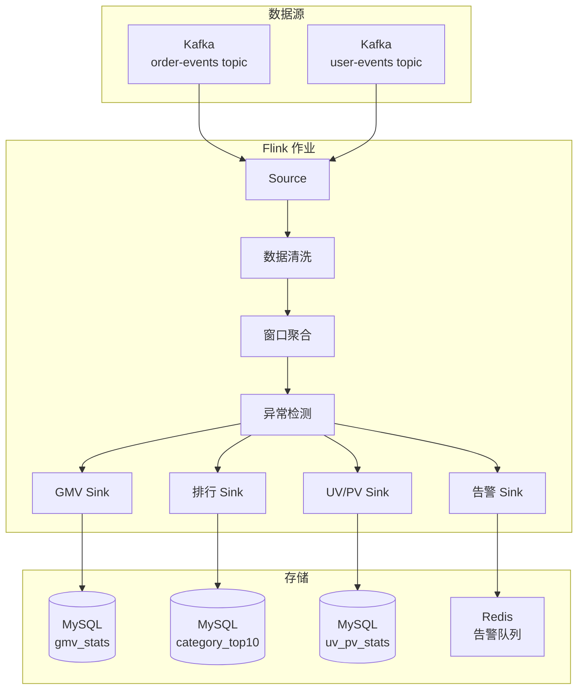

# CSA 综合项目: 实时电商数据统计系统

> **项目代码**: CSA-CAPSTONE-001
> **难度等级**: ★★★☆☆
> **预计用时**: 8-10 小时

## 1. 项目概述

### 1.1 项目背景

某电商平台需要构建实时数据统计系统，对平台运营数据进行实时分析和监控。

### 1.2 业务目标

实现以下实时统计功能：

1. **GMV 实时监控**: 分时间段统计成交金额
2. **品类销售排行**: 实时计算各品类销售额 Top 10
3. **UV/PV 统计**: 实时访客数和页面浏览量
4. **异常检测**: 识别异常订单（金额异常、频率异常）

## 2. 需求规格

### 2.1 功能需求

#### FR1: 实时 GMV 统计

- 每 1 分钟统计一次 GMV
- 支持按地域、品类维度下钻
- 输出到 MySQL 结果表

#### FR2: 品类销售排行

- 每 5 分钟计算各品类销售额
- 取 Top 10 输出
- 包含品类名称、销售额、订单数

#### FR3: UV/PV 统计

- 每 1 分钟统计 UV（独立访客）和 PV（页面浏览）
- UV 基于用户 ID 去重
- 支持按渠道维度统计

#### FR4: 异常订单检测

- 检测单笔金额超过 10000 元的订单
- 检测 1 分钟内同一用户下单超过 5 次
- 异常订单输出到告警队列

### 2.2 非功能需求

| 指标 | 要求 |
|------|------|
| 延迟 | ≤ 10 秒（端到端） |
| 吞吐 | ≥ 1000 订单/秒 |
| 可用性 | 支持故障恢复 |
| 准确性 | 统计误差 < 0.1% |

### 2.3 数据格式

**订单事件 (OrderEvent)**:

```json
{
  "orderId": "O20240408123456",
  "userId": "U12345",
  "amount": 299.99,
  "category": "electronics",
  "region": "beijing",
  "channel": "app",
  "timestamp": 1712553600000
}
```

**用户行为事件 (UserEvent)**:

```json
{
  "userId": "U12345",
  "eventType": "page_view",
  "pageId": "product_123",
  "channel": "app",
  "timestamp": 1712553600000
}
```

## 3. 系统架构



## 4. 开发任务

### 任务 1: 项目搭建 (1小时)

**目标**: 搭建项目结构和基础配置

**要求**:

- 创建 Maven 项目
- 配置 Flink 依赖
- 创建配置文件
- 搭建本地测试环境（Docker Compose）

**检查点**:

- [ ] 项目可以编译通过
- [ ] 本地 Kafka 和 MySQL 可访问
- [ ] 编写 README 说明环境搭建步骤

### 任务 2: 数据接入 (1.5小时)

**目标**: 实现 Kafka Source 接入

**要求**:

- 实现 OrderEvent 和 UserEvent 的数据类
- 配置 Kafka Consumer
- 实现数据解析和基础转换
- 添加 Watermark 策略

**代码框架**:

```java

import org.apache.flink.streaming.api.datastream.DataStream;

DataStream<OrderEvent> orderStream = env
    .addSource(new FlinkKafkaConsumer<>("order-events",
        new OrderEventDeserializationSchema(), properties))
    .assignTimestampsAndWatermarks(
        WatermarkStrategy.<OrderEvent>forBoundedOutOfOrderness(
            Duration.ofSeconds(5))
        .withTimestampAssigner((event, timestamp) -> event.getTimestamp())
    );
```

**检查点**:

- [ ] 可以消费 Kafka 数据
- [ ] Watermark 正确生成
- [ ] 打印数据验证解析正确

### 任务 3: GMV 统计 (2小时)

**目标**: 实现分钟级 GMV 统计

**要求**:

- 使用 1 分钟滚动窗口
- 支持按地域、品类分组统计
- 结果写入 MySQL

**实现提示**:

```java

import org.apache.flink.api.common.functions.AggregateFunction;
import org.apache.flink.streaming.api.windowing.time.Time;

orderStream
    .keyBy(OrderEvent::getRegion)
    .window(TumblingEventTimeWindows.of(Time.minutes(1)))
    .aggregate(new GmvAggregateFunction())
    .addSink(new JdbcSink<>(
        "INSERT INTO gmv_stats (window_start, region, gmv, order_count) VALUES (?, ?, ?, ?)",
        new GmvStatementBuilder(),
        jdbcExecutionOptions,
        connectionOptions
    ));
```

**检查点**:

- [ ] 窗口计算结果正确
- [ ] 数据成功写入 MySQL
- [ ] 验证数据准确性

### 任务 4: 品类排行 (1.5小时)

**目标**: 实现品类销售 Top 10

**要求**:

- 使用 5 分钟滑动窗口
- 计算各品类销售额
- 取 Top 10 输出

**实现提示**:

```java

import org.apache.flink.streaming.api.windowing.time.Time;

orderStream
    .keyBy(OrderEvent::getCategory)
    .window(TumblingEventTimeWindows.of(Time.minutes(5)))
    .aggregate(new CategorySalesAggregate())
    .windowAll(TumblingEventTimeWindows.of(Time.minutes(5)))
    .process(new TopNFunction(10))
    .addSink(categorySink);
```

### 任务 5: UV/PV 统计 (1.5小时)

**目标**: 实现 UV/PV 统计

**要求**:

- UV 使用布隆过滤器或 Set 去重
- 按渠道统计
- 1 分钟窗口输出

**实现提示**:

```java
// UV 统计使用 MapState 保存用户ID

import org.apache.flink.api.common.functions.AggregateFunction;

public class UvPvAggregate extends AggregateFunction<UserEvent, UvPvAcc, UvPvResult> {
    @Override
    public UvPvAcc createAccumulator() {
        return new UvPvAcc(new HashSet<>(), 0);
    }

    @Override
    public UvPvAcc add(UserEvent event, UvPvAcc acc) {
        acc.getUserIds().add(event.getUserId());
        acc.setPvCount(acc.getPvCount() + 1);
        return acc;
    }
    // ...
}
```

### 任务 6: 异常检测 (1.5小时)

**目标**: 实现异常订单检测

**要求**:

- 检测大额订单（>10000元）
- 检测高频下单（1分钟>5次）
- 输出到 Redis 告警队列

**实现提示**:

```java

import org.apache.flink.streaming.api.windowing.time.Time;

// 大额订单检测
orderStream
    .filter(event -> event.getAmount() > 10000)
    .map(event -> new Alert("LARGE_AMOUNT", event))
    .addSink(redisSink);

// 高频下单检测 - 使用 CEP 或状态
Pattern<OrderEvent, ?> pattern = Pattern
    .<OrderEvent>begin("first")
    .next("second")
    .next("third")
    .next("fourth")
    .next("fifth")
    .within(Time.minutes(1));
```

### 任务 7: Checkpoint 与容错 (1小时)

**目标**: 配置 Checkpoint 保证容错

**要求**:

- 启用 Checkpoint，间隔 30 秒
- 配置 Exactly-Once 语义
- 测试故障恢复

**配置代码**:

```java

import org.apache.flink.streaming.api.CheckpointingMode;

env.enableCheckpointing(30000);
env.getCheckpointConfig().setCheckpointingMode(
    CheckpointingMode.EXACTLY_ONCE);
env.getCheckpointConfig().setMinPauseBetweenCheckpoints(10000);
env.getCheckpointConfig().setCheckpointTimeout(60000);
env.setStateBackend(new FsStateBackend("file:///tmp/flink-checkpoints"));
```

## 5. 评分标准

| 维度 | 权重 | 评分细则 |
|------|------|----------|
| **功能完整性** | 40% | 4个功能各10分 |
| **代码质量** | 25% | 规范、可读、异常处理 |
| **性能优化** | 15% | 状态优化、序列化选择 |
| **文档完整** | 10% | README、设计说明 |
| **运行稳定** | 10% | 可持续运行无异常 |

## 6. 提交要求

### 6.1 代码提交

```
project/
├── src/
│   ├── main/
│   │   ├── java/
│   │   │   └── com/example/
│   │   │       ├── model/        # 数据模型
│   │   │       ├── source/       # Source 实现
│   │   │       ├── sink/         # Sink 实现
│   │   │       ├── function/     # 自定义函数
│   │   │       └── job/          # 作业入口
│   │   └── resources/
│   │       └── application.conf
│   └── test/
├── docker/                       # Docker 配置
├── docs/
│   ├── design.md                # 设计文档
│   └── runbook.md               # 运行手册
├── README.md
└── pom.xml
```

### 6.2 文档要求

**README.md** 必须包含:

- 项目概述
- 环境要求
- 快速开始指南
- 架构说明
- 测试方法

**设计文档 (design.md)** 必须包含:

- 数据流图
- 关键设计决策
- 状态设计
- 容错策略

## 7. 参考实现

### 7.1 数据模型

```java
@Data
public class OrderEvent {
    private String orderId;
    private String userId;
    private Double amount;
    private String category;
    private String region;
    private String channel;
    private Long timestamp;
}

@Data
public class GmvStats {
    private Long windowStart;
    private String region;
    private Double gmv;
    private Integer orderCount;
}
```

### 7.2 MySQL 表结构

```sql
CREATE TABLE gmv_stats (
    window_start BIGINT,
    region VARCHAR(50),
    gmv DECIMAL(18, 2),
    order_count INT,
    PRIMARY KEY (window_start, region)
);

CREATE TABLE category_top10 (
    window_start BIGINT,
    category VARCHAR(50),
    sales_amount DECIMAL(18, 2),
    order_count INT,
    rank_num INT,
    PRIMARY KEY (window_start, rank_num)
);

CREATE TABLE uv_pv_stats (
    window_start BIGINT,
    channel VARCHAR(50),
    uv_count INT,
    pv_count INT,
    PRIMARY KEY (window_start, channel)
);
```

## 8. 测试数据生成器

```java
public class DataGenerator {
    private static final String[] CATEGORIES =
        {"electronics", "clothing", "food", "books", "home"};
    private static final String[] REGIONS =
        {"beijing", "shanghai", "guangzhou", "shenzhen", "hangzhou"};
    private static final String[] CHANNELS =
        {"app", "web", "miniapp"};

    public static OrderEvent generateOrderEvent() {
        Random random = new Random();
        OrderEvent event = new OrderEvent();
        event.setOrderId("O" + System.currentTimeMillis());
        event.setUserId("U" + random.nextInt(10000));
        event.setAmount(random.nextDouble() * 5000 + 10);
        event.setCategory(CATEGORIES[random.nextInt(CATEGORIES.length)]);
        event.setRegion(REGIONS[random.nextInt(REGIONS.length)]);
        event.setChannel(CHANNELS[random.nextInt(CHANNELS.length)]);
        event.setTimestamp(System.currentTimeMillis());
        return event;
    }
}
```

## 9. 常见问题

**Q: 如何处理迟到数据？**

A: 配置 Allowed Lateness，将迟到数据发送到侧输出流。

**Q: UV 去重内存不够怎么办？**

A: 使用 RocksDBStateBackend，或采用 HyperLogLog 近似算法。

**Q: TopN 实现性能不佳？**

A: 使用 TreeSet 或 PriorityQueue 维护 TopN，避免全量排序。

---

**祝项目顺利！如有问题，请在讨论区提问。**
