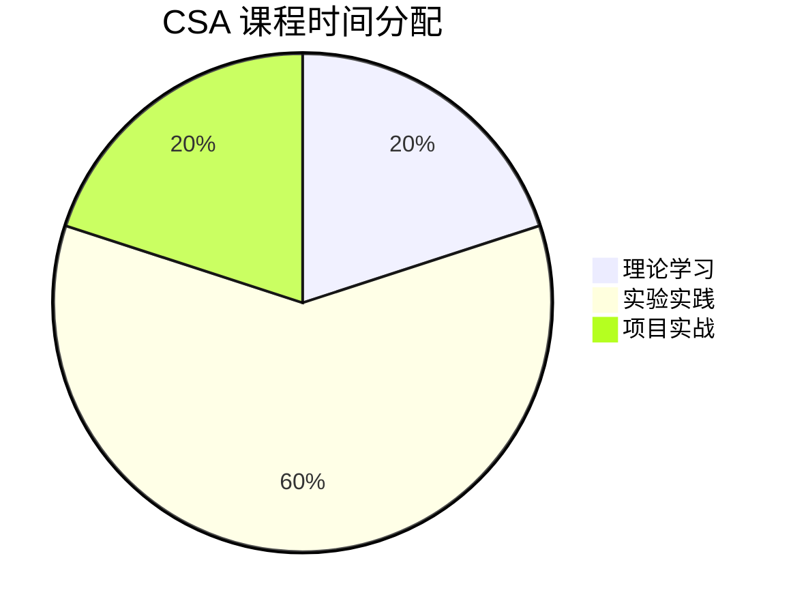

# CSA 认证课程大纲

> **版本**: v1.0 | **生效日期**: 2026-04-08 | **形式化等级**: L2
>
> **Certified Streaming Associate** | 流计算认证助理

## 1. 课程目标

完成本课程后，学员将能够：

1. 理解流计算核心概念（Event Time、Window、State、Checkpoint）
2. 使用 Apache Flink 开发简单 DataStream 作业
3. 部署和监控基础流处理应用
4. 识别并解决常见入门级问题

## 2. 前置知识

- Java 或 Python 基础编程能力
- Linux 基本操作命令
- SQL 基础（了解 SELECT、WHERE、GROUP BY）

## 3. 课程结构

**总时长**: 40小时（建议 4-6 周完成）

**模块分布**:

- 理论学习: 8 小时（20%）
- 实验实践: 24 小时（60%）
- 项目实战: 8 小时（20%）



## 4. 模块详解

### 模块 1: 流计算基础概念 (5小时)

**学习目标**: 建立流计算基础概念框架

**核心内容**:

1. **批处理 vs 流处理**
   - 数据处理的两种范式
   - 延迟与吞吐量的权衡
   - 适用场景对比

2. **时间语义**
   - Event Time（事件时间）
   - Processing Time（处理时间）
   - Ingestion Time（摄入时间）
   - 时间语义的选择策略

3. **窗口计算**
   - Tumbling Window（滚动窗口）
   - Sliding Window（滑动窗口）
   - Session Window（会话窗口）
   - Global Window（全局窗口）

**必读文档**:

- `Knowledge/01-concept-atlas/streaming-models-mindmap.md`
- `tutorials/02-streaming-fundamentals-script.md`

**实验任务**:

- [Lab 1.1: 理解不同时间语义](./labs/lab-01-time-semantics.md)
- [Lab 1.2: 窗口计算实践](./labs/lab-02-window-basics.md)

**检查点**:

- [ ] 能够解释 Event Time 和 Processing Time 的区别
- [ ] 能够根据场景选择合适的窗口类型

---

### 模块 2: Flink 快速入门 (5小时)

**学习目标**: 搭建 Flink 环境，运行第一个作业

**核心内容**:

1. **Flink 架构概览**
   - JobManager 与 TaskManager
   - Slot 与并行度
   - Client 模式

2. **开发环境搭建**
   - JDK 安装与配置
   - Flink 本地安装
   - Maven/Gradle 项目配置

3. **第一个 Flink 作业**
   - DataStream API 基础
   - Source 与 Sink
   - Transformation 操作

**必读文档**:

- `tutorials/01-environment-setup.md`
- `tutorials/02-first-flink-job.md`
- `Flink/01-getting-started/first-flink-program.md`

**实验任务**:

- [Lab 2.1: 本地环境搭建](./labs/lab-03-setup.md)
- [Lab 2.2: WordCount 实现](./labs/lab-04-wordcount.md)

**检查点**:

- [ ] 成功启动本地 Flink 集群
- [ ] 独立完成 WordCount 程序并运行

---

### 模块 3: DataStream API 基础 (5小时)

**学习目标**: 掌握 DataStream API 核心操作

**核心内容**:

1. **数据源（Source）**
   - 集合数据源
   - 文件数据源
   - Socket 数据源
   - Kafka 基础接入

2. **转换操作（Transformation）**
   - map / filter / flatMap
   - keyBy 与分区
   - reduce / aggregate
   - union / connect

3. **数据输出（Sink）**
   - 打印输出
   - 文件输出
   - Kafka 输出
   - JDBC 输出

**必读文档**:

- `Flink/01-getting-started/datastream-api-basics.md`
- `tutorials/03-flink-quickstart-script.md`

**实验任务**:

- [Lab 3.1: 实时日志分析](./labs/lab-05-log-analysis.md)
- [Lab 3.2: 数据清洗与转换](./labs/lab-06-data-transform.md)

**检查点**:

- [ ] 熟练使用 5 种以上 transformation 操作
- [ ] 能够接入 Kafka 作为 Source 和 Sink

---

### 模块 4: 窗口与聚合 (5小时)

**学习目标**: 掌握窗口计算与聚合操作

**核心内容**:

1. **窗口 API**
   - 窗口分配器（Window Assigner）
   - 窗口触发器（Trigger）
   - 窗口驱逐器（Evictor）

2. **增量聚合**
   - ReduceFunction
   - AggregateFunction
   - ProcessWindowFunction

3. **Watermark 基础**
   - Watermark 概念
   - 允许延迟（Allowed Lateness）
   - 侧输出流（Side Output）

**必读文档**:

- `Flink/02-core/time-semantics-and-watermark.md`
- `Flink/03-apis/window-operations.md`

**实验任务**:

- [Lab 4.1: 实时 UV 统计](./labs/lab-07-uv-stats.md)
- [Lab 4.2: 订单金额聚合](./labs/lab-08-order-agg.md)

**检查点**:

- [ ] 理解 Watermark 的作用
- [ ] 能够实现增量聚合函数

---

### 模块 5: 状态管理基础 (5小时)

**学习目标**: 理解状态概念，使用基础状态类型

**核心内容**:

1. **状态概述**
   - 有状态 vs 无状态计算
   - Keyed State 与 Operator State
   - 状态后端的类型

2. **Keyed State 类型**
   - ValueState
   - ListState
   - MapState
   - ReducingState

3. **状态 TTL**
   - 过期策略配置
   - 清理策略

**必读文档**:

- `Knowledge/02-design-patterns/pattern-stateful-computation.md`
- `Flink/02-core/state-management-overview.md`

**实验任务**:

- [Lab 5.1: 用户行为状态跟踪](./labs/lab-09-user-state.md)
- [Lab 5.2: 状态 TTL 配置实践](./labs/lab-10-state-ttl.md)

**检查点**:

- [ ] 能够区分不同类型的 State
- [ ] 能够使用 ValueState 实现状态计算

---

### 模块 6: Checkpoint 与容错 (5小时)

**学习目标**: 理解 Checkpoint 机制，配置基础容错

**核心内容**:

1. **Checkpoint 概念**
   - Checkpoint 的作用
   - 一致性语义（At-Least-Once vs Exactly-Once）
   - Checkpoint 触发流程

2. **Checkpoint 配置**
   - 启用 Checkpoint
   - 检查点间隔设置
   - 超时配置
   - 最大并发检查点数

3. **状态后端配置**
   - MemoryStateBackend
   - FsStateBackend
   - RocksDBStateBackend（简介）

**必读文档**:

- `Flink/02-core/checkpoint-mechanism-deep-dive.md`（前3节）
- `Flink/02-core/exactly-once-semantics-deep-dive.md`（概述）

**实验任务**:

- [Lab 6.1: Checkpoint 配置与观察](./labs/lab-11-checkpoint-config.md)
- [Lab 6.2: 故障恢复测试](./labs/lab-12-failover.md)

**检查点**:

- [ ] 理解 Exactly-Once 语义的基本含义
- [ ] 能够配置并启用 Checkpoint

---

### 模块 7: Table API 与 SQL 入门 (5小时)

**学习目标**: 使用 SQL 进行流处理

**核心内容**:

1. **Table API 概述**
   - DataStream 与 Table 转换
   - TableEnvironment

2. **流处理 SQL**
   - DDL 定义表
   - 基本查询语法
   - 窗口函数（TUMBLE, HOP, SESSION）

3. **连接器基础**
   - Kafka Connector
   - JDBC Connector

**必读文档**:

- `Flink/04-ecosystem/table-api-sql-basics.md`
- `Flink/04-ecosystem/streaming-sql-guide.md`

**实验任务**:

- [Lab 7.1: SQL 实现实时统计](./labs/lab-13-sql-stats.md)
- [Lab 7.2: CDC 数据同步基础](./labs/lab-14-cdc-basics.md)

**检查点**:

- [ ] 能够使用 SQL 完成简单流计算
- [ ] 理解流 SQL 与批 SQL 的差异

---

### 模块 8: 部署与监控 (5小时)

**学习目标**: 部署作业，查看运行指标

**核心内容**:

1. **部署模式**
   - Local 模式
   - Standalone 模式
   - YARN 模式（简介）
   - Kubernetes 模式（简介）

2. **作业提交**
   - Flink CLI 使用
   - REST API 提交
   - 作业参数传递

3. **监控基础**
   - Flink Web UI 导航
   - 基础 Metrics 查看
   - 日志查看

**必读文档**:

- `Flink/08-operations/deployment-overview.md`
- `Flink/08-operations/monitoring-basics.md`

**实验任务**:

- [Lab 8.1: Standalone 集群部署](./labs/lab-15-deployment.md)
- [Lab 8.2: 作业监控与日志分析](./labs/lab-16-monitoring.md)

**检查点**:

- [ ] 能够独立部署 Standalone 集群
- [ ] 能够使用 Web UI 诊断简单问题

---

## 5. 综合项目

### 项目: 实时电商数据统计系统

**项目描述**: 构建一个实时统计电商平台关键指标的流处理系统

**功能要求**:

1. 实时统计每分钟 GMV（成交总额）
2. 实时统计各品类销售额 Top 10
3. 实时计算 UV/PV 指标
4. 异常订单检测（金额过大或频率过高）

**技术要求**:

- 使用 Flink DataStream API
- 使用 Kafka 作为数据源
- 使用 MySQL 存储结果
- 启用 Checkpoint 保证容错

**评分标准**:

| 维度 | 权重 | 说明 |
|------|------|------|
| 功能完整性 | 40% | 完成所有功能点 |
| 代码质量 | 25% | 规范、可读、可维护 |
| 文档完整 | 20% | README、设计说明 |
| 运行稳定 | 15% | 可持续运行无异常 |

[项目详细要求 →](./resources/capstone-project-csa.md)

---

## 6. 学习资源清单

### 必读文档

| 优先级 | 文档路径 | 预计阅读时间 |
|--------|----------|--------------|
| P0 | `tutorials/00-5-MINUTE-QUICK-START.md` | 10分钟 |
| P0 | `Knowledge/01-concept-atlas/streaming-models-mindmap.md` | 30分钟 |
| P0 | `tutorials/02-first-flink-job.md` | 45分钟 |
| P1 | `Flink/01-getting-started/datastream-api-basics.md` | 60分钟 |
| P1 | `Flink/02-core/time-semantics-and-watermark.md` | 60分钟 |
| P2 | `Flink/02-core/state-management-overview.md` | 45分钟 |
| P2 | `Flink/02-core/checkpoint-mechanism-deep-dive.md` | 60分钟 |

### 推荐书籍章节

- 《Streaming Systems》第 1-4 章
- 《Apache Flink实战》第 1-5 章

### 视频资源

- [Flink Forward 入门演讲](https://www.flink-forward.org/)
- 阿里云 Flink 入门课程（免费）

---

## 7. 评估标准

### 7.1 模块完成标准

每个模块必须完成：

- [ ] 阅读所有必读文档
- [ ] 完成所有实验任务
- [ ] 通过模块检查点自测
- [ ] 提交实验报告

### 7.2 最终考核

| 考核项 | 形式 | 占比 | 及格线 |
|--------|------|------|--------|
| 理论考试 | 在线选择题 | 60% | 70分 |
| 项目评估 | 代码+文档 | 40% | 70分 |

---

## 8. 时间安排建议

### 方案 A: 集中学习（4周）

| 周次 | 学习内容 | 每日投入 |
|------|----------|----------|
| 第1周 | 模块 1-2 | 2小时 |
| 第2周 | 模块 3-4 | 2小时 |
| 第3周 | 模块 5-6 | 2小时 |
| 第4周 | 模块 7-8 + 项目 | 2小时 |

### 方案 B: 业余学习（6周）

| 周次 | 学习内容 | 每日投入 |
|------|----------|----------|
| 第1周 | 模块 1 | 1小时 |
| 第2周 | 模块 2-3 | 1.5小时 |
| 第3周 | 模块 4-5 | 1.5小时 |
| 第4周 | 模块 6-7 | 1.5小时 |
| 第5周 | 模块 8 | 1小时 |
| 第6周 | 综合项目 | 2小时 |

---

## 9. 附录

### 9.1 常用命令速查

```bash
# 启动本地 Flink 集群
./bin/start-cluster.sh

# 提交作业
./bin/flink run -c com.example.MyJob my-job.jar

# 查看运行作业
./bin/flink list

# 取消作业
./bin/flink cancel <job-id>
```

### 9.2 常见问题 FAQ

**Q: 模块可以跳过吗？**

不建议跳过，但如果已有相关经验，可以快速通过检查点验证后进入下一模块。

**Q: 实验环境有什么要求？**

- 内存: 至少 4GB 可用内存
- 磁盘: 至少 10GB 可用空间
- 系统: Windows 10+/macOS 10.14+/Linux

---

[返回认证首页 →](../README.md) | [查看练习题库 →](./quizzes/README.md) | [查看考试说明 →](./exam-guide-csa.md)

