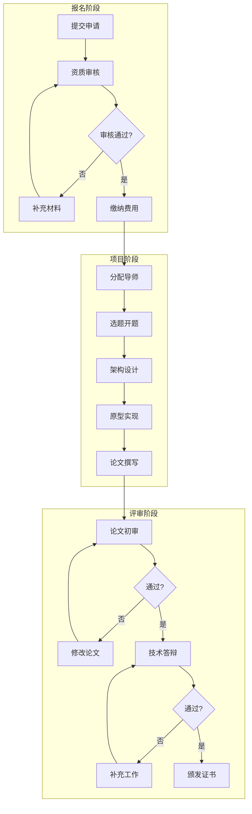
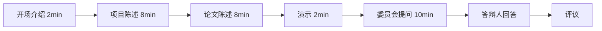

# CSE 认证考试说明

> **版本**: v1.0 | **生效日期**: 2026-04-08
>
> **Certified Streaming Expert Exam Guide**

## 1. 考试概述

| 项目 | 说明 |
|------|------|
| **考试名称** | CSE - Certified Streaming Expert |
| **考试代码** | CSE-FLINK-001 |
| **考试形式** | 项目实战 + 技术论文 + 答辩 |
| **项目周期** | 12周（含答辩） |
| **及格标准** | 项目70% + 论文70% + 答辩70% |
| **考试费用** | ¥3999 / $599 |
| **有效期** | 3 年 |

## 2. 前置条件

满足以下任一条件：

- 持有有效的 CSP 认证
- 通过 CSE 经验认证（3年以上架构经验 + 技术成果证明）

**技术成果证明**（满足其一）：

- 流计算相关专利（发明人）
- 顶级会议/期刊论文（一作或主要贡献）
- 开源项目核心贡献者（Flink/Spark/Kafka 等）
- 企业级流平台架构负责人

## 3. 认证流程



## 4. 项目实战要求

### 4.1 项目类型选择

**类型 A: 架构设计型**

- 设计大规模流计算平台架构
- 解决复杂技术挑战
- 产出: 架构文档 + 原型系统

**类型 B: 研究创新型**

- 解决流计算领域难题
- 理论创新或算法创新
- 产出: 研究论文 + 验证原型

**类型 C: 工程优化型**

- 重大性能优化或可靠性提升
- 量化指标改进
- 产出: 优化方案 + 生产验证

### 4.2 项目评审标准

| 维度 | 权重 | 优秀标准 |
|------|------|----------|
| **问题复杂度** | 15% | 解决的问题具有行业挑战性 |
| **技术创新** | 25% | 有独特见解或原创方法 |
| **技术深度** | 20% | 理论扎实，分析透彻 |
| **实现质量** | 20% | 代码/原型质量高，可落地 |
| **成果价值** | 20% | 对业务或社区有显著价值 |

### 4.3 项目里程碑

| 里程碑 | 时间节点 | 交付物 | 评审标准 |
|--------|----------|--------|----------|
| M1: 开题 | 第1周末 | 开题报告 | 问题定义清晰，方案可行 |
| M2: 架构 | 第4周末 | 架构设计文档 | 设计合理，考虑全面 |
| M3: 原型 | 第8周末 | 可运行原型 | 核心功能实现 |
| M4: 完成 | 第11周末 | 完整项目 | 达到项目要求 |

## 5. 技术论文要求

### 5.1 论文格式

**字数**: 3000-5000 字（不含参考文献和附录）

**结构要求**:

```
1. 摘要 (200-300字)
2. 引言 (研究背景、问题定义、贡献)
3. 相关工作 (文献综述)
4. 方法/设计 (核心内容)
5. 实现/实验 (验证部分)
6. 讨论 (局限性、未来工作)
7. 结论
8. 参考文献 (不少于15篇)
```

### 5.2 论文评审

**评审流程**:

1. 导师初审（1周）
2. 外部专家评审（双盲，2周）
3. 修改完善（1周）

**评审维度**:

| 维度 | 权重 | 说明 |
|------|------|------|
| 创新性 | 30% | 原创贡献或深度洞察 |
| 技术准确性 | 25% | 理论正确，无重大错误 |
| 完整性 | 20% | 问题-方法-结果完整链条 |
| 写作质量 | 15% | 清晰、规范、易读 |
| 引用规范 | 10% | 引用恰当，格式正确 |

### 5.3 论文模板

```markdown
# 论文标题

**作者**: [姓名]
**导师**: [导师姓名]
**日期**: 2026年X月

## 摘要

[研究背景] 流计算系统在处理...
[问题] 现有方法存在...
[方法] 本文提出...
[结果] 实验表明...
[贡献] 主要贡献包括...

**关键词**: 流计算、Flink、形式化验证、...

## 1. 引言

### 1.1 研究背景
...

### 1.2 问题定义
...

### 1.3 主要贡献
本文的主要贡献如下：
- 贡献 1: ...
- 贡献 2: ...
- 贡献 3: ...

### 1.4 论文结构
...

## 2. 相关工作

### 2.1 流计算一致性研究
...

### 2.2 形式化验证应用
...

## 3. 方法

### 3.1 形式化模型
...

### 3.2 正确性证明
...

## 4. 实验与评估

### 4.1 实验设置
...

### 4.2 结果分析
...

## 5. 讨论

### 5.1 局限性
...

### 5.2 未来工作
...

## 6. 结论
...

## 参考文献

[1] Tyler Akidau et al. The Dataflow Model. VLDB 2015.
[2] ...
```

## 6. 技术答辩

### 6.1 答辩安排

- **时间**: 30 分钟
  - 陈述: 20 分钟
  - 问答: 10 分钟

- **答辩委员会**: 3 位认证专家
  - 主席: 资深架构师/研究员
  - 委员: 技术专家
  - 委员: 学术界代表

### 6.2 答辩流程



### 6.3 评分标准

| 维度 | 权重 | 评分要点 |
|------|------|----------|
| 技术深度 | 40% | 回答准确，见解深刻，理论扎实 |
| 表达能力 | 25% | 逻辑清晰，表达流畅，重点突出 |
| 项目质量 | 20% | 成果有说服力，解决问题有效 |
| 应变能力 | 15% | 应对问题从容，思维敏捷 |

## 7. 导师指导

### 7.1 导师分配

根据研究方向匹配导师：

- **形式化理论方向**: 高校教授/研究员
- **系统架构方向**: 企业资深架构师
- **性能优化方向**: 内核工程师/性能专家

### 7.2 指导内容

| 阶段 | 指导重点 | 时间 |
|------|----------|------|
| 选题期 | 方向把握，问题定义 | 2h |
| 设计期 | 架构 review，技术选型 | 3h |
| 实现期 | 代码 review，方案调整 | 2h |
| 写作期 | 论文 structure，表达 | 1h |

### 7.3 导师评价

导师对学员的以下方面进行评价：

- 学习能力
- 技术能力
- 沟通能力
- 项目完成度

评价计入最终成绩（10%权重）

## 8. 论文选题参考

### 形式化理论方向

1. **《基于会话类型的 Flink DataStream API 形式化规约》**
   - 为 DataStream API 设计形式化语义
   - 证明关键操作的类型安全性

2. **《流计算 Watermark 机制的形式化建模与验证》**
   - 建立 Watermark 传播的数学模型
   - 证明窗口计算完整性定理

3. **《Flink Checkpoint 协议的正确性证明》**
   - 使用 TLA+ 规约 Checkpoint 协议
   - 验证一致性保证

### 系统架构方向

1. **《面向金融场景的流计算多活架构设计》**
   - 设计跨地域多活架构
   - 解决数据一致性与延迟的权衡

2. **《亿级 QPS 流处理平台的自适应调度算法》**
   - 设计自适应资源调度算法
   - 实现负载均衡与故障恢复

3. **《边缘-云协同流处理架构的设计与实现》**
   - 设计边云协同计算框架
   - 解决断网续传与数据一致性

### 性能优化方向

1. **《大规模状态存储的压缩与分层策略研究》**
   - 设计自适应压缩算法
   - 实现冷热数据分层

2. **《流计算 SQL 引擎的查询优化器改进》**
   - 针对流场景优化执行计划
   - 设计增量计算优化规则

## 9. 证书与续期

### 9.1 证书颁发

通过全部评审后，颁发 CSE 认证证书：

```
┌─────────────────────────────────────────────────────────────┐
│                                                             │
│          AnalysisDataFlow 认证体系                          │
│                    ★ CSE ★                                 │
│                                                             │
│              Certified Streaming Expert                     │
│                   流计算认证专家                             │
│                                                             │
│    此证书授予                                                 │
│                                                             │
│                    [学员姓名]                                │
│                                                             │
│    通过 CSE 认证评审，证明其具备：                           │
│    • 流计算形式化理论深度理解                                │
│    • 大规模架构设计与实现能力                                │
│    • 原创技术研究与创新能力                                  │
│                                                             │
│    证书编号: CSE-2026-XXXX                                   │
│    颁发日期: 2026年X月X日                                    │
│    有效期至: 2029年X月X日                                    │
│                                                             │
│    导师签名: _______  委员会主席签名: _______                │
│                                                             │
└─────────────────────────────────────────────────────────────┘
```

### 9.2 续期要求

证书到期前 6 个月内：

**方式 A: 持续贡献**

- 流计算领域持续技术产出
- 认证期间完成以下之一：
  - 发表技术论文
  - 获得相关专利
  - 开源项目重要贡献
  - 技术大会演讲

**方式 B: 重认证**

- 提交简化版项目（6周周期）
- 通过答辩即可续期
- 费用: ¥1500 / $249

## 10. 常见问题

**Q1: 可以团队完成项目吗？**

CSE 认证为个人认证，项目需独立完成。但允许使用开源组件和第三方库。

**Q2: 项目必须与工作相关吗？**

不必须。可以选择感兴趣的选题，也可以选择工作中的实际问题作为项目。

**Q3: 论文可以发表到会议/期刊吗？**

鼓励发表。但需注意：

- 论文提交评审前不得公开发表
- 发表时需注明基于 CSE 认证项目

**Q4: 答辩不通过怎么办？**

- 首次不通过: 根据反馈补充工作，2周后重新答辩（免费）
- 再次不通过: 需等待 3 个月后重新申请

**Q5: 导师如何选择？**

系统根据选题方向自动匹配，学员可在匹配名单中选择。如对匹配结果不满意，可申请调整一次。

---

[返回课程大纲 →](./syllabus-cse.md) | [返回认证首页 →](../README.md)
