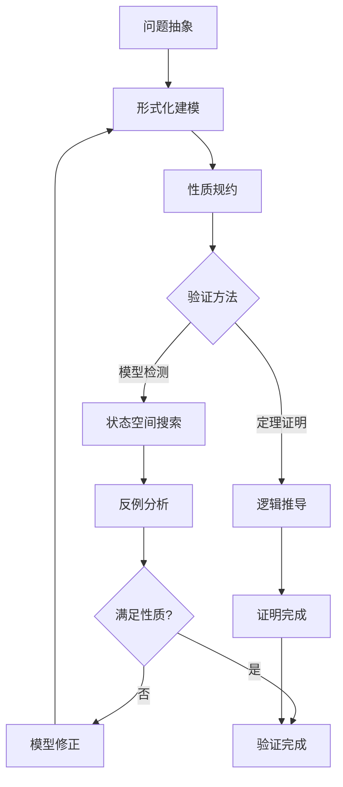
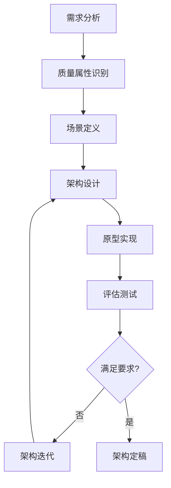

> **状态**: 🔮 前瞻内容 | **风险等级**: 高 | **最后更新**: 2026-04
> 
> 此文档描述的内容处于早期规划阶段，可能与最终实现不符。请以 Apache Flink 官方发布为准。
# CSE 研究与设计实验室

> **形式化等级**: L4-L6 | **研究导向**

## 实验室目录

### 形式化理论研究

| 编号 | 课题 | 难度 | 形式化工具 |
|------|------|------|------------|
| R1.1 | [CSP 建模 Flink 调度器](./research-01-csp-modeling.md) | ★★★★☆ | FDR4 |
| R1.2 | [π-calculus 建模动态扩缩容](./research-02-pi-scaling.md) | ★★★★★ | 手工证明 |
| R2.1 | [会话类型设计流算子](./research-03-operator-session-types.md) | ★★★★★ | 类型检查器 |
| R2.2 | [类型驱动窗口算子设计](./research-04-typed-windows.md) | ★★★★☆ | Coq |
| R3.1 | [一致性协议正确性证明](./research-05-consistency-proof.md) | ★★★★★ | TLA+/Isabelle |
| R3.2 | [Watermark 形式化验证](./research-06-watermark-verification.md) | ★★★★☆ | Coq |
| R4.1 | [TLA+ 规约 Checkpoint 协议](./research-07-tla-checkpoint.md) | ★★★★☆ | TLC |
| R4.2 | [Exactly-Once Sink 正确性验证](./research-08-verify-sink.md) | ★★★★★ | Iris |
| R6.1 | [自适应调度算法设计](./research-09-adaptive-scheduler.md) | ★★★★☆ | 仿真+证明 |
| R6.2 | [状态压缩算法理论分析](./research-10-state-compression.md) | ★★★★★ | 复杂度分析 |

### 架构设计项目

| 编号 | 课题 | 难度 | 产出要求 |
|------|------|------|----------|
| D5.1 | [跨地域多活流平台设计](./design-01-multi-region.md) | ★★★★☆ | 架构文档+原型 |
| D5.2 | [亿级事件处理架构设计](./design-02-billion-scale.md) | ★★★★★ | 架构文档+POC |
| D5.3 | [边缘-云协同流处理架构](./design-03-edge-cloud.md) | ★★★★☆ | 架构文档+Demo |
| D5.4 | [金融级实时风控平台](./design-04-finance-risk.md) | ★★★★★ | 完整系统设计 |

## 研究方法论

### 形式化验证流程



### 架构设计流程



## 工具安装指南

### TLA+ Toolbox

```bash
# macOS
brew install tla-plus-toolbox

# Linux
wget https://github.com/tlaplus/tlaplus/releases/download/v1.7.1/TLAToolbox-1.7.1-linux.gtk.x86_64.zip
unzip TLAToolbox-*.zip
cd toolboox && ./toolbox

# Windows
# 下载安装包后双击安装
```

### FDR4 (CSP 模型检测器)

```bash
# 需要从 Oxford 大学获取许可证
# 学术用途免费
wget https://www.cs.ox.ac.uk/projects/fdr/downloads/fdr4-xxx-linux.zip
```

### Coq

```bash
# macOS
brew install coq

# Ubuntu
sudo apt-get install coq

# 安装 IDE (CoqIDE)
brew install coqide  # macOS
```

### Isabelle/HOL

```bash
# 下载官方发行版
wget https://isabelle.in.tum.de/website-Isabelle2023/dist/Isabelle2023_linux.tar.gz
tar -xzf Isabelle2023_linux.tar.gz
```

## 经典案例

### 案例 1: Raft 共识的形式化验证

**参考**:

- Paper: "Verifying Raft Consensus using TLA+"
- Spec: <https://github.com/ongardie/raft.tla>

**学习要点**:

- 分布式协议建模方法
- 安全性与活性规约
- 模型检测配置

### 案例 2: Flink Checkpoint 协议分析

**参考**:

- `Struct/06-verification/06.01-tla-plus-for-flink.md`
- 官方 TLA+ 规约

**学习要点**:

- Barrier 传播模型
- 一致性保证验证
- 边界条件分析

## 论文写作指南

### 结构模板

```
1. Abstract (200-300 words)
   - Background
   - Problem
   - Method
   - Results
   - Contribution

2. Introduction
   - Motivation
   - Problem Statement
   - Contributions
   - Paper Structure

3. Related Work
   - Existing Solutions
   - Limitations
   - Our Position

4. Method/Design
   - Formal Model
   - Key Algorithms
   - Proof Sketch

5. Evaluation
   - Experimental Setup
   - Results
   - Analysis

6. Discussion
   - Limitations
   - Future Work

7. Conclusion

References
```

### 写作工具推荐

- **LaTeX**: 学术论文标准格式

  ```bash
  # 推荐模板: IEEEtran, ACM sigconf
  ```

- **Overleaf**: 在线协作写作
- **Zotero**: 文献管理

## 评审标准

### 形式化研究评审

| 维度 | 权重 | 标准 |
|------|------|------|
| 建模准确性 | 25% | 模型忠实反映现实系统 |
| 形式化严谨性 | 25% | 定义清晰，推理正确 |
| 创新性 | 20% | 有新见解或方法 |
| 验证完整性 | 20% | 覆盖关键性质 |
| 表达清晰 | 10% | 易于理解 |

### 架构设计评审

| 维度 | 权重 | 标准 |
|------|------|------|
| 需求满足 | 20% | 解决核心问题 |
| 架构合理性 | 25% | 设计决策有依据 |
| 技术深度 | 25% | 深入关键技术 |
| 可落地性 | 20% | 可以工程实现 |
| 表达清晰 | 10% | 文档结构合理 |

## 资源推荐

### 在线课程

- **Berkeley CS262A**: Advanced Topics in Computer Systems
- **CMU 15-712**: Advanced Operating Systems
- **MIT 6.826**: Principles of Computer Systems

### 经典书籍

1. **《Communication and Concurrency》** - Robin Milner
2. **《Specifying Systems》** - Leslie Lamport
3. **《Types and Programming Languages》** - Benjamin Pierce
4. **《The Art of Multiprocessor Programming》** - Herlihy & Shavit

### 会议与期刊

- **形式化方法**: CAV, TACAS, FMCAD, POPL
- **分布式系统**: PODC, DISC, OSDI, SOSP
- **流计算**: VLDB, SIGMOD, ICDE

---

[返回课程大纲 →](../syllabus-cse.md)
