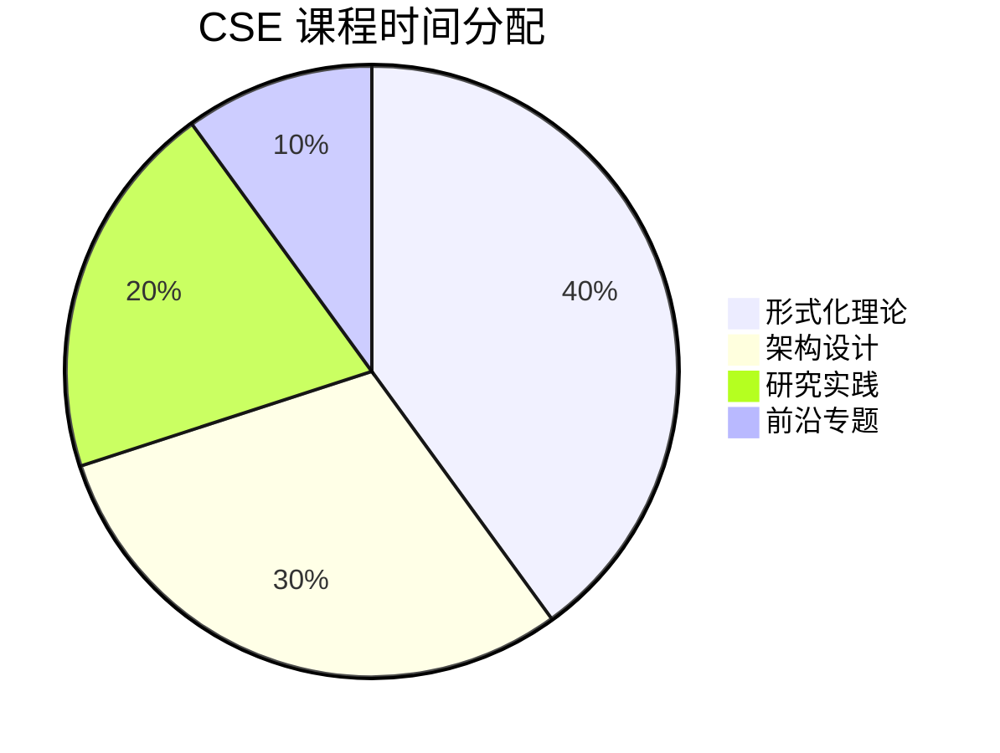

# CSE 认证课程大纲

> **版本**: v1.0 | **生效日期**: 2026-04-08 | **形式化等级**: L4-L6
>
> **Certified Streaming Expert** | 流计算认证专家

## 1. 课程目标

完成本课程后，学员将能够：

1. 掌握流计算形式化理论（进程演算、类型系统、一致性模型）
2. 进行流计算系统的形式化建模与验证
3. 设计大规模流计算架构并解决复杂技术挑战
4. 开展流计算领域的原创性研究
5. 指导团队进行技术决策和创新

## 2. 前置要求

### 2.1 认证前置（满足其一）

- 持有有效的 CSP 认证
- 通过 CSE 经验认证（3年以上流计算架构经验 + 技术成果）

### 2.2 知识基础

- 扎实的离散数学基础（集合论、逻辑、图论）
- 熟悉至少一种进程演算（CCS、CSP、π-calculus）
- 掌握基础类型理论
- 具备分布式系统深度实践经验

## 3. 课程结构

**总时长**: 120小时（建议 12-16 周完成）

**模块分布**:

- 形式化理论: 48 小时（40%）
- 架构设计: 36 小时（30%）
- 研究实践: 24 小时（20%）
- 前沿专题: 12 小时（10%）

## 4. 模块详解

### 模块 1: 进程演算与并发理论 (20小时)

**学习目标**: 掌握流计算系统的形式化建模基础

**核心内容**:

1. **CCS (Calculus of Communicating Systems)**
   - 语法与语义（Milner 经典理论）
   - 强模拟与弱模拟（Bisimulation）
   - 互模拟等价性判定
   - Hennessy-Milner 逻辑

2. **CSP (Communicating Sequential Processes)**
   - 迹语义（Trace Semantics）
   - 失败语义（Failures Semantics）
   - 精化关系（Refinement）
   - FDR 模型检测工具

3. **π-calculus**
   - 移动性理论（Mobility）
   - 名称传递与拓扑变化
   - 异步 π-calculus
   - 流计算系统的 π-calculus 建模

**必读文档**:

- `Struct/01-foundations/01.01-process-calculus-intro.md`
- `Struct/01-foundations/01.02-actor-vs-process-calculus.md`
- `Knowledge/01-concept-atlas/formal-methods-map.md`

**延伸阅读**:

- R. Milner, "Communication and Concurrency" (1989)
- C.A.R. Hoare, "Communicating Sequential Processes" (1985)
- R. Milner, "The Polyadic π-calculus: A Tutorial"

**研究任务**:

- Research 1.1: 用 CSP 建模 Flink 调度器
- Research 1.2: π-calculus 建模动态扩缩容

---

### 模块 2: 类型理论与会话类型 (20小时)

**学习目标**: 掌握流计算系统的类型安全保证

**核心内容**:

1. **λ-calculus 与类型系统基础**
   - 简单类型 λ-calculus
   - 多态与 System F
   - 依赖类型简介

2. **会话类型（Session Types）**
   - 二元会话类型
   - 多线程会话类型（Multiparty Session Types）
   - 递归与选择
   - 会话类型的类型检查

3. **流计算的类型安全**
   - 数据流的类型系统
   - 时态类型（Temporal Types）
   - 资源敏感的类型系统

**必读文档**:

- `Struct/01-foundations/01.03-session-types-for-streaming.md`
- `Struct/01-foundations/01.04-linear-types-state-management.md`
- `Knowledge/03-language-guides/scala-type-system-deep-dive.md`

**延伸阅读**:

- K. Honda, "Session Types: A Historical Perspective"
- P. Wadler, "Propositions as Sessions"
- F. Pfenning et al., "Session-Typed Concurrent Programming"

**研究任务**:

- Research 2.1: 为流算子设计会话类型
- Research 2.2: 类型驱动的窗口算子设计

---

### 模块 3: 一致性模型与形式化语义 (20小时)

**学习目标**: 严格理解流计算一致性保证

**核心内容**:

1. **一致性层次理论**
   - 严格序（Strict Serializability）
   - 线性一致性（Linearizability）
   - 顺序一致性（Sequential Consistency）
   - 因果一致性（Causal Consistency）
   - 最终一致性（Eventual Consistency）

2. **流计算语义**
   - Dataflow 模型语义
   - 时间推理的形式化
   - Watermark 的数学性质
   - 乱序处理的形式化

3. **Exactly-Once 形式化**
   - 幂等性的代数定义
   - 事务的形式化模型
   - 2PC 的正确性证明

**必读文档**:

- `Struct/02-properties/02.01-exactly-once-semantics.md`
- `Struct/02-properties/02.02-consistency-hierarchy.md`
- `Struct/02-properties/02.03-watermark-monotonicity.md`
- `Struct/03-models/03.01-dataflow-model-formalization.md`

**定理清单**:

- Thm-S-02-01: Exactly-Once 等价于幂等性 + 至少一次
- Thm-S-02-02: Watermark 单调性保证窗口计算的完整性
- Thm-S-02-03: 在因果一致性下，乱序数据可以被正确归并

**研究任务**:

- Research 3.1: 证明自定义一致性协议的正确性
- Research 3.2: Watermark 策略的形式化验证

---

### 模块 4: 形式化验证方法 (20小时)

**学习目标**: 掌握流计算系统的验证技术

**核心内容**:

1. **TLA+ 规约与验证**
   - TLA+ 基础语法
   - 状态机规约
   - 不变式与活性属性
   - TLC 模型检查器

2. **模型检测技术**
   - LTL/CTL 时序逻辑
   - SPIN/Promela
   - 状态空间爆炸问题
   - 抽象与精化

3. **定理证明工具**
   - Coq/Isabelle/HOL4 简介
   - Iris 框架
   - 并发程序验证

**必读文档**:

- `Struct/06-verification/06.01-tla-plus-for-flink.md`
- `Struct/06-verification/06.02-model-checking-checkpoint.md`
- `Flink/06-formal-verification/flink-tla-specifications.md`

**延伸阅读**:

- L. Lamport, "Specifying Systems"
- M. Herlihy et al., "The Art of Multiprocessor Programming"
- R. Jung et al., "Iris from the Ground Up"

**研究任务**:

- Research 4.1: 用 TLA+ 规约 Checkpoint 协议
- Research 4.2: 验证 Exactly-Once Sink 的正确性

---

### 模块 5: 大规模流架构设计 (20小时)

**学习目标**: 设计企业级流计算平台

**核心内容**:

1. **架构设计方法论**
   - 需求分析框架
   - 质量属性驱动设计
   - 架构权衡分析方法（ATAM）
   - 技术选型决策树

2. **高可用架构模式**
   - 多活架构设计
   - 故障域隔离
   - 优雅降级策略
   - 灾难恢复规划

3. **性能架构**
   - 容量规划方法论
   - 负载均衡策略
   - 数据分区与路由
   - 缓存与加速层设计

**必读文档**:

- `Knowledge/05-architecture-patterns/`
- `DEPLOYMENT-ARCHITECTURES.md`
- `Knowledge/04-technology-selection/engine-selection-guide.md`

**案例研究**:

- LinkedIn Brooklin 架构
- Uber AthenaX 平台
- Netflix Keystone 管道

**设计任务**:

- Design 5.1: 设计跨地域多活流平台
- Design 5.2: 设计每秒亿级事件处理架构

---

### 模块 6: 高级调优与优化理论 (16小时)

**学习目标**: 从理论角度理解和优化系统

**核心内容**:

1. **调度理论**
   - 作业调度算法
   - 资源分配优化
   - 在线算法与竞争比
   - 流量整形理论

2. **数据流优化**
   - 算子融合与拆分
   - 谓词下推理论
   - 增量计算理论
   - 物化视图维护

3. **状态优化**
   - 状态访问模式分析
   - 压缩算法选择
   - 冷热分层策略
   - 状态迁移算法

**必读文档**:

- `Flink/05-internals/scheduler-optimization.md`
- `Flink/02-core/large-state-optimization.md`
- `Knowledge/02-design-patterns/pattern-incremental-computation.md`

**研究任务**:

- Research 6.1: 设计自适应调度算法
- Research 6.2: 状态压缩算法的理论分析

---

## 5. 认证项目

### 项目要求

CSE 认证要求完成以下三部分：

#### 5.1 架构设计项目 (40%)

**要求**:

- 设计一个大规模流计算平台架构
- 解决至少三个复杂技术挑战
- 产出: 架构文档 + 原型实现

**选题示例**:

1. **实时 AI 推理平台**: 支持模型动态更新、A/B 测试、特征实时计算
2. **金融风控中台**: 毫秒级延迟、高可用、复杂规则引擎
3. **IoT 边缘流处理**: 边云协同、离线容灾、海量设备接入

#### 5.2 技术论文 (40%)

**要求**:

- 字数: 3000-5000 字
- 内容: 原创技术研究成果或深度技术分析
- 需通过技术评审

**选题方向**:

- 形式化验证在流计算中的应用
- 新型一致性协议设计
- 性能优化理论分析
- 架构模式创新

#### 5.3 技术答辩 (20%)

**要求**:

- 30 分钟答辩（20分钟陈述 + 10分钟问答）
- 答辩委员会: 3位认证专家
- 评分维度: 技术深度、表达能力、问题应对

### 项目时间表

| 阶段 | 时长 | 产出 |
|------|------|------|
| 选题开题 | 1周 | 开题报告 |
| 架构设计 | 3周 | 架构文档 |
| 原型实现 | 4周 | 可运行系统 |
| 论文撰写 | 2周 | 技术论文 |
| 答辩准备 | 1周 | 答辩 PPT |
| 正式答辩 | 1天 | 评审结果 |

## 6. 学习资源清单

### 必读形式化文档

| 优先级 | 文档路径 | 难度 |
|--------|----------|------|
| P0 | `Struct/01-foundations/` 全目录 | L4-L6 |
| P0 | `Struct/02-properties/` 全目录 | L4-L5 |
| P1 | `Struct/06-verification/` 全目录 | L5-L6 |
| P2 | `Struct/03-models/` 全目录 | L5-L6 |

### 经典论文

1. **进程演算**:
   - Milner, "A Calculus of Communicating Systems" (1980)
   - Hoare, "Communicating Sequential Processes" (1978)

2. **流计算模型**:
   - Akidau et al., "The Dataflow Model" (VLDB 2015)
   - Akidau et al., "Streaming Systems" (Book)

3. **一致性理论**:
   - Herlihy & Wing, "Linearizability: A Correctness Condition" (1990)
   - Burckhardt, "Principles of Eventual Consistency" (2014)

4. **形式化验证**:
   - Lamport, "The Temporal Logic of Actions" (1994)
   - Jung et al., "Iris: Monoids and Invariants" (2015)

### 在线课程

- **MIT 6.006**: Introduction to Algorithms
- **CMU 15-712**: Advanced Operating Systems
- **Stanford CS240**: Advanced Topics in Operating Systems

## 7. 评估标准

### 7.1 架构设计评分

| 维度 | 权重 | 标准 |
|------|------|------|
| 问题分析 | 15% | 准确识别核心挑战 |
| 方案创新 | 25% | 有独特见解和创新 |
| 技术深度 | 25% | 理论支撑充分 |
| 可行性 | 20% | 可落地实施 |
| 表达清晰 | 15% | 文档结构清晰 |

### 7.2 论文评分

| 维度 | 权重 | 标准 |
|------|------|------|
| 创新性 | 30% | 原创贡献或深度洞察 |
| 技术准确性 | 25% | 理论正确，论证严谨 |
| 完整性 | 20% | 问题-方法-结果完整 |
| 写作质量 | 15% | 表达清晰，结构合理 |
| 引用规范 | 10% | 引用恰当，格式规范 |

### 7.3 答辩评分

| 维度 | 权重 | 标准 |
|------|------|------|
| 技术深度 | 40% | 回答准确，见解深刻 |
| 表达能力 | 30% | 逻辑清晰，表达流畅 |
| 应变能力 | 20% | 应对问题从容 |
| 时间控制 | 10% | 节奏得当 |

## 8. 导师制度

CSE 认证采用导师制，每位学员配备一位认证导师：

**导师职责**:

- 指导选题方向
- 定期 review 进展
- 把关论文质量
- 答辩准备辅导

**学员权利**:

- 8小时一对一辅导
- 邮件/即时通讯答疑
- 代码 review 服务

## 9. 认证价值

### 9.1 职业定位

| 角色 | 年薪范围 | CSE 价值 |
|------|----------|----------|
| 流计算架构师 | 60-100万 | 核心资质认证 |
| 技术专家 | 80-150万 | 技术领导力证明 |
| 研究员 | 50-200万 | 研究能力认可 |

### 9.2 行业认可

- 阿里巴巴、字节跳动等企业专家职级认定
- 开源社区 Committer/Maintainer 申请加分
- 技术大会演讲嘉宾资质

---

[返回认证首页 →](../README.md) | [查看考试说明 →](./exam-guide-cse.md)
