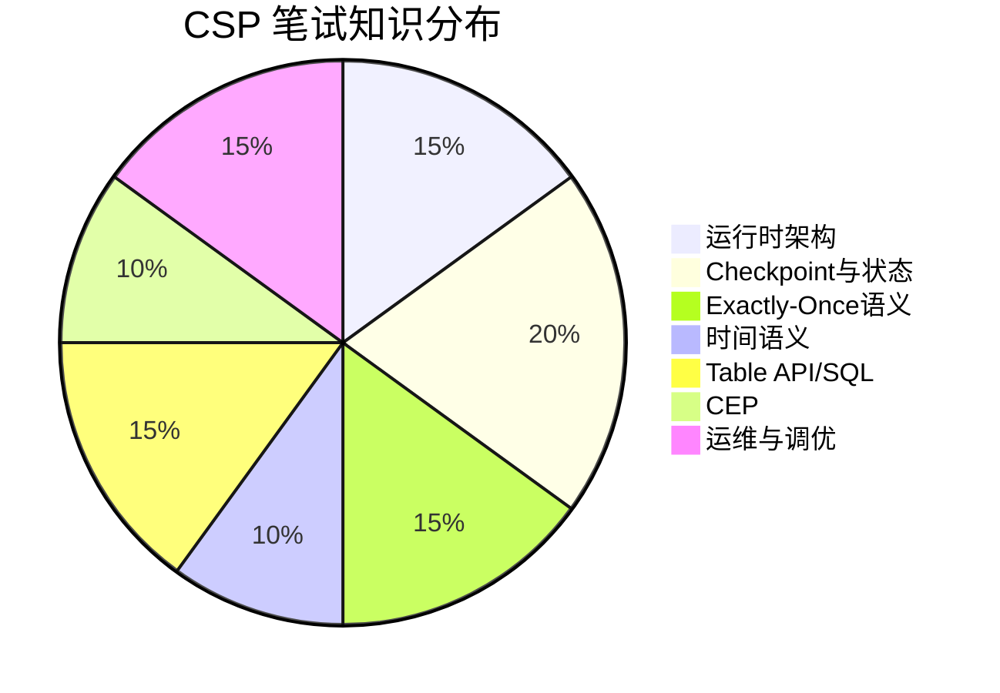
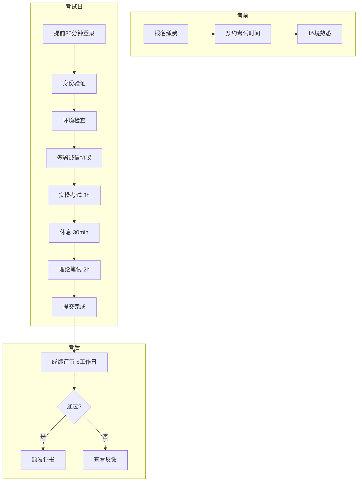

# CSP 认证考试说明

> **版本**: v1.0 | **生效日期**: 2026-04-08
>
> **Certified Streaming Professional Exam Guide**

## 1. 考试概述

| 项目 | 说明 |
|------|------|
| **考试名称** | CSP - Certified Streaming Professional |
| **考试代码** | CSP-FLINK-001 |
| **考试形式** | 实操 + 笔试 |
| **考试时长** | 实操 3h + 笔试 2h（共 5h） |
| **及格分数** | 实操 70% + 笔试 70%（双及格） |
| **考试费用** | ¥899 / $149 |
| **有效期** | 3 年 |

## 2. 前置条件

满足以下任一条件：

- 持有有效的 CSA 认证
- 通过 CSP 经验认证（1年以上流计算项目经验）

## 3. 实操考试

### 3.1 考试形式

- **环境**: 云端 Kubernetes 集群
- **工具**: Flink 1.18、Kafka、MySQL、Redis
- **监控**: 全程录屏，远程监考

### 3.2 考试任务

**场景**: 构建实时用户行为分析系统

**任务清单**:

| 任务 | 权重 | 要求 |
|------|------|------|
| T1: 环境搭建 | 10% | 部署 Flink Session 集群 |
| T2: 数据接入 | 15% | Kafka Source 配置与消费 |
| T3: 实时计算 | 35% | 实现 PV/UV 统计、用户路径分析 |
| T4: 状态管理 | 20% | 使用 Keyed State 实现会话统计 |
| T5: Exactly-Once | 10% | 端到端一致性保证 |
| T6: 监控配置 | 10% | Metrics 上报与告警 |

### 3.3 评分标准

**功能性 (40%)**:

- 所有功能正常运行
- 结果准确无误

**代码质量 (30%)**:

- 结构清晰，可读性强
- 异常处理完善
- 配置外部化

**性能 (20%)**:

- 吞吐达标 (≥ 1000 events/s)
- 延迟可控 (≤ 5s)

**文档 (10%)**:

- README 完整
- 设计说明清晰

## 4. 理论笔试

### 4.1 题型分布

| 题型 | 题数 | 分值 | 内容 |
|------|------|------|------|
| 单选题 | 30 | 30分 | 核心机制、API使用 |
| 多选题 | 15 | 30分 | 选型、架构设计 |
| 简答题 | 5 | 25分 | 原理阐述 |
| 案例分析 | 1 | 15分 | 故障诊断与优化 |

### 4.2 知识领域分布



### 4.3 样题示例

**简答题示例**:

```
Q: 请阐述 Flink Checkpoint 的完整流程,包括 Barrier 注入、
   对齐、快照制作的详细过程,以及可能失败的原因。

评分要点:
- Barrier 注入机制 (4分)
- 对齐过程描述 (4分)
- 同步/异步快照 (4分)
- Checkpoint 失败原因 (3分)
```

**案例分析示例**:

```
场景: 某 Flink 作业在运行 2 小时后开始出现 Checkpoint 超时,
      最终失败。作业状态大小约 50GB,使用 RocksDBStateBackend。

问题:
1. 分析可能的原因 (5分)
2. 给出诊断步骤 (5分)
3. 提出优化方案 (5分)
```

## 5. 考试流程



## 6. 备考资源

### 6.1 推荐学习路径

1. **系统学习** (6-8周)
   - 完成全部 10 个模块
   - 每模块完成实验任务

2. **专项训练** (2周)
   - [练习题库](./quizzes/) 500+ 题目
   - 3套模拟实操环境

3. **冲刺阶段** (1周)
   - 复习错题
   - 模拟考试

### 6.2 实验环境

考生可申请免费实验环境（有效期7天）：

- K8s 集群访问权限
- 预装 Flink、Kafka、MySQL
- 监控套件（Prometheus + Grafana）

申请方式: <https://labs.analysisdataflow.org/csp>

## 7. 重考政策

| 情况 | 费用 | 间隔 | 次数 |
|------|------|------|------|
| 首次未通过 | 免费 | 14天 | 1次 |
| 后续重考 | ¥500/$79 | 30天 | 不限 |

**部分通过政策**:

- 实操通过 + 笔试未通过: 只需重考笔试
- 实操未通过 + 笔试通过: 需全部重考

## 8. 证书与续期

### 8.1 证书样式

```
┌─────────────────────────────────────────────────────────────┐
│                                                             │
│          AnalysisDataFlow 认证体系                          │
│                                                             │
│                    ★ CSP ★                                 │
│                                                             │
│              Certified Streaming Professional               │
│                                                             │
│                   流计算认证专业人员                         │
│                                                             │
│    此证书授予                                                 │
│                                                             │
│                    [学员姓名]                                │
│                                                             │
│    通过 CSP 认证考试,证明其具备:                           │
│    • Flink 核心机制深度理解                                  │
│    • 生产级系统开发能力                                      │
│    • 性能调优与故障排查能力                                  │
│                                                             │
│    证书编号: CSP-2026-XXXXX                                  │
│    颁发日期: 2026年5月15日                                   │
│    有效期至: 2029年5月15日                                   │
│                                                             │
└─────────────────────────────────────────────────────────────┘
```

### 8.2 续期要求

证书到期前 6 个月内，完成以下任一方式：

**方式 A: 继续教育**

- 完成 30 学分继续教育课程
- 学分获取途径：
  - 官方培训课程（10学分/门）
  - Flink Forward 等技术大会（5学分/次）
  - 开源贡献（5-15学分）

**方式 B: 重新考试**

- 通过 CSP 重认证考试（简化版，仅笔试）
- 费用: ¥300 / $49

## 9. 常见问题

**Q1: 实操考试可以使用自己的 IDE 吗？**

可以。通过浏览器访问云端环境，支持 VS Code 在线版或 SSH 连接使用自己的 IDE。

**Q2: 实操考试允许查阅文档吗？**

允许查阅 Flink 官方文档，但禁止使用 AI 辅助编程、通讯工具或搜索引擎。

**Q3: 考试期间断网怎么办？**

系统每 5 分钟自动保存进度。断网后 5 分钟内可重新连接继续考试，超过则视为放弃。

**Q4: 可以只考笔试不考实操吗？**

不可以。CSP 认证要求实操和笔试双及格，缺少任何一部分都无法获得证书。

---

[返回课程大纲 →](./syllabus-csp.md) | [返回认证首页 →](../README.md)
