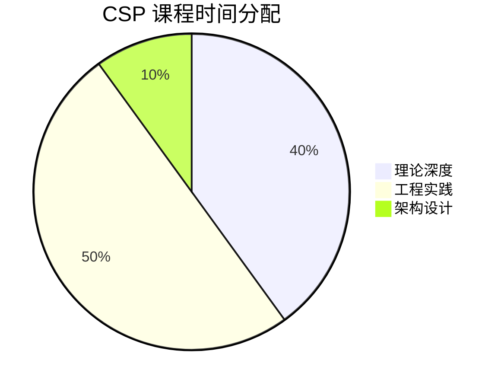

# CSP 认证课程大纲

> **版本**: v1.0 | **生效日期**: 2026-04-08 | **形式化等级**: L3-L4
>
> **Certified Streaming Professional** | 流计算认证专业人员

## 1. 课程目标

完成本课程后，学员将能够：

1. 深入理解 Flink 核心机制（Checkpoint、State、Watermark、Exactly-Once）
2. 设计和实现生产级流处理系统
3. 进行性能调优和故障诊断
4. 完成技术选型和架构设计
5. 掌握流计算最佳实践和反模式

## 2. 前置要求

### 2.1 认证前置（满足其一）

- 持有 CSA 认证
- 通过 CSP 经验认证（1年以上流计算项目经验）

### 2.2 知识基础

- 扎实的 Java/Scala 编程能力
- 熟悉 Linux 系统运维
- 了解分布式系统基础概念
- 掌握 Kafka 等消息队列使用

## 3. 课程结构

**总时长**: 80小时（建议 8-10 周完成）

**模块分布**:

- 理论深度: 32 小时（40%）
- 工程实践: 40 小时（50%）
- 架构设计: 8 小时（10%）

## 4. 模块详解

### 模块 1: Flink 运行时架构深度解析 (8小时)

**学习目标**: 深入理解 Flink 内部运行机制

**核心内容**:

1. **作业提交与执行流程**
   - Client → JobManager → TaskManager 完整链路
   - 作业图转换: StreamGraph → JobGraph → ExecutionGraph
   - 调度策略与拓扑优化

2. **Task 执行模型**
   - Operator Chain 机制与优化
   - Task Slot 与资源分配
   - 背压（Backpressure）传播机制

3. **网络栈与数据传输**
   - Netty 网络通信层
   - 数据序列化与反序列化
   - 信用值流控（Credit-based Flow Control）

**必读文档**:

- `Flink/05-internals/job-submission-flow.md`
- `Flink/05-internals/network-stack-deep-dive.md`
- `Flink/02-core/backpressure-and-flow-control.md`

**实验任务**:

- [Lab 1.1: 作业图分析](./labs/lab-01-jobgraph-analysis.md)
- [Lab 1.2: 背压诊断与优化](./labs/lab-02-backpressure-tuning.md)

---

### 模块 2: Checkpoint 与状态后端 (8小时)

**学习目标**: 掌握 Checkpoint 机制和状态后端选型

**核心内容**:

1. **Checkpoint 机制深度解析**
   - Barrier 注入与对齐
   - 同步阶段与异步阶段
   - 增量 Checkpoint 原理
   - 非对齐 Checkpoint（Unaligned Checkpoint）

2. **状态后端对比与选型**
   - MemoryStateBackend: 适用场景与限制
   - FsStateBackend: 配置与优化
   - RocksDBStateBackend: 深入原理与调优
   - 增量 Checkpoint 配置

3. **Savepoint 管理**
   - Savepoint 与 Checkpoint 区别
   - 触发与恢复流程
   - 状态迁移与升级

**必读文档**:

- `Flink/02-core/checkpoint-mechanism-deep-dive.md`
- `Flink/08-operations/state-backends-configuration.md`
- `Knowledge/04-technology-selection/state-backend-selection-guide.md`

**实验任务**:

- [Lab 2.1: 状态后端性能对比](./labs/lab-03-state-backend-benchmark.md)
- [Lab 2.2: Checkpoint 调优实战](./labs/lab-04-checkpoint-tuning.md)

---

### 模块 3: Exactly-Once 语义保证 (8小时)

**学习目标**: 理解并实现端到端 Exactly-Once

**核心内容**:

1. **一致性语义理论**
   - At-Most-Once、At-Least-Once、Exactly-Once 定义
   - 端到端一致性挑战
   - 幂等性与事务性写入

2. **Flink Two-Phase Commit**
   - 2PC 协议在 Flink 中的实现
   - PreCommit 与 Commit 阶段
   - Kafka Sink 的 Exactly-Once 实现

3. **外部系统集成**
   - 幂等性 Sink 设计（Elasticsearch、Redis）
   - 事务性 Sink 实现（JDBC、Kafka）
   - 自定义 TwoPhaseCommitSinkFunction

**必读文档**:

- `Flink/02-core/exactly-once-semantics-deep-dive.md`
- `Struct/02-properties/02.01-exactly-once-semantics.md`
- `Knowledge/02-design-patterns/pattern-exactly-once-sink.md`

**实验任务**:

- [Lab 3.1: 端到端 Exactly-Once 实现](./labs/lab-05-exactly-once.md)
- [Lab 3.2: 故障场景测试](./labs/lab-06-fault-tolerance-test.md)

---

### 模块 4: Watermark 与时间处理高级主题 (8小时)

**学习目标**: 掌握复杂时间处理场景

**核心内容**:

1. **Watermark 策略**
   - 定期生成 vs 每事件生成
   - 空闲数据源处理（Idleness）
   - Watermark 对齐与多流处理

2. **延迟数据处理**
   - Allowed Lateness 机制
   - 侧输出流（Side Output）收集延迟数据
   - 延迟数据补全策略

3. **复杂时间模式**
   - 基于 ProcessFunction 的灵活计时
   - 注册定时器（Timer）
   - 状态与时间结合的计算

**必读文档**:

- `Flink/02-core/time-semantics-and-watermark.md`
- `Struct/02-properties/02.03-watermark-monotonicity.md`
- `Knowledge/02-design-patterns/pattern-late-data-handling.md`

**实验任务**:

- [Lab 4.1: 自定义 Watermark 生成器](./labs/lab-07-custom-watermark.md)
- [Lab 4.2: 复杂时间窗口实现](./labs/lab-08-complex-time-windows.md)

---

### 模块 5: 状态管理高级特性 (8小时)

**学习目标**: 掌握复杂状态计算与优化

**核心内容**:

1. **Keyed State 高级应用**
   - 状态类型选择策略
   - 状态过期与清理（TTL、Cleanup）
   - 大状态优化（State Partitioning）

2. **Operator State 与 Broadcast State**
   - ListState 与 UnionListState
   - Broadcast Stream 模式
   - 动态配置更新场景

3. **Queryable State**
   - 配置与启用
   - 查询客户端实现
   - 适用场景与限制

**必读文档**:

- `Flink/02-core/state-management-overview.md`
- `Flink/02-core/large-state-optimization.md`
- `Knowledge/02-design-patterns/pattern-broadcast-state.md`

**实验任务**:

- [Lab 5.1: 大状态优化实践](./labs/lab-09-large-state.md)
- [Lab 5.2: Broadcast State 配置中心](./labs/lab-10-broadcast-config.md)

---

### 模块 6: Table API 与 SQL 高级特性 (8小时)

**学习目标**: 掌握 Flink SQL 生产实践

**核心内容**:

1. **SQL 优化与执行计划**
   - 执行计划分析（EXPLAIN）
   - 优化器规则与提示（Hint）
   - 子查询优化

2. **时态表（Temporal Table）**
   - 时态表 Join
   - 版本表与版本视图
   - Lookup Cache 优化

3. **CDC 与数据同步**
   - MySQL CDC Connector
   - Schema 变更处理
   - 数据一致性保证

**必读文档**:

- `Flink/04-ecosystem/table-api-sql-basics.md`
- `Flink/04-ecosystem/sql-optimization-guide.md`
- `Flink/04-ecosystem/cdc-connectors-guide.md`

**实验任务**:

- [Lab 6.1: SQL 执行计划分析](./labs/lab-11-sql-plan.md)
- [Lab 6.2: CDC 实时同步](./labs/lab-12-cdc-sync.md)

---

### 模块 7: CEP 复杂事件处理 (8小时)

**学习目标**: 掌握模式匹配与复杂事件检测

**核心内容**:

1. **CEP 基础**
   - Pattern API 详解
   - 量词与条件（Next/FollowedBy）
   - 时间约束（Within）

2. **复杂模式定义**
   - 迭代模式（Looping）
   - 组合模式
   - 超时处理

3. **生产实践**
   - 模式动态更新
   - 性能优化策略
   - 典型应用场景（风控、营销）

**必读文档**:

- `Flink/03-apis/cep-pattern-api.md`
- `Flink/07-case-studies/case-fraud-detection.md`
- `Knowledge/02-design-patterns/pattern-cep-detection.md`

**实验任务**:

- [Lab 7.1: 登录异常检测](./labs/lab-13-login-anomaly.md)
- [Lab 7.2: 营销路径分析](./labs/lab-14-marketing-path.md)

---

### 模块 8: 生产部署与运维 (8小时)

**学习目标**: 掌握生产环境部署与运维

**核心内容**:

1. **部署模式详解**
   - Standalone 集群部署
   - YARN/Mesos 集成
   - Kubernetes Native 部署

2. **资源配置与调优**
   - Slot 与并行度规划
   - JVM 参数优化
   - 内存配置（Managed/Network/JVM Heap）

3. **监控与告警**
   - Metrics 体系与配置
   - 集成 Prometheus/Grafana
   - 关键指标与告警策略

**必读文档**:

- `Flink/08-operations/deployment-overview.md`
- `Flink/08-operations/production-checklist.md`
- `Flink/08-operations/monitoring-basics.md`

**实验任务**:

- [Lab 8.1: K8s 部署实战](./labs/lab-15-k8s-deployment.md)
- [Lab 8.2: 监控告警配置](./labs/lab-16-monitoring-setup.md)

---

### 模块 9: 性能调优与问题诊断 (8小时)

**学习目标**: 掌握性能优化和故障排查

**核心内容**:

1. **性能分析工具**
   - Flink Web UI 深度使用
   - Flame Graph 火焰图分析
   - JFR/JMC 性能剖析

2. **常见性能问题**
   - 数据倾斜识别与解决
   - 序列化瓶颈优化
   - 网络缓冲区调优

3. **故障诊断流程**
   - Checkpoint 失败排查
   - OOM 问题分析
   - 作业重启根因定位

**必读文档**:

- `Knowledge/09-anti-patterns/` 全目录
- `Flink/08-operations/performance-tuning-guide.md`
- `TROUBLESHOOTING.md`（相关章节）

**实验任务**:

- [Lab 9.1: 数据倾斜优化](./labs/lab-17-skew-optimization.md)
- [Lab 9.2: 故障排查演练](./labs/lab-18-troubleshooting.md)

---

### 模块 10: 设计模式与最佳实践 (8小时)

**学习目标**: 掌握流计算设计模式

**核心内容**:

1. **常用设计模式**
   - 异步 IO 模式
   - 旁路缓存模式
   - 双流 Join 模式

2. **反模式识别**
   - 常见设计陷阱
   - 性能误区
   - 可靠性隐患

3. **技术选型**
   - Flink vs Spark Streaming vs Kafka Streams
   - 存储选型（状态后端、结果存储）
   - 架构模式选择

**必读文档**:

- `Knowledge/02-design-patterns/` 全目录
- `Knowledge/09-anti-patterns/` 全目录
- `Knowledge/04-technology-selection/engine-selection-guide.md`

**实验任务**:

- [Lab 10.1: 异步 IO 优化](./labs/lab-19-async-io.md)
- [Lab 10.2: 综合架构设计](./labs/lab-20-architecture-design.md)

---

## 5. 综合项目

### 项目: 实时电商数据中台

**项目描述**: 为大型电商平台构建完整的实时数据处理中台

**业务需求**:

1. **实时看板**
   - GMV 实时统计（分地域/品类/渠道）
   - 订单量/支付量实时监控
   - 库存预警实时推送

2. **用户行为分析**
   - 实时 UV/PV 统计
   - 用户路径分析（CEP）
   - 实时推荐特征计算

3. **风控系统**
   - 异常交易检测
   - 刷单识别
   - 反欺诈规则引擎

**技术要求**:

- 使用 Flink SQL + DataStream 混合开发
- Kafka 作为数据源，MySQL/Redis/HBase 作为存储
- 实现端到端 Exactly-Once
- 支持水平扩展和故障恢复
- 完善的监控告警体系

**评分维度**:

| 维度 | 权重 | 要求 |
|------|------|------|
| 功能完整性 | 30% | 实现所有核心功能 |
| 架构合理性 | 25% | 设计清晰，扩展性好 |
| 代码质量 | 20% | 规范、可维护 |
| 性能表现 | 15% | 吞吐达标，延迟可控 |
| 文档完整 | 10% | 设计文档、运维手册 |

---

## 6. 学习资源清单

### 必读文档

| 优先级 | 文档路径 | 预计阅读 |
|--------|----------|----------|
| P0 | `Flink/02-core/checkpoint-mechanism-deep-dive.md` | 2h |
| P0 | `Flink/02-core/exactly-once-semantics-deep-dive.md` | 2h |
| P0 | `Flink/05-internals/job-submission-flow.md` | 1.5h |
| P1 | `Knowledge/02-design-patterns/` | 3h |
| P1 | `Knowledge/09-anti-patterns/` | 2h |
| P2 | `Struct/02-properties/02.01-exactly-once-semantics.md` | 2h |

### 推荐书籍

- 《Streaming Systems》第 5-8 章
- 《Apache Flink实战》第 6-12 章
- 《Designing Data-Intensive Applications》第 11 章

---

## 7. 评估标准

### 7.1 考试形式

| 部分 | 形式 | 时长 | 权重 |
|------|------|------|------|
| 实操考试 | 在线编程，完成系统开发 | 3小时 | 50% |
| 理论笔试 | 选择+简答+案例分析 | 2小时 | 50% |

### 7.2 通过标准

- 实操考试 ≥ 70 分
- 理论笔试 ≥ 70 分
- 两部分同时及格

---

[返回认证首页 →](../README.md) | [查看考试说明 →](./exam-guide-csp.md)

