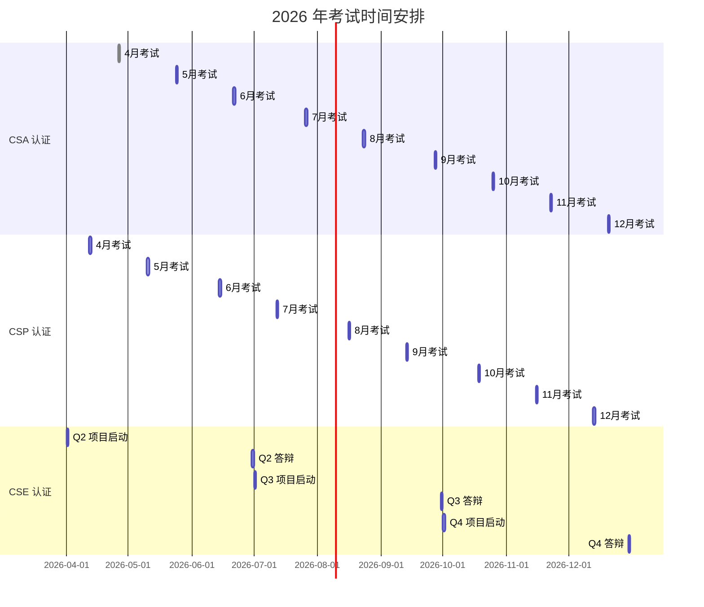

# 2026 年考试时间表

> **版本**: v1.0 | **生效日期**: 2026-04-08
> **更新周期**: 每季度更新

## 1. 考试日历概览

## 2. CSA 认证时间表

CSA 认证每月举办一次，周日进行。

| 考试日期 | 报名截止 | 成绩发布 | 考位限制 |
|----------|----------|----------|----------|
| 2026-04-27 | 2026-04-20 | 即时 | 200人 |
| 2026-05-25 | 2026-05-18 | 即时 | 200人 |
| 2026-06-22 | 2026-06-15 | 即时 | 200人 |
| 2026-07-27 | 2026-07-20 | 即时 | 200人 |
| 2026-08-24 | 2026-08-17 | 即时 | 200人 |
| 2026-09-28 | 2026-09-21 | 即时 | 200人 |
| 2026-10-26 | 2026-10-19 | 即时 | 200人 |
| 2026-11-23 | 2026-11-16 | 即时 | 200人 |
| 2026-12-21 | 2026-12-14 | 即时 | 200人 |

**考试时段选择**（每场选其一）：

- 上午场: 09:00 - 10:30
- 下午场: 14:00 - 15:30
- 晚场: 20:00 - 21:30

## 3. CSP 认证时间表

CSP 认证每月举办一次，周六进行。

| 考试日期 | 报名截止 | 实操时段 | 笔试时段 | 成绩发布 |
|----------|----------|----------|----------|----------|
| 2026-04-12 | 2026-03-29 | 09:00-12:00 | 14:00-16:00 | 5工作日后 |
| 2026-05-10 | 2026-04-26 | 09:00-12:00 | 14:00-16:00 | 5工作日后 |
| 2026-06-14 | 2026-05-31 | 09:00-12:00 | 14:00-16:00 | 5工作日后 |
| 2026-07-12 | 2026-06-28 | 09:00-12:00 | 14:00-16:00 | 5工作日后 |
| 2026-08-16 | 2026-08-02 | 09:00-12:00 | 14:00-16:00 | 5工作日后 |
| 2026-09-13 | 2026-08-30 | 09:00-12:00 | 14:00-16:00 | 5工作日后 |
| 2026-10-18 | 2026-10-04 | 09:00-12:00 | 14:00-16:00 | 5工作日后 |
| 2026-11-15 | 2026-11-01 | 09:00-12:00 | 14:00-16:00 | 5工作日后 |
| 2026-12-13 | 2026-11-29 | 09:00-12:00 | 14:00-16:00 | 5工作日后 |

## 4. CSE 认证时间表

CSE 认证按季度进行，每季度一批。

### Q2 批次 (4-6月)

| 阶段 | 日期 | 事项 |
|------|------|------|
| 报名截止 | 2026-03-15 | 资质审核截止 |
| 项目启动 | 2026-04-01 | 分配导师，开始项目 |
| M1 开题 | 2026-04-08 | 提交开题报告 |
| M2 架构 | 2026-04-29 | 提交架构设计文档 |
| M3 原型 | 2026-05-27 | 提交原型系统 |
| M4 完成 | 2026-06-24 | 项目完成，提交论文 |
| 论文初审 | 2026-07-01 | 初审结果反馈 |
| 答辩安排 | 2026-07-08 | 确定答辩时间 |
| 答辩 | 2026-06-28 - 07-04 | 分批进行 |
| 结果公布 | 2026-07-11 | 颁发证书 |

### Q3 批次 (7-9月)

| 阶段 | 日期 | 事项 |
|------|------|------|
| 报名截止 | 2026-06-15 | 资质审核截止 |
| 项目启动 | 2026-07-01 | 分配导师，开始项目 |
| M1 开题 | 2026-07-08 | 提交开题报告 |
| M2 架构 | 2026-07-29 | 提交架构设计文档 |
| M3 原型 | 2026-08-26 | 提交原型系统 |
| M4 完成 | 2026-09-23 | 项目完成，提交论文 |
| 论文初审 | 2026-09-30 | 初审结果反馈 |
| 答辩安排 | 2026-10-07 | 确定答辩时间 |
| 答辩 | 2026-09-27 - 10-03 | 分批进行 |
| 结果公布 | 2026-10-12 | 颁发证书 |

### Q4 批次 (10-12月)

| 阶段 | 日期 | 事项 |
|------|------|------|
| 报名截止 | 2026-09-15 | 资质审核截止 |
| 项目启动 | 2026-10-01 | 分配导师，开始项目 |
| M1 开题 | 2026-10-08 | 提交开题报告 |
| M2 架构 | 2026-10-29 | 提交架构设计文档 |
| M3 原型 | 2026-11-26 | 提交原型系统 |
| M4 完成 | 2026-12-24 | 项目完成，提交论文 |
| 论文初审 | 2026-12-31 | 初审结果反馈 |
| 答辩安排 | 2027-01-07 | 确定答辩时间 |
| 答辩 | 2026-12-28 - 01-03 | 分批进行 |
| 结果公布 | 2027-01-11 | 颁发证书 |

## 5. 特别场次

### 企业专场

为企业提供定制化考试服务：

- 最低人数: 20人
- 预约时间: 提前 1 个月
- 费用: 9折优惠

| 企业 | 日期 | 等级 | 人数 |
|------|------|------|------|
| 待定 | 2026-05-16 | CSA | 30人 |
| 待定 | 2026-08-22 | CSP | 15人 |

### 校园专场

面向高校学生的优惠考试：

- 资格: 在校学生（凭学生证）
- 优惠: 5折优惠
- 场次: 每学期 1 次

| 日期 | 等级 | 地点 |
|------|------|------|
| 2026-06-07 | CSA | 线上 |
| 2026-12-06 | CSA | 线上 |

## 6. 报名与费用

### 6.1 报名方式

1. 官网注册: <[认证系统 - 待部署]>
2. 选择考试等级和日期
3. 填写个人信息
4. 上传证件照和身份证件
5. 在线支付考试费用
6. 收到确认邮件

### 6.2 考试费用

| 等级 | 标准费用 | 学生优惠 | 企业团购(20+) |
|------|----------|----------|---------------|
| CSA | ¥299 / $49 | ¥150 / $25 | ¥269 / $44 |
| CSP | ¥899 / $149 | ¥450 / $75 | ¥809 / $134 |
| CSE | ¥3999 / $599 | - | ¥3599 / $539 |

### 6.3 退费政策

| 取消时间 | 退费比例 |
|----------|----------|
| 开考前 14 天以上 | 100% |
| 开考前 7-14 天 | 70% |
| 开考前 3-7 天 | 50% |
| 开考前 3 天内 | 0% |

## 7. 考试准备清单

### CSA 考前准备

- [ ] 完成 [课程大纲](./csa/syllabus-csa.md) 全部模块
- [ ] 完成 [练习题库](./csa/quizzes/) 至少 200 题
- [ ] 完成 1 套模拟考试（正确率 75%+）
- [ ] 准备好带摄像头的电脑
- [ ] 测试网络连接

### CSP 考前准备

- [ ] 完成 [课程大纲](./csp/syllabus-csp.md) 全部模块
- [ ] 完成所有实验任务
- [ ] 完成 [练习题库](./csp/quizzes/) 至少 300 题
- [ ] 申请实验环境进行练习
- [ ] 熟悉 K8s 基本操作

### CSE 考前准备

- [ ] 完成 [课程大纲](./cse/syllabus-cse.md) 学习
- [ ] 确定研究选题
- [ ] 阅读形式化理论经典文献
- [ ] 准备资质证明材料

## 8. 联系方式

- **报名咨询**: <certification@analysisdataflow.org>
- **技术支持**: <exam-tech@analysisdataflow.org>
- **投诉建议**: <feedback@analysisdataflow.org>
- **紧急联系**: 400-XXX-XXXX（工作日 9:00-18:00）

## 9. 更新日志

| 版本 | 日期 | 更新内容 |
|------|------|----------|
| v1.0 | 2026-04-08 | 2026年度考试时间表发布 |

---

[返回认证首页 →](./README.md)
