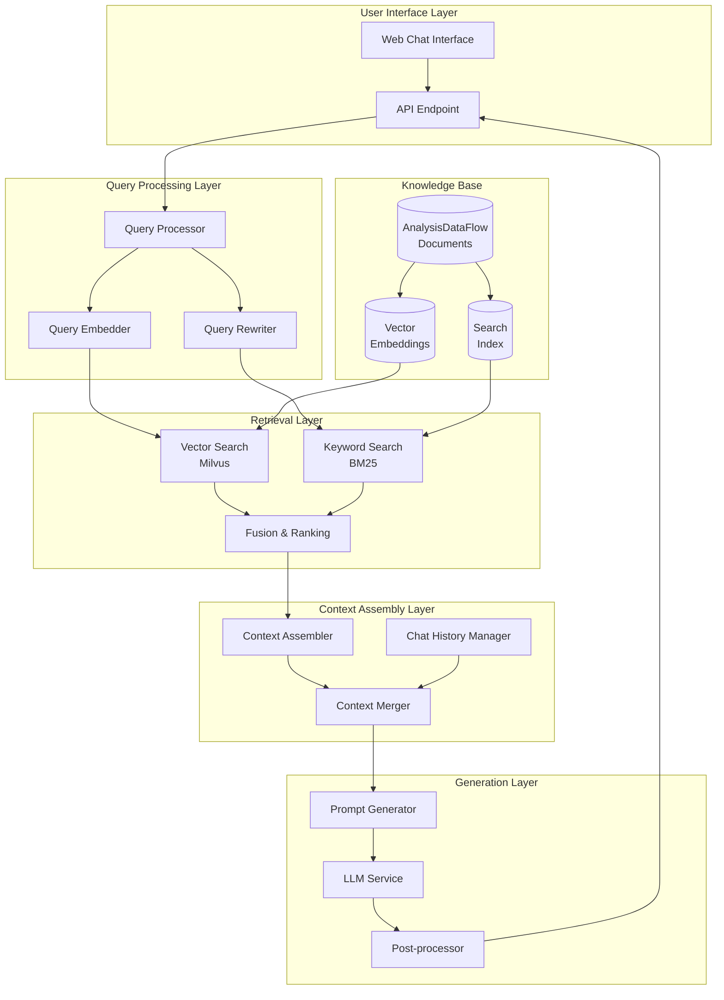
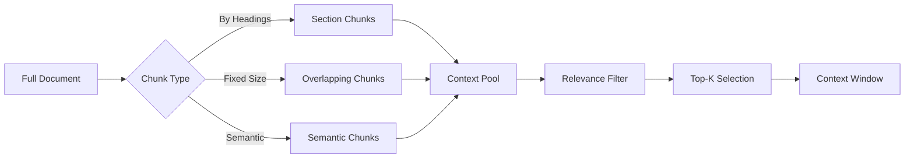
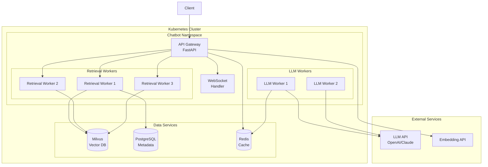

# Chatbot Integration Guide

> **Project**: P3-7 | **Type**: Technical Design | **Version**: v1.0 | **Date**: 2026-04-04

This document describes the integration of a Retrieval-Augmented Generation (RAG) based Q&A chatbot for the AnalysisDataFlow knowledge base.

---

## 1. Overview

### 1.1 Purpose

The chatbot integration enables users to:

- Ask natural language questions about stream computing concepts
- Get accurate answers grounded in the knowledge base
- Receive citations to source documents for verification
- Navigate the knowledge base through conversational interaction

### 1.2 Architecture Overview



---

## 2. RAG Architecture

### 2.1 Query Understanding

#### Intent Classification

| Intent Type | Description | Example |
|-------------|-------------|---------|
| **Definition** | Request for concept definition | "What is a Watermark?" |
| **How-To** | Implementation guidance | "How do I configure Checkpoint?" |
| **Comparison** | Comparison between concepts | "Compare Flink vs Spark" |
| **Troubleshooting** | Problem resolution | "Why is my checkpoint timing out?" |
| **Reference** | Specific theorem or definition lookup | "Show me Thm-S-17-01" |
| **Navigation** | Finding relevant documents | "What documents cover AI Agents?" |

#### Query Expansion

```python
# Query expansion strategies
expansion_strategies = {
    "synonym_expansion": {
        "checkpoint": ["checkpoint", "snapshot", "state backup"],
        "watermark": ["watermark", "event time progress", "timestamp marker"],
        "stream": ["stream", "dataflow", "event stream"],
    },
    "acronym_expansion": {
        "EO": ["Exactly-Once", "exactly once semantics"],
        "AL": ["At-Least-Once", "at least once"],
        "CEP": ["Complex Event Processing"],
    },
    "formal_element_lookup": {
        "Thm-S-17-01": "checkpoint consistency theorem",
        "Def-S-04-04": "watermark semantics definition",
    }
}
```

### 2.2 Hybrid Retrieval

#### Vector Search (Semantic)

```yaml
# Vector search configuration
vector_search:
  database: Milvus
  embedding_model: BAAI/bge-large-zh
  vector_dimension: 1024
  distance_metric: COSINE

  index_params:
    index_type: IVF_FLAT
    nlist: 128

  search_params:
    nprobe: 16
    top_k: 20
```

#### Keyword Search (BM25)

```yaml
# Keyword search configuration
keyword_search:
  algorithm: BM25
  parameters:
    k1: 1.5
    b: 0.75

  fields:
    - title^3.0      # Boost title matches
    - headings^2.0   # Boost heading matches
    - content^1.0    # Standard content weight
    - tags^2.5       # Boost tag matches
```

#### Reciprocal Rank Fusion (RRF)

```python
def reciprocal_rank_fusion(vector_results, keyword_results, k=60):
    """
    Fuse results from vector and keyword search.

    score = Σ 1/(k + rank)
    """
    scores = {}

    # Add vector search scores
    for rank, doc in enumerate(vector_results):
        doc_id = doc.id
        scores[doc_id] = scores.get(doc_id, 0) + 1.0 / (k + rank + 1)
        scores[doc_id + "_vector_rank"] = rank

    # Add keyword search scores
    for rank, doc in enumerate(keyword_results):
        doc_id = doc.id
        scores[doc_id] = scores.get(doc_id, 0) + 1.0 / (k + rank + 1)
        scores[doc_id + "_keyword_rank"] = rank

    # Sort by fused score
    fused_results = sorted(
        [(doc_id, score) for doc_id, score in scores.items()
         if not doc_id.endswith("_rank")],:
        key=lambda x: x[1],
        reverse=True
    )

    return fused_results[:10]  # Return top 10
```

### 2.3 Context Assembly

#### Document Chunking Strategy



#### Context Window Management

```python
def build_context_window(query, retrieved_chunks, chat_history, max_tokens=4000):
    """
    Build context window within token limits.

    Priority:
    1. System prompt (fixed)
    2. Recent chat history (last 3 turns)
    3. Retrieved documents (by relevance)
    """
    context_parts = []
    used_tokens = 0

    # System prompt
    system_prompt = get_system_prompt()
    system_tokens = estimate_tokens(system_prompt)
    used_tokens += system_tokens
    context_parts.append({"type": "system", "content": system_prompt})

    # Chat history (recent 3 turns)
    for msg in chat_history[-3:]:
        msg_tokens = estimate_tokens(msg.content)
        if used_tokens + msg_tokens > max_tokens * 0.3:  # 30% for history
            break
        context_parts.append({"type": "history", "content": msg.content})
        used_tokens += msg_tokens

    # Retrieved documents (remaining budget)
    for chunk in sorted(retrieved_chunks, key=lambda x: x.score, reverse=True):
        chunk_tokens = estimate_tokens(chunk.content)
        if used_tokens + chunk_tokens > max_tokens:
            break
        context_parts.append({"type": "document", "content": chunk.content,
                            "metadata": chunk.metadata})
        used_tokens += chunk_tokens

    return context_parts
```

---

## 3. Prompt Engineering

### 3.1 System Prompt

```markdown
# System Prompt: AnalysisDataFlow Assistant

You are a knowledgeable assistant specialized in stream computing and Apache Flink.
Your answers are based on the AnalysisDataFlow knowledge base.

## Guidelines:

1. **Base answers strictly on provided context** - Do not hallucinate information
2. **Use formal element references** - Cite theorems, definitions with their IDs
3. **Provide code examples when relevant** - Use Flink code syntax
4. **Structure complex answers** - Use headings, lists, and tables
5. **Acknowledge limitations** - If context is insufficient, say so

## Citation Format:

Use [^N] format for citations:
- [^1]: Document path, Section "X.Y"
- Example: According to the checkpoint mechanism[^1]...

## Response Structure:

1. Direct answer to the question
2. Detailed explanation with citations
3. Code example (if applicable)
4. Related topics for further reading
```

### 3.2 Prompt Templates by Intent

#### Definition Query Template

```markdown
## User Question
{question}

## Retrieved Context
{context}

## Instructions
Provide a clear, formal definition based on the context. Include:
1. The formal definition statement
2. Intuitive explanation
3. Related formal elements (theorems, definitions)
4. Code example showing usage (if applicable)

Format the definition in a code block if it contains mathematical notation.
```

#### How-To Query Template

```markdown
## User Question
{question}

## Retrieved Context
{context}

## Instructions
Provide step-by-step implementation guidance:
1. Prerequisites and assumptions
2. Configuration steps with code
3. Best practices and considerations
4. Common pitfalls to avoid

Use numbered steps and provide complete, working code examples.
```

#### Troubleshooting Query Template

```markdown
## User Question
{question}

## Retrieved Context
{context}

## Instructions
Provide diagnostic and resolution steps:
1. Identify the likely cause based on symptoms
2. Provide diagnostic steps
3. Offer solutions with configuration/code changes
4. Suggest preventive measures

Be specific about error messages and configuration parameters.
```

---

## 4. Response Generation

### 4.1 Post-Processing

```python
class ResponsePostProcessor:
    """Post-process LLM responses."""

    def process(self, response: str, retrieved_docs: List[Document]) -> str:
        """Process and validate the LLM response."""
        # 1. Validate citations
        response = self._validate_citations(response, retrieved_docs)

        # 2. Add source links
        response = self._add_source_links(response, retrieved_docs)

        # 3. Format formal elements
        response = self._format_formal_elements(response)

        # 4. Add related topics
        response = self._add_related_topics(response)

        return response

    def _validate_citations(self, response: str, docs: List[Document]) -> str:
        """Ensure all citations reference valid documents."""
        # Extract citations
        citations = re.findall(r'\[\^(\d+)\]', response)

        # Validate and fix
        for i, citation in enumerate(citations):
            if int(citation) > len(docs):
                # Remove invalid citation
                response = response.replace(f'[^{citation}]', '')

        return response

    def _add_source_links(self, response: str, docs: List[Document]) -> str:
        """Add clickable links to source documents."""
        sources_section = "\n\n## Sources\n\n"

        for i, doc in enumerate(docs[:5], 1):
            doc_url = f"/docs/{doc.path}"
            sources_section += f"[^i]: [{doc.title}]({doc_url})\n"

        return response + sources_section
```

### 4.2 Multi-Turn Conversation

```python
class ConversationManager:
    """Manage multi-turn conversation state."""

    def __init__(self):
        self.sessions = {}

    def create_session(self, session_id: str):
        """Create a new conversation session."""
        self.sessions[session_id] = {
            "history": [],
            "context_entities": set(),
            "retrieved_docs_history": [],
        }

    def add_turn(self, session_id: str, query: str, response: str,
                 retrieved_docs: List[Document]):
        """Add a conversation turn."""
        session = self.sessions.get(session_id)
        if not session:
            return

        # Add to history
        session["history"].append({
            "role": "user",
            "content": query,
        })
        session["history"].append({
            "role": "assistant",
            "content": response,
        })

        # Track entities
        entities = self._extract_entities(query + " " + response)
        session["context_entities"].update(entities)

        # Track retrieved docs
        session["retrieved_docs_history"].extend(retrieved_docs)

    def resolve_references(self, session_id: str, query: str) -> str:
        """Resolve pronoun references using conversation context."""
        # Replace pronouns with last mentioned entity
        pronouns = ["it", "this", "that", "they"]

        session = self.sessions.get(session_id)
        if session and session["context_entities"]:
            main_entity = list(session["context_entities"])[-1]

            for pronoun in pronouns:
                if f" {pronoun} " in f" {query} ":
                    query = query.replace(f" {pronoun} ", f" {main_entity} ")

        return query
```

---

## 5. Implementation Guide

### 5.1 API Endpoints

```yaml
# OpenAPI specification
openapi: 3.0.0
info:
  title: AnalysisDataFlow Chatbot API
  version: 1.0.0

paths:
  /api/chat:
    post:
      summary: Send a chat message
      requestBody:
        content:
          application/json:
            schema:
              type: object
              properties:
                query:
                  type: string
                session_id:
                  type: string
                history:
                  type: array
      responses:
        200:
          description: Successful response
          content:
            application/json:
              schema:
                type: object
                properties:
                  answer:
                    type: string
                  sources:
                    type: array
                  suggested_questions:
                    type: array

  /api/chat/stream:
    post:
      summary: Stream chat response (SSE)
      requestBody:
        content:
          application/json:
            schema:
              type: object
              properties:
                query:
                  type: string
                session_id:
                  type: string
      responses:
        200:
          description: SSE stream of response chunks

  /api/search:
    get:
      summary: Search documents
      parameters:
        - name: q
          in: query
          required: true
          schema:
            type: string
        - name: top_k
          in: query
          schema:
            type: integer
            default: 10
      responses:
        200:
          description: Search results
```

### 5.2 Deployment Architecture



### 5.3 Configuration

```yaml
# chatbot-config.yaml
chatbot:
  name: "AnalysisDataFlow Assistant"
  version: "1.0.0"

  retrieval:
    vector_search:
      enabled: true
      top_k: 20
      min_score: 0.7

    keyword_search:
      enabled: true
      top_k: 20

    fusion:
      method: "rrf"
      k: 60
      final_top_k: 10

  context:
    max_tokens: 4000
    history_turns: 3
    chunk_size: 500
    chunk_overlap: 50

  llm:
    provider: "openai"  # or "anthropic", "azure"
    model: "gpt-3.5-turbo"
    temperature: 0.3
    max_tokens: 1000

  response:
    format_markdown: true
    include_sources: true
    include_suggestions: true

  caching:
    enabled: true
    ttl: 3600  # 1 hour
```

---

## 6. Evaluation Metrics

### 6.1 Retrieval Metrics

| Metric | Description | Target |
|--------|-------------|--------|
| **Precision@K** | Proportion of relevant documents in top K | > 0.8 |
| **Recall@K** | Proportion of all relevant documents retrieved | > 0.7 |
| **MRR** | Mean Reciprocal Rank | > 0.6 |
| **NDCG** | Normalized Discounted Cumulative Gain | > 0.75 |

### 6.2 Generation Metrics

| Metric | Description | Target |
|--------|-------------|--------|
| **Answer Relevance** | Answer relevance to query | > 4.0/5 |
| **Factual Accuracy** | Correctness of facts | > 95% |
| **Citation Accuracy** | Validity of citations | 100% |
| **Response Time** | P95 latency | < 2s |

### 6.3 User Experience Metrics

| Metric | Description | Target |
|--------|-------------|--------|
| **Conversation Depth** | Average turns per session | > 3 |
| **Satisfaction Score** | User rating | > 4.2/5 |
| **Resolution Rate** | Queries fully resolved | > 85% |

---

## 7. Usage Examples

### 7.1 Basic Query

**User**: "What is Flink's Checkpoint mechanism?"

**Assistant**:
> **Checkpoint** is Flink's fault tolerance mechanism that creates globally consistent snapshots of distributed streaming data flow[^1].
>
> **Key Concepts**:
>
> - **Checkpoint Barrier**: Special markers inserted into data streams to trigger state snapshots
> - **State Backend**: Component responsible for state storage (HashMap, RocksDB, ForSt)
> - **Exactly-Once Guarantee**: Checkpoint ensures state consistency even with failures
>
> **Implementation**:
>
> ```java
> env.enableCheckpointing(60000);  // 60 second interval
> env.getCheckpointConfig().setCheckpointingMode(
>     CheckpointingMode.EXACTLY_ONCE);
>
```
>
> See [Checkpoint Mechanism Deep Dive](../Flink/02-core/checkpoint-mechanism-deep-dive.md) for complete details.
>
> [^1]: Flink/02-core/checkpoint-mechanism-deep-dive.md

### 7.2 Follow-up Query

**User**: "How does it handle backpressure?"

**Assistant**:
> Checkpoint processing is affected by backpressure, but Flink provides several mechanisms to handle this[^2]:
>
> 1. **Aligned Checkpoint**: Waits for barriers from all inputs (may pause during backpressure)
> 2. **Unaligned Checkpoint**: Buffers in-flight data to continue processing
> 3. **Incremental Checkpoint**: Only saves changed state to reduce I/O
>
> [^2]: Flink/02-core/checkpoint-mechanism-deep-dive.md, Section "Checkpoint and Backpressure"

---

## 8. References

- [AI-SEARCH-DESIGN.md](./ai-features/AI-SEARCH-DESIGN.md) - AI Search Enhancement Design
- [RAG Streaming Architecture](../Flink/12-ai-ml/rag-streaming-architecture.md) - RAG implementation in Flink
- [Vector Search Integration](../Knowledge/06-frontier/vector-search-streaming-convergence.md) - Vector search concepts

---

**Document Version History**:

| Version | Date | Changes |
|---------|------|---------|
| v1.0 | 2026-04-04 | Initial version |

