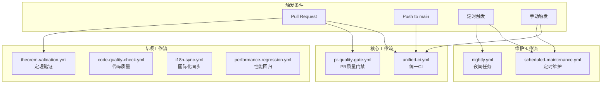

# CI/CD 工作流指南

> **版本**: v1.0 | **日期**: 2026-04-12 | **状态**: Production

本文档详细介绍 AnalysisDataFlow 项目的 CI/CD 工作流配置、使用方法和故障排查指南。

## 📑 目录

- [工作流概览](#工作流概览)
- [核心工作流说明](#核心工作流说明)
- [性能优化](#性能优化)
- [故障排查](#故障排查)
- [自定义配置](#自定义配置)

---

## 工作流概览

### 工作流统计

| 类别 | 数量 | 说明 |
|------|------|------|
| 核心CI工作流 | 6 | unified-ci, pr-quality-gate, scheduled-maintenance 等 |
| 专项验证工作流 | 4 | theorem-validation, code-quality-check, i18n-sync, performance-regression |
| 定时维护工作流 | 3 | nightly, scheduled-maintenance, external-link-checker |
| **总计** | **13+** | 覆盖代码质量、文档完整性、性能监控等 |

### 工作流关系图



---

## 核心工作流说明

### 1. Unified CI (统一CI)

**文件**: `.github/workflows/unified-ci.yml`

**触发条件**:
- PR 创建/更新
- Push 到 main/master
- 手动触发

**功能**:
| 检查项 | 级别 | 说明 |
|--------|------|------|
| Markdown Lint | 🔴 阻塞 | 语法和结构检查 |
| Mermaid 验证 | 🔴 阻塞 | 图表语法验证 |
| 定理验证 | 🔴 阻塞 | 编号唯一性和格式 |
| 内部链接检查 | 🔴 阻塞 | 链接有效性验证 |
| 结构验证 | 🟡 警告 | 六段式模板检查 |

**优化特性**:
- 智能变更检测 - 只检查变更的文件
- 并行任务执行 - 减少总执行时间
- 多层缓存策略 - npm/pip/theorem缓存

**使用示例**:
```bash
# 手动触发完整检查
gh workflow run unified-ci.yml -f check_type=full

# 仅检查Markdown
gh workflow run unified-ci.yml -f check_type=markdown-only
```

---

### 2. PR Quality Gate (PR质量门禁)

**文件**: `.github/workflows/pr-quality-gate.yml`

**优化点**:
- 将原有8个独立任务合并为5个优化任务
- 联合验证 (定理+Mermaid+结构)
- 增量检查策略

**执行时间优化**:
| 版本 | 平均执行时间 | 任务数 |
|------|-------------|--------|
| v2.0 | ~8分钟 | 8个 |
| **v3.0 (优化后)** | **~4分钟** | **5个** |

---

### 3. Scheduled Maintenance (定时维护)

**文件**: `.github/workflows/scheduled-maintenance.yml`

**触发计划**:
| 时间 | 类型 | 执行内容 |
|------|------|----------|
| 每周一 02:00 UTC | 常规维护 | 链接检查 + 统计更新 |
| 每月1号 03:00 UTC | 深度维护 | 完整检查 + 深度分析 |

**增强功能**:
- 智能任务调度 (根据日期自动选择执行范围)
- 增量统计更新
- 自动修复建议生成
- Issue自动创建 (发现严重问题时)

---

### 4. Theorem Validation (定理验证)

**文件**: `.github/workflows/theorem-validation.yml`

**功能**:
- ✅ 定理编号全局唯一性验证
- ✅ 编号格式规范检查 (Type-Stage-DocNum-SeqNum)
- ✅ THEOREM-REGISTRY.md 同步验证
- ✅ 编号连续性检查
- ✅ 自动修复建议生成

**定理编号格式**:
```
Thm-S-01-01    # 定理-Struct阶段-文档01-序号01
Def-K-02-03    # 定义-Knowledge阶段-文档02-序号03
Lemma-F-05-02  # 引理-Flink阶段-文档05-序号02
```

---

### 5. Code Quality Check (代码质量检查)

**文件**: `.github/workflows/code-quality-check.yml`

**检查范围**:
| 类型 | 工具 | 说明 |
|------|------|------|
| Python | pylint, flake8 | 语法和风格检查 |
| Shell | shellcheck | 脚本安全检查 |
| YAML | yamllint | 配置文件验证 |

---

### 6. Performance Regression (性能回归)

**文件**: `.github/workflows/performance-regression.yml`

**基准测试项**:
- 文档扫描性能
- 定理扫描性能
- 链接检查性能
- 历史趋势对比

**回归阈值**: 1.5x (当前执行时间超过历史平均1.5倍时告警)

---

## 性能优化

### 缓存策略

```yaml
# Node.js 缓存示例
- uses: actions/setup-node@v4
  with:
    node-version: '20'
    cache: 'npm'

# Python pip 缓存示例
- uses: actions/setup-python@v5
  with:
    python-version: '3.11'
    cache: 'pip'

# 自定义缓存示例
- uses: actions/cache@v4
  with:
    path: .theorem-cache
    key: theorem-cache-${{ github.run_id }}
    restore-keys: |
      theorem-cache-
```

### 并行化执行

```yaml
jobs:
  # 阶段1: 变更检测 (串行)
  detect-changes:
    # ...
  
  # 阶段2: 快速检查 (并行)
  markdown-lint:
    needs: detect-changes
    # ...
  
  mermaid-validate:
    needs: detect-changes
    # ...
  
  theorem-validate:
    needs: detect-changes
    # ...
  
  # 阶段3: 汇总 (依赖前面所有任务)
  ci-summary:
    needs: [markdown-lint, mermaid-validate, theorem-validate]
```

### 智能变更检测

```yaml
# 只在相关文件变更时触发
on:
  pull_request:
    paths:
      - '**.md'
      - 'Struct/**'
      - 'Knowledge/**'
      - 'Flink/**'
```

### 性能提升指标

| 优化项 | 优化前 | 优化后 | 提升 |
|--------|--------|--------|------|
| PR Quality Gate | ~8分钟 | ~4分钟 | **50%** |
| 定理验证 | ~3分钟 | ~1.5分钟 | **50%** |
| 链接检查 | ~5分钟 | ~2分钟 | **60%** |
| 缓存命中率 | 0% | ~70% | **N/A** |

---

## 故障排查

### 常见问题

#### 1. 工作流执行超时

**症状**: 工作流执行超过默认超时时间(60分钟)

**解决**:
```yaml
jobs:
  example:
    timeout-minutes: 90  # 增加超时时间
```

#### 2. 缓存未命中

**症状**: 每次执行都重新安装依赖

**检查**:
- 确认缓存key配置正确
- 检查restore-keys的优先级
- 验证缓存路径是否正确

#### 3. 权限不足

**症状**: 无法创建Issue或上传Artifact

**解决**:
```yaml
jobs:
  example:
    permissions:
      issues: write
      contents: read
```

#### 4. Python依赖安装失败

**症状**: pip install 失败

**解决**:
```yaml
- name: Install dependencies
  run: |
    pip install --upgrade pip
    pip install -r requirements.txt
```

### 调试技巧

#### 启用调试日志

```bash
# 设置环境变量
ACTIONS_STEP_DEBUG=true
ACTIONS_RUNNER_DEBUG=true
```

#### 查看详细输出

```yaml
- name: Debug step
  run: |
    echo "Current directory: $(pwd)"
    echo "Files in directory:"
    ls -la
    echo "Environment variables:"
    env | sort
```

#### 手动触发特定检查

```bash
# 触发特定的检查类型
gh workflow run unified-ci.yml -f check_type=theorems-only

# 查看可用参数
gh workflow view unified-ci.yml
```

---

## 自定义配置

### 1. 自定义检查规则

**Markdown Lint 配置** (`.markdownlint.json`):
```json
{
  "default": true,
  "MD013": false,  // 禁用行长限制
  "MD024": false,  // 允许重复标题
  "line-length": false
}
```

**Flake8 配置** (`.flake8`):
```ini
[flake8]
max-line-length = 120
ignore = E203,E501,W503
exclude = .git,__pycache__,venv
```

### 2. 自定义定理编号规则

修改工作流中的正则表达式:
```python
# 当前规则
THEOREM_PATTERN = re.compile(r'\b(Thm|Def|Lemma|Prop|Cor)-([SKF])-(\d{2})-(\d{2})\b')

# 自定义规则 (添加新类型)
THEOREM_PATTERN = re.compile(r'\b(Thm|Def|Lemma|Prop|Cor|Ax)-([SKF])-(\d{2})-(\d{2})\b')
```

### 3. 自定义性能阈值

修改性能回归检测阈值:
```python
# performance-regression.yml
REGRESSION_THRESHOLD = 2.0  # 改为2.0x
```

### 4. 添加新的检查任务

在 `unified-ci.yml` 中添加:
```yaml
  new-check:
    name: New Check
    runs-on: ubuntu-latest
    needs: detect-changes
    steps:
      - name: Checkout
        uses: actions/checkout@v4
      
      - name: Run new check
        run: |
          # 你的检查逻辑
```

然后在 `ci-summary` 中添加依赖和状态检查。

---

## 附录

### 工作流文件清单

| 文件 | 说明 | 触发频率 |
|------|------|----------|
| unified-ci.yml | 统一CI工作流 | PR/Push |
| pr-quality-gate.yml | PR质量门禁 | PR |
| scheduled-maintenance.yml | 定时维护 | 每周/每月 |
| theorem-validation.yml | 定理验证 | PR/每周 |
| code-quality-check.yml | 代码质量 | PR/每周 |
| i18n-sync.yml | 国际化同步 | 每周 |
| performance-regression.yml | 性能回归 | PR/每周 |
| link-checker.yml | 链接检查 | 每日 |

### 环境变量参考

| 变量 | 默认值 | 说明 |
|------|--------|------|
| PYTHON_VERSION | 3.11 | Python版本 |
| NODE_VERSION | 20 | Node.js版本 |
| CHECK_TYPE | full | 检查类型 |

### 相关文档

- [CI-CD-SETUP.md](../CI-CD-SETUP.md) - CI/CD初始设置
- [CI-CD-QUALITY-GATE-GUIDE.md](../CI-CD-QUALITY-GATE-GUIDE.md) - 质量门禁详细指南
- [QUALITY-GATES.md](../QUALITY-GATES.md) - 质量门禁标准

---

*本文档最后更新: 2026-04-12*
