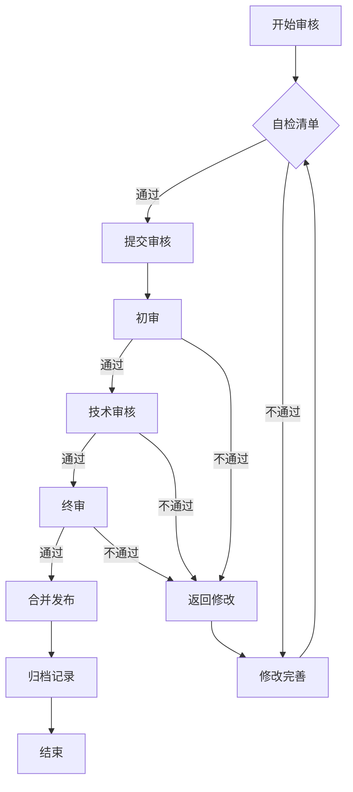

# 内容审核清单

# Content Review Checklist

> **版本**: v1.0 | **生效日期**: 2026-04-12 | **状态**: Active | **审核周期**: 月度
>
> 本文档定义了AnalysisDataFlow项目的内容审核标准、流程和记录模板。

---

## 1. 审核概述

### 1.1 审核目标

- **准确性**: 确保技术内容的正确性和时效性
- **完整性**: 验证文档结构符合六段式模板要求
- **一致性**: 保持术语、格式和风格的统一
- **可用性**: 确保内容易于理解和导航

### 1.2 审核范围

| 内容类型 | 审核频率 | 负责人 |
|----------|----------|--------|
| Struct/ 形式化文档 | 每月 | 形式化方法负责人 |
| Knowledge/ 知识文档 | 每季度 | 内容负责人 |
| Flink/ 技术文档 | 每周 | Flink维护者 |
| 项目级文档 | 每季度 | 项目负责人 |
| 英文文档 | 每月 | 国际化协调员 |

---

## 2. 审核项目清单

### 2.1 结构性审核 ✓

#### 2.1.1 六段式模板合规

- [ ] **概念定义 (Definitions)**
  - [ ] 包含至少一个带编号的定义 (Def-*)
  - [ ] 定义清晰、无歧义
  - [ ] 包含直观解释

- [ ] **属性推导 (Properties)**
  - [ ] 包含至少一个引理 (Lemma-*) 或命题 (Prop-*)
  - [ ] 推导逻辑正确
  - [ ] 与定义一致

- [ ] **关系建立 (Relations)**
  - [ ] 与其他概念建立关联
  - [ ] 引用相关文档链接
  - [ ] 说明映射/编码关系

- [ ] **论证过程 (Argumentation)**
  - [ ] 辅助定理完整
  - [ ] 边界情况讨论
  - [ ] 反例分析（如适用）

- [ ] **形式证明 / 工程论证 (Proof)**
  - [ ] 主要定理完整证明
  - [ ] 或工程选型严谨论证
  - [ ] 引用形式化验证（如适用）

- [ ] **实例验证 (Examples)**
  - [ ] 至少一个简化实例
  - [ ] 代码片段或配置示例
  - [ ] 真实案例（如适用）

- [ ] **可视化 (Visualizations)**
  - [ ] 至少一个Mermaid图表
  - [ ] 图表类型选择恰当
  - [ ] 图表语法正确

- [ ] **引用参考 (References)**
  - [ ] 使用 `[^n]` 上标格式
  - [ ] 在文档末尾集中列出
  - [ ] 引用权威来源

#### 2.1.2 元数据完整性

- [ ] 文档标题清晰
- [ ] 所属阶段标注 (Struct/Knowledge/Flink)
- [ ] 前置依赖链接完整
- [ ] 形式化等级标注 (L1-L6)
- [ ] 状态标注 (Active/Deprecated/Draft)

### 2.2 技术性审核 ✓

#### 2.2.1 形式化元素

- [ ] **定理编号体系**
  - [ ] 编号格式: `{类型}-{阶段}-{文档序号}-{顺序号}`
  - [ ] 全局唯一性
  - [ ] 连续性无跳跃

- [ ] **定义完整性**
  - [ ] 每个定义有明确编号
  - [ ] 定义范围清晰
  - [ ] 无循环定义

- [ ] **引用一致性**
  - [ ] 定理引用格式正确
  - [ ] 引用目标存在
  - [ ] 无孤立引用

#### 2.2.2 技术准确性

- [ ] **Flink相关内容**
  - [ ] 版本信息准确
  - [ ] API示例可执行
  - [ ] 前瞻内容有状态标注

- [ ] **代码示例**
  - [ ] 语法正确
  - [ ] 可执行（如标注可运行）
  - [ ] 与描述一致

- [ ] **外部链接**
  - [ ] 链接可访问
  - [ ] 指向权威来源
  - [ ] 无失效链接

### 2.3 质量性审核 ✓

#### 2.3.1 语言表达

- [ ] 术语使用统一（参考GLOSSARY.md）
- [ ] 无错别字
- [ ] 语法正确
- [ ] 表达简洁清晰
- [ ] 中英文标点使用正确

#### 2.3.2 格式规范

- [ ] 文件命名符合规范
  - [ ] 全部小写
  - [ ] 连字符 `-` 分隔
  - [ ] 前缀体现层级和序号

- [ ] Markdown格式正确
  - [ ] 标题层级正确
  - [ ] 列表格式统一
  - [ ] 代码块标注语言

- [ ] Mermaid图表
  - [ ] 语法通过校验
  - [ ] 图表前文字说明
  - [ ] 类型选择恰当

#### 2.3.3 可访问性

- [ ] 内部链接有效
- [ ] 图片显示正常
- [ ] 表格格式正确
- [ ] 长文档有目录

---

## 3. 质量标准

### 3.1 质量等级定义

| 等级 | 分数范围 | 说明 | 处理建议 |
|------|----------|------|----------|
| **A级** | 95-100 | 优秀，符合所有标准 | 直接通过 |
| **B级** | 85-94 | 良好， minor issues | 修复后通过 |
| **C级** | 70-84 | 合格，需要改进 | 要求修改 |
| **D级** | 60-69 | 不合格，重大问题 | 必须重写 |
| **F级** | <60 | 严重不足 | 废弃或全面重构 |

### 3.2 评分细则

```
总分 = 结构性(30%) + 技术性(40%) + 质量性(30%)

结构性评分:
- 六段式合规: 20分
- 元数据完整: 10分

技术性评分:
- 形式化元素: 15分
- 技术准确性: 15分
- 代码/示例: 10分

质量性评分:
- 语言表达: 10分
- 格式规范: 10分
- 可访问性: 10分
```

### 3.3 通过标准

- **最低通过分数**: 70分 (C级)
- **推荐分数**: 85分 (B级)
- **优秀标准**: 95分 (A级)

---

## 4. 审核流程

### 4.1 审核流程图



### 4.2 审核阶段

#### 阶段1: 自检 (Self-Review)

**执行人**: 内容作者
**时间**: 提交前
**checklist**:

- [ ] 完成自查清单
- [ ] 运行自动化检查
- [ ] 修复明显问题

**命令**:

```bash
# 运行六段式检查
python .scripts/six-section-validator.py --file <file>

# 运行定理编号检查
python .scripts/theorem-validator.py --file <file>

# 运行Mermaid语法检查
python .scripts/mermaid-syntax-checker.py --file <file>
```

#### 阶段2: 初审 (Initial Review)

**执行人**: 内容负责人
**时间**: 1-2个工作日
**重点**:

- 结构性合规
- 内容完整性
- 明显错误

**输出**: 初审意见

#### 阶段3: 技术审核 (Technical Review)

**执行人**: 技术专家/Flink维护者
**时间**: 2-3个工作日
**重点**:

- 技术准确性
- 形式化元素正确性
- 代码示例可执行性

**输出**: 技术审核意见

#### 阶段4: 终审 (Final Review)

**执行人**: 项目负责人
**时间**: 1个工作日
**重点**:

- 整体质量
- 与项目目标对齐
- 发布决策

**输出**: 终审意见 + 质量等级

### 4.3 审核时间线

| 阶段 | 执行人 | 标准时长 | 最长时长 |
|------|--------|----------|----------|
| 自检 | 作者 | - | - |
| 初审 | 内容负责人 | 1-2天 | 3天 |
| 技术审核 | 技术专家 | 2-3天 | 5天 |
| 终审 | 项目负责人 | 1天 | 2天 |
| **总计** | - | **4-6天** | **10天** |

---

## 5. 记录模板

### 5.1 审核记录表

```markdown
## 审核记录: [文档路径]

### 基本信息
- **文档名称**:
- **文档路径**:
- **审核日期**:
- **审核版本**:
- **审核人**:
- **审核类型**: 月度/季度/专项

### 评分详情

| 维度 | 得分 | 满分 | 备注 |
|------|------|------|------|
| 结构性 | | 30 | |
| 技术性 | | 40 | |
| 质量性 | | 30 | |
| **总分** | | **100** | |

### 审核结果

- [ ] A级 (95-100) - 直接通过
- [ ] B级 (85-94) - 修复后通过
- [ ] C级 (70-84) - 需要改进
- [ ] D级 (60-69) - 必须重写
- [ ] F级 (<60) - 废弃

### 发现问题

#### 严重问题 (Must Fix)
1.
2.

#### 建议改进 (Should Fix)
1.
2.

#### 可选优化 (Nice to Have)
1.
2.

### 修改建议

1.
2.

### 审核结论

- [ ] 通过
- [ ] 有条件通过
- [ ] 不通过，需修改
- [ ] 不通过，建议废弃

### 后续行动

- [ ] 作者修改
- [ ] 复审
- [ ] 合并发布
- [ ] 归档

**审核人签名**:
**日期**:
```

### 5.2 批量审核报告模板

```markdown
# 月度内容审核报告

> **报告周期**: [月份]
> **生成日期**: [日期]
> **审核人**: [姓名]

## 审核概览

| 指标 | 数值 |
|------|------|
| 审核文档总数 | |
| A级文档数 | |
| B级文档数 | |
| C级文档数 | |
| D级及以下 | |
| 平均分数 | |

## 问题汇总

### 结构性问题
- 六段式不合规: X篇
- 元数据缺失: X篇

### 技术性问题
- 形式化元素错误: X处
- 代码示例问题: X处
- 失效链接: X个

### 质量问题
- 术语不统一: X处
- 格式问题: X处

## 改进建议

1.
2.

## 下月重点

1.
2.
```

---

## 6. 自动化审核工具

### 6.1 可用工具列表

| 工具 | 功能 | 使用场景 |
|------|------|----------|
| six-section-validator.py | 六段式结构检查 | 自检/初审 |
| theorem-validator.py | 定理编号验证 | 技术审核 |
| mermaid-syntax-checker.py | Mermaid语法检查 | 自检 |
| link-health-checker.py | 链接健康检查 | 初审 |
| code-example-validator.py | 代码示例验证 | 技术审核 |
| formal-element-checker.py | 形式化元素审计 | 技术审核 |
| i18n-quality-checker.py | 国际化质量检查 | 英文审核 |

### 6.2 自动化审核流程

```bash
# 完整自动化审核
python .scripts/content-audit-pipeline.py \
  --target <file_or_dir> \
  --output audit-report.json \
  --fail-on-error
```

---

## 7. 参考文档

- [AGENTS.md](../AGENTS.md) - Agent工作规范
- [DOCUMENT-TIERS.md](../DOCUMENT-TIERS.md) - 文档分级标准
- [BEST-PRACTICES.md](../BEST-PRACTICES.md) - 最佳实践
- [GLOSSARY.md](../GLOSSARY.md) - 术语表
- [CONTRIBUTING.md](../CONTRIBUTING.md) - 贡献指南

---

## 8. 历史记录

| 日期 | 版本 | 变更内容 | 作者 |
|------|------|----------|------|
| 2026-04-12 | 1.0 | 初始版本 | Content Team |
