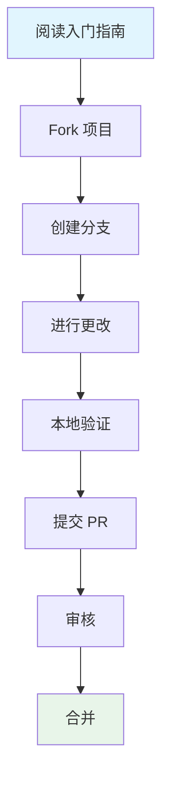
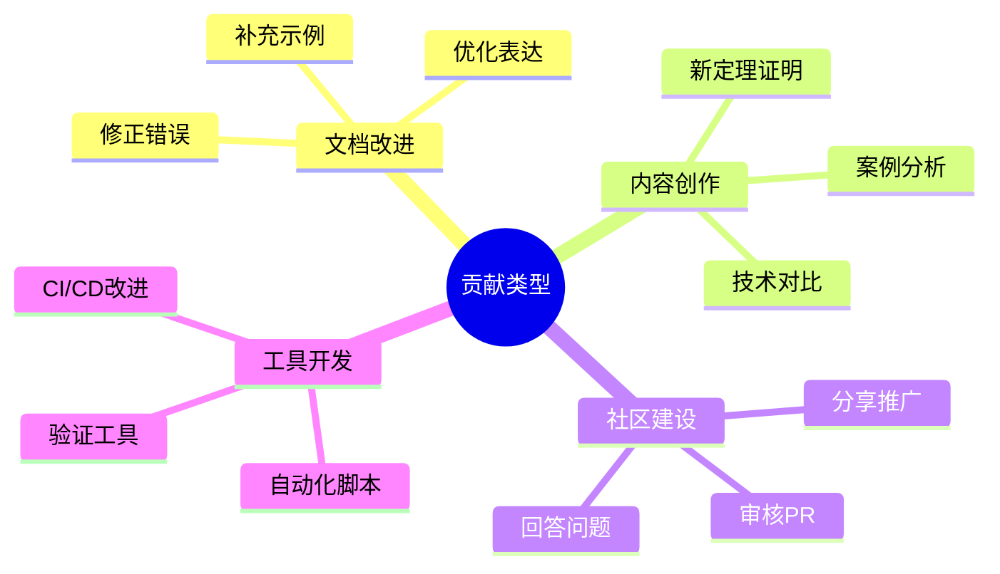

# AnalysisDataFlow 贡献指南

> 欢迎来到 AnalysisDataFlow 贡献指南中心！这里汇集了所有与贡献相关的文档和资源。

## 快速开始

| 如果您是... | 从这里开始 |
|-----------|-----------|
| **完全新手** | [getting-started.md](./getting-started.md) - 零基础入门指南 |
| **准备编写文档** | [writing-guide.md](./writing-guide.md) - 写作风格规范 |
| **准备提交 PR** | [review-checklist.md](./review-checklist.md) - 提交前检查清单 |
| **需要了解社区规范** | [code-of-conduct.md](./code-of-conduct.md) - 行为准则 |

## 文档目录

### 📚 核心指南

1. **[getting-started.md](./getting-started.md)** - 新贡献者入门指南
   - 项目概览
   - 环境配置
   - 第一次贡献实战
   - 获取帮助

2. **[writing-guide.md](./writing-guide.md)** - 写作风格指南
   - 写作原则
   - 文档结构（六段式模板详解）
   - 语言表达规范
   - 术语规范
   - 代码示例规范
   - 数学公式规范
   - 图表规范
   - 引用规范

3. **[review-checklist.md](./review-checklist.md)** - 审核清单
   - 提交前自检清单
   - 审核者检查清单
   - 问题分类与处理
   - 审核流程
   - 自动化检查脚本

4. **[code-of-conduct.md](./code-of-conduct.md)** - 行为准则
   - 我们的承诺
   - 标准与规范
   - 执行机制
   - 沟通指南
   - 冲突解决

### 🎥 视频教程脚本

用于制作教学视频的详细脚本：

1. **[01-first-contribution.md](./video-scripts/01-first-contribution.md)** - 第一次贡献（15-20分钟）
   - Fork 和克隆项目
   - 创建分支
   - 进行修改
   - 提交 PR

2. **[02-writing-theorem.md](./video-scripts/02-writing-theorem.md)** - 编写形式化定理（20-25分钟）
   - 形式化体系概览
   - 定理编号分配
   - 定义、引理、定理编写
   - 更新注册表

3. **[03-creating-mermaid.md](./video-scripts/03-creating-mermaid.md)** - 创建 Mermaid 图表（18-22分钟）
   - 图表类型选择
   - 层次图、时序图、流程图、状态图
   - 最佳实践

## 贡献流程概览

## 重要资源

### 项目级文档

| 文档 | 路径 | 说明 |
|-----|------|------|
| 项目规范 | [AGENTS.md](../../AGENTS.md) | Agent 工作上下文规范 |
| 完整贡献指南 | [CONTRIBUTING.md](../../CONTRIBUTING.md) | 详细贡献流程和规范 |
| 定理注册表 | [THEOREM-REGISTRY.md](../../THEOREM-REGISTRY.md) | 所有定理/定义的完整列表 |
| 项目进度 | [PROJECT-TRACKING.md](../../PROJECT-TRACKING.md) | 项目进度看板 |
| 导航索引 | [NAVIGATION-INDEX.md](../../NAVIGATION-INDEX.md) | 文档导航索引 |

### GitHub 模板

| 模板 | 路径 | 用途 |
|-----|------|------|
| Bug 报告 | [.github/ISSUE_TEMPLATE/bug_report.yml](../../.github/ISSUE_TEMPLATE/bug_report.yml) | 报告错误 |
| 功能建议 | [.github/ISSUE_TEMPLATE/feature_request.yml](../../.github/ISSUE_TEMPLATE/feature_request.yml) | 建议新功能 |
| 文档改进 | [.github/ISSUE_TEMPLATE/doc_improvement.yml](../../.github/ISSUE_TEMPLATE/doc_improvement.yml) | 改进文档 |
| PR 模板 | [.github/PULL_REQUEST_TEMPLATE.md](../../.github/PULL_REQUEST_TEMPLATE.md) | 提交 PR 时使用 |

## 常见问题

**Q: 我第一次贡献，应该从哪里开始？**
A: 建议从阅读 [getting-started.md](./getting-started.md) 开始，然后尝试修正文档中的拼写错误或添加简单的示例。

**Q: 如何为新定理分配编号？**
A: 查看 [THEOREM-REGISTRY.md](../../THEOREM-REGISTRY.md) 获取最新编号，确保全局唯一。详细说明见 [02-writing-theorem.md](./video-scripts/02-writing-theorem.md)。

**Q: 提交前需要做哪些检查？**
A: 使用 [review-checklist.md](./review-checklist.md) 进行自检，包括 Markdown 语法检查、链接验证等。

**Q: 如何创建 Mermaid 图表？**
A: 参考 [03-creating-mermaid.md](./video-scripts/03-creating-mermaid.md) 了解各种图表类型的创建方法和最佳实践。

**Q: 遇到问题可以在哪里求助？**
A: 可以通过 GitHub Discussions 提问，或查看项目文档中的联系方式。

## 贡献类型

## 联系方式

- **GitHub Issues**: 报告问题、提出功能建议
- **GitHub Discussions**: 一般讨论、问答
- **邮件**: discussion@analysisdataflow.org

---

*欢迎加入 AnalysisDataFlow 社区，共同打造流计算领域最全面、最严谨的知识库！*
